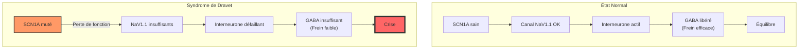

# Partie I : L'Architecture du Chaos
## Chapitre 1 : Le Code Source (Étiologie)

### 🎯 L'Essentiel (Cible : Familles & Aidants)

**Qu'est-ce que c'est ?**
Le syndrome de Dravet n'est pas une maladie que l'on "attrape". C'est une erreur de programmation qui se trouve dans les cellules de l'enfant dès sa conception. Imaginez un livre de recettes : si une seule lettre est mal écrite dans la recette du sel, tout le plat sera raté. Pour le cerveau, c'est la même chose.

**Le coupable : Le gène SCN1A**
Chaque être humain possède deux exemplaires de chaque gène (un venant du père, un de la mère). Dans le cas de Dravet, l'un de ces deux exemplaires est "cassé". Ce gène est responsable de la fabrication d'une petite porte appelée **canal sodique**. Cette porte permet au courant électrique de circuler dans les neurones.

**Pourquoi cela n'apparaît-il pas tout de suite ?**
L'enfant naît avec cette erreur, mais le cerveau fonctionne encore assez bien au début. C'est souvent lors d'un épisode de fièvre que le système "décroche" et que la première crise survient. La fièvre agit comme un test de résistance que le cerveau, à cause de cette erreur de code, ne parvient pas à passer.

**Toutes les mutations ne se valent pas**
Toutes les "erreurs" dans le gène SCN1A ne sont pas identiques. Certaines mutations sont comme une page entière arrachée dans le livre de recettes : le résultat est presque toujours très grave. D'autres sont plutôt comme un mot mal écrit : les conséquences peuvent être très variables, allant d'une forme légère à une forme sévère, selon l'endroit exact où se trouve l'erreur et selon d'autres caractéristiques propres à chaque enfant.

C'est pour cela que deux familles touchées par le syndrome de Dravet peuvent vivre des réalités très différentes. Le test génétique aide à comprendre le type de mutation, mais il ne permet pas de prédire exactement comment la maladie évoluera pour chaque enfant.

**À retenir :**
*   Ce n'est pas de votre faute (ce n'est pas dû à l'environnement ou à votre comportement).
*   L'erreur est présente dès la naissance mais se manifeste plus tard.
*   La cause est une mutation du gène SCN1A.
*   Le type de mutation influence la sévérité, mais ne détermine pas tout : chaque enfant est unique.

---

### 🩺 Le Protocole (Cible : Corps Médical)

**Étiologie Moléculaire**
Le syndrome de Dravet est une **encéphalopathie épileptique génétique** causée par des mutations hétérozygotes de perte de fonction du gène **SCN1A** (situé sur le chromosome 2q24.3), identifiées pour la première fois par [Claes et al., 2001]. Ce gène code pour la sous-unité alpha du canal sodique voltage-dépendant **NaV1.1**.

**Mécanisme de la mutation**
La pathologie repose sur une réduction de la densité fonctionnelle des canaux NaV1.1 à la membrane neuronale [Depienne et al., 2009]. Les types de mutations rencontrés incluent :
*   **Mutations non-sens et décalages de lecture (frameshift) :** Entraînant un arrêt prématuré de la traduction protéique.
*   **Délétions géniques :** Perte d'exons entiers.
*   **Mutations faux-sens (missense) :** Altérant la cinétique d'ouverture/fermeture ou le transport du canal.

**Physiopathologie de l'inhibition**
Contrairement à d'autres épilepsies, le défaut de NaV1.1 ne touche pas principalement les neurones excitateurs, mais les **interneurones GABAergiques** (notamment les cellules parvalbumine-positives). La perte de fonction des canaux sodiques dans ces interneurones réduit leur capacité à générer des potentiels d'action rapides. Cela entraîne un déficit de l'inhibition synaptique (le "frein" cérébral), favorisant une hyperexcitabilité neuronale globale et la propagation des décharges épileptiques.

**Origine Génétique**
*   **Mutations *de novo* (>90%) :** Mutations germinales ou post-zygotiques, absentes chez les deux parents.
*   **Hérédité (5-10%) :** Transmission autosomique dominante, parfois avec une expressivité variable. Un mosaïcisme parental somatique ou germinal est détecté chez 5-10% des parents apparemment non atteints [Depienne et al., 2006], impliquant un risque de récurrence de 1-2% même en cas de mutation de novo.

**Corrélations Génotype-Phénotype**

La corrélation génotype-phénotype dans le syndrome de Dravet est significative mais imparfaite.

*   **Mutations tronquantes (nonsense, frameshift, grandes délétions) :** Causent une haploinsuffisance complète de NaV1.1. Elles sont presque exclusivement associées au syndrome de Dravet classique (et non à des formes plus légères comme GEFS+), avec un début plus précoce et un phénotype globalement plus sévère [Marini et al., 2011] (n=226).
*   **Mutations missense (faux-sens) :** Spectre phénotypique plus large, allant de GEFS+ bénin au SD classique. La localisation est déterminante : les mutations dans les régions du pore (boucles P) et les segments transmembranaires S4/S5/S6 sont associées aux phénotypes les plus sévères, tandis que les mutations des boucles intracellulaires ou des extrémités N/C-terminales tendent vers des phénotypes plus légers.
*   **Nature de l'altération fonctionnelle :** Perte de fonction complète = SD classique ; perte de fonction partielle = SD atténué ou phénotype intermédiaire ; modifications biophysiques complexes = phénotypes variables.

Cohortes clés : [Marini et al., 2011] (n=226, cohorte italienne), [Brunklaus et al., 2014] (série britannique), [Depienne et al., 2009] (cohorte française).

**Limites :** La même mutation peut produire des phénotypes différents au sein d'une même famille (expressivité variable). Les gènes modificateurs, le sexe et les facteurs épigénétiques ajoutent une complexité significative.

#### 📊 Schéma de la mutation (Mermaid)

---

### 🤝 L'Accompagnement (Cible : Structures d'accueil & Éducateurs)

**Comprendre le profil de l'enfant**
L'enfant peut paraître parfaitement "dans les clous" durant ses premiers mois. Il est crucial de ne pas sous-estimer le risque de crise, même si le développement semble normal au départ.

**Signaux d'alerte et vigilance :**
*   **La fièvre est un facteur déclencheur majeur :** Toute montée thermique doit être traitée avec une extrême réactivité selon les protocoles médicaux établis.
*   **Observation du comportement :** Notez tout changement de comportement inhabituel (irritabilité, fatigue soudaine, regard fixe) qui pourrait précéder une crise ou une phase post-critique.

**Aménagement de l'environnement :**
*   **Sécurité thermique :** Dans les structures d'accueil, veillez à ce que l'enfant ne soit pas en surchauffe (vêtements trop épais, température de la pièce).
*   **Gestion des stimuli :** Bien que le gène affecte l'inhibition, certains enfants peuvent être sensibles à une surcharge sensorielle qui pourrait abaisser leur seuil de tolérance.

**La génétique ne prédit pas tout**
Le type de mutation (la "sévérité génétique") influence le tableau clinique, mais ne le détermine pas entièrement. Deux enfants portant la même mutation peuvent évoluer très différemment. L'environnement de l'enfant -- qualité de l'accompagnement, gestion des crises, stimulation adaptée -- joue un rôle concret dans son développement. Cela signifie que le travail d'accompagnement a un impact réel et mesurable, indépendamment de la gravité génétique.

**Communication avec les parents :**
Ne pas chercher à interpréter les causes de la maladie. Le rôle de l'éducateur est d'observer et de rapporter des faits précis (durée, type de mouvement, réaction à la fièvre) pour aider le corps médical.

---

### 💡 Le Point de Liaison (Synthèse)

| Aspect | Famille | Médical | Professionnel |
| :--- | :--- | :--- | :--- |
| **Cause** | Erreur de code génétique | Mutation SCN1A (NaV1.1) | Défaut d'inhibition GABAergique |
| **Déclencheur** | La fièvre est le danger n°1 | Stress thermique / Épileptogénèse | Vigilance température et comportement |
| **Sévérité** | "Page arrachée" vs "mot mal écrit" | Tronquante = sévère ; missense = variable selon localisation | La génétique ne prédit pas tout, l'environnement compte |
| **Action clé** | Se rassurer sur l'origine | Diagnostic génétique précis + corrélation génotype-phénotype | Observation, sécurité et accompagnement adapté |

***
