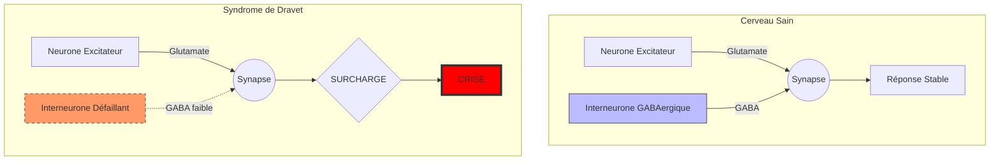

# Partie I : L'Architecture du Chaos
## Chapitre 2 : La Tempête Électrique (Physiopathologie)

### 🎯 L'Essentiel (Cible : Familles & Aidants)

**Pourquoi le cerveau "s'emballe" ?**
Pour comprendre la crise d'épilepsie, imaginez une foule dans un stade de football. Pour que tout se passe bien, il faut des agents de sécurité (les **interneurones**) qui circulent pour calmer les tensions et maintenir l'ordre. 

Dans le syndrome de Dravet, à cause du défaut de la "porte" (le canal sodique dont nous avons parlé au chapitre 1), ces agents de sécurité sont soit trop peu nombreux, soit trop lents à réagir. Dès qu'une petite tension apparaît dans la foule (un signal électrique un peu fort), les agents ne peuvent pas intervenir à temps. La tension monte, tout le monde s'agite en même temps : c'est la **crise d'épilepsie**.

**Le rôle de la fièvre : l'accélérateur de tempête**
La fièvre augmente naturellement l'activité électrique du cerveau. Pour un cerveau normal, c'est une montée de tension gérable. Pour un cerveau de Dravet, où les "agents de sécurité" sont déjà débordés, la fièvre est comme si on ajoutait soudainement des milliers de personnes agitées dans le stade. Le système sature instantanément.

**À retenir :**
*   La crise n'est pas une "attaque" extérieure, c'est un défaut de régulation interne.
*   Le cerveau perd sa capacité à se "calmer" lui-même.
*   La fièvre est le principal facteur qui rend cette régulation impossible.

---

### 🩺 Le Protocole (Cible : Corps Médical)

**Déséquilibre Excitation/Inhibition (E/I Balance)**
Le cœur de la physiopathologie du syndrome de Dravet réside dans une rupture profonde de l'homéostasie entre les systèmes excitateurs (glutamatergiques) et inhibiteurs (GABAergiques). 

**La défaillance des interneurones GABAergiques**
Les canaux NaV1.1 sont essentiels pour la génération de potentiels d'action rapides dans les interneurones inhibiteurs, particulièrement les cellules à **parvalbumine (PV+)**. Ces cellules sont responsables de l'inhibition périsomatique rapide, cruciale pour le contrôle du timing des décharges neuronales.
*   **Déficit de décharge :** La mutation réduit la capacité de ces interneurones à suivre des fréquences de décharge élevées.
*   **Échec de l'inhibition latérale :** Normalement, un neurone excité active ses voisins inhibiteurs pour limiter la propagation du signal. Dans le Dravet, cette inhibition latérale est défaillante, permettant une propagation spatiale rapide (décharge généralisée).

**L'impact de l'hyperthermie sur la cinétique des canaux**
La température corporelle influence directement la cinétique des canaux sodiques. L'augmentation de la température :
1.  Accélère les taux de décharge neuronale.
2.  Modifie l'état d'activation/inactivation des canaux NaV1.1 déjà défectueux, aggravant le déficit d'inhibition.
3.  Crée un cercle vicieux où l'augmentation de l'activité électrique génère une chaleur métabolique supplémentaire, exacerbant la vulnérabilité.

#### 📊 Schéma du déséquilibre synaptique (Mermaid)

---

### 🤝 L'Accompagnement (Cible : Structures d'accueil & Éducateurs)

**Comprendre la "tempête" pour mieux l'anticiper**
Il est important de comprendre que la crise n'est pas un événement isolé, mais le résultat d'un système qui ne peut plus s'auto-réguler. 

**Gestion des stimuli environnementaux :**
Puisque le cerveau a du mal à "freiner" l'excitation, les stimuli sensoriels excessifs peuvent agir comme des micro-déclencheurs :
*   **Stimuli visuels :** Les lumières clignotantes ou les contrastes très violents peuvent augmenter l'excitation corticale.
*   **Stimuli sonores :** Un environnement trop bruyant peut être fatigant et stressant pour le système nerveux de l'enfant.

**Observation des signes pré-critiques (Prodromes) :**
Bien que chaque enfant soit différent, une augmentation de l'agitation ou un changement dans la régulation thermique (l'enfant semble soudainement très chaud ou transpire anormalement) peut être le signe que le système est en train de saturer.

**Sécurité lors de la crise :**
L'échec de l'inhibition signifie que la crise peut être brutale et généralisée. 
*   **Protection physique :** Éviter les chutes ou les chocs contre des objets tranchants/durs.
*   **Positionnement :** Privilégier la Position Latérale de Sécurité (PLS) pour libérer les voies aériennes, car l'absence d'inhibition peut entraîner une perte de tonus musculaire ou des difficultés respiratoires.

---

### 💡 Le Point de Liaison (Synthèse)

| Concept | Famille | Médical | Professionnel |
| :--- | :--- | :--- | :--- |
| **Mécanisme** | Les "freins" ne marchent plus | Déficit d'inhibition GABAergique via NaV1.1 | Incapacité du cerveau à s'auto-calmer |
| **Déclencheur** | La fièvre accélère tout | Hyperthermie → cinétique des canaux altérée | Éviter la surchauffe et les stimuli excessifs |
| **Conséquence** | Une tempête électrique | Propagation de la décharge (absence d'inhibition latérale) | Risque de chute et besoin de protection physique |

***
