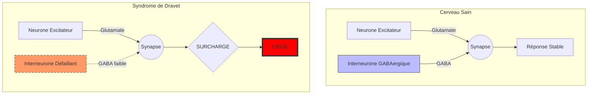

# Partie I : L'Architecture du Chaos
## Chapitre 2 : La Tempête Électrique (Physiopathologie)

### 🎯 L'Essentiel (Cible : Familles & Aidants)

**Pourquoi le cerveau "s'emballe" ?**
Pour comprendre la crise d'épilepsie, imaginez une foule dans un stade de football. Pour que tout se passe bien, il faut des agents de sécurité (les **interneurones**) qui circulent pour calmer les tensions et maintenir l'ordre. 

Dans le syndrome de Dravet, à cause du défaut de la "porte" (le canal sodique dont nous avons parlé au chapitre 1), ces agents de sécurité sont soit trop peu nombreux, soit trop lents à réagir. Dès qu'une petite tension apparaît dans la foule (un signal électrique un peu fort), les agents ne peuvent pas intervenir à temps. La tension monte, tout le monde s'agite en même temps : c'est la **crise d'épilepsie**.

**Le rôle de la fièvre : l'accélérateur de tempête**
La fièvre augmente naturellement l'activité électrique du cerveau. Pour un cerveau normal, c'est une montée de tension gérable. Pour un cerveau de Dravet, où les "agents de sécurité" sont déjà débordés, la fièvre est comme si on ajoutait soudainement des milliers de personnes agitées dans le stade. Le système sature instantanément.

**Pourquoi les symptômes n'apparaissent-ils pas à la naissance ?**
Imaginez que dans le cerveau, il existe deux versions d'une même porte électrique : une "porte de naissance" (NaV1.3) et une "porte définitive" (NaV1.1). Quand le bébé est dans le ventre de sa maman et pendant ses premiers mois de vie, c'est la porte de naissance qui fait le travail. Puis, vers l'âge de 3 à 6 mois, un relais se met en place : la porte définitive prend le relais de la porte de naissance.

C'est exactement comme une course de relais : tant que le premier coureur (NaV1.3) court, tout va bien. Mais quand il passe le témoin au second coureur (NaV1.1), si celui-ci est blessé, la course s'effondre. C'est ce qui se passe dans le Dravet : la porte définitive est défectueuse, et c'est au moment du relais que les premiers symptômes apparaissent, souvent vers 5-6 mois.

**Les trois grandes phases de la maladie :**
1.  **Phase fébrile (5-12 mois) :** Les premières crises surviennent, souvent déclenchées par la fièvre. Le bébé semblait normal avant.
2.  **Phase d'aggravation (1-5 ans) :** Les crises se multiplient et se diversifient (avec ou sans fièvre). C'est la période la plus difficile.
3.  **Phase de stabilisation relative (après 5 ans) :** Les crises persistent mais tendent à diminuer en fréquence. Le développement reste affecté, mais se stabilise.

**À retenir :**
*   La crise n'est pas une "attaque" extérieure, c'est un défaut de régulation interne.
*   Le cerveau perd sa capacité à se "calmer" lui-même.
*   La fièvre est le principal facteur qui rend cette régulation impossible.
*   Les symptômes apparaissent vers 5-6 mois à cause d'un "relais" entre deux portes électriques dans le cerveau.

---

### 🩺 Le Protocole (Cible : Corps Médical)

**Déséquilibre Excitation/Inhibition (E/I Balance)**
Le cœur de la physiopathologie du syndrome de Dravet réside dans une rupture profonde de l'homéostasie entre les systèmes excitateurs (glutamatergiques) et inhibiteurs (GABAergiques), comme démontré initialement dans le modèle murin [Yu et al., 2006]. 

**La défaillance des interneurones GABAergiques**
Les canaux NaV1.1 sont essentiels pour la génération de potentiels d'action rapides dans les interneurones inhibiteurs, particulièrement les cellules à **parvalbumine (PV+)** [Yu et al., 2006 ; Ogiwara et al., 2007]. Ces cellules sont responsables de l'inhibition périsomatique rapide, cruciale pour le contrôle du timing des décharges neuronales.
*   **Déficit de décharge :** La mutation réduit la capacité de ces interneurones à suivre des fréquences de décharge élevées. Ce déficit touche à la fois les interneurones PV+ et les interneurones à somatostatine (SST+) [Tai et al., 2014].
*   **Échec de l'inhibition latérale :** Normalement, un neurone excité active ses voisins inhibiteurs pour limiter la propagation du signal. Dans le Dravet, cette inhibition latérale est défaillante, permettant une propagation spatiale rapide (décharge généralisée). La délétion sélective de NaV1.1 dans les interneurones inhibiteurs suffit à reproduire le phénotype épileptique [Cheah et al., 2012].

**Le switch développemental NaV1.3 → NaV1.1**
La fenêtre temporelle d'apparition des symptômes s'explique par un switch développemental critique des canaux sodiques dans les interneurones GABAergiques :
*   **Période foetale et néonatale :** NaV1.3 (et dans une moindre mesure NaV1.2) est le canal sodique prédominant dans les interneurones. L'haploinsuffisance de NaV1.1 n'a donc pas d'impact fonctionnel significatif.
*   **3-8 mois postnataux :** NaV1.1 remplace progressivement NaV1.3 comme canal sodique dominant dans les interneurones inhibiteurs [Ogiwara et al., 2007]. C'est à ce moment que l'haploinsuffisance de NaV1.1 commence à se manifester fonctionnellement, abaissant le seuil épileptogène.
*   **Conséquence clinique :** Première crise typiquement entre 5 et 8 mois, souvent déclenchée par la fièvre (vaccination, infection intercurrente).

**Phases de l'épileptogenèse dans le syndrome de Dravet**
L'épileptogenèse peut être décomposée en phases cliniquement distinctes :
1.  **Phase 1 -- Fébrile (5-12 mois) :** Crises cloniques hémilatérales ou généralisées, prolongées, déclenchées par la fièvre. Le seuil épileptogène est abaissé mais les crises restent essentiellement provoquées. Le développement psychomoteur est encore normal.
2.  **Phase 2 -- Aggravation (1-5 ans) :** Crises de plus en plus fréquentes, apparition de crises afébriles. Émergence des myoclonies, absences atypiques, crises focales. États de mal épileptiques fébriles répétés. Ralentissement puis plateau du développement psychomoteur. Modifications structurelles et fonctionnelles des circuits neuronaux.
3.  **Phase 3 -- Stabilisation relative (>5 ans) :** Épilepsie pharmacorésistante persistante, mais la fréquence des crises tend à diminuer. Déficit cognitif stabilisé. Possibilité d'ataxie progressive. Réorganisation définitive des circuits neuronaux.

**L'impact de l'hyperthermie sur la cinétique des canaux**
La température corporelle influence directement la cinétique des canaux sodiques. L'augmentation de la température :
1.  Accélère les taux de décharge neuronale.
2.  Modifie l'état d'activation/inactivation des canaux NaV1.1 déjà défectueux, aggravant le déficit d'inhibition.
3.  Crée un cercle vicieux où l'augmentation de l'activité électrique génère une chaleur métabolique supplémentaire, exacerbant la vulnérabilité.

#### 📊 Schéma du déséquilibre synaptique (Mermaid)

---

### 🤝 L'Accompagnement (Cible : Structures d'accueil & Éducateurs)

**Comprendre la "tempête" pour mieux l'anticiper**
Il est important de comprendre que la crise n'est pas un événement isolé, mais le résultat d'un système qui ne peut plus s'auto-réguler. 

**Gestion des stimuli environnementaux :**
Puisque le cerveau a du mal à "freiner" l'excitation, les stimuli sensoriels excessifs peuvent agir comme des micro-déclencheurs :
*   **Stimuli visuels :** Les lumières clignotantes ou les contrastes très violents peuvent augmenter l'excitation corticale.
*   **Stimuli sonores :** Un environnement trop bruyant peut être fatigant et stressant pour le système nerveux de l'enfant.

**Observation des signes pré-critiques (Prodromes) :**
Bien que chaque enfant soit différent, une augmentation de l'agitation ou un changement dans la régulation thermique (l'enfant semble soudainement très chaud ou transpire anormalement) peut être le signe que le système est en train de saturer.

**Comprendre les phases pour adapter l'accompagnement**
La maladie évolue en trois grandes phases, et l'accompagnement doit s'y adapter :
*   **Phase fébrile (5-12 mois) :** L'enfant semble se développer normalement. La vigilance porte essentiellement sur la gestion de la fièvre et la surveillance des premières crises.
*   **Phase d'aggravation (1-5 ans) :** Période la plus exigeante. Les crises se multiplient et le développement ralentit. L'environnement doit être très sécurisé, les stimulations dosées avec soin, et la coordination avec l'équipe médicale renforcée.
*   **Phase de stabilisation (après 5 ans) :** Les crises persistent mais diminuent souvent en fréquence. L'accompagnement se recentre sur le soutien au développement cognitif, à l'autonomie et à la socialisation.

**Sécurité lors de la crise :**
L'échec de l'inhibition signifie que la crise peut être brutale et généralisée. 
*   **Protection physique :** Éviter les chutes ou les chocs contre des objets tranchants/durs.
*   **Positionnement :** Privilégier la Position Latérale de Sécurité (PLS) pour libérer les voies aériennes, car l'absence d'inhibition peut entraîner une perte de tonus musculaire ou des difficultés respiratoires.

---

### 💡 Le Point de Liaison (Synthèse)

| Concept | Famille | Médical | Professionnel |
| :--- | :--- | :--- | :--- |
| **Mécanisme** | Les "freins" ne marchent plus | Déficit d'inhibition GABAergique via NaV1.1 | Incapacité du cerveau à s'auto-calmer |
| **Fenêtre temporelle** | "Relais" entre deux portes vers 5-6 mois | Switch NaV1.3 → NaV1.1 dans les interneurones | Symptômes absents à la naissance, apparition progressive |
| **Phases** | Fébrile → aggravation → stabilisation | 3 phases d'épileptogenèse distinctes | Adapter l'intensité de l'accompagnement à chaque phase |
| **Déclencheur** | La fièvre accélère tout | Hyperthermie → cinétique des canaux altérée | Éviter la surchauffe et les stimuli excessifs |
| **Conséquence** | Une tempête électrique | Propagation de la décharge (absence d'inhibition latérale) | Risque de chute et besoin de protection physique |

***
