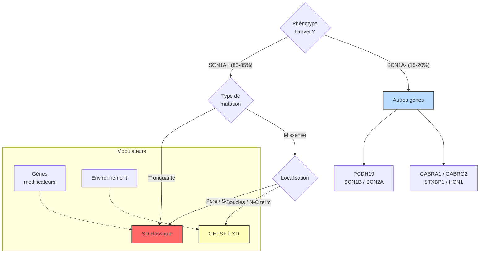

# Partie I : L'Architecture du Chaos
## Chapitre 3 : La Diversité des Visages (Hétérogénéité)

### 🎯 L'Essentiel (Cible : Familles & Aidants)

**Pourquoi chaque enfant est-il différent ?**
Si vous parlez à deux familles vivant avec le syndrome de Dravet, vous pourriez avoir l'impression qu'elles ne parlent pas de la même maladie. L'un peut avoir des crises très courtes, l'autre des crises qui durent des heures. L'un peut marcher normalement, l'autre avoir de grandes difficultés d'équilibre.

Cette différence s'appelle l'**hétérogénéité**. Imaginez que le syndrome de Dravet soit une panne dans un moteur de voiture. La panne est la même (le gène SCN1A), mais selon que la voiture est une citadine, une sportive ou un camion, les conséquences sur la conduite ne seront pas du tout les mêmes.

**Les trois facteurs de différence :**
1.  **Le type d'erreur dans le code :** Une petite faute d'orthographe dans le gène n'aura pas le même impact qu'une page entière arrachée.
2.  **Le terrain de l'enfant :** Chaque cerveau est unique. La façon dont le reste du système nerveux réagit à la panne va varier d'un enfant à l'autre.
3.  **L'évolution dans le temps :** La maladie n'est pas figée ; elle change au fur et à mesure que l'enfant grandit.

**Et si le test génétique ne trouve rien ?**
Chez 15 à 20% des enfants qui présentent tous les signes cliniques du syndrome de Dravet, le test génétique standard ne trouve pas de mutation dans le gène SCN1A. Cela ne veut pas dire que ce n'est pas un syndrome de Dravet. D'autres gènes peuvent être en cause (comme PCDH19, qui touche exclusivement les filles, ou d'autres gènes plus rares). Et parfois, les techniques actuelles ne sont simplement pas assez sensibles pour détecter certaines mutations.

**Le mosaïcisme parental : un concept important**
Dans 5 à 10% des cas, l'un des parents porte la mutation dans une partie seulement de ses cellules, sans être lui-même malade. On appelle cela le mosaïcisme (du mot "mosaïque", parce que certaines cellules portent la mutation et d'autres non). Cette information est importante pour évaluer le risque si les parents souhaitent avoir d'autres enfants.

**Le spectre GEFS+ / Dravet**
Le syndrome de Dravet n'est pas une maladie isolée : il fait partie d'un spectre, c'est-à-dire d'un ensemble continu de formes plus ou moins sévères. À un bout du spectre se trouve le GEFS+ (une forme d'épilepsie avec crises fébriles, de pronostic généralement favorable), et à l'autre bout se trouve le syndrome de Dravet classique. La position d'un enfant sur ce spectre dépend du type de mutation, mais aussi de facteurs génétiques et environnementaux propres à chacun.

**À retenir :**
*   Ne comparez pas votre enfant à celui d'une autre famille ; son parcours est unique.
*   La sévérité peut varier énormément selon la nature précise de la mutation.
*   Le diagnostic doit être personnalisé pour chaque patient.
*   Pas de mutation trouvée ne signifie pas que ce n'est pas Dravet -- d'autres gènes ou limites techniques peuvent être en cause.

---

### 🩺 Le Protocole (Cible : Corps Médical)

**Hétérogénéité Moléculaire et Phénotypique**
Le syndrome de Dravet présente une variabilité clinique majeure, ce qui rend la standardisation des protocoles complexe [Steel et al., 2017 ; Scheffer et al., 2017]. Cette hétérogénéité est multidimensionnelle.

**1. Corrélation Génotype-Phénotype**
Bien que le lien entre mutation *SCN1A* et Dravet soit établi, la corrélation précise reste un sujet de recherche intense. 
*   **Mutations de perte de fonction totale (Null alleles) :** Souvent associées à des formes plus sévères avec un retard neurodéveloppemental précoce.
*   **Mutations de perte de fonction partielle (Hypomorphes) :** Peuvent entraîner des phénotypes plus légers, parfois confondus avec d'autres épilepsies de l'enfant.

**2. Variabilité du Phénotype Clinique**
Le spectre clinique inclut une grande diversité de :
*   **Types de crises :** Prédominance de crises myocloniques, atoniques ou de crises de type absence chez certains, alors que d'autres présentent des crises tonico-cloniques généralisées plus fréquentes.
*   **Profil neurodéveloppemental :** Le degré de retard cognitif et les troubles du spectre autistique (TSA) varient considérablement.

**3. Patients SCN1A-négatifs et autres gènes**
15 à 20% des patients présentant un phénotype clinique de syndrome de Dravet n'ont pas de mutation SCN1A identifiable par les techniques de séquençage standard [Steel et al., 2017]. Plusieurs autres gènes ont été impliqués :
*   **PCDH19** (protocadhérine 19) : épilepsie limitée aux filles, transmission liée à l'X avec expression paradoxale (les garçons hémizygotes sont asymptomatiques, les filles hétérozygotes sont atteintes en raison de l'interférence cellulaire).
*   **SCN1B** : sous-unité bêta du canal sodique, modifiant la cinétique de NaV1.1.
*   **SCN2A** : canal NaV1.2, phénotypes épileptiques néonataux avec chevauchement possible.
*   **GABRA1, GABRG2** : sous-unités du récepteur GABA-A, impliquées dans des formes d'épilepsie généralisée.
*   **STXBP1** (Munc18-1) : protéine de la machinerie de libération des vésicules synaptiques.
*   **HCN1** : canal cationique activé par l'hyperpolarisation, impliqué dans la régulation de l'excitabilité neuronale.

**4. Mosaïcisme parental**
5-10% des parents apparemment non atteints sont porteurs d'un mosaïcisme somatique ou germinal [Depienne et al., 2006]. Ce mosaïcisme n'est pas toujours détectable sur un prélèvement sanguin standard (le taux peut être faible dans le sang mais plus élevé dans les gonades). Le mosaïcisme germinal implique un risque de récurrence de 1-2% même en cas de mutation apparemment de novo, ce qui a des implications majeures pour le conseil génétique et le diagnostic prénatal.

**5. Le continuum GEFS+ / Dravet**
Il existe un continuum phénotypique entre le GEFS+ (Genetic Epilepsy with Febrile Seizures Plus), de pronostic généralement favorable, et le syndrome de Dravet qui représente le pôle sévère du spectre SCN1A [Scheffer et al., 2017]. La position d'un patient sur ce spectre est déterminée par : la nature de la mutation (tronquante = SD ; missense = variable), le fond génétique (gènes modificateurs), et les facteurs environnementaux (infections intercurrentes, vaccinations comme facteurs déclenchants mais non causaux).

**6. Facteurs Modulateurs**
L'expression du phénotype est influencée par des mécanismes de compensation neuronale (plasticité synaptique) qui diffèrent selon l'individu, ainsi que par des facteurs épigénétiques encore mal compris [Marini et al., 2011 ; Brunklaus et al., 2014].

#### 📊 Graphique conceptuel de la variabilité (Mermaid)

---

### 🤝 L'Accompagnement (Cible : Structures d'accueil & Éducateurs)

**Sortir du "Modèle Type"**
L'erreur la plus commune est de vouloir appliquer une méthode d'accompagnement unique à tous les enfants diagnostiqués Dravet. 

**Stratégies d'observation personnalisées :**
*   **Établir un profil de base (Baseline) :** Pour chaque enfant, documentez son comportement "normal" (sommeil, interaction, motricité). C'est la seule façon de détecter une dérive liée à une crise ou à une fatigue neurologique.
*   **Adapter l'intensité des interventions :** Un enfant avec une forme sévère de la maladie (ce que les médecins appellent un "phénotype sévère") aura besoin d'un environnement très structuré et sécurisé, tandis qu'un enfant avec une forme plus légère pourra bénéficier de stimulations sociales plus intenses.

**Quand le test génétique est négatif**
Certains enfants accueillis auront un diagnostic clinique de syndrome de Dravet sans mutation SCN1A identifiée. Cela ne change rien à l'accompagnement : le phénotype (ce que l'on observe chez l'enfant) prime sur le génotype (le résultat du test). Les besoins en termes de sécurité, de gestion des crises et d'adaptation de l'environnement restent les mêmes. L'absence de confirmation génétique peut en revanche être une source d'angoisse pour les familles, qui mérite d'être entendue et relayée à l'équipe médicale.

**Le cas particulier de PCDH19**
L'épilepsie liée à PCDH19 touche exclusivement les filles et peut ressembler au syndrome de Dravet. Ces enfants présentent des crises en salves déclenchées par la fièvre, avec un profil de développement qui peut différer. L'accompagnement reste similaire, mais il est utile de savoir que ce diagnostic existe pour mieux comprendre les échanges avec les familles et les médecins.

**Gestion de la diversité des besoins :**
*   **Communication alternative :** Puisque le retard de langage est variable, prévoyez dès le départ des outils de communication non-verbale (pictogrammes, signes) pour les enfants qui en ont besoin.
*   **Adaptation motrice :** Soyez attentifs aux troubles de l'équilibre (ataxie, c'est-à-dire des difficultés de coordination des mouvements) qui peuvent varier d'un enfant à l'autre ; l'aménagement de l'espace doit être modulable selon la mobilité réelle de l'enfant.

---

### 💡 Le Point de Liaison (Synthèse)

| Aspect | Famille | Médical | Professionnel |
| :--- | :--- | :--- | :--- |
| **Variabilité** | "Mon enfant est unique" | Hétérogénéité génotype-phénotype | Pas de protocole d'accueil standard |
| **SCN1A-négatifs** | Pas de mutation ne veut pas dire pas de Dravet | 15-20% sans mutation SCN1A ; explorer PCDH19, SCN1B, etc. | Le phénotype prime : mêmes besoins d'accompagnement |
| **Mosaïcisme** | Important pour les futurs enfants | 5-10% mosaïcisme parental ; conseil génétique | Source d'angoisse parentale à relayer |
| **Spectre** | GEFS+ léger → Dravet sévère | Continuum phénotypique SCN1A | Adapter l'intensité au profil réel de l'enfant |
| **Diagnostic** | Ne pas comparer les enfants | Recherche du type précis de mutation | Observer le profil spécifique (langage/moteur) |
| **Approche** | Acceptation du parcours propre | Médecine de précision | Personnalisation des aides et de l'espace |

***
