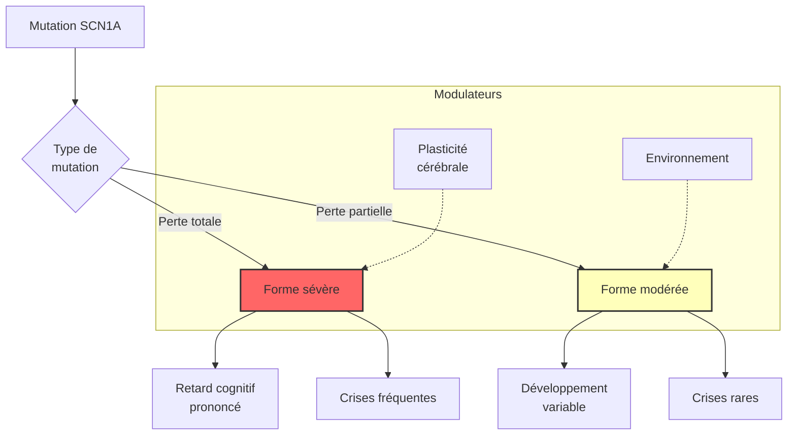

# Partie I : L'Architecture du Chaos
## Chapitre 3 : La Diversité des Visages (Hétérogénéité)

### 🎯 L'Essentiel (Cible : Familles & Aidants)

**Pourquoi chaque enfant est-il différent ?**
Si vous parlez à deux familles vivant avec le syndrome de Dravet, vous pourriez avoir l'impression qu'elles ne parlent pas de la même maladie. L'un peut avoir des crises très courtes, l'autre des crises qui durent des heures. L'un peut marcher normalement, l'autre avoir de grandes difficultés d'équilibre.

Cette différence s'appelle l'**hétérogénéité**. Imaginez que le syndrome de Dravet soit une panne dans un moteur de voiture. La panne est la même (le gène SCN1A), mais selon que la voiture est une citadine, une sportive ou un camion, les conséquences sur la conduite ne seront pas du tout les mêmes.

**Les trois facteurs de différence :**
1.  **Le type d'erreur dans le code :** Une petite faute d'orthographe dans le gène n'aura pas le même impact qu'une page entière arrachée.
2.  **Le terrain de l'enfant :** Chaque cerveau est unique. La façon dont le reste du système nerveux réagit à la panne va varier d'un enfant à l'autre.
3.  **L'évolution dans le temps :** La maladie n'est pas figée ; elle change au fur et à mesure que l'enfant grandit.

**À retenir :**
*   Ne comparez pas votre enfant à celui d'une autre famille ; son parcours est unique.
*   La sévérité peut varier énormément selon la nature précise de la mutation.
*   Le diagnostic doit être personnalisé pour chaque patient.

---

### 🩺 Le Protocole (Cible : Corps Médical)

**Hétérogénéité Moléculaire et Phénotypique**
Le syndrome de Dravet présente une variabilité clinique majeure, ce qui rend la standardisation des protocoles complexe. Cette hétérogénéité est multidimensionnelle.

**1. Corrélation Génotype-Phénotype**
Bien que le lien entre mutation *SCN1A* et Dravet soit établi, la corrélation précise reste un sujet de recherche intense. 
*   **Mutations de perte de fonction totale (Null alleles) :** Souvent associées à des formes plus sévères avec un retard neurodéveloppemental précoce.
*   **Mutations de perte de fonction partielle (Hypomorphes) :** Peuvent entraîner des phénotypes plus légers, parfois confondus avec d'autres épilepsies de l'enfant.

**2. Variabilité du Phénotype Clinique**
Le spectre clinique inclut une grande diversité de :
*   **Types de crises :** Prédominance de crises myocloniques, atoniques ou de crises de type absence chez certains, alors que d'autres présentent des crises tonico-cloniques généralisées plus fréquentes.
*   **Profil neurodéveloppemental :** Le degré de retard cognitif et les troubles du spectre autistique (TSA) varient considérablement.

**3. Facteurs Modulateurs**
L'expression du phénotype est influencée par des mécanismes de compensation neuronale (plasticité synaptique) qui diffèrent selon l'individu, ainsi que par des facteurs épigénétiques encore mal compris.

#### 📊 Graphique conceptuel de la variabilité (Mermaid)

---

### 🤝 L'Accompagnement (Cible : Structures d'accueil & Éducateurs)

**Sortir du "Modèle Type"**
L'erreur la plus commune est de vouloir appliquer une méthode d'accompagnement unique à tous les enfants diagnostiqués Dravet. 

**Stratégies d'observation personnalisées :**
*   **Établir un profil de base (Baseline) :** Pour chaque enfant, documentez son comportement "normal" (sommeil, interaction, motricité). C'est la seule façon de détecter une dérive liée à une crise ou à une fatigue neurologique.
*   **Adapter l'intensité des interventions :** Un enfant avec une forme sévère de la maladie (ce que les médecins appellent un "phénotype sévère") aura besoin d'un environnement très structuré et sécurisé, tandis qu'un enfant avec une forme plus légère pourra bénéficier de stimulations sociales plus intenses.

**Gestion de la diversité des besoins :**
*   **Communication alternative :** Puisque le retard de langage est variable, prévoyez dès le départ des outils de communication non-verbale (pictogrammes, signes) pour les enfants qui en ont besoin.
*   **Adaptation motrice :** Soyez attentifs aux troubles de l'équilibre (ataxie) qui peuvent varier d'un enfant à l'autre ; l'aménagement de l'espace doit être modulable selon la mobilité réelle de l'enfant.

---

### 💡 Le Point de Liaison (Synthèse)

| Aspect | Famille | Médical | Professionnel |
| :--- | :--- | :--- | :--- |
| **Variabilité** | "Mon enfant est unique" | Hétérogénéité génotype-phénotype | Pas de protocole d'accueil standard |
| **Diagnostic** | Ne pas comparer les enfants | Recherche du type précis de mutation | Observer le profil spécifique (langage/moteur) |
| **Approche** | Acceptation du parcours propre | Médecine de précision | Personnalisation des aides et de l'espace |

***
