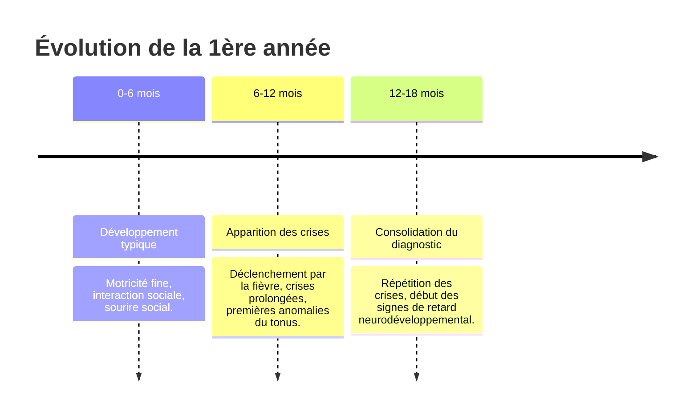

# Partie II : La Chronique d'une Maladie
## Chapitre 4 : L'Éveil de la Maladie (La Première Année)

### 🎯 L'Essentiel (Cible : Familles & Aidants)

**Le calme avant la tempête**
Pendant les premiers mois de vie, l'enfant semble souvent se développer normalement. Il sourit, suit du regard, et atteint ses étapes motrices classiques. C'est une période de "calme relatif" qui peut être trompeuse.

**L'arrivée des premières crises**
Le syndrome de Dravet se manifeste généralement entre **6 et 18 mois**. Le déclencheur est presque toujours un événement banal : une petite fièvre due à un rhume ou une poussée dentaire. 

**À quoi ressemble une crise ?**
Contrairement aux idées reçues, la première crise n'est pas forcément une convulsion violente avec des secousses. Elle peut prendre plusieurs formes :
*   **La crise fébrile prolongée :** L'enfant semble "absent", ses yeux se révulsent ou il devient très mou (crise atonique) pendant plusieurs minutes.
*   **Le regard fixe :** Un arrêt soudain de l'activité, comme si l'enfant était "déconnecté".
*   **Les mouvements brusques :** Des secousses rapides de la tête ou des membres.

**L'impact émotionnel du diagnostic**
Recevoir ce diagnostic alors que l'enfant est encore un bébé est un choc immense. Il est normal de ressentir de la confusion, de la colère ou une peur de l'avenir. Le plus important est de comprendre que cette phase de "découverte" est le début d'un parcours qui nécessite une équipe de soutien (médecins, éducateurs, associations).

**À retenir :**
*   Le développement semble normal au tout début.
*   La fièvre est le signal d'alarme majeur.
*   Les premières crises peuvent être subtiles (absence, perte de tonus) et non seulement des convulsions.

---

### 🩺 Le Protocole (Cible : Corps Médical)

**Phénoménologie de la phase initiale**
La présentation clinique précoce est le pivot du diagnostic différentiel. Le syndrome de Dravet se distingue des épilepsies fébriles simples par la **durée** et la **récurrence** des crises.

**Typologie des crises précoces**
1.  **Crises Fébriles Prolongées (Status Epilepticus Fébrile) :** C'est le signe cardinal. Les crises dépassent souvent les 30 minutes, nécessitant une intervention médicamenteuse d'urgence.
2.  **Crises Atoniques et Myocloniques :** Apparition de chutes brutales (drop attacks) ou de secousses musculaires brèves, souvent déclenchées par l'hyperthermie (élévation de la température) ou la fièvre.
3.  **Évolution vers la généralisation :** Les crises initiales, parfois focalisées, évoluent rapidement vers des décharges tonico-cloniques généralisées.

**Le défi du diagnostic différentiel**
À ce stade, il est crucial de ne pas confondre Dravet avec :
*   Les épilepsies fébriles simples (durée courte, absence de retard ultérieur).
*   Le syndrome de Doose (épilepsie myoclonique de l'enfant) : bien que proche, la génétique et le profil de réponse aux traitements diffèrent.

**Évaluation initiale indispensable :**
*   **Séquençage de l'exome (WES) :** Pour identifier la mutation *SCN1A*.
*   **EEG de routine et vidéo-EEG :** Pour caractériser les décharges (souvent normales au début, mais peuvent montrer des pointes-ondes).
*   **Évaluation du développement :** Établir une ligne de base pour monitorer l'évolution ultérieure.

#### 📊 Chronologie de l'éveil (Mermaid)

---

### 🤝 L'Accompagnement (Cible : Structures d'accueil & Éducateurs)

**La vigilance "Température"**
Dans une crèche ou un milieu familial, la gestion de la fièvre est la priorité absolue. 
*   **Protocole de fièvre :** Les structures doivent avoir un protocole clair et écrit (en lien avec les parents et le médecin) sur la conduite à tenir dès l'apparition d'une température élevée.
*   **Éviter la surchauffe :** Veiller à ce que l'enfant ne soit pas trop couvert, surtout lors de périodes de chaleur ou de jeux physiques intenses.

**Observation des "micro-signes"**
L'éducateur est souvent le premier témoin d'un changement subtil. Apprenez à repérer :
*   **La phase pré-critique (les signes avant la crise) :** Un enfant qui devient soudainement très fatigué et apathique, ou au contraire, anormalement agité.
*   **La phase post-critique (les signes après la crise) :** Une confusion prolongée, une somnolence excessive ou une difficulté à interagir après un épisode de fièvre.

**Sécurité et environnement :**
À cet âge, les crises atoniques (perte de tonus) peuvent provoquer des chutes brutales. 
*   **Aménagement :** Privilégier des tapis de sol épais dans les zones de jeu.
*   **Surveillance :** Une attention accrue est nécessaire lors des siestes ou des moments de repos où la régulation thermique peut être moins surveillée.

---

### 💡 Le Point de Liaison (Synthèse)

| Aspect | Famille | Médical | Professionnel |
| :--- | :--- | :--- | :--- |
| **Signe d'alerte** | La fièvre et les crises longues | Status epilepticus fébrile | Changement de comportement/température |
| **Action immédiate** | Appeler le médecin / Gérer la fièvre | Diagnostic génétique & EEG | Application du protocole de secours |
| **Focus principal** | Comprendre l'imprévisibilité | Écarter les diagnostics différentiels | Sécurité physique et surveillance thermique |

***
