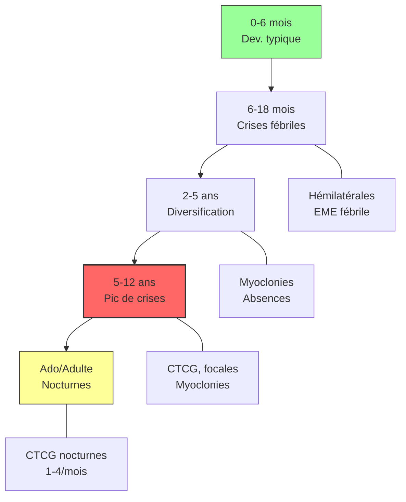

# Partie II : La Chronique d'une Maladie
## Chapitre 4 : L'Éveil de la Maladie (La Première Année)

### 🎯 L'Essentiel (Cible : Familles & Aidants)

**Le calme avant la tempête**
Pendant les premiers mois de vie, l'enfant semble souvent se développer normalement. Il sourit, suit du regard, et atteint ses étapes motrices classiques. C'est une période de "calme relatif" qui peut être trompeuse.

**L'arrivée des premières crises**
Le syndrome de Dravet se manifeste généralement entre **6 et 18 mois**. Le déclencheur est presque toujours un événement banal : une petite fièvre due à un rhume ou une poussée dentaire. 

**À quoi ressemble une crise ?**
Contrairement aux idées reçues, la première crise n'est pas forcément une convulsion violente avec des secousses. Elle peut prendre plusieurs formes :
*   **La crise fébrile prolongée :** L'enfant semble "absent", ses yeux se révulsent ou il devient très mou pendant plusieurs minutes, parfois plus de 30 minutes (on parle alors d'**état de mal épileptique** — une crise qui ne s'arrête pas spontanément et qui nécessite une intervention médicale urgente).
*   **Les secousses d'un seul côté :** L'enfant a des secousses qui touchent seulement un bras, une jambe, ou un côté du corps. On les appelle des **crises cloniques hémilatérales** (du grec "hemi" = moitié, "clonique" = avec des secousses). Ce type de crise est assez caractéristique du syndrome de Dravet et aide les médecins à poser le diagnostic.
*   **Le regard fixe :** Un arrêt soudain de l'activité, comme si l'enfant était "déconnecté". On parle d'**absence atypique**.
*   **Les mouvements brusques :** Des secousses rapides de la tête ou des membres, appelées **myoclonies** (du grec "myo" = muscle, "clonie" = mouvement).

**Les crises évoluent avec l'âge**
Un point important à comprendre : le type de crises change au fil du temps. Pendant la première année, les crises fébriles prolongées dominent. Puis, entre 2 et 6 ans, d'autres types de crises apparaissent (myoclonies, absences atypiques, crises dites "focales" qui démarrent dans une zone précise du cerveau). C'est souvent la période la plus difficile. Après l'adolescence, les crises tendent à devenir principalement nocturnes et moins variées — mais elles ne disparaissent généralement pas complètement.

**L'impact émotionnel du diagnostic**
Recevoir ce diagnostic alors que l'enfant est encore un bébé est un choc immense. Il est normal de ressentir de la confusion, de la colère ou une peur de l'avenir. Le plus important est de comprendre que cette phase de "découverte" est le début d'un parcours qui nécessite une équipe de soutien (médecins, éducateurs, associations).

**À retenir :**
*   Le développement semble normal au tout début.
*   La fièvre est le signal d'alarme majeur.
*   Les premières crises peuvent être subtiles (absence, perte de tonus) et non seulement des convulsions.
*   Les crises d'un seul côté du corps (hémilatérales) sont un signe évocateur du syndrome de Dravet.
*   Le type de crises évolue avec l'âge : de plus en plus variées dans l'enfance, puis principalement nocturnes à l'âge adulte.

---

### 🩺 Le Protocole (Cible : Corps Médical)

**Phénoménologie de la phase initiale**
La présentation clinique précoce est le pivot du diagnostic différentiel [Dravet et al., 2005]. Le syndrome de Dravet se distingue des épilepsies fébriles simples par la **durée** et la **récurrence** des crises.

**Typologie des crises dans le syndrome de Dravet**

Le syndrome de Dravet se caractérise par une diversité de types de crises qui évolue avec l'âge [Dravet et al., 2005 ; Genton et al., 2011] :

1.  **Crises Fébriles Prolongées (Status Epilepticus Fébrile) :** Signe cardinal de la phase initiale. Les crises dépassent souvent les 30 minutes, nécessitant une intervention médicamenteuse d'urgence.
2.  **Crises cloniques hémilatérales :** Crises avec secousses rythmiques touchant un hémicorps, souvent alternantes (tantôt à droite, tantôt à gauche). Ce pattern est particulièrement évocateur du syndrome de Dravet et constitue un élément discriminant du diagnostic différentiel.
3.  **Crises myocloniques :** Secousses musculaires brèves, bilatérales et synchrones, apparaissant généralement après la première année. Plus fréquentes entre 2 et 8 ans, elles tendent à diminuer après l'adolescence.
4.  **Absences atypiques :** Ruptures de contact prolongées avec des manifestations motrices subtiles (automatismes, myoclonies palpébrales). Apparition généralement entre 2 et 4 ans.
5.  **Crises focales :** Crises démarrant dans une zone cérébrale localisée, avec des manifestations variables (motrices, autonomiques, ou avec altération de la conscience). Elles peuvent secondairement se généraliser.
6.  **Crises atoniques :** Chutes brutales par perte de tonus (drop attacks), souvent déclenchées par l'hyperthermie.
7.  **Crises tonico-cloniques généralisées :** Évolution des crises initiales vers des décharges tonico-cloniques bilatérales. Ce type devient prédominant à l'âge adulte, principalement nocturne.

**Évolution des types de crises avec l'âge :**
*   **Phase 1 (0-5 ans) :** Crises fébriles prolongées, crises cloniques hémilatérales, état de mal épileptique.
*   **Phase 2 (5-12 ans) :** Pic de fréquence et de diversité (CTCG, myoclonies, absences atypiques, crises focales). Période souvent la plus difficile.
*   **Phase 3 (adolescence) :** Diminution progressive de la fréquence, prédominance nocturne.
*   **Phase 4 (âge adulte) :** Stabilisation relative. CTCG principalement nocturnes (1-4/mois). Les myoclonies et absences atypiques régressent. Les états de mal deviennent exceptionnels après 20 ans [Genton et al., 2011].

**Le défi du diagnostic différentiel**
À ce stade, il est crucial de ne pas confondre Dravet avec [Wirrell et al., 2017] :
*   Les épilepsies fébriles simples (durée courte, absence de retard ultérieur, pas de crises hémilatérales).
*   Le syndrome de Doose (épilepsie myoclonique de l'enfant) : bien que proche, la génétique et le profil de réponse aux traitements diffèrent.
*   L'**hémicrise fébrile alternante** (crises cloniques touchant alternativement un côté puis l'autre) est un signe fortement évocateur du syndrome de Dravet.

**Évaluation initiale indispensable :**
*   **Séquençage de l'exome (WES) :** Pour identifier la mutation *SCN1A* [Wirrell et al., 2017].
*   **EEG de routine et vidéo-EEG :** Pour caractériser les décharges (souvent normales au début, mais peuvent montrer des pointes-ondes).
*   **Évaluation du développement :** Établir une ligne de base pour monitorer l'évolution ultérieure.

#### 📊 Chronologie de l'éveil (Mermaid)

---

### 🤝 L'Accompagnement (Cible : Structures d'accueil & Éducateurs)

**La vigilance "Température"**
Dans une crèche ou un milieu familial, la gestion de la fièvre est la priorité absolue. 
*   **Protocole de fièvre :** Les structures doivent avoir un protocole clair et écrit (en lien avec les parents et le médecin) sur la conduite à tenir dès l'apparition d'une température élevée.
*   **Éviter la surchauffe :** Veiller à ce que l'enfant ne soit pas trop couvert, surtout lors de périodes de chaleur ou de jeux physiques intenses.

**Connaitre les différents types de crises**
Chaque type de crise a une apparence différente. Votre capacité à décrire précisément ce que vous observez est précieuse pour l'équipe médicale :
*   **Crises cloniques hémilatérales :** Des secousses rythmiques d'un seul côté du corps (un bras, une jambe, ou tout un côté). Notez quel côté est touché.
*   **Myoclonies :** Des secousses très brèves et brusques, souvent des deux côtés en même temps.
*   **Absences atypiques :** L'enfant "se fige", ne répond plus, semble "déconnecté" pendant plusieurs secondes à minutes.
*   **Crises atoniques :** L'enfant s'effondre brutalement par perte de tonus musculaire ("drop attack").
*   Pour chaque épisode, notez : l'heure, la durée, le type de mouvements, le côté touché, et l'état de l'enfant avant et après la crise.

**Observation des "micro-signes"**
L'éducateur est souvent le premier témoin d'un changement subtil. Apprenez à repérer :
*   **La phase pré-critique (les signes avant la crise) :** Un enfant qui devient soudainement très fatigué et apathique, ou au contraire, anormalement agité.
*   **La phase post-critique (les signes après la crise) :** Une confusion prolongée, une somnolence excessive ou une difficulté à interagir après un épisode de fièvre.

**Sécurité et environnement :**
À cet âge, les crises atoniques (perte de tonus) peuvent provoquer des chutes brutales. 
*   **Aménagement :** Privilégier des tapis de sol épais dans les zones de jeu.
*   **Surveillance :** Une attention accrue est nécessaire lors des siestes ou des moments de repos où la régulation thermique peut être moins surveillée.

---

### 💡 Le Point de Liaison (Synthèse)

| Aspect | Famille | Médical | Professionnel |
| :--- | :--- | :--- | :--- |
| **Signe d'alerte** | La fièvre et les crises longues | Status epilepticus fébrile, crises hémilatérales | Changement de comportement/température |
| **Types de crises** | Crises variées qui évoluent avec l'âge | 7 types identifiés (hémilatérales, myoclonies, absences, focales, atoniques, CTCG, EME) | Savoir décrire chaque type observé |
| **Évolution** | Plus variées dans l'enfance, nocturnes à l'âge adulte | Pic de diversité 5-12 ans, stabilisation adulte | Adapter la surveillance à l'âge |
| **Action immédiate** | Appeler le médecin / Gérer la fièvre | Diagnostic génétique & EEG | Application du protocole de secours |
| **Focus principal** | Comprendre l'imprévisibilité | Écarter les diagnostics différentiels | Sécurité physique et surveillance thermique |

***
