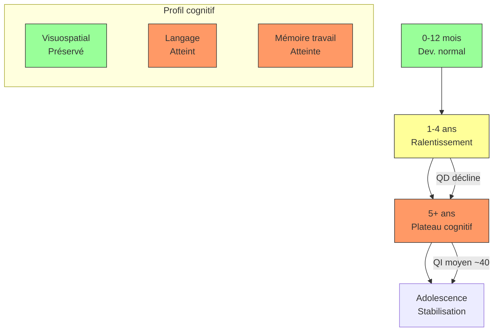

# Partie II : La Chronique d'une Maladie
## Chapitre 5 : La Traversée du Développement (Enfance et Adolescence)

### 🎯 L'Essentiel (Cible : Familles & Aidants)

**Le changement de rythme**
Une fois la première année passée, le syndrome de Dravet entre dans une phase de "croisière" qui peut durer plusieurs années. Ce n'est plus seulement une question de crises, mais de la manière dont l'enfant grandit et apprend. 

**L'impact sur l'apprentissage**
Le cerveau, occupé à gérer des décharges électriques fréquentes, a moins d'énergie disponible pour les tâches complexes comme le langage ou la motricité fine. Vous remarquerez peut-être que :
*   **Le langage stagne :** L'enfant comprend beaucoup de choses, mais a du mal à les exprimer avec des mots.
*   **La motricité devient un défi :** La marche peut devenir moins stable, ou certains gestes précis (tenir un crayon) sont difficiles.

**Un ralentissement, pas une "régression"**
Un point essentiel pour les familles : le développement de votre enfant ne "recule" pas au sens strict. C'est plutôt que la vitesse d'apprentissage ralentit par rapport aux autres enfants du même âge. Votre enfant continue d'acquérir de nouvelles compétences, mais à un rythme plus lent. Imaginez deux personnes qui marchent dans la même direction : l'une avance vite, l'autre plus lentement — mais les deux avancent.

Ce ralentissement suit un schéma assez typique :
*   **Avant 1 an :** le développement semble tout à fait normal.
*   **Entre 2 et 4 ans :** un "plateau" apparait — les progrès sont plus lents, surtout en langage.
*   **Après 5 ans :** les capacités se stabilisent à un niveau inférieur à la moyenne, mais sans dégradation majeure supplémentaire.

Par ailleurs, toutes les compétences ne sont pas touchées de la même manière. Les capacités **visuelles et spatiales** (comprendre les formes, les espaces, les images) sont souvent mieux préservées que le **langage** et la **mémoire à court terme**. C'est une information précieuse pour adapter les outils d'apprentissage.

**L'adolescence : une période de nouveaux défis**
L'arrivée de la puberté apporte son lot de changements hormonaux qui peuvent influencer la fréquence des crises et l'humeur. C'est aussi le moment où l'enfant cherche plus d'autonomie, ce qui peut créer des tensions entre ses capacités réelles et ses envies sociales.

**À retenir :**
*   Le développement "ralentit" plutôt qu'il ne "régresse" — votre enfant continue d'avancer, à son rythme.
*   Les capacités visuelles et spatiales sont souvent un point fort ; le langage et la mémoire de travail sont plus touchés.
*   Les troubles de l'apprentissage sont une conséquence directe de la maladie, pas un manque d'effort.
*   L'adolescence demande une adaptation de l'accompagnement (plus de respect de l'intimité, gestion de l'autonomie).

---

### 🩺 Le Protocole (Cible : Corps Médical)

**Évolution du Phénotype Neurodéveloppemental**
Le syndrome de Dravet est caractérisé par un retard neurodéveloppemental qui s'installe progressivement [Wolff et al., 2006]. Ce n'est pas une régression brutale, mais plutôt un ralentissement des acquisitions par rapport aux normes de développement.

**1. Trajectoire cognitive et données de cohortes**
Le profil cognitif du syndrome de Dravet suit un schéma distinctif en trois phases :
*   **Phase 1 (0-12 mois) :** Développement initial normal ou subnormal. Les jalons développementaux sont généralement dans les limites de la norme [Wolff et al., 2006].
*   **Phase 2 (1-4 ans) :** Ralentissement progressif, coïncidant avec la récurrence des crises et des états de mal épileptique. Le quotient de développement (QD) diminue significativement entre 1 et 4 ans [Ragona et al., 2010].
*   **Phase 3 (> 5 ans) :** Stabilisation à un plateau cognitif bas. Le QI se stabilise généralement entre 30 et 50 sans régression supplémentaire significative.

**Donnée clé :** Dans la cohorte adulte de [Nabbout et al., 2013] (n = 67), le QI moyen à l'âge adulte était de 40,4 +/- 17,5. La déficience intellectuelle affecte 75 à 100 % des patients (légère 15-25 %, modérée 30-40 %, sévère à profonde 35-50 %).

**Déterminants du pronostic cognitif :**
*   Fréquence et durée des états de mal épileptique (EME), surtout avant 3 ans (Brunklaus et al., 2012).
*   Type de mutation SCN1A : les mutations tronquantes sont généralement associées à un pronostic cognitif plus sévère.
*   Rôle intrinsèque de SCN1A : des modèles murins montrent des déficits cognitifs indépendamment de la fréquence des crises (Bhatt et al., 2024), suggérant un rôle direct du déficit en Nav1.1 dans la cognition.

**2. Profil neuropsychologique détaillé**
Le profil cognitif présente des forces et faiblesses caractéristiques [Chieffo et al., 2011 ; Ragona et al., 2010] :
*   **Fonctions visuospatiales :** Relativement mieux préservées que les fonctions verbales.
*   **Langage :** Retard expressif et réceptif, avec une atteinte prédominante du langage expressif. La compréhension est généralement mieux préservée que la production. Environ 50-60 % des patients adultes ont un langage fonctionnel mais souvent limité.
*   **Attention et fonctions exécutives :** Sévèrement atteintes, avec des déficits de la mémoire de travail, de l'inhibition et de la flexibilité cognitive.
*   **Mémoire :** Déficits de la mémoire à court terme et de la mémoire épisodique ; la mémoire procédurale est relativement préservée.

**3. Troubles du Langage et de la Communication**
On observe fréquemment un décalage entre la compréhension (souvent mieux préservée) et l'expression (**aphasie** — difficulté ou incapacité à produire ou comprendre le langage — ou retard de langage sévère). L'évaluation doit inclure :
*   Le suivi de la phonologie et de la syntaxe.
*   L'identification précoce du besoin en Communication Alternative et Augmentée (CAA).

**4. Troubles de la Motricité et de l'Équilibre**
L'**ataxie** (trouble de la coordination des mouvements et de l'équilibre) et l'**hypotonie** (diminution anormale du tonus musculaire, donnant une impression de "mollesse") peuvent s'accentuer avec l'âge, impactant la marche et la posture.
*   **Risque de chutes :** Augmentation de la fréquence des crises atoniques ("drop attacks").
*   **Suivi kinésithérapique :** Indispensable pour maintenir la plasticité motrice.

**5. L'Impact de la Puberté**
Les changements hormonaux peuvent modifier le seuil épileptogène. Une surveillance accrue de la fréquence des crises et de la stabilité émotionnelle est recommandée durant cette période de transition.

**6. Stratégies de prise en charge**
*   **Intervention précoce :** Stimulation globale (psychomotrice, orthophonique, éducative) dès le diagnostic, idéalement avant 2 ans.
*   **Évaluations neuropsychologiques régulières :** Tous les 2-3 ans pour adapter le projet éducatif et thérapeutique.
*   **Réduction de la charge en crises :** La réduction des EME pourrait limiter l'aggravation cognitive, bien que le rôle exact des crises versus la canalopathie elle-même reste débattu.

#### 📊 Courbe d'évolution type (Mermaid)

---

### 🤝 L'Accompagnement (Cible : Structures d'accueil & Éducateurs)

**Adapter l'enseignement et l'inclusion**
L'enfant ne peut pas être traité comme un enfant "typique" qui aurait simplement des crises. Son cerveau traite l'information différemment. Le développement cognitif suit un "ralentissement" plutôt qu'une régression : l'enfant continue d'apprendre, mais à un rythme plus lent que ses pairs.

**Stratégies pédagogiques adaptées au profil cognitif :**

Le profil cognitif du syndrome de Dravet présente des forces et des faiblesses spécifiques. Les capacités **visuospatiales** (comprendre les formes, les espaces, les images) sont souvent mieux préservées, tandis que le **langage** et la **mémoire de travail** (la capacité à retenir temporairement une information pour l'utiliser — par exemple, retenir une consigne en deux étapes) sont plus atteints. Cette connaissance est la clé pour adapter les activités :

*   **Supports visuels :** Utilisez massivement les images, les pictogrammes et les gestes pour compenser les difficultés de langage. Le canal visuel étant une force relative, les démonstrations par l'image sont plus efficaces que les consignes verbales longues.
*   **Consignes courtes et répétées :** Décomposez les tâches en étapes très courtes et simples (une seule action à la fois). Répétez les consignes plutôt que de les reformuler avec des mots différents — la répétition aide la mémoire de travail.
*   **Séquençage visuel :** Utilisez des emplois du temps visuels, des séquences d'images étape par étape, et des repères concrets dans l'espace.
*   **Temps de repos :** Prévoyez des temps de calme réguliers ; la fatigue est un facteur aggravant majeur pour les crises. La **surcharge cognitive** (l'épuisement du cerveau quand il traite trop d'informations en même temps) est un signe à repérer : l'enfant peut devenir agité, se replier sur lui-même, ou "décrocher".
*   **Mémoire procédurale :** Bien que la mémoire de travail soit atteinte, la **mémoire procédurale** (la mémoire des gestes et des habitudes — celle qui permet de faire du vélo ou de se brosser les dents "automatiquement") est souvent mieux préservée. Investissez dans l'apprentissage par la répétition et la routine plutôt que par la compréhension abstraite.

**Gestion de l'autonomie et de la vie sociale :**
*   **Encourager sans brusquer :** L'objectif est de favoriser l'autonomie (s'habiller, manger seul) tout en garantissant une sécurité maximale.
*   **Sensibilisation des pairs :** Dans un cadre scolaire ou de loisirs, expliquer la maladie aux autres enfants (avec l'accord des parents) aide à prévenir l'isolement et favorise l'empathie.
*   **Activités adaptées :** Privilégiez les activités faisant appel aux forces visuospatiales (puzzles, construction, arts plastiques) plutôt qu'aux compétences verbales.

**Vigilance motrice :**
L'ataxie peut rendre les déplacements en groupe difficiles. Prévoyez des parcours sécurisés et soyez attentifs aux signes de fatigue qui précèdent une perte de tonus.

---

### 💡 Le Point de Liaison (Synthèse)

| Aspect | Famille | Médical | Professionnel |
| :--- | :--- | :--- | :--- |
| **Trajectoire cognitive** | Ralentissement (pas régression), plateau vers 2-4 ans | QI moyen adulte ~40 (Nabbout 2013), DI 75-100 % | Adapter les attentes au rythme de l'enfant |
| **Profil cognitif** | Les capacités visuelles sont un point fort | Visuospatial préservé, langage et mémoire de travail atteints | Supports visuels, consignes courtes, répétitions |
| **Motricité** | Peur des chutes et de la maladresse | Ataxie et troubles de l'équilibre | Aménagement de l'espace et sécurité |
| **Social/École** | Inquiétude sur l'avenir et l'autonomie | Évaluations neuropsychologiques tous les 2-3 ans | Activités visuospatiales, routine, inclusion |

***
