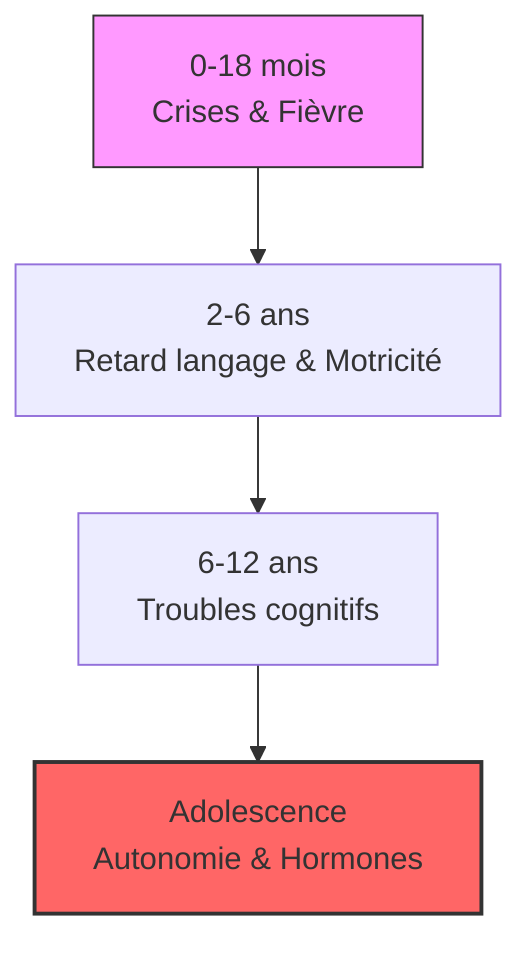

# Partie II : La Chronique d'une Maladie
## Chapitre 5 : La Traversée du Développement (Enfance et Adolescence)

### 🎯 L'Essentiel (Cible : Familles & Aidants)

**Le changement de rythme**
Une fois la première année passée, le syndrome de Dravet entre dans une phase de "croisière" qui peut durer plusieurs années. Ce n'est plus seulement une question de crises, mais de la manière dont l'enfant grandit et apprend. 

**L'impact sur l'apprentissage**
Le cerveau, occupé à gérer des décharges électriques fréquentes, a moins d'énergie disponible pour les tâches complexes comme le langage ou la motricité fine. Vous remarquerez peut-être que :
*   **Le langage stagne :** L'enfant comprend beaucoup de choses, mais a du mal à les exprimer avec des mots.
*   **La motricité devient un défi :** La marche peut devenir moins stable, ou certains gestes précis (tenir un crayon) sont difficiles.

**L'adolescence : une période de nouveaux défis**
L'arrivée de la puberté apporte son lot de changements hormonaux qui peuvent influencer la fréquence des crises et l'humeur. C'est aussi le moment où l'enfant cherche plus d'autonomie, ce qui peut créer des tensions entre ses capacités réelles et ses envies sociales.

**À retenir :**
*   Le développement n'est pas linéaire ; il y a des hauts et des bas.
*   Les troubles de l'apprentissage sont une conséquence directe de la maladie, pas un manque d'effort.
*   L'adolescence demande une adaptation de l'accompagnement (plus de respect de l'intimité, gestion de l'autonomie).

---

### 🩺 Le Protocole (Cible : Corps Médical)

**Évolution du Phénotype Neurodéveloppemental**
Le syndrome de Dravet est caractérisé par un retard neurodéveloppemental qui s'installe progressivement. Ce n'est pas une régression brutale, mais plutôt un ralentissement des acquisitions par rapport aux normes de développement.

**1. Troubles du Langage et de la Communication**
On observe fréquemment un décalage entre la compréhension (souvent mieux préservée) et l'expression (**aphasie** — difficulté ou incapacité à produire ou comprendre le langage — ou retard de langage sévère). L'évaluation doit inclure :
*   Le suivi de la phonologie et de la syntaxe.
*   L'identification précoce du besoin en Communication Alternative et Augmentée (CAA).

**2. Troubles de la Motricité et de l'Équilibre**
L'**ataxie** (trouble de la coordination des mouvements et de l'équilibre) et l'**hypotonie** (diminution anormale du tonus musculaire, donnant une impression de "mollesse") peuvent s'accentuer avec l'âge, impactant la marche et la posture. 
*   **Risque de chutes :** Augmentation de la fréquence des crises atoniques ("drop attacks").
*   **Suivi kinésithérapique :** Indispensable pour maintenir la plasticité motrice.

**3. L'Impact de la Puberté**
Les changements hormonaux peuvent modifier le seuil épileptogène. Une surveillance accrue de la fréquence des crises et de la stabilité émotionnelle est recommandée durant cette période de transition.

#### 📊 Courbe d'évolution type (Mermaid)

---

### 🤝 L'Accompagnement (Cible : Structures d'accueil & Éducateurs)

**Adapter l'enseignement et l'inclusion**
L'enfant ne peut pas être traité comme un enfant "typique" qui aurait simplement des crises. Son cerveau traite l'information différemment.

**Stratégies pédagogiques :**
*   **Supports visuels :** Utilisez massivement les images, les pictogrammes et les gestes pour compenser les difficultés de langage.
*   **Fractionnement des tâches :** Décomposez les consignes en étapes très courtes et simples pour éviter la surcharge cognitive.
*   **Temps de repos :** Prévoyez des temps de calme réguliers ; la fatigue est un facteur aggravant majeur pour les crises.

**Gestion de l'autonomie et de la vie sociale :**
*   **Encourager sans brusquer :** L'objectif est de favoriser l'autonomie (s'habiller, manger seul) tout en garantissant une sécurité maximale.
*   **Sensibilisation des pairs :** Dans un cadre scolaire ou de loisirs, expliquer la maladie aux autres enfants (avec l'accord des parents) aide à prévenir l'isolement et favorise l'empathie.

**Vigilance motrice :**
L'ataxie peut rendre les déplacements en groupe difficiles. Prévoyez des parcours sécurisés et soyez attentifs aux signes de fatigue qui précèdent une perte de tonus.

---

### 💡 Le Point de Liaison (Synthèse)

| Aspect | Famille | Médical | Professionnel |
| :--- | :--- | :--- | :--- |
| **Développement** | "Il n'avance pas comme les autres" | Retard neurodéveloppemental progressif | Besoin d'outils de communication (CAA) |
| **Motricité** | Peur des chutes et de la maladresse | Ataxie et troubles de l'équilibre | Aménagement de l'espace et sécurité |
| **Social/École** | Inquiétude sur l'avenir et l'autonomie | Évaluation des capacités cognitives | Adaptation pédagogique et inclusion |

***
