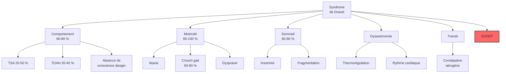

# Partie II : La Chronique d'une Maladie
## Chapitre 6 : Les Comorbidités (Le Spectre Étendu)

### 🎯 L'Essentiel (Cible : Familles & Aidants)

**Au-delà des crises : la vie avec le syndrome**
Il est fréquent de penser que le principal défi du syndrome de Dravet est de stopper les crises. Pourtant, pour beaucoup de familles, le plus grand défi quotidien réside dans ce qu'on appelle les **comorbidités**. Ce sont tous les autres troubles qui accompagnent la maladie et qui ne sont pas des crises d'épilepsie en soi.

**Les grands domaines des comorbidités :**
1.  **Le comportement et l'esprit :** L'enfant peut présenter des traits d'autisme (difficultés de communication, comportements répétitifs) ou des troubles de l'attention (hyperactivité, difficulté à se concentrer). Les troubles du comportement au sens large (agitation, impulsivité, absence de conscience du danger) touchent 60 à 80 % des enfants.
2.  **Le corps et les mouvements :** La coordination des gestes et de l'équilibre peut être perturbée — un trouble appelé **ataxie** (du grec "sans ordre", c'est-à-dire une difficulté à coordonner les mouvements) — et la marche peut devenir instable. L'ataxie concerne 60 à 80 % des patients. Avec la croissance, une posture de marche particulière peut apparaitre (marche en position accroupie, ou "crouch gait" en anglais), surtout à l'adolescence.
3.  **Les sens et le sommeil :** Le sommeil est très perturbé chez 60 à 80 % des patients, ce qui fatigue l'enfant et ses parents, créant un cercle vicieux avec les crises.
4.  **Le ventre et la digestion :** La **constipation** chronique est fréquente et souvent sous-diagnostiquée. Elle est liée aux médicaments (qui ralentissent le transit), au manque d'activité physique, et aux difficultés alimentaires. Elle peut provoquer des douleurs et de l'irritabilité, et perturber l'absorption des médicaments.
5.  **Le système nerveux autonome :** Le **système nerveux autonome** (la partie du système nerveux qui contrôle les fonctions "automatiques" du corps comme le rythme cardiaque, la respiration et la température) peut être perturbé. On parle de **dysautonomie**. Cela contribue aux problèmes de régulation de la température et au risque de complications cardiaques.

**Un risque grave à connaitre : la SUDEP**
Il est important de mentionner ici l'existence de la **SUDEP** (Sudden Unexpected Death in Epilepsy, ou mort subite inattendue liée à l'épilepsie). C'est une complication rare mais grave, dans laquelle une personne épileptique décède soudainement sans cause identifiable. Le syndrome de Dravet fait partie des épilepsies où ce risque est le plus élevé. Ce sujet est traité en détail au chapitre 9 ; il est mentionné ici car il représente la complication la plus sévère liée aux crises.

**Pourquoi est-ce important ?**
Parce que traiter uniquement les crises ne suffit pas à améliorer la qualité de vie. Si un enfant a des crises rares mais qu'il ne peut pas communiquer ou qu'il ne dort jamais, sa vie reste très difficile. L'objectif est donc une prise en charge globale.

**À retenir :**
*   La maladie est "multidimensionnelle" (elle touche plusieurs aspects de la vie).
*   Les troubles du comportement (60-80 %), du sommeil (60-80 %) et de la motricité (60-80 %) sont aussi importants que les crises.
*   La constipation et la dysautonomie sont des problèmes fréquents mais souvent négligés.
*   La SUDEP est un risque grave qui justifie la surveillance nocturne (voir chapitre 9).
*   Chaque trouble nécessite une aide spécifique (orthophoniste, psychologue, kinésithérapeute).

---

### 🩺 Le Protocole (Cible : Corps Médical)

**Le concept de comorbidité dans l'encéphalopathie épileptique**
Dans le syndrome de Dravet, les comorbidités ne sont pas des pathologies associées fortuites, mais des conséquences directes de la perturbation du développement cérébral et de l'activité épileptique chronique [Villas et al., 2017].

**1. Le Spectre Neurodéveloppemental (TSA et TDAH)**
Une prévalence élevée de **Troubles du Spectre de l'Autisme (TSA)** (20-50 %) et de **Troubles du Déficit de l'Attention avec ou sans Hyperactivité (TDAH)** (20-40 %) est documentée [Li et al., 2011 ; Villas et al., 2017].
*   **Mécanisme :** La désorganisation des circuits synaptiques (défaut d'inhibition GABAergique) perturbe la connectivité fonctionnelle nécessaire aux fonctions exécutives et sociales.
*   **Évaluation :** Utilisation d'échelles standardisées (ADOS-2, ADI-R) pour le TSA et de tests attentionnels. Dépistage recommandé entre 2 et 4 ans (M-CHAT-R/F).

**2. Troubles du Comportement**
Les troubles du comportement constituent l'une des préoccupations majeures des familles. Campbell et al. (2018) et Lagae et al. (2018) rapportent que 60 à 80 % des patients présentent des troubles comportementaux significatifs.
*   **Profil :** Absence de conscience du danger (60-80 %), hyperactivité/impulsivité (25-40 %), comportements stéréotypés (30-50 %), comportements auto-agressifs (15-30 %), irritabilité (20-35 %).
*   **Traits positifs :** Les patients Dravet sont fréquemment décrits comme sociables, affectueux et persévérants, conservant un intérêt social et une réactivité émotionnelle positive.
*   **Évolution :** L'hyperactivité tend à diminuer à l'adolescence ; l'inertie comportementale et le repli sur soi peuvent émerger.

**3. Troubles de la Motricité et de l'Équilibre**
L'ataxie cérébelleuse est une comorbidité majeure, touchant 60 à 100 % des patients [Rodda et al., 2012].
*   **Manifestations :** Dysmétrie, instabilité posturale, troubles de la marche, dyspraxie (50-70 %).
*   **Crouch gait :** Déformation posturale caractéristique (marche accroupie avec flexion des hanches et des genoux), observée chez 50-60 % des adolescents et adultes [Rodda et al., 2012]. Ce phénomène est multifactoriel (ataxie, spasticité, adaptations compensatoires) et peut s'aggraver progressivement.
*   **Impact :** Augmentation du risque de traumatismes liés aux chutes (souvent liées aux crises atoniques).

**4. Troubles du Sommeil et de la Régulation**
Les troubles du sommeil (insomnie de maintien, apnées obstructives, fragmentation) sont extrêmement fréquents (60-80 %) [Licheni et al., 2018].
*   **Architecture du sommeil :** Réduction du sommeil lent profond (stades N3), fragmentation du sommeil paradoxal (REM), crises infracliniques nocturnes.
*   **Cercle vicieux :** Le manque de sommeil abaisse le seuil épileptogène, augmentant la fréquence des crises, qui elles-mêmes fragmentent le sommeil.

**5. Dysautonomie**
Le dysfonctionnement du système nerveux autonome est documenté dans le syndrome de Dravet. Nav1.1 est exprimé dans les circuits autonomes cardiaques et respiratoires.
*   **Manifestations :** Variabilité de la fréquence cardiaque réduite (Delogu et al., 2011), troubles de la régulation thermique, anomalies de la sudation.
*   **Lien avec la SUDEP :** La dysautonomie contribue au risque de SUDEP par le biais d'arythmies post-critiques et de dépression respiratoire (voir chapitre 9 pour le détail).

**6. Troubles gastro-intestinaux et constipation**
La **constipation chronique** est une comorbidité fréquente mais souvent sous-estimée. Elle résulte de la convergence de plusieurs facteurs :
*   **Effets iatrogènes** (liés aux médicaments) : le valproate, le stiripentol et le clobazam ralentissent le transit intestinal. L'association stiripentol + valproate majore cet effet.
*   **Mobilité réduite** : l'ataxie et la sédation médicamenteuse limitent l'activité physique, facteur aggravant de la constipation.
*   **Troubles de la déglutition et de l'alimentation** : les difficultés à mastiquer et à avaler réduisent l'apport en fibres et en liquides.
*   **Cercle vicieux :** La constipation sévère peut entraîner des douleurs abdominales et une irritabilité, qui elles-mêmes abaissent le seuil de tolérance aux crises. Par ailleurs, une constipation importante peut altérer l'absorption des antiépileptiques, réduisant leur efficacité.

#### 📊 Cartographie des comorbidités (Mermaid)

---

### 🤝 L'Accompagnement (Cible : Structures d'accueil & Éducateurs)

**Une approche multidimensionnelle de l'enfant**
L'enfant n'est pas "un enfant épileptique", c'est un enfant qui a des besoins variés. Votre rôle est d'ajuster l'environnement à ses difficultés spécifiques, au-delà de la gestion des crises.

**Stratégies par domaine :**

*   **Communication (TSA/Langage) :** 
    *   Ne pas se contenter de la parole. Utilisez des supports visuels systématiques.
    *   Soyez prévisible : les changements de routine peuvent être très anxiogènes pour un enfant avec des traits autistiques.

*   **Mouvement (Ataxie/Motricité) :** 
    *   Sécurisez les parcours de déplacement.
    *   Encouragez l'autonomie motrice sans mettre en danger la stabilité de l'enfant.

*   **Gestion de la fatigue (Sommeil/Attention) :**
    *   Respectez les rythmes biologiques. Un enfant fatigué est un enfant à risque de crise et d'irritabilité.
    *   Proposez des "zones de calme" ou des temps de décompression sensorielle dans la journée.

*   **Alimentation et transit :**
    *   La constipation est fréquente et souvent liée aux médicaments. Veillez à un apport suffisant en eau et en fibres (fruits, légumes, céréales complètes).
    *   Notez la régularité du transit et signalez tout changement aux parents ou au médecin : une constipation sévère peut affecter l'absorption des médicaments et provoquer de l'irritabilité.

*   **Sécurité face aux comportements à risque :**
    *   L'absence de conscience du danger est quasi-universelle dans le syndrome de Dravet (60-80 % des patients). L'enfant peut ne pas percevoir les situations dangereuses (escaliers, points d'eau, routes). Une sécurisation active de l'environnement (verrous, barrières, surveillance des accès) est indispensable.
    *   L'impulsivité peut entrainer des gestes brusques ; prévenez plutôt que de réagir.

*   **Vigilance à la posture et à la marche :**
    *   Chez les adolescents, une **marche accroupie** ("crouch gait" en anglais, c'est-à-dire une posture de marche avec les genoux et les hanches fléchis) peut apparaitre. Signalez toute modification de la posture ou de la démarche au kinésithérapeute et aux parents.

*   **Dysautonomie et régulation thermique :**
    *   La **dysautonomie** (dysfonctionnement du système nerveux qui contrôle les fonctions automatiques du corps) peut se manifester par une mauvaise régulation de la température. Soyez attentifs aux signes de surchauffe ou de refroidissement excessif.

**Observation pour l'équipe médicale :**
Soyez attentifs aux changements subtils qui ne sont pas des crises : une augmentation de l'agitation, un retrait social plus marqué, ou une modification du **tonus musculaire** (la tension naturelle qui maintient les muscles en état de fonctionnement — un tonus trop faible rend l'enfant "mou", un tonus trop élevé le rend raide). Ces informations sont cruciales pour ajuster les traitements non-antiépileptiques.

**Mention importante : la SUDEP**
La **SUDEP** (mort subite inattendue liée à l'épilepsie) est un risque grave dans le syndrome de Dravet. En tant que professionnel, votre rôle est d'assurer une surveillance rigoureuse, notamment pendant les temps de repos et de sieste. Si un moniteur de crises nocturne est en place, veillez à son bon fonctionnement. Le chapitre 9 détaille ce sujet et les mesures de prévention.

---

### 💡 Le Point de Liaison (Synthèse)

| Domaine | Famille | Médical | Professionnel |
| :--- | :--- | :--- | :--- |
| **Comportement (60-80 %)** | Gérer l'agitation, l'absence de conscience du danger | Diagnostic TSA (20-50 %) / TDAH (20-40 %), évaluation comportementale | Sécurisation active, routine et supports visuels |
| **Mouvement (60-100 %)** | Sécuriser la maison, surveiller la posture | Évaluation ataxie, suivi crouch gait, kinésithérapie | Aménagement de l'espace, signaler les changements posturaux |
| **Sommeil (60-80 %)** | Gérer la fatigue globale | Polysomnographie, mélatonine, ajustement MAE | Respecter les temps de repos |
| **Transit** | Hydratation et fibres | Constipation iatrogène (valproate, stiripentol) | Noter la régularité du transit, alerter si changement |
| **Dysautonomie** | Surveiller la température | Évaluation cardiaque, variabilité FC | Prévenir surchauffe et refroidissement |
| **SUDEP** | Surveillance nocturne, moniteur de crises | Prévention, information aux familles (voir ch. 9) | Surveillance pendant siestes et repos |

***