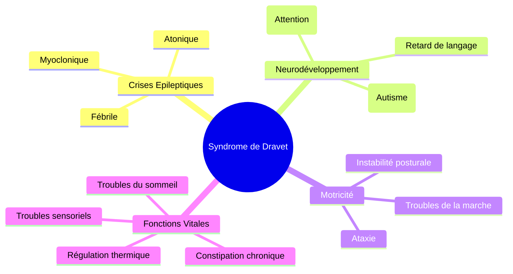

# Partie II : La Chronique d'une Maladie
## Chapitre 6 : Les Comorbidités (Le Spectre Étendu)

### 🎯 L'Essentiel (Cible : Familles & Aidants)

**Au-delà des crises : la vie avec le syndrome**
Il est fréquent de penser que le principal défi du syndrome de Dravet est de stopper les crises. Pourtant, pour beaucoup de familles, le plus grand défi quotidien réside dans ce qu'on appelle les **comorbidités**. Ce sont tous les autres troubles qui accompagnent la maladie et qui ne sont pas des crises d'épilepsie en soi.

**Les trois grands piliers des comorbidités :**
1.  **Le comportement et l'esprit :** L'enfant peut présenter des traits d'autisme (difficultés de communication, comportements répétitifs) ou des troubles de l'attention (hyperactivité, difficulté à se concentrer).
2.  **Le corps et les mouvements :** La coordination des gestes et de l'équilibre peut être perturbée — un trouble appelé **ataxie** (du grec "sans ordre") — et la marche peut devenir instable.
3.  **Les sens et le sommeil :** Le sommeil est souvent très perturbé, ce qui fatigue l'enfant et ses parents, créant un cercle vicieux avec les crises.

**Pourquoi est-ce important ?**
Parce que traiter uniquement les crises ne suffit pas à améliorer la qualité de vie. Si un enfant a des crises rares mais qu'il ne peut pas communiquer ou qu'il ne dort jamais, sa vie reste très difficile. L'objectif est donc une prise en charge globale.

**À retenir :**
*   La maladie est "multidimensionnelle" (elle touche plusieurs aspects de la vie).
*   Les troubles du comportement et du sommeil sont aussi importants que les crises.
*   Chaque trouble nécessite une aide spécifique (orthophoniste, psychologue, kinésithérapeute).

---

### 🩺 Le Protocole (Cible : Corps Médical)

**Le concept de comorbidité dans l'encéphalopathie épileptique**
Dans le syndrome de Dravet, les comorbidités ne sont pas des pathologies associées fortuites, mais des conséquences directes de la perturbation du développement cérébral et de l'activité épileptique chronique.

**1. Le Spectre Neurodéveloppemental (TSA et TDAH)**
Une prévalence élevée de **Troubles du Spectre de l'Autisme (TSA)** et de **Troubles du Déficit de l'Attention avec ou sans Hyperactivité (TDAH)** est documentée. 
*   **Mécanisme :** La désorganisation des circuits synaptiques (défaut d'inhibition GABAergique) perturbe la connectivité fonctionnelle nécessaire aux fonctions exécutives et sociales.
*   **Évaluation :** Utilisation d'échelles standardisées (ADOS, ADI-R) pour le TSA et de tests attentionnels.

**2. Troubles de la Motricité et de l'Équilibre**
L'ataxie cérébelleuse est une comorbidité majeure. 
*   **Manifestations :** Dysmétrie, instabilité posturale, troubles de la marche.
*   **Impact :** Augmentation du risque de traumatismes liés aux chutes (souvent liées aux crises atoniques).

**3. Troubles du Sommeil et de la Régulation**
Les troubles du sommeil (insomnie de maintien, apnées obstructives, fragmentation) sont extrêmement fréquents. 
*   **Cercle vicieux :** Le manque de sommeil abaisse le seuil épileptogène, augmentant la fréquence des crises, qui elles-mêmes fragmentent le sommeil.

**4. Troubles gastro-intestinaux et constipation**
La **constipation chronique** est une comorbidité fréquente mais souvent sous-estimée. Elle résulte de la convergence de plusieurs facteurs :
*   **Effets iatrogènes** (liés aux médicaments) : le valproate, le stiripentol et le clobazam ralentissent le transit intestinal. L'association stiripentol + valproate majore cet effet.
*   **Mobilité réduite** : l'ataxie et la sédation médicamenteuse limitent l'activité physique, facteur aggravant de la constipation.
*   **Troubles de la déglutition et de l'alimentation** : les difficultés à mastiquer et à avaler réduisent l'apport en fibres et en liquides.
*   **Cercle vicieux :** La constipation sévère peut entraîner des douleurs abdominales et une irritabilité, qui elles-mêmes abaissent le seuil de tolérance aux crises. Par ailleurs, une constipation importante peut altérer l'absorption des antiépileptiques, réduisant leur efficacité.

#### 📊 Cartographie des comorbidités (Mermaid)

---

### 🤝 L'Accompagnement (Cible : Structures d'accueil & Éducateurs)

**Une approche multidimensionnelle de l'enfant**
L'enfant n'est pas "un enfant épileptique", c'est un enfant qui a des besoins variés. Votre rôle est d'ajuster l'environnement à ses difficultés spécifiques, au-delà de la gestion des crises.

**Stratégies par domaine :**

*   **Communication (TSA/Langage) :** 
    *   Ne pas se contenter de la parole. Utilisez des supports visuels systématiques.
    *   Soyez prévisible : les changements de routine peuvent être très anxiogènes pour un enfant avec des traits autistiques.

*   **Mouvement (Ataxie/Motricité) :** 
    *   Sécurisez les parcours de déplacement.
    *   Encouragez l'autonomie motrice sans mettre en danger la stabilité de l'enfant.

*   **Gestion de la fatigue (Sommeil/Attention) :**
    *   Respectez les rythmes biologiques. Un enfant fatigué est un enfant à risque de crise et d'irritabilité.
    *   Proposez des "zones de calme" ou des temps de décompression sensorielle dans la journée.

*   **Alimentation et transit :**
    *   La constipation est fréquente et souvent liée aux médicaments. Veillez à un apport suffisant en eau et en fibres (fruits, légumes, céréales complètes).
    *   Notez la régularité du transit et signalez tout changement aux parents ou au médecin : une constipation sévère peut affecter l'absorption des médicaments et provoquer de l'irritabilité.

**Observation pour l'équipe médicale :**
Soyez attentifs aux changements subtils qui ne sont pas des crises : une augmentation de l'agitation, un retrait social plus marqué, ou une modification du **tonus musculaire** (la tension naturelle qui maintient les muscles en état de fonctionnement — un tonus trop faible rend l'enfant "mou", un tonus trop élevé le rend raide). Ces informations sont cruciales pour ajuster les traitements non-antiépileptiques.

---

### 💡 Le Point de Liaison (Synthèse)

| Domaine | Famille | Médical | Professionnel |
| :--- | :--- | :--- | :--- |
| **Comportement** | Gérer l'agitation/l'isolement | Diagnostic TSA / TDAH | Routine et supports visuels |
| **Mouvement** | Sécuriser la maison | Évaluation de l'ataxie | Aménagement de l'espace de jeu |
| **Sommeil** | Gérer la fatigue globale | Étude du sommeil / Rythmes | Respecter les temps de repos |
| **Transit** | Veiller à l'hydratation et aux fibres | Constipation iatrogène (valproate, stiripentol) | Noter la régularité du transit, alerter si changement |

***