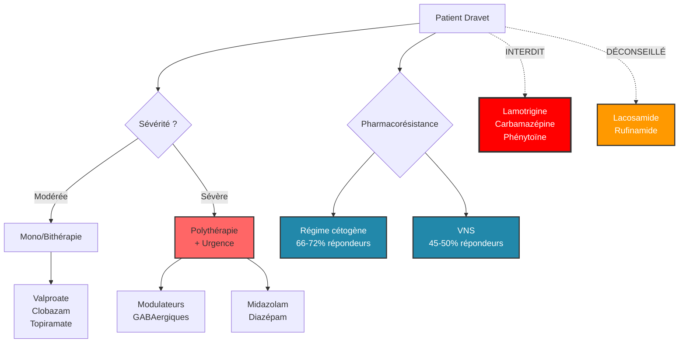

# Partie III : L'Arsenal Thérapeutique
## Chapitre 7 : La Pharmacopée Classique

### 🎯 L'Essentiel (Cible : Familles & Aidants)

**Le but du traitement : trouver l'équilibre**
Le premier objectif des médicaments est simple en apparence : réduire le nombre de crises et leur durée. Mais le vrai défi est de trouver le "juste milieu". Un médicament trop faible ne protège pas assez, mais un médicament trop fort peut rendre l'enfant très somnolent, léthargique ou modifier son comportement.

**Les médicaments "standards"**
Il existe des traitements utilisés depuis longtemps pour beaucoup d'épilepsies. Pour le syndrome de Dravet, certains sont plus efficaces que d'autres, mais ils font partie de la boîte à outils de base. Ils agissent en essayant de calmer l'activité électrique du cerveau ou en renforçant les "freins" (le GABA, un messager chimique qui ralentit l'activité des neurones) dont nous avons parlé au début.

Voici les principales molécules utilisées :
*   **Le valproate de sodium** est souvent le premier médicament essayé. Il réduit les crises d'au moins moitié chez environ 40 à 60 % des enfants. Il est encore plus efficace quand il est associé au clobazam. Attention : ce médicament est **contre-indiqué chez la femme enceinte ou en âge de procréer** en raison de risques graves pour le foetus.
*   **Le clobazam** est une benzodiazépine (un médicament de la famille des calmants) qui renforce l'action du GABA. Ajouté au valproate, il réduit les crises de 30 à 50 % supplémentaires. Son principal inconvénient est la somnolence et le risque que le corps s'y habitue avec le temps.
*   **Le topiramate** agit sur plusieurs mécanismes à la fois. Environ un enfant sur deux voit ses crises diminuer d'au moins moitié. Mais il peut entraîner des difficultés à trouver ses mots et une perte d'appétit, et il augmente le risque d'hyperthermie (surchauffe du corps), ce qui est préoccupant dans le Dravet où la chaleur déclenche souvent des crises.
*   **Le lévétiracétam** est parfois ajouté car il interagit peu avec les autres médicaments, mais son efficacité reste variable.

**Les effets secondaires : un combat quotidien**
Il est important de savoir que presque tous les antiépileptiques ont des effets secondaires possibles. Cela peut être :
*   Une fatigue importante.
*   Des troubles de l'équilibre ou de la marche.
*   Des changements d'humeur (irritabilité).

**Attention — Médicaments dangereux :**
Certains antiépileptiques, parfaitement adaptés pour d'autres formes d'épilepsie, sont **formellement interdits** dans le syndrome de Dravet car ils aggravent les crises. C'est le cas notamment de la **lamotrigine**, de la **carbamazépine**, de l'**oxcarbazépine**, de la **phénytoïne** et de la **vigabatrine**. D'autres molécules à action sur les canaux sodiques, comme le **lacosamide** et le **rufinamide**, sont également déconseillées (contre-indication relative à absolue selon les patients). Si un médecin qui ne connaît pas bien le syndrome prescrit l'un de ces médicaments, il faut immédiatement en discuter avec le neurologue référent.

**Au-delà des médicaments : le régime cétogène et le stimulateur du nerf vague**

Quand les médicaments ne suffisent pas, deux autres approches peuvent aider :

*   **Le régime cétogène** : imaginez que le cerveau fonctionne normalement au "sucre" (glucose). Le régime cétogène lui propose un "carburant alternatif" : les graisses. En mangeant très peu de sucres et beaucoup de graisses, le corps produit des substances appelées corps cétoniques (des molécules fabriquées par le foie à partir des graisses) qui nourrissent le cerveau différemment et semblent calmer les crises. Ce n'est pas un simple changement d'alimentation : c'est un traitement médical strict, supervisé par un diététicien spécialisé. Les études montrent que **deux enfants sur trois** voient leurs crises diminuer significativement avec ce régime. Il existe des versions plus ou moins strictes : le régime classique (le plus efficace mais le plus contraignant), le régime Atkins modifié (plus souple) et le régime MCT (qui utilise des huiles spéciales à base de triglycérides à chaîne moyenne, un type de graisse plus facilement transformé en corps cétoniques).

*   **Le stimulateur du nerf vague (VNS)** : c'est un petit appareil implanté sous la peau de la poitrine, comme un pacemaker cardiaque, mais pour le cerveau. Il envoie régulièrement de petites impulsions électriques au nerf vague (un grand nerf qui relie le corps au cerveau) dans le cou. Ces signaux remontent au cerveau et contribuent à calmer l'activité électrique excessive. Environ **un enfant sur deux** voit ses crises diminuer. Un avantage important : il est accompagné d'un aimant que le parent ou l'accompagnant peut passer sur le boîtier au début d'une crise pour déclencher une stimulation supplémentaire.

**À retenir :**
*   Le traitement est une recherche constante de l'équilibre entre efficacité et tolérance.
*   Il n'existe pas de "pilule miracle" unique qui fonctionne pour tout le monde.
*   Certains médicaments courants contre l'épilepsie sont **contre-indiqués** dans le Dravet — vérifiez toujours avec le spécialiste.
*   Le régime cétogène et le stimulateur du nerf vague sont des options complémentaires quand les médicaments ne suffisent pas.
*   Notez toujours les changements de comportement ou de fatigue pour en parler au médecin.

---

### 🩺 Le Protocole (Cible : Corps Médical)

**Stratégies Pharmacologiques Conventionnelles**
La prise en charge thérapeutique du syndrome de Dravet repose traditionnellement sur l'utilisation d'antiépileptiques (AE) à large spectre [Chiron et al., 2000], bien que leur efficacité soit souvent limitée pour contrôler totalement le phénotype.

**1. Les molécules de première et deuxième lignes**
L'objectif est de cibler les mécanismes d'hyperexcitabilité :

*   **Valproate de sodium (VPA) — Première intention :**
    Mécanisme multiple : inhibition modérée des canaux sodiques (faible affinité, ne compromet pas les interneurones PV+), augmentation de la synthèse de GABA, inhibition des canaux calciques de type T [Perucca, 2002]. Réduction >= 50 % des crises chez environ 40-60 % des patients en monothérapie. Efficacité améliorée en bithérapie avec le clobazam.
    *Posologie :* 10-15 mg/kg/jour initial, entretien 20-40 mg/kg/jour (jusqu'à 60), taux plasmatique cible 50-100 microg/mL.
    *Effets secondaires :* Hépatotoxicité (risque accru < 2 ans en polythérapie), thrombocytopénie, tremblements, prise de poids, hyperammoniémie.
    **Contre-indication chez la femme en âge de procréer** (risque tératogène majeur : anomalies du tube neural, troubles neurodéveloppementaux in utero).

*   **Clobazam (CLB) — Composante essentielle de la bithérapie de base :**
    Benzodiazépine 1,5 atypique, modulateur allostérique positif du récepteur GABA-A. Réduction supplémentaire de 30-50 % des crises en add-on au VPA (Conry et al., 2009). Composante obligatoire du protocole de l'essai pivot stiripentol (STICLO). Risque de tolérance pharmacodynamique après 6-12 mois.
    *Posologie :* 0,2-1 mg/kg/jour en 2 prises (max 20 mg/jour enfant, 40 mg/jour adulte).
    *Effets secondaires :* Sédation dose-dépendante, ataxie, hypersalivation, crises de sevrage en cas d'arrêt brutal. Interaction majeure avec le stiripentol (inhibition CYP2C19, augmentation du N-desméthylclobazam).

*   **Topiramate (TPM) — Troisième ligne :**
    Mécanisme multiple : blocage sodique modéré, potentialisation GABA-A (sites non-benzodiazépiniques), antagonisme glutamatergique kainate/AMPA, inhibition de l'anhydrase carbonique. Coppola et al. (2002) : réduction >= 50 % chez 56 % des patients (10/18, étude ouverte). Pas d'essai randomisé contrôlé spécifique dans le Dravet.
    *Posologie :* Titration lente depuis 0,5-1 mg/kg/jour, cible 3-9 mg/kg/jour.
    *Effets secondaires :* Troubles cognitifs et du langage (effet "word-finding"), anorexie, néphrolithiase, acidose métabolique, **oligohydrose avec risque d'hyperthermie** (particulièrement préoccupant dans le Dravet en raison de la thermosensibilité).

*   **Lévétiracétam (LEV) — Add-on :**
    Se lie à la protéine SV2A des vésicules synaptiques. Efficacité limitée dans le Dravet par rapport aux autres épilepsies (Striano et al., 2007). Utilisé pour son profil d'interactions favorable. Pas d'essai contrôlé spécifique.
    *Effets secondaires :* Irritabilité et troubles du comportement (fréquents et parfois sévères chez l'enfant), somnolence.

**2. Médicaments formellement contre-indiqués**
La physiopathologie du syndrome de Dravet (perte de fonction des canaux NaV1.1 dans les interneurones inhibiteurs) rend **contre-indiqués** les antiépileptiques agissant par blocage des canaux sodiques [Guerrini et al., 1998]. Ces molécules aggravent le déficit d'inhibition GABAergique et peuvent provoquer une augmentation paradoxale des crises, voire un état de mal épileptique :
*   **Lamotrigine**
*   **Carbamazépine / Oxcarbazépine**
*   **Phénytoïne**
*   **Vigabatrine** (aggravation documentée des crises myocloniques)
*   **Lacosamide** (bloqueur sodique sélectif — contre-indication relative à absolue)
*   **Rufinamide** (modulateur sodique — contre-indication relative, aggravation possible)

> ⚠️ **Point critique :** L'erreur de prescription d'un bloqueur sodique est l'un des risques iatrogènes majeurs dans le Dravet, en particulier lorsque le diagnostic n'est pas encore confirmé ou lorsque le patient est vu par un neurologue non spécialisé.

**3. La problématique de la polythérapie**
La majorité des patients Dravet nécessitent une **polythérapie** (combinaison de plusieurs molécules). Le défi clinique est la gestion des interactions médicamenteuses et l'accumulation des effets secondaires (somnolence, troubles cognitifs).

**4. Limites de la pharmacopée classique**
Le principal échec thérapeutique réside dans l'incapacité de ces molécules à restaurer une inhibition GABAergique suffisante pour stopper les crises prolongées ou les états de mal épileptiques fréquents chez ces patients.

**5. Approches non pharmacologiques**

**5a. Régime cétogène**
Le régime cétogène (riche en lipides 70-90 %, pauvre en glucides < 5-10 %) induit une cétose chronique où le cerveau utilise les corps cétoniques comme source d'énergie alternative au glucose. Mécanismes antiépileptiques proposés : modulation GABAergique, inhibition des récepteurs AMPA (acide décanoïque), activation des canaux KATP, réduction du stress oxydatif, modification du microbiome intestinal.

*Données cliniques dans le Dravet :*
*   [Caraballo, 2011], cohorte prospective (n=24) : **66,7 % de répondeurs** (réduction >= 50 %), 16,7 % avec réduction >= 90 %.
*   [Dressler et al., 2015], étude rétrospective multicentrique (n=32) : **72 % de répondeurs** à 3 mois, 62 % à 6 mois.
*   Nabbout et al. (2011), multicentrique (n=15) : 66,7 % de répondeurs à 3 mois, mais taux d'abandon élevé à long terme (compliance).

*Variantes :*

| Type | Ratio lip:non-lip | Particularités |
| :--- | :--- | :--- |
| Cétogène classique | 4:1 ou 3:1 | Le plus étudié, le plus restrictif |
| MCT | Variable | Plus souple, action directe de l'acide décanoïque |
| Atkins modifié | ~1,5:1 | Compliance améliorée |

*Effets secondaires :* Hypoglycémie (initiation), dyslipidémie, néphrolithiase (5-10 %), retard de croissance, carences en micronutriments (supplémentation obligatoire : calcium, vitamine D, sélénium, magnésium, zinc), constipation, acidose métabolique.

*Suivi :* Diététicien spécialisé obligatoire. Monitoring des corps cétoniques, profil lipidique, fonction rénale, croissance. Durée minimale recommandée : 2 ans.

**5b. Stimulation du nerf vague (VNS)**
Implantation d'un générateur d'impulsions sous-cutané thoracique relié à une électrode sur le nerf vague gauche cervical. Stimulation intermittente (typiquement 30 s toutes les 5 min). Mécanismes : projections vagales vers le NTS, libération de noradrénaline via le locus coeruleus, modulation thalamo-corticale, augmentation de l'activité sérotoninergique. Effet neuromodulateur progressif (efficacité croissante sur mois/années).

*Données cliniques dans le Dravet :*
*   Dibué-Adjei et al. (2017), revue systématique (n=68) : taux de répondeurs >= 50 % : environ **45-50 %**. Amélioration subjective de la vigilance et de la qualité de vie.
*   Fulton et al. (2017), n=12 : 58 % de répondeurs à 12 mois, réduction significative de la durée et de la sévérité.

*Avantages :* Pas d'interactions médicamenteuses, pas d'effets cognitifs. Système aimant permettant une stimulation supplémentaire au début d'une crise. Pas de chirurgie cérébrale. Nouveaux modèles avec détection cardiaque (AspireSR, SenTiva) : déclenchement automatique lors d'une tachycardie pré-ictale.

*Limites :* Efficacité partielle (rarement > 75 % de réduction), chirurgie d'implantation sous AG, effets locaux (enrouement, toux, dysphagie), coût élevé, remplacement du générateur tous les 5-10 ans.

#### 📊 Hiérarchie des interventions (Mermaid)

---

### 🤝 L'Accompagnement (Cible : Structures d'accueil & Éducateurs)

**Observer pour protéger**
Votre rôle n'est pas de donner les médicaments, mais d'être les "yeux" du médecin sur l'impact réel du traitement dans la vie quotidienne.

**Les points de vigilance comportementaux :**
*   **La sédation (Somnolence) :** Un enfant qui semble "dans le brouillard", qui a des difficultés à rester éveillé ou qui réagit lentement aux sollicitations. Cela peut impacter sa sécurité et ses apprentissages.
*   **L'irritabilité :** Certains traitements peuvent modifier l'humeur. Notez si l'enfant devient soudainement plus agressif ou plus anxieux après un changement de dosage.
*   **La coordination :** Surveillez si le traitement accentue les troubles de l'équilibre (ataxie), ce qui augmente le risque de chutes lors des activités physiques.

**Gestion de la routine médicamenteuse :**
*   **Régularité absolue :** Les crises sont souvent liées à des oublis ou des décalages d'horaires. Assurez-vous que les protocoles de prise sont strictement respectés dans votre structure.
*   **Communication avec les parents :** Si vous observez un changement (même léger) dans l'état de vigilance de l'enfant, signalez-le systématiquement aux parents pour qu'ils puissent en informer le neurologue.

**Effets secondaires à connaître par molécule :**
*   **Valproate :** surveiller une fatigue inhabituelle, une prise de poids rapide, des tremblements.
*   **Clobazam :** somnolence marquée (surtout après augmentation de dose), salivation excessive.
*   **Topiramate :** difficultés à trouver ses mots (l'enfant peut sembler "chercher" plus que d'habitude), perte d'appétit. Attention particulière à l'hyperthermie (surchauffe du corps) : le topiramate réduit la transpiration, ce qui est un risque supplémentaire pour un enfant déjà sensible à la chaleur.

**Si l'enfant suit un régime cétogène :**
Le régime cétogène est un traitement médical strict qui impose une alimentation très riche en graisses et quasiment sans sucres ni féculents. En collectivité, cela demande une vigilance particulière :
*   **Les repas sont différents** : l'enfant ne peut pas partager les repas classiques. Ses repas sont préparés selon des ratios précis et fournis par la famille ou un service spécialisé. Ne jamais donner d'aliment non prévu (même un bonbon ou un morceau de pain) — cela pourrait rompre la cétose (l'état métabolique dans lequel le corps utilise les graisses au lieu du sucre) et réduire l'efficacité du traitement.
*   **Surveiller les signes de malaise** : une hypoglycémie (chute du taux de sucre dans le sang) est possible, surtout en début de régime. Soyez attentif à une fatigue soudaine, des sueurs, une pâleur ou une confusion.
*   **Signaler les vomissements ou refus alimentaires** : ils peuvent compromettre le régime et doivent être communiqués rapidement aux parents.

**Si l'enfant porte un stimulateur du nerf vague (VNS) :**
Le VNS est un petit boîtier implanté sous la peau de la poitrine, relié au nerf vague dans le cou. Il fonctionne en continu et ne nécessite aucune intervention au quotidien, mais il y a des points importants à connaître :
*   **L'aimant VNS** : un aimant spécial accompagne l'enfant. En cas de début de crise, passer l'aimant sur le boîtier (geste rapide, une à deux secondes) déclenche une stimulation supplémentaire qui peut aider à raccourcir ou atténuer la crise. Demandez aux parents de vous montrer le geste. L'aimant doit être accessible à tout moment.
*   **Signes normaux pendant la stimulation** : l'enfant peut avoir la voix rauque ou une légère toux pendant les quelques secondes de stimulation (toutes les 5 minutes environ). C'est normal et non douloureux.
*   **Ne pas s'inquiéter du boîtier** : il est sous la peau et ne gêne pas les activités courantes. En revanche, éviter les chocs directs sur la zone d'implantation (poitrine gauche).

---

### 💡 Le Point de Liaison (Synthèse)

| Aspect | Famille | Médical | Professionnel |
| :--- | :--- | :--- | :--- |
| **Objectif** | Moins de crises, plus de vie | Contrôle de l'hyperexcitabilité | Sécurité et vigilance comportementale |
| **Risque majeur** | Effets secondaires (fatigue) | Interactions, toxicité et **contre-indications** | Sédation et risque de chute |
| **Danger** | Certains médicaments aggravent les crises | Bloqueurs sodiques **contre-indiqués** (Lamotrigine, etc.) | Signaler tout changement après modification de traitement |
| **Valproate** | Premier médicament essayé ; interdit si grossesse | Première intention, 40-60 % répondeurs ; **contre-indication femme en âge de procréer** | Surveiller fatigue, prise de poids, tremblements |
| **Clobazam** | Renforce le "frein" GABA ; risque de somnolence | Bithérapie de base avec VPA, +30-50 % réduction | Surveiller somnolence, salivation |
| **Topiramate** | Efficace chez 1 enfant sur 2 ; risque surchauffe | 3e ligne, 56 % répondeurs ; risque d'hyperthermie | Attention chaleur, perte d'appétit, mots difficiles |
| **Régime cétogène** | Carburant alternatif pour le cerveau ; repas stricts | 66-72 % répondeurs ; suivi diététique obligatoire | Repas spéciaux, ne rien donner hors protocole |
| **VNS** | Pacemaker du nerf vague ; aimant en cas de crise | 45-50 % répondeurs ; efficacité progressive | Connaître le geste aimant ; signes normaux (voix rauque) |
| **Action clé** | Noter les changements d'humeur | Ajustement des doses/molécules | Respect strict des horaires de prise |

***
