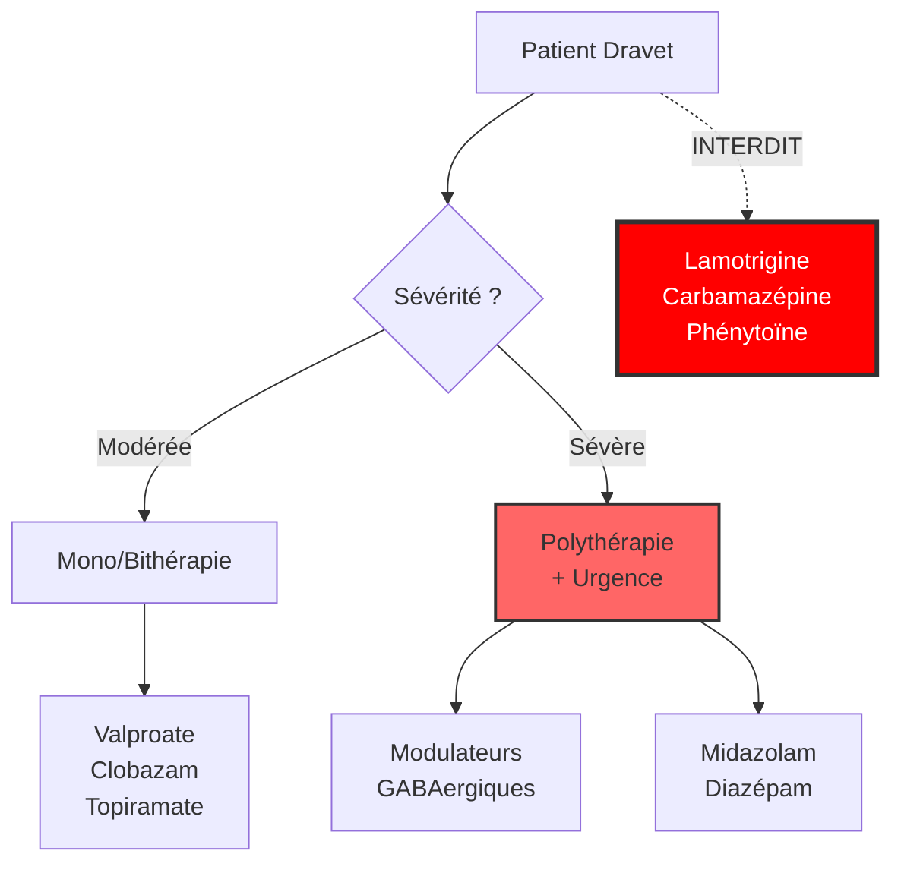

# Partie III : L'Arsenal Thérapeutique
## Chapitre 7 : La Pharmacopée Classique

### 🎯 L'Essentiel (Cible : Familles & Aidants)

**Le but du traitement : trouver l'équilibre**
Le premier objectif des médicaments est simple en apparence : réduire le nombre de crises et leur durée. Mais le vrai défi est de trouver le "juste milieu". Un médicament trop faible ne protège pas assez, mais un médicament trop fort peut rendre l'enfant très somnolent, léthargique ou modifier son comportement.

**Les médicaments "standards"**
Il existe des traitements utilisés depuis longtemps pour beaucoup d'épilepsies. Pour le syndrome de Dravet, certains sont plus efficaces que d'autres, mais ils font partie de la boîte à outils de base. Ils agissent en essayant de calmer l'activité électrique du cerveau ou en renforçant les "freins" (le GABA) dont nous avons parlé au début.

**Les effets secondaires : un combat quotidien**
Il est important de savoir que presque tous les antiépileptiques ont des effets secondaires possibles. Cela peut être :
*   Une fatigue importante.
*   Des troubles de l'équilibre ou de la marche.
*   Des changements d'humeur (irritabilité).

**Attention — Médicaments dangereux :**
Certains antiépileptiques, parfaitement adaptés pour d'autres formes d'épilepsie, sont **formellement interdits** dans le syndrome de Dravet car ils aggravent les crises. C'est le cas notamment de la **lamotrigine**, de la **carbamazépine**, de l'**oxcarbazépine**, de la **phénytoïne** et de la **vigabatrine**. Si un médecin qui ne connaît pas bien le syndrome prescrit l'un de ces médicaments, il faut immédiatement en discuter avec le neurologue référent.

**À retenir :**
*   Le traitement est une recherche constante de l'équilibre entre efficacité et tolérance.
*   Il n'existe pas de "pilule miracle" unique qui fonctionne pour tout le monde.
*   Certains médicaments courants contre l'épilepsie sont **contre-indiqués** dans le Dravet — vérifiez toujours avec le spécialiste.
*   Notez toujours les changements de comportement ou de fatigue pour en parler au médecin.

---

### 🩺 Le Protocole (Cible : Corps Médical)

**Stratégies Pharmacologiques Conventionnelles**
La prise en charge thérapeutique du syndrome de Dravet repose traditionnellement sur l'utilisation d'antiépileptiques (AE) à large spectre, bien que leur efficacité soit souvent limitée pour contrôler totalement le phénotype.

**1. Les molécules de première et deuxième lignes**
L'objectif est de cibler les mécanismes d'hyperexcitabilité :
*   **Valproate de sodium :** Souvent utilisé en première intention pour son spectre large, mais avec une prudence extrême chez la femme en âge de procréer (risques tératogènes).
*   **Topiramate / Zonisamide :** Agissent sur plusieurs canaux (sodium, calcium) pour stabiliser la membrane neuronale.
*   **Clobazam (Benzodiazépine) :** Agit en renforçant l'inhibition GABAergique. Très efficace pour réduire la fréquence, mais risque de sédation et de tolérance à long terme.
*   **Lévétiracétam :** Utilisé en add-on thérapeutique pour son profil de tolérance, bien que son efficacité reste variable selon les patients.

**2. Médicaments formellement contre-indiqués**
La physiopathologie du syndrome de Dravet (perte de fonction des canaux NaV1.1 dans les interneurones inhibiteurs) rend **contre-indiqués** les antiépileptiques agissant par blocage des canaux sodiques. Ces molécules aggravent le déficit d'inhibition GABAergique et peuvent provoquer une augmentation paradoxale des crises, voire un état de mal épileptique :
*   **Lamotrigine**
*   **Carbamazépine / Oxcarbazépine**
*   **Phénytoïne**
*   **Vigabatrine** (aggravation documentée des crises myocloniques)

> ⚠️ **Point critique :** L'erreur de prescription d'un bloqueur sodique est l'un des risques iatrogènes majeurs dans le Dravet, en particulier lorsque le diagnostic n'est pas encore confirmé ou lorsque le patient est vu par un neurologue non spécialisé.

**3. La problématique de la polythérapie**
La majorité des patients Dravet nécessitent une **polythérapie** (combinaison de plusieurs molécules). Le défi clinique est la gestion des interactions médicamenteuses et l'accumulation des effets secondaires (somnolence, troubles cognitifs).

**4. Limites de la pharmacopée classique**
Le principal échec thérapeutique réside dans l'incapacité de ces molécules à restaurer une inhibition GABAergique suffisante pour stopper les crises prolongées ou les états de mal épileptiques fréquents chez ces patients.

#### 📊 Hiérarchie des interventions (Mermaid)

---

### 🤝 L'Accompagnement (Cible : Structures d'accueil & Éducateurs)

**Observer pour protéger**
Votre rôle n'est pas de donner les médicaments, mais d'être les "yeux" du médecin sur l'impact réel du traitement dans la vie quotidienne.

**Les points de vigilance comportementaux :**
*   **La sédation (Somnolence) :** Un enfant qui semble "dans le brouillard", qui a des difficultés à rester éveillé ou qui réagit lentement aux sollicitations. Cela peut impacter sa sécurité et ses apprentissages.
*   **L'irritabilité :** Certains traitements peuvent modifier l'humeur. Notez si l'enfant devient soudainement plus agressif ou plus anxieux après un changement de dosage.
*   **La coordination :** Surveillez si le traitement accentue les troubles de l'équilibre (ataxie), ce qui augmente le risque de chutes lors des activités physiques.

**Gestion de la routine médicamenteuse :**
*   **Régularité absolue :** Les crises sont souvent liées à des oublis ou des décalages d'horaires. Assurez-vous que les protocoles de prise sont strictement respectés dans votre structure.
*   **Communication avec les parents :** Si vous observez un changement (même léger) dans l'état de vigilance de l'enfant, signalez-le systématiquement aux parents pour qu'ils puissent en informer le neurologue.

---

### 💡 Le Point de Liaison (Synthèse)

| Aspect | Famille | Médical | Professionnel |
| :--- | :--- | :--- | :--- |
| **Objectif** | Moins de crises, plus de vie | Contrôle de l'hyperexcitabilité | Sécurité et vigilance comportementale |
| **Risque majeur** | Effets secondaires (fatigue) | Interactions, toxicité et **contre-indications** | Sédation et risque de chute |
| **Danger** | Certains médicaments aggravent les crises | Bloqueurs sodiques **contre-indiqués** (Lamotrigine, etc.) | Signaler tout changement après modification de traitement |
| **Action clé** | Noter les changements d'humeur | Ajustement des doses/molécules | Respect strict des horaires de prise |

***
