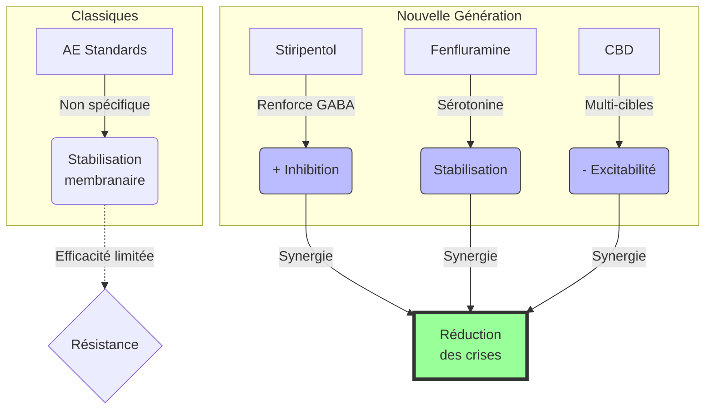

# Partie III : L'Arsenal Thérapeutique
## Chapitre 8 : La Révolution Moléculaire (Traitements Ciblés)

### 🎯 L'Essentiel (Cible : Familles & Aidants)

**L'espoir d'une nouvelle ère**
Pendant longtemps, nous n'avions que des médicaments "généraux" qui essayaient de calmer tout le cerveau. Aujourd'hui, la science progresse vers des traitements beaucoup plus précis, conçus spécifiquement pour agir sur les mécanismes défaillants du syndrome de Dravet.

**Les nouveaux alliés : Fenfluramine et Stiripentol**
Ces médicaments ne sont pas de simples antiépileptiques classiques. Ils agissent de manière complémentaire pour "réparer" ou compenser le manque d'inhibition :
*   **Le Stiripentol :** Il aide à augmenter l'effet du GABA (le "frein" naturel du cerveau dont nous avons parlé au chapitre 1).
*   **La Fenfluramine :** Elle agit sur la **sérotonine**, un messager chimique du cerveau qui influence l'humeur et l'activité électrique. En stimulant certains de ses récepteurs (des "capteurs" à la surface des neurones), elle stabilise les circuits cérébraux et réduit drastiquement la fréquence des crises.
*   **Le Cannabidiol (CBD) :** Utilisé sous forme médicale stricte (différent du cannabis récréatif), il aide à réduire la suractivité électrique du cerveau.

**Ce que cela change concrètement**
Ces traitements ne guérissent pas la mutation génétique, mais ils peuvent réduire le nombre de crises de manière spectaculaire (parfois de plus de 50% ou 70%). Pour une famille, cela signifie moins d'urgences, moins de peur et potentiellement une meilleure qualité de vie pour l'enfant.

**À retenir :**
*   On passe d'une médecine "générale" à une médecine "de précision".
*   Ces traitements sont souvent ajoutés en complément des anciens (polythérapie).
*   Leur accès peut être complexe et nécessite un suivi médical très spécialisé.

---

### 🩺 Le Protocole (Cible : Corps Médical)

**Médecine de Précision et Modulation Synaptique**
L'évolution thérapeutique du syndrome de Dravet marque le passage d'une approche purement symptomatique à une approche ciblant les voies de signalisation spécifiques altérées par la mutation *SCN1A*.

**1. Le Stiripentol (ST) : Modulation GABAergique**
Le stiripentol agit comme un modulateur allostérique positif des récepteurs GABA-A. 
*   **Mécanisme :** Il augmente l'efficacité de la transmission inhibitrice, compensant ainsi le déficit d'activité des interneurones PV+ défaillants.
*   **Synergie :** Son efficacité est maximale lorsqu'il est utilisé en association avec le clobazam et le valproate, créant un effet de synergie sur l'inhibition synaptique.

**2. La Fenfluramine (FEN) : Voie Sérotoninergique**
La fenfluramine représente une avancée majeure par son mécanisme d'action distinct des antiépileptiques classiques.
*   **Mécanisme :** Elle agit comme un agoniste sélectif des récepteurs de la sérotonine (notamment 5-HT₂B et 5-HT₂C). Cette modulation sérotoninergique semble stabiliser l'excitabilité corticale et réduire la propagation des décharges épileptiques.
*   **Efficacité clinique :** Les études montrent une réduction significative de la fréquence des crises, y compris les crises atoniques et myocloniques, souvent résistantes aux traitements conventionnels.
*   **Surveillance cardiaque obligatoire :** En raison du risque de valvulopathie cardiaque lié à l'agonisme 5-HT₂B (même mécanisme ayant conduit au retrait de la fenfluramine comme anorexigène dans les années 1990), une **échocardiographie** est obligatoire avant l'initiation du traitement, puis tous les 6 mois pendant toute la durée du traitement.

**3. Le Cannabidiol (CBD) médical**
Le CBD agit via des mécanismes complexes impliquant les récepteurs cannabinoïdes (CB1, CB2) mais aussi des voies non-cannabinoïdes (récepteurs TRPV1). Il contribue à la réduction de l'excitabilité neuronale globale.

#### 📊 Comparaison des modes d'action (Mermaid)

---

### 🤝 L'Accompagnement (Cible : Structures d'accueil & Éducateurs)

**Comprendre l'impact des nouveaux traitements**
L'introduction de ces molécules peut modifier le profil de l'enfant. Il est crucial de ne pas interpréter un changement comme une "guérison", mais comme une amélioration de la stabilité.

**Surveillance des effets secondaires spécifiques :**
*   **Sédation et Somnolence :** Les nouveaux traitements (notamment le stiripentol ou le CBD) peuvent augmenter la fatigue. Soyez attentifs à l'impact sur la vigilance lors des activités pédagogiques.
*   **Appétit et Poids :** Certains de ces médicaments peuvent influencer l'appétit ou le métabolisme. Notez tout changement notable dans la prise alimentaire.
*   **Comportement :** Surveillez toute apparition d'agitation ou, au contraire, d'un retrait social accru, qui pourrait être lié à l'ajustement thérapeutique.

**Soutien à la gestion de la polythérapie :**
L'enfant peut prendre un nombre important de médicaments à des heures très précises. 
*   **Régularité du protocole :** La coordination avec les parents pour le respect strict des horaires est vitale pour maintenir l'efficacité thérapeutique.
*   **Observation fine :** Votre rôle est d'être le témoin privilégié de la "réponse" au traitement dans un environnement naturel (jeu, repas, interaction sociale).

---

### 💡 Le Point de Liaison (Synthèse)

| Aspect | Famille | Médical | Professionnel |
| :--- | :--- | :--- | :--- |
| **Objectif** | Moins de crises, plus de vie | Modulation GABA/Sérotonine | Stabilité et vigilance accrue |
| **Nouveauté** | Traitements ciblés (Fenfluramine, etc.) | Médecine de précision | Gestion des nouveaux effets secondaires |
| **Action clé** | Espoir et patience dans l'ajustement | Optimisation de la polythérapie | Observation fine du comportement |

***
