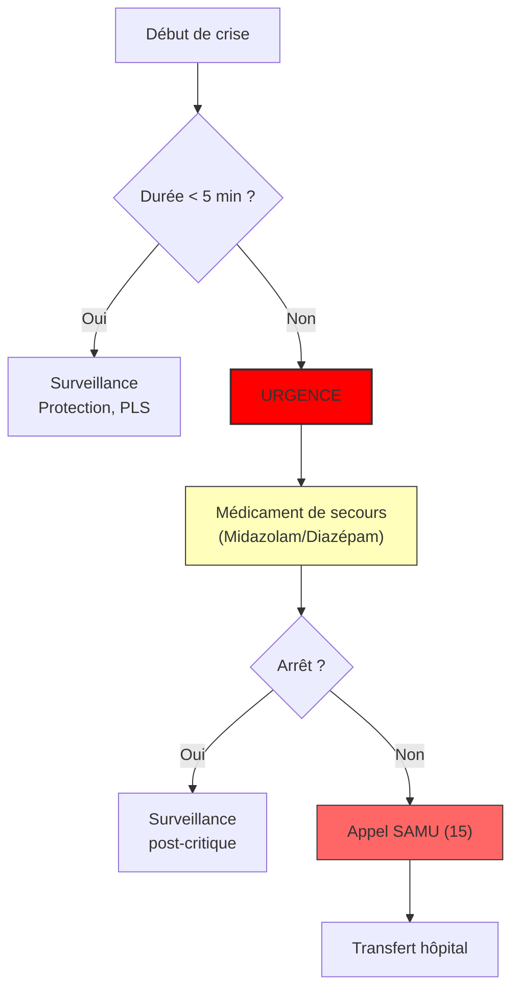

# Partie III : L'Arsenal Thérapeutique
## Chapitre 9 : Le Protocole d'Urgence (Gestion des crises et SUDEP)

### 🎯 L'Essentiel (Cible : Familles & Aidants)

**Quand l'urgence devient réelle**
La plupart des crises sont brèves, mais dans le syndrome de Dravet, certaines peuvent durer anormalement longtemps. On parle d'**état de mal épileptique** lorsque la crise dépasse un certain seuil de temps (généralement 5 minutes) ou qu'elle se répète sans que l'enfant reprenne conscience entre elles. C'est une urgence médicale absolue.

**Les réflexes qui sauvent**
Face à une crise prolongée, le stress est immense, mais la procédure doit être automatique :
1.  **Sécuriser :** Écarter les objets dangereux, protéger la tête.
2.  **Positionner :** Mettre l'enfant en Position Latérale de Sécurité (PLS) dès que possible pour libérer ses voies respiratoires.
3.  **Agir (Médicaments de secours) :** Si le médecin a prescrit un médicament d'urgence (souvent une forme de diazépam ou de midazolam à administrer par voie rectale ou nasale), utilisez-le immédiatement selon les instructions.
4.  **Appeler :** Contactez les secours (15 ou 112) si la crise ne s'arrête pas ou si vous avez un doute.

**La question de la SUDEP (Mort Subite en Épilepsie)**
C'est le sujet le plus difficile. La SUDEP est un décès soudain et inattendu chez une personne épileptique, sans cause apparente (souvent liée à un arrêt respiratoire pendant une crise). Bien que cela soit terrifiant, savoir que des mesures de prévention existent (gestion du sommeil, contrôle des crises, suivi médical) permet d'agir plutôt que de subir.

**À retenir :**
*   Une crise qui dure plus de 5 minutes est une urgence vitale.
*   La PLS et les médicaments de secours sont vos meilleurs outils.
*   La prévention passe par un contrôle rigoureux des crises au quotidien.

---

### 🩺 Le Protocole (Cible : Corps Médical)

**Gestion de l'État de Mal Épileptique (EME)**
Dans le syndrome de Dravet, la gestion de l'EME doit être extrêmement rapide en raison du risque élevé de dommages neuronaux et de complications respiratoires.

**1. Algorithme d'intervention (Protocoles de secours)**
*   **Phase 1 (0-5 min) :** Stabilisation des fonctions vitales, oxygénothérapie si nécessaire, mise en PLS.
*   **Phase 2 (5-10 min - Traitement de première ligne) :** Administration rapide de **benzodiazépines** (famille de médicaments à action calmante rapide sur le cerveau). Les protocoles privilégient souvent le **Midazolam** (administré dans la bouche ou dans le nez) pour sa rapidité d'action et sa facilité d'administration par les non-professionnels.
*   **Phase 3 (10 min+ - Traitement de deuxième ligne) :** Si l'EME persiste, passage aux antiépileptiques intraveineux (Levetiracetam, Phénobarbital ou Propofol en milieu hospitalier).

**2. Prévention de la SUDEP (Sudden Unexpected Death in Epilepsy)**
La SUDEP est une complication majeure dont le risque est corrélé à la fréquence des crises nocturnes et aux crises tonico-cloniques généralisées.
*   **Optimisation du contrôle nocturne :** Un contrôle strict des crises durant le sommeil est le levier de prévention n°1.
*   **Évaluation du risque :** Identifier les patients présentant des apnées obstructives du sommeil ou des dépressions respiratoires post-critiques.

#### 📊 Arbre décisionnel d'urgence (Mermaid)

---

### 🤝 L'Accompagnement (Cible : Structures d'accueil & Éducateurs)

**Le rôle de "Premier Répondant"**
En structure (crèche, école), vous êtes les premiers témoins. Votre capacité à rester calme et à appliquer le protocole est vitale.

**Actions immédiates en cas de crise prolongée :**
*   **Ne jamais rien mettre dans la bouche :** Cela peut provoquer des étouffements ou des blessures.
*   **Libérer les voies aériennes :** La priorité est d'éviter l'obstruction par la langue ou les sécrétions. La PLS est votre geste réflexe.
*   **Chronométrer :** Notez précisément l'heure de début et l'heure de fin de la crise. Cette donnée est cruciale pour le médecin.

**Prévention et environnement sécurisé :**
*   **Protocole écrit :** Chaque structure accueillant un enfant Dravet doit avoir une copie du "Plan d'Urgence Individuel" (incluant les contacts d'urgence et le protocole de médicaments de secours).
*   **Gestion des risques de chute :** Lors des crises atoniques, assurez-vous que l'espace est dégagé pour éviter les chocs violents.
*   **Surveillance du sommeil :** Dans les structures avec nuitées, une vigilance accrue est nécessaire lors des phases de sommeil profond.

---

### 💡 Le Point de Liaison (Synthèse)

| Aspect | Famille | Médical | Professionnel |
| :--- | :--- | :--- | :--- |
| **Urgence** | Crise > 5 min = Danger | État de mal épileptique (EME) | Application immédiate du protocole |
| **Action clé** | Médicament de secours & PLS | Stabilisation et traitement IV | Chronométrage et protection physique |
| **Prévention** | Contrôle des crises au quotidien | Stratégie anti-SUDEP | Vigilance thermique et sommeil |

***
