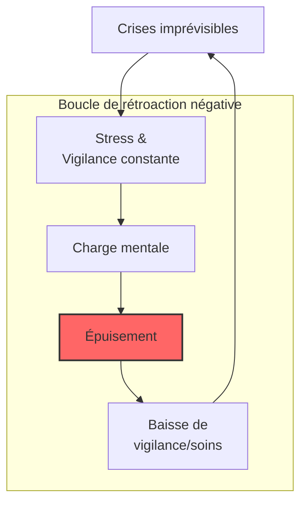

# Partie IV : L'Impact Global
## Chapitre 10 : L'Écosystème Familial

### 🎯 L'Essentiel (Cible : Familles & Aidants)

**Une vie qui bascule**
Le diagnostic du syndrome de Dravet ne concerne pas seulement l'enfant ; il impacte toute la structure familiale. C'est un événement qui redéfinit les priorités, les rythmes et souvent les projets de vie de chaque membre de la famille.

**Les défis du quotidien :**
*   **La charge mentale :** Devenir "expert" en neurologie, gérer les médicaments, surveiller la température, anticiper les crises... Cette vigilance constante est épuisante. Les études montrent que les aidants y consacrent en moyenne plus de 21 heures par semaine, en plus des soins habituels d'un enfant.
*   **L'isolement social :** La peur des crises en public ou le besoin de routines très strictes peuvent limiter les sorties et l'interaction avec l'entourage.
*   **La fratrie :** Les frères et soeurs peuvent se sentir mis à l'écart, car l'essentiel de l'attention parentale est absorbé par la maladie. Ils peuvent ressentir un mélange de jalousie (vis-à-vis de l'attention reçue par l'enfant malade) et de culpabilité (d'éprouver cette jalousie). Certains développent une maturité précoce en prenant des responsabilités qui ne sont pas de leur âge — on parle parfois de "parentification". D'autres peuvent manifester de l'anxiété, notamment la peur de voir leur frère ou soeur avoir une crise grave.
*   **L'impact financier :** Les coûts liés au syndrome de Dravet sont considérables : entre 40 000 et 100 000 euros par an en moyenne (soins, équipements, perte de revenus). Dans 60 à 80 % des familles, un parent réduit ou arrête son activité professionnelle. Ces chiffres ne sont pas anecdotiques — ils traduisent un bouleversement économique réel qui fragilise l'ensemble de la cellule familiale.

**Prendre soin de soi pour prendre soin de l'autre**
Il est crucial de comprendre que l'épuisement (le "burn-out" des aidants) n'est pas une faiblesse, mais une conséquence physiologique du stress chronique. Près de 72 % des aidants rapportent un impact négatif sur leur santé mentale (Campbell 2018), et 89 % décrivent un impact modéré à sévère sur leur qualité de vie globale (Nabbout 2019). Chercher du soutien (associations, psychologues, répit) n'est pas un luxe, c'est une nécessité pour la survie de l'équilibre familial.

**À retenir :**
*   Le syndrome de Dravet est une "maladie familiale" par son impact.
*   L'épuisement des aidants est un risque réel et documenté — il touche plus de 7 aidants sur 10.
*   L'impact sur la fratrie est souvent sous-estimé : les frères et soeurs ont aussi besoin d'écoute et d'espaces à eux.
*   Demander de l'aide est une stratégie de soin, pas un aveu d'échec.

**La relation avec la structure d'accueil**

Quand votre enfant adulte vit en foyer (foyer de vie, FAM ou MAS), vous ne devenez pas un simple visiteur. Vous restez un partenaire essentiel de son accompagnement. Ce changement de rôle est souvent difficile à vivre : après des années de vigilance quotidienne, il faut accepter de déléguer sans se sentir dépossédé.

*   **Vos droits sont réels et protégés par la loi 2002-2 :** vous avez accès aux comptes rendus, aux réunions de projet personnalisé, au cahier de liaison quotidien (papier ou numérique). Ces outils ne sont pas une faveur de l'établissement -- ils sont obligatoires.
*   **Le projet personnalisé est co-construit :** il s'agit du document qui définit les objectifs d'accompagnement de votre enfant. Il doit être élaboré avec vous dans les 6 mois suivant l'admission, et révisé au moins une fois par an. Votre connaissance intime de votre enfant -- ses habitudes, ses déclencheurs de crises, ses moyens de communication -- est irremplaçable.
*   **Quand il y a un désaccord :** commencez toujours par le dialogue direct avec l'équipe et la direction. Si cela ne suffit pas, vous pouvez faire appel à la personne qualifiée -- un médiateur externe indépendant et gratuit, désigné par l'ARS et le département (voir chapitre 11 pour les détails de la procédure). Le Conseil de la Vie Sociale (CVS), où siègent des représentants des familles, peut aussi relayer vos préoccupations.
*   **Confier n'est pas abandonner.** Le choix d'une structure d'accueil est un acte de protection, pas un renoncement. Il permet à votre enfant de bénéficier d'un encadrement professionnel continu -- y compris la surveillance nocturne, que peu de familles peuvent assurer indéfiniment. Il vous permet aussi de retrouver un espace pour prendre soin de votre propre santé.

**Quand les parents vieillissent**

Le "double vieillissement" est une réalité que beaucoup de familles connaissent sans la nommer : les parents avancent en âge avec leurs propres fragilités (fatigue, maladies, perte de mobilité), tandis que leur enfant handicapé vieillit lui aussi, souvent de manière prématurée. Ce phénomène touche des milliers de familles en France -- on estime qu'un aidant sur deux ne se reconnaît même pas comme tel.

*   **Anticiper l'avenir, c'est protéger.** Le mandat de protection future (créé par la loi du 5 mars 2007) permet de désigner à l'avance la personne qui prendra le relais pour représenter votre enfant si vous n'êtes plus en mesure de le faire. Cet acte, rédigé obligatoirement devant notaire pour un enfant handicapé, couvre les décisions relatives à sa personne (santé, lieu de vie) et/ou à son patrimoine. C'est une démarche qui se prépare sereinement, pas dans l'urgence.
*   **La fratrie peut prendre le relais -- mais ne doit pas se sentir obligée.** Les frères et soeurs sont souvent les premiers pressentis pour devenir tuteurs. C'est un choix qui doit rester libre. Les facteurs qui comptent : la proximité géographique, la qualité de la relation, la disponibilité, mais surtout le désir sincère de s'engager. Forcer ce rôle crée du ressentiment et de l'épuisement. Si la fratrie ne peut ou ne veut pas, un mandataire judiciaire professionnel peut prendre le relais -- c'est une solution légitime et encadrée.
*   **Préparer la transition :** au fil des années, le parent passe du rôle de superviseur actif à celui de "veilleur bienveillant". L'essentiel est de transmettre progressivement : les habitudes de votre enfant, ses déclencheurs de crises, ses moyens de communication, ses préférences alimentaires, son profil de douleur. Un document écrit, partagé avec la fratrie et l'établissement, est précieux.
*   **Le droit au répit existe.** L'accueil temporaire en structure (jusqu'à 90 jours par an) permet de souffler. Les plateformes de répit, financées par la CNSA, offrent information, soutien psychologique et solutions concrètes. L'AJPA (allocation journalière du proche aidant) verse 66,64 EUR par jour (montant 2026) pour compenser la réduction d'activité professionnelle d'un aidant, y compris un membre de la fratrie. Le baluchonnage -- un professionnel qui remplace l'aidant à domicile jusqu'à 6 jours -- est pérennisé depuis janvier 2025.
*   **Préparer l'après n'est pas renoncer -- c'est protéger.**

---

### 🩺 Le Protocole (Cible : Corps Médical)

**La dimension psychosociale de la prise en charge**
Le succès thérapeutique du syndrome de Dravet ne peut être évalué uniquement par le contrôle des crises. Une approche holistique doit intégrer la santé mentale et la stabilité de l'environnement familial.

**1. Le risque de Burn-out de l'aidant principal**
Le stress chronique lié à la gestion de l'imprévisibilité (crises, urgences) et à la charge de soins augmente le risque de troubles anxieux et dépressifs chez les parents.
*   **Données épidémiologiques :** [Campbell et al., 2018] ont documenté que 72 % des aidants principaux rapportent un impact négatif significatif sur leur santé mentale. L'étude DISCUSS [Nabbout et al., 2019] a montré que 89 % des aidants décrivent un impact modéré à sévère sur leur qualité de vie [Lagae et al., 2018]. La prévalence des troubles anxio-dépressifs est estimée entre 40 et 60 % chez les mères d'enfants Dravet.
*   **Mécanismes :** Stress chronique cumulatif, privation de sommeil (surveillance nocturne), absence de prévisibilité, disparition progressive de l'identité propre au profit du rôle d'aidant. Des manifestations somatiques (douleurs chroniques, céphalées, immunodépression) et un état de stress post-traumatique (lié aux états de mal épileptique) sont documentés.
*   **Évaluation :** Utilisation systématique d'échelles de stress perçu ou de questionnaires de qualité de vie des aidants lors des consultations de suivi.
*   **Orientation :** Nécessité de prescrire un accompagnement psychologique ou de diriger vers des structures de répit [Skluzacek et al., 2011].

**2. Dynamique de la fratrie et équilibre familial**
Le "syndrome du parent dévoué" peut créer un déséquilibre dans l'attention portée aux autres enfants.
*   **Conséquences documentées :** Sentiment de mise à l'écart, anxiété liée aux crises (peur de la mort du frère ou de la soeur), parentification précoce (prise de responsabilités d'adulte), inhibition de l'expression des besoins propres [Villas et al., 2017]. Sur le plan identitaire, la construction peut se faire autour du statut de "frère ou soeur de" plutôt que comme individu à part entière [Marquis et al., 2020].
*   **Facteurs de protection :** Espaces de parole dédiés (groupes fratrie), temps dédié avec chaque parent, consultation psychologique préventive, information adaptée à l'âge sur la maladie.
*   **Intervention :** Soutien à la parentalité pour aider les parents à maintenir des moments de qualité avec tous les membres de la famille.

**3. L'impact socio-économique**
La gestion du Dravet entraîne souvent une réduction de l'activité professionnelle des parents (temps partiel, arrêt maladie), ce qui peut fragiliser la stabilité financière du foyer.
*   **Données chiffrées :** [Jensen et al., 2017] ont estimé le coût annuel direct et indirect entre 40 000 et 100 000 euros par patient/an en Europe [Campbell et al., 2018]. [Whittington et al., 2020] confirment que les coûts indirects (perte de productivité des aidants) représentent 40 à 60 % du coût total. En France, 67 % des familles rapportent une diminution significative de leurs revenus (enquête Alliance Dravet 2019). Dans 60 à 80 % des cas, un parent réduit ou arrête son activité professionnelle.
*   **Accompagnement :** Orientation vers les services sociaux et les aides liées au handicap (AEEH, AAH, PCH en France — voir chapitre 11 pour le détail des procédures et montants).

**4. Vieillissement des aidants : implications cliniques**

Le vieillissement des parents-aidants constitue un facteur de risque médical à part entière, tant pour l'aidant que pour le patient.

*   **Données épidémiologiques :** 52 % des parents d'un enfant présentant une pathologie neurologique avec handicap développent des symptômes dépressifs, et 68 % des symptômes anxieux (ScienceDirect, 2020). Les aidants familiaux d'adultes avec déficience intellectuelle présentent une prévalence significativement plus élevée d'arthrite, d'hypertension artérielle, d'obésité et de limitations d'activité [Yamaki et al., 2009]. La fatigue et la qualité de sommeil altérée sont significativement associées à la dépression et à l'anxiété chez les aidants Dravet [Lagae et al., 2021].
*   **Double vieillissement :** La conjonction du vieillissement du parent-aidant (souvent 70 ans et plus, avec ses propres pathologies) et du vieillissement prématuré de la personne handicapée crée une situation de vulnérabilité croisée. L'épuisement de l'aidant âgé se traduit par une dégradation du suivi médical, une moindre observance thérapeutique, et un risque accru de crises non surveillées -- facteur de risque majeur de SUDEP.
*   **Rôle du médecin :** Le clinicien peut encourager les familles à anticiper la succession de l'accompagnement, notamment via le mandat de protection future (loi du 5 mars 2007, article 477 du Code civil). Pour les parents d'enfants handicapés, la forme notariée est obligatoire. Le médecin peut aussi orienter vers les plateformes de répit et l'AJPA (66,64 EUR/jour en 2026).

**Mandat de protection future vs Habilitation familiale vs Tutelle :**

| Critère | Mandat de protection future | Habilitation familiale | Tutelle |
| :--- | :--- | :--- | :--- |
| **Base légale** | Loi du 5 mars 2007, art. 477 C. civ. | Ordonnance du 15 oct. 2015 | Code civil, art. 440 et suivants |
| **Initiative** | Parents (anticipation) | Famille proche (demande au juge) | Tout tiers intéressé ou procureur |
| **Condition** | Acte notarié obligatoire pour enfant handicapé | Accord unanime de la famille | Certificat médical circonstancié |
| **Contrôle judiciaire** | Limité (pas de contrôle systématique) | Absent sauf dysfonctionnement | Comptes de gestion annuels au juge |
| **Coût** | Frais de notaire | Frais de procédure | Gratuit si familial, sinon pris en charge |
| **Avantage principal** | Anticipation, choix libre du mandataire | Procédure simplifiée, moins de contraintes | Protection la plus encadrée |
| **Limite** | Mandats souvent trop vagues si mal rédigés | Impossible en cas de conflit familial | Lourdeur administrative |

**Transfert de tutelle :** Quand un parent-tuteur ne peut plus exercer sa mission (hospitalisation, décès, perte cognitive), le transfert peut s'opérer vers la fratrie (tutelle familiale, gratuite, connaissance intime de la personne) ou vers un mandataire judiciaire professionnel (neutralité, professionnalisme, mais moindre connaissance de la personne). La dissociation est possible : protection de la personne confiée à la famille, gestion du patrimoine confiée à un professionnel.

#### 📊 Le cercle vicieux de l'épuisement (Mermaid)

---

### 🤝 L'Accompagnement (Cible : Structures d'accueil & Éducateurs)

**Soutenir la famille, pas seulement l'enfant**
En tant que professionnel (école, centre de loisirs), vous êtes un maillon essentiel du réseau de soutien. Votre attitude peut soit alléger, soit accentuer le stress des parents.

**Stratégies de partenariat avec les familles :**
*   **Communication bienveillante et factuelle :** Évitez les jugements sur l'organisation familiale. Communiquez les informations (incidents, changements de comportement) de manière claire, rapide et sans dramatisation inutile.
*   **Respect de la charge mentale :** Ne surchargez pas les parents d'informations non essentielles. Privilégiez des outils de communication simples (carnet de liaison, application dédiée).
*   **Inclusion de la famille dans le projet :** Impliquez les parents dans l'élaboration du Projet d'Accueil Individualisé (PAI), en valorisant leur expertise de "premier témoin".

**Sensibilisation à la fratrie :**
Dans les structures collectives, veillez à ce que les frères et soeurs de l'enfant atteint ne soient pas systématiquement mis de côté ou perçus uniquement comme des "enfants de parents occupés". Ces enfants peuvent ressentir de l'anxiété, un sentiment de mise à l'écart, ou au contraire endosser un rôle de "petit aidant" qui ne correspond pas à leur âge. Favorisez leur propre épanouissement :
*   Proposez-leur des temps d'activité où ils sont au centre de l'attention, sans référence à la maladie de leur frère ou soeur.
*   Soyez attentifs aux signes de détresse (retrait, surinvestissement scolaire, somatisations).
*   Si les parents sont d'accord, orientez vers des groupes de parole pour fratries (associations spécialisées).

**Prise en compte de la dimension économique :**
Soyez conscients que de nombreuses familles vivent sous une pression financière importante (les coûts totaux liés au Dravet atteignent 40 000 à 100 000 euros par an). Évitez les demandes de contributions financières non essentielles et signalez aux parents les ressources d'aide sociale dont vous avez connaissance.

**La relation avec les familles en structure résidentielle :**

Quand un résident Dravet vit dans votre établissement, ses parents ne deviennent pas des intervenants extérieurs. Ils restent des partenaires indispensables dont l'expertise -- souvent construite sur des décennies de vie commune -- est irremplaçable.

*   **Transmettre l'information de manière proactive :** N'attendez pas que les familles réclament des nouvelles. Le cahier de liaison doit refléter les événements significatifs (crises, changements de comportement, activités, rendez-vous médicaux). Les réunions de projet personnalisé (au minimum annuelles) doivent être planifiées suffisamment à l'avance pour permettre la participation des parents.
*   **Reconnaître le savoir des parents :** Les parents d'un enfant Dravet connaissent les signes précurseurs de crises, les déclencheurs spécifiques, les moyens de communication non verbaux. Cette connaissance doit être recueillie de manière structurée à l'admission et intégrée dans le projet personnalisé.
*   **Gérer les désaccords :** Un désaccord n'est pas un conflit. Privilégiez toujours le dialogue direct. Si la situation se tend, le référent du résident ou le cadre socio-éducatif peut servir de médiateur interne. L'existence de la personne qualifiée (médiateur externe indépendant) doit être connue des familles dès l'admission.

**Accompagner les familles vieillissantes :**

En tant que professionnel en structure, vous êtes souvent le premier à percevoir les signes d'épuisement chez les parents âgés.

*   **Repérer les signaux d'alerte :** Des absences répétées aux réunions, un désengagement progressif du suivi médical, des oublis dans la transmission d'informations, une négligence inhabituelle de l'apparence lors des visites -- ces signes peuvent traduire un épuisement, une dépression ou l'apparition de troubles cognitifs chez le parent.
*   **Faciliter l'implication de la fratrie :** Si les parents sont d'accord, proposez d'inclure les frères et soeurs dans les réunions de projet personnalisé. Transmettez-leur les informations importantes. Cette inclusion progressive prépare un éventuel relais et évite que la fratrie ne se retrouve démunie le jour où les parents ne peuvent plus assurer leur rôle.
*   **Quand un parent décède :** L'impact sur le résident peut être profond, même si la personne ne verbalise pas sa souffrance. Le deuil chez la personne en situation de handicap intellectuel se manifeste souvent par des changements de comportement : retrait, agitation, refus alimentaire, augmentation des crises. L'accompagnement doit être adapté : maintenir les rituels, permettre l'expression par tous les canaux disponibles (images, objets, sorties au cimetière si la personne le souhaite), et ne pas sous-estimer la capacité de la personne à comprendre la perte.
*   **Orienter les familles :** Connaître et transmettre les ressources disponibles : plateformes de répit départementales, AJPA (66,64 EUR/jour en 2026, accessible aussi à la fratrie), congé de proche aidant (jusqu'à 3 mois, renouvelable), baluchonnage (remplacement à domicile jusqu'à 6 jours), accueil temporaire en structure (90 jours par an maximum).

---

### 💡 Le Point de Liaison (Synthèse)

| Aspect | Famille | Médical | Professionnel |
| :--- | :--- | :--- | :--- |
| **Enjeu majeur** | Équilibre vie privée / soins | Santé mentale des aidants (72 % impactés) | Partenariat et communication |
| **Risque identifié** | Isolement, épuisement, précarité financière | Burn-out parental, troubles anxio-dépressifs (40-60 %) | Rupture de confiance avec les parents |
| **Fratrie** | Sentiment de mise à l'écart, anxiété | Dépistage des signes de souffrance | Temps dédié, groupes de parole |
| **Impact économique** | 40-100k EUR/an, réduction d'activité professionnelle | Orientation AEEH/AAH/PCH | Conscience des contraintes financières |
| **Relation foyer** | Partenaire, pas visiteur ; droits garantis (loi 2002-2) | Coordonner médecin structure / neurologue référent | Recueillir le savoir parental, communication proactive |
| **Aidants vieillissants** | Anticiper (mandat de protection future) ; répit (AJPA, baluchonnage) | Dépister dépression/anxiété aidant (52 %/68 %) ; encourager planification | Repérer l'épuisement parental ; faciliter relais fratrie ; accompagner le deuil |
| **Action clé** | Chercher du soutien/répit | Évaluer la QdV familiale (89 % impactée) | Communication bienveillante, soutien fratrie |

***
