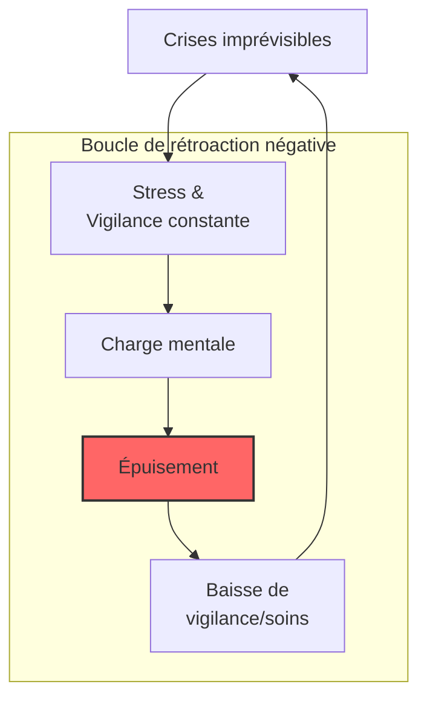

# Partie IV : L'Impact Global
## Chapitre 10 : L'Écosystème Familial

### 🎯 L'Essentiel (Cible : Familles & Aidants)

**Une vie qui bascule**
Le diagnostic du syndrome de Dravet ne concerne pas seulement l'enfant ; il impacte toute la structure familiale. C'est un événement qui redéfinit les priorités, les rythmes et souvent les projets de vie de chaque membre de la famille.

**Les défis du quotidien :**
*   **La charge mentale :** Devenir "expert" en neurologie, gérer les médicaments, surveiller la température, anticiper les crises... Cette vigilance constante est épuisante.
*   **L'isolement social :** La peur des crises en public ou le besoin de routines très strictes peuvent limiter les sorties et l'interaction avec l'entourage.
*   **La fratrie :** Les frères et sœurs peuvent se sentir délaissés ou porter un poids émotionnel important face à la maladie de leur frère ou sœur.

**Prendre soin de soi pour prendre soin de l'autre**
Il est crucial de comprendre que l'épuisement (le "burn-out" des aidants) n'est pas une faiblesse, mais une conséquence physiologique du stress chronique. Chercher du soutien (associations, psychologues, répit) n'est pas un luxe, c'est une nécessité pour la survie de l'équilibre familial.

**À retenir :**
*   Le syndrome de Dravet est une "maladie familiale" par son impact.
*   L'épuisement des aidants est un risque réel et documenté.
*   Demander de l'aide est une stratégie de soin, pas un aveu d'échec.

---

### 🩺 Le Protocole (Cible : Corps Médical)

**La dimension psychosociale de la prise en charge**
Le succès thérapeutique du syndrome de Dravet ne peut être évalué uniquement par le contrôle des crises. Une approche holistique doit intégrer la santé mentale et la stabilité de l'environnement familial.

**1. Le risque de Burn-out de l'aidant principal**
Le stress chronique lié à la gestion de l'imprévisibilité (crises, urgences) et à la charge de soins augmente le risque de troubles anxieux et dépressifs chez les parents. 
*   **Évaluation :** Utilisation d'échelles de stress perçu ou de questionnaires de qualité de vie des aidants lors des consultations de suivi.
*   **Orientation :** Nécessité de prescrire un accompagnement psychologique ou de diriger vers des structures de répit.

**2. Dynamique de la fratrie et équilibre familial**
Le "syndrome du parent dévoué" peut créer un déséquilibre dans l'attention portée aux autres enfants. 
*   **Intervention :** Soutien à la parentalité pour aider les parents à maintenir des moments de qualité avec tous les membres de la famille.

**3. L'impact socio-économique**
La gestion du Dravet entraîne souvent une réduction de l'activité professionnelle des parents (temps partiel, arrêt maladie), ce qui peut fragiliser la stabilité financière du foyer.
*   **Accompagnement :** Orientation vers les services sociaux et les aides liées au handicap (AAH, PCH en France).

#### 📊 Le cercle vicieux de l'épuisement (Mermaid)

---

### 🤝 L'Accompagnement (Cible : Structures d'accueil & Éducateurs)

**Soutenir la famille, pas seulement l'enfant**
En tant que professionnel (école, centre de loisirs), vous êtes un maillon essentiel du réseau de soutien. Votre attitude peut soit alléger, soit accentuer le stress des parents.

**Stratégies de partenariat avec les familles :**
*   **Communication bienveillante et factuelle :** Évitez les jugements sur l'organisation familiale. Communiquez les informations (incidents, changements de comportement) de manière claire, rapide et sans dramatisation inutile.
*   **Respect de la charge mentale :** Ne surchargez pas les parents d'informations non essentielles. Privilégiez des outils de communication simples (carnet de liaison, application dédiée).
*   **Inclusion de la famille dans le projet :** Impliquez les parents dans l'élaboration du Projet d'Accueil Individualisé (PAI), en valorisant leur expertise de "premier témoin".

**Sensibilisation à la fratrie :**
Dans les structures collectives, veillez à ce que les frères et sœurs de l'enfant atteint ne soient pas systématiquement mis de côté ou perçus uniquement comme des "enfants de parents occupés". Favorisez leur propre épanouissement.

---

### 💡 Le Point de Liaison (Synthèse)

| Aspect | Famille | Médical | Professionnel |
| :--- | :--- | :--- | :--- |
| **Enjeu majeur** | Équilibre vie privée / soins | Santé mentale des aidants | Partenariat et communication |
| **Risque identifié** | Isolement et épuisement | Burn-out parental | Rupture de confiance avec les parents |
| **Action clé** | Chercher du soutien/répit | Évaluer la qualité de vie familiale | Communication factuelle et bienveillante |

***
