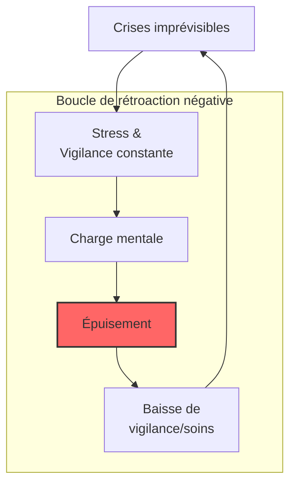

# Partie IV : L'Impact Global
## Chapitre 10 : L'Écosystème Familial

### 🎯 L'Essentiel (Cible : Familles & Aidants)

**Une vie qui bascule**
Le diagnostic du syndrome de Dravet ne concerne pas seulement l'enfant ; il impacte toute la structure familiale. C'est un événement qui redéfinit les priorités, les rythmes et souvent les projets de vie de chaque membre de la famille.

**Les défis du quotidien :**
*   **La charge mentale :** Devenir "expert" en neurologie, gérer les médicaments, surveiller la température, anticiper les crises... Cette vigilance constante est épuisante. Les études montrent que les aidants y consacrent en moyenne plus de 21 heures par semaine, en plus des soins habituels d'un enfant.
*   **L'isolement social :** La peur des crises en public ou le besoin de routines très strictes peuvent limiter les sorties et l'interaction avec l'entourage.
*   **La fratrie :** Les frères et soeurs peuvent se sentir mis à l'écart, car l'essentiel de l'attention parentale est absorbé par la maladie. Ils peuvent ressentir un mélange de jalousie (vis-à-vis de l'attention reçue par l'enfant malade) et de culpabilité (d'éprouver cette jalousie). Certains développent une maturité précoce en prenant des responsabilités qui ne sont pas de leur âge — on parle parfois de "parentification". D'autres peuvent manifester de l'anxiété, notamment la peur de voir leur frère ou soeur avoir une crise grave.
*   **L'impact financier :** Les coûts liés au syndrome de Dravet sont considérables : entre 40 000 et 100 000 euros par an en moyenne (soins, équipements, perte de revenus). Dans 60 à 80 % des familles, un parent réduit ou arrête son activité professionnelle. Ces chiffres ne sont pas anecdotiques — ils traduisent un bouleversement économique réel qui fragilise l'ensemble de la cellule familiale.

**Prendre soin de soi pour prendre soin de l'autre**
Il est crucial de comprendre que l'épuisement (le "burn-out" des aidants) n'est pas une faiblesse, mais une conséquence physiologique du stress chronique. Près de 72 % des aidants rapportent un impact négatif sur leur santé mentale (Campbell 2018), et 89 % décrivent un impact modéré à sévère sur leur qualité de vie globale (Nabbout 2019). Chercher du soutien (associations, psychologues, répit) n'est pas un luxe, c'est une nécessité pour la survie de l'équilibre familial.

**À retenir :**
*   Le syndrome de Dravet est une "maladie familiale" par son impact.
*   L'épuisement des aidants est un risque réel et documenté — il touche plus de 7 aidants sur 10.
*   L'impact sur la fratrie est souvent sous-estimé : les frères et soeurs ont aussi besoin d'écoute et d'espaces à eux.
*   Demander de l'aide est une stratégie de soin, pas un aveu d'échec.

---

### 🩺 Le Protocole (Cible : Corps Médical)

**La dimension psychosociale de la prise en charge**
Le succès thérapeutique du syndrome de Dravet ne peut être évalué uniquement par le contrôle des crises. Une approche holistique doit intégrer la santé mentale et la stabilité de l'environnement familial.

**1. Le risque de Burn-out de l'aidant principal**
Le stress chronique lié à la gestion de l'imprévisibilité (crises, urgences) et à la charge de soins augmente le risque de troubles anxieux et dépressifs chez les parents.
*   **Données épidémiologiques :** [Campbell et al., 2018] ont documenté que 72 % des aidants principaux rapportent un impact négatif significatif sur leur santé mentale. L'étude DISCUSS [Nabbout et al., 2019] a montré que 89 % des aidants décrivent un impact modéré à sévère sur leur qualité de vie [Lagae et al., 2018]. La prévalence des troubles anxio-dépressifs est estimée entre 40 et 60 % chez les mères d'enfants Dravet.
*   **Mécanismes :** Stress chronique cumulatif, privation de sommeil (surveillance nocturne), absence de prévisibilité, disparition progressive de l'identité propre au profit du rôle d'aidant. Des manifestations somatiques (douleurs chroniques, céphalées, immunodépression) et un état de stress post-traumatique (lié aux états de mal épileptique) sont documentés.
*   **Évaluation :** Utilisation systématique d'échelles de stress perçu ou de questionnaires de qualité de vie des aidants lors des consultations de suivi.
*   **Orientation :** Nécessité de prescrire un accompagnement psychologique ou de diriger vers des structures de répit [Skluzacek et al., 2011].

**2. Dynamique de la fratrie et équilibre familial**
Le "syndrome du parent dévoué" peut créer un déséquilibre dans l'attention portée aux autres enfants.
*   **Conséquences documentées :** Sentiment de mise à l'écart, anxiété liée aux crises (peur de la mort du frère ou de la soeur), parentification précoce (prise de responsabilités d'adulte), inhibition de l'expression des besoins propres [Villas et al., 2017]. Sur le plan identitaire, la construction peut se faire autour du statut de "frère ou soeur de" plutôt que comme individu à part entière [Marquis et al., 2020].
*   **Facteurs de protection :** Espaces de parole dédiés (groupes fratrie), temps dédié avec chaque parent, consultation psychologique préventive, information adaptée à l'âge sur la maladie.
*   **Intervention :** Soutien à la parentalité pour aider les parents à maintenir des moments de qualité avec tous les membres de la famille.

**3. L'impact socio-économique**
La gestion du Dravet entraîne souvent une réduction de l'activité professionnelle des parents (temps partiel, arrêt maladie), ce qui peut fragiliser la stabilité financière du foyer.
*   **Données chiffrées :** [Jensen et al., 2017] ont estimé le coût annuel direct et indirect entre 40 000 et 100 000 euros par patient/an en Europe [Campbell et al., 2018]. [Whittington et al., 2020] confirment que les coûts indirects (perte de productivité des aidants) représentent 40 à 60 % du coût total. En France, 67 % des familles rapportent une diminution significative de leurs revenus (enquête Alliance Dravet 2019). Dans 60 à 80 % des cas, un parent réduit ou arrête son activité professionnelle.
*   **Accompagnement :** Orientation vers les services sociaux et les aides liées au handicap (AEEH, AAH, PCH en France — voir chapitre 11 pour le détail des procédures et montants).

#### 📊 Le cercle vicieux de l'épuisement (Mermaid)

---

### 🤝 L'Accompagnement (Cible : Structures d'accueil & Éducateurs)

**Soutenir la famille, pas seulement l'enfant**
En tant que professionnel (école, centre de loisirs), vous êtes un maillon essentiel du réseau de soutien. Votre attitude peut soit alléger, soit accentuer le stress des parents.

**Stratégies de partenariat avec les familles :**
*   **Communication bienveillante et factuelle :** Évitez les jugements sur l'organisation familiale. Communiquez les informations (incidents, changements de comportement) de manière claire, rapide et sans dramatisation inutile.
*   **Respect de la charge mentale :** Ne surchargez pas les parents d'informations non essentielles. Privilégiez des outils de communication simples (carnet de liaison, application dédiée).
*   **Inclusion de la famille dans le projet :** Impliquez les parents dans l'élaboration du Projet d'Accueil Individualisé (PAI), en valorisant leur expertise de "premier témoin".

**Sensibilisation à la fratrie :**
Dans les structures collectives, veillez à ce que les frères et soeurs de l'enfant atteint ne soient pas systématiquement mis de côté ou perçus uniquement comme des "enfants de parents occupés". Ces enfants peuvent ressentir de l'anxiété, un sentiment de mise à l'écart, ou au contraire endosser un rôle de "petit aidant" qui ne correspond pas à leur âge. Favorisez leur propre épanouissement :
*   Proposez-leur des temps d'activité où ils sont au centre de l'attention, sans référence à la maladie de leur frère ou soeur.
*   Soyez attentifs aux signes de détresse (retrait, surinvestissement scolaire, somatisations).
*   Si les parents sont d'accord, orientez vers des groupes de parole pour fratries (associations spécialisées).

**Prise en compte de la dimension économique :**
Soyez conscients que de nombreuses familles vivent sous une pression financière importante (les coûts totaux liés au Dravet atteignent 40 000 à 100 000 euros par an). Évitez les demandes de contributions financières non essentielles et signalez aux parents les ressources d'aide sociale dont vous avez connaissance.

---

### 💡 Le Point de Liaison (Synthèse)

| Aspect | Famille | Médical | Professionnel |
| :--- | :--- | :--- | :--- |
| **Enjeu majeur** | Équilibre vie privée / soins | Santé mentale des aidants (72 % impactés) | Partenariat et communication |
| **Risque identifié** | Isolement, épuisement, précarité financière | Burn-out parental, troubles anxio-dépressifs (40-60 %) | Rupture de confiance avec les parents |
| **Fratrie** | Sentiment de mise à l'écart, anxiété | Dépistage des signes de souffrance | Temps dédié, groupes de parole |
| **Impact économique** | 40-100k EUR/an, réduction d'activité professionnelle | Orientation AEEH/AAH/PCH | Conscience des contraintes financières |
| **Action clé** | Chercher du soutien/répit | Évaluer la QdV familiale (89 % impactée) | Communication bienveillante, soutien fratrie |

***
