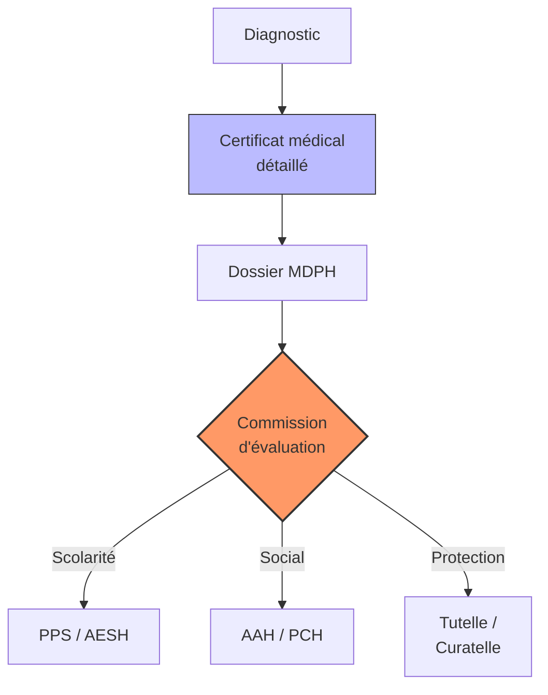

# Partie IV : L'Impact Global
## Chapitre 11 : Inclusion et Droits (Scolarité, Juridique, Social)

### 🎯 L'Essentiel (Cible : Familles & Aidants)

**Transformer le handicap en droits**
Vivre avec le syndrome de Dravet signifie souvent devoir se battre pour que l'enfant soit accueilli à l'école, qu'il reçoive les aides nécessaires et que sa sécurité soit garantie. La loi est là pour vous aider, mais elle demande une démarche active : il faut "faire valoir ses droits".

**Les trois piliers de l'inclusion :**
1.  **L'École (Scolarité) :** L'objectif est que votre enfant puisse apprendre, même si cela nécessite des aménagements (aide humaine, matériel adapté, temps supplémentaire).
2.  **Le Soutien Financier et Social :** Le handicap entraîne des coûts importants (soins, matériel, temps de présence). Il existe des aides financières pour compenser ces charges : l'**AEEH** (Allocation d'Éducation de l'Enfant Handicapé) pour les enfants, l'**AAH** (Allocation aux Adultes Handicapés) à partir de 20 ans, et la **PCH** (Prestation de Compensation du Handicap) pour financer les aides humaines et techniques. Ces aides sont attribuées par la **MDPH** (Maison Départementale des Personnes Handicapées) de votre département.
3.  **La Protection Juridique :** À mesure que l'enfant grandit, si ses capacités ne lui permettent pas de prendre seul les décisions importantes (gestion de l'argent, choix médicaux), il faudra organiser une protection légale. Cela peut aller de la **curatelle** (une aide pour les décisions, la personne garde une part d'autonomie) à la **tutelle** (une protection plus forte où un tuteur décide à sa place).

**À retenir :**
*   L'inclusion n'est pas une faveur, c'est un droit (souvent encadré par des lois comme la loi de 2005 en France).
*   Chaque dossier est unique : l'administratif demande de la patience et de la rigueur.
*   Ne restez pas seuls face aux démarches : les associations sont vos meilleures alliées pour comprendre les procédures.

---

### 🩺 Le Protocole (Cible : Corps Médical)

**Le rôle du médecin dans le parcours administratif**
Le corps médical est le moteur de la reconnaissance du handicap. Sans un dossier médical solide, l'accès aux droits est quasi impossible.

**1. La construction du dossier médical d'expertise**
Pour obtenir des aides auprès de la **MDPH** (Maison Départementale des Personnes Handicapées) en France, le médecin doit produire un certificat médical détaillé qui ne se contente pas de nommer la maladie, mais décrit ses **conséquences fonctionnelles** :
*   **Impact cognitif :** Score de QI, troubles de l'attention, difficultés d'apprentissage.
*   **Impact moteur :** Besoin d'aide pour les déplacements, la toilette, l'alimentation.
*   **Impact sécuritaire :** Risque lié aux crises (besoin de surveillance constante).

**2. L'accompagnement scolaire (Le PAI et le PPS)**
Le médecin joue un rôle clé dans la mise en place des outils d'inclusion scolaire :
*   **PAI (Projet d'Accueil Individualisé) :** Indispensable pour la gestion médicale à l'école (administration des médicaments de secours, protocole fièvre).
*   **PPS (Projet Personnalisé de Scolarisation) :** Pour l'attribution d'une AESH (Accompagnant des Élèves en Situation de Handicap) ou d'aménagements pédagogiques.

**3. La protection juridique et la capacité**
Le médecin intervient dans le processus de mise sous protection juridique — **curatelle** (assistance au majeur protégé qui conserve une autonomie partielle) ou **tutelle** (représentation complète du majeur protégé) — en évaluant la capacité de discernement et l'autonomie décisionnelle du patient.

#### 📊 Le parcours de reconnaissance des droits (Mermaid)

---

### 🤝 L'Accompagnement (Cible : Structures d'accueil & Éducateurs)

**L'école et les structures comme partenaires de l'inclusion**
Votre rôle est de transformer les décisions administratives en réalités quotidiennes pour l'enfant.

**Mise en œuvre des aménagements :**
*   **Application du PAI :** Vous devez être formé et capable d'appliquer le protocole médical (crises, médicaments) sans hésitation. La sécurité de l'enfant dépend de votre réactivité.
*   **Adaptation pédagogique :** L'inclusion n'est pas seulement la présence physique, c'est l'accès au savoir. Utilisez les outils de communication (CAA) et les temps de repos prévus dans le projet de l'enfant.

**Lutte contre la stigmatisation :**
*   **Sensibilisation :** Expliquez la maladie aux autres élèves et au personnel pour éviter les malentendus sur les comportements (fatigue, crises, troubles du langage).
*   **Équité vs Égalité :** Comprenez que donner "plus" ou "différent" à cet enfant n'est pas un privilège, mais une compensation nécessaire pour lui donner les mêmes chances de réussite que les autres.

**Communication avec la famille :**
Soyez le relais d'information fiable. Si un aménagement ne fonctionne pas en pratique (ex: l'AESH est absente ou l'outil de communication est perdu), informez immédiatement les parents pour qu'ils puissent agir auprès des instances décisionnelles.

---

### 💡 Le Point de Liaison (Synthèse)

| Aspect | Famille | Médical | Professionnel |
| :--- | :--- | :--- | :--- |
| **Objectif** | Obtenir des aides et l'inclusion | Fournir les preuves médicales | Appliquer les aménagements |
| **Outil clé** | Dossiers administratifs (AAH, PCH) | Certificats détaillés & PAI | Pédagogie adaptée & Sécurité |
| **Défi majeur** | Lenteur et complexité administrative | Traduire le médical en fonctionnel | Passer de la théorie à la pratique |

***
