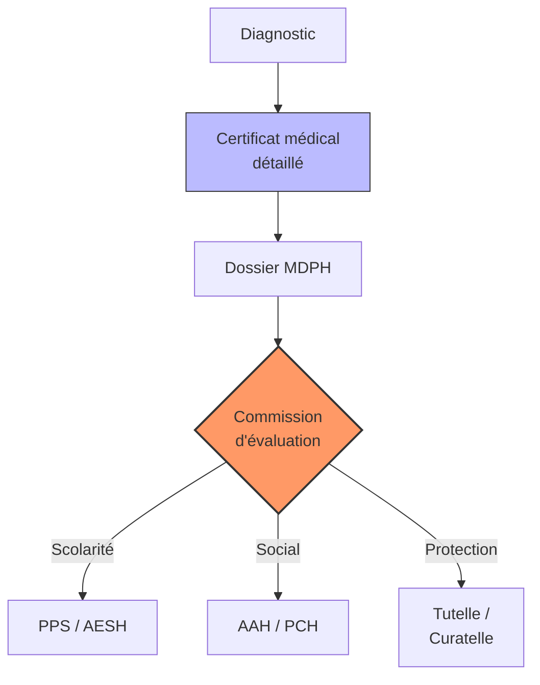

# Partie IV : L'Impact Global
## Chapitre 11 : Inclusion et Droits (Scolarité, Juridique, Social)

### 🎯 L'Essentiel (Cible : Familles & Aidants)

**Transformer le handicap en droits**
Vivre avec le syndrome de Dravet signifie souvent devoir se battre pour que l'enfant soit accueilli à l'école, qu'il reçoive les aides nécessaires et que sa sécurité soit garantie. La loi est là pour vous aider, mais elle demande une démarche active : il faut "faire valoir ses droits".

**Les trois piliers de l'inclusion :**
1.  **L'École (Scolarité) :** L'objectif est que votre enfant puisse apprendre, même si cela nécessite des aménagements (aide humaine, matériel adapté, temps supplémentaire).
2.  **Le Soutien Financier et Social :** Le handicap entraîne des coûts importants (soins, matériel, temps de présence). Il existe des aides financières pour compenser ces charges, attribuées par la **MDPH** (Maison Départementale des Personnes Handicapées) de votre département :
    *   **AEEH** (Allocation d'Éducation de l'Enfant Handicapé) : pour les enfants de moins de 20 ans. L'allocation de base est d'environ 142 EUR/mois, à laquelle s'ajoutent des compléments selon la gravité (de 107 EUR/mois pour le complément 1 jusqu'à 1 126 EUR/mois pour le complément 6). Dans le syndrome de Dravet, les compléments 4 à 6 sont fréquemment attribués en raison de la surveillance constante nécessaire.
    *   **AAH** (Allocation aux Adultes Handicapés) : à partir de 20 ans, environ 1 016 EUR/mois à taux plein. Depuis 2023, les revenus du conjoint ne sont plus pris en compte (déconjugalisation). C'est souvent la principale ressource des adultes Dravet.
    *   **PCH** (Prestation de Compensation du Handicap) : pour financer les aides humaines (surveillance, accompagnement), les aides techniques (détecteur de crises, matériel adapté), et l'aménagement du logement. Elle peut être plus avantageuse que l'AEEH + complément pour les situations les plus lourdes.
3.  **La Protection Juridique :** À mesure que l'enfant grandit, si ses capacités ne lui permettent pas de prendre seul les décisions importantes (gestion de l'argent, choix médicaux), il faudra organiser une protection légale. Cela peut aller de la **curatelle** (une aide pour les décisions, la personne garde une part d'autonomie) à la **tutelle** (une protection plus forte où un tuteur décide à sa place). L'**habilitation familiale** (depuis 2016) est une alternative plus souple, souvent privilégiée pour les parents d'adultes Dravet.

**La procédure MDPH en pratique :**
1.  **Constituer le dossier :** Formulaire Cerfa, certificat médical détaillé (moins de 6 mois), projet de vie rédigé par la famille (document crucial, souvent sous-estimé), bilans paramédicaux.
2.  **Évaluation :** Une équipe pluridisciplinaire de la MDPH évalue les besoins et élabore un Plan Personnalisé de Compensation (PPC).
3.  **Décision :** La CDAPH (Commission des Droits et de l'Autonomie des Personnes Handicapées) prend la décision. Délai légal : 4 mois, souvent 6 à 12 mois en pratique.
4.  **En cas de refus ou de décision insatisfaisante :** Un recours est possible — d'abord un recours administratif (RAPO, dans les 2 mois), puis si nécessaire un recours devant le tribunal (dans les 2 mois suivant le rejet du RAPO). Les associations peuvent vous aider à formuler ces recours.

**À retenir :**
*   L'inclusion n'est pas une faveur, c'est un droit (souvent encadré par des lois comme la loi de 2005 en France).
*   L'AEEH, l'AAH et la PCH sont les trois aides financières principales ; elles ne couvrent pas tous les coûts mais constituent un socle essentiel.
*   Le projet de vie est un document clé du dossier MDPH — prenez le temps de le rédiger.
*   Chaque dossier est unique : l'administratif demande de la patience et de la rigueur.
*   Ne restez pas seuls face aux démarches : les associations sont vos meilleures alliées pour comprendre les procédures.

---

### 🩺 Le Protocole (Cible : Corps Médical)

**Le rôle du médecin dans le parcours administratif**
Le corps médical est le moteur de la reconnaissance du handicap [HAS, 2021]. Sans un dossier médical solide, l'accès aux droits est quasi impossible [Wirrell et al., 2017].

**1. La construction du dossier médical d'expertise**
Pour obtenir des aides auprès de la **MDPH** (Maison Départementale des Personnes Handicapées) en France, le médecin doit produire un certificat médical détaillé (Cerfa n° 15695*01) qui ne se contente pas de nommer la maladie, mais décrit ses **conséquences fonctionnelles** [HAS, 2021] :
*   **Impact cognitif :** Score de QI, troubles de l'attention, difficultés d'apprentissage.
*   **Impact moteur :** Besoin d'aide pour les déplacements, la toilette, l'alimentation.
*   **Impact sécuritaire :** Risque lié aux crises (besoin de surveillance constante, risque de SUDEP).
*   **Le taux d'incapacité de 80 %** est généralement reconnu dès le diagnostic confirmé de syndrome de Dravet, ouvrant droit à l'AEEH de base et à l'AAH [Wirrell et al., 2017].

**Orientation vers les aides financières :**
Le médecin doit connaitre les dispositifs pour orienter les familles de manière proactive :
*   **AEEH** (enfants < 20 ans) : base ~142 EUR/mois + compléments 1 à 6 (107 à 1 126 EUR/mois). Les compléments 4 à 6 sont fréquemment justifiés dans le Dravet.
*   **AAH** (adultes >= 20 ans) : ~1 016 EUR/mois à taux plein. Attribution possible sans limitation de durée si taux d'incapacité >= 80 %.
*   **PCH** : 5 éléments (aides humaines, aides techniques, aménagement du logement, charges spécifiques, aide animalière). La PCH est souvent plus avantageuse que l'AEEH + complément pour les situations les plus lourdes.
*   **ALD 9** : l'épilepsie sévère (dont le syndrome de Dravet) relève de l'ALD 9, avec prise en charge à 100 % des soins liés à l'ALD.
*   **AJPP** (Allocation Journalière de Présence Parentale) : ~64 EUR/jour pour un parent qui doit cesser son activité pour accompagner son enfant.

**2. L'accompagnement scolaire (Le PAI et le PPS)**
Le médecin joue un rôle clé dans la mise en place des outils d'inclusion scolaire :
*   **PAI (Projet d'Accueil Individualisé) :** Indispensable pour la gestion médicale à l'école (administration des médicaments de secours — Buccolam/midazolam buccal, diazépam intrarectal — protocole fièvre, contre-indications) [HAS, 2021]. Élaboré avec le médecin scolaire, renouvelé annuellement.
*   **PPS (Projet Personnalisé de Scolarisation) :** Pour l'attribution d'une AESH (Accompagnant des Élèves en Situation de Handicap) ou d'aménagements pédagogiques [Wirrell et al., 2017]. Dans le Dravet, une AESH individuelle à temps complet (18-24h hebdomadaires) est fréquemment justifiée.

**3. La protection juridique et la capacité**
Le médecin intervient dans le processus de mise sous protection juridique en évaluant la capacité de discernement et l'autonomie décisionnelle du patient. Les options, par ordre croissant de protection :
*   **Habilitation familiale** (depuis 2016) : alternative simplifiée, privilégiée quand un proche peut assurer la protection sans conflit familial.
*   **Curatelle** (simple ou renforcée) : assistance au majeur protégé qui conserve une autonomie partielle. Adaptée aux adultes Dravet avec déficience intellectuelle légère à modérée.
*   **Tutelle** : représentation complète du majeur protégé. Mesure la plus fréquemment mise en place pour les adultes Dravet avec déficience intellectuelle sévère.

#### 📊 Le parcours de reconnaissance des droits (Mermaid)

---

### 🤝 L'Accompagnement (Cible : Structures d'accueil & Éducateurs)

**L'école et les structures comme partenaires de l'inclusion**
Votre rôle est de transformer les décisions administratives en réalités quotidiennes pour l'enfant.

**Mise en oeuvre des aménagements :**
*   **Application du PAI :** Vous devez être formé et capable d'appliquer le protocole médical (crises, médicaments) sans hésitation. La sécurité de l'enfant dépend de votre réactivité.
*   **Adaptation pédagogique :** L'inclusion n'est pas seulement la présence physique, c'est l'accès au savoir. Utilisez les outils de communication (CAA) et les temps de repos prévus dans le projet de l'enfant.

**Comprendre le cadre administratif :**
En tant que professionnel, connaitre les dispositifs vous permet de mieux accompagner les familles et de comprendre le cadre dans lequel vous intervenez :
*   **Le PAI** encadre la gestion médicale (crises, médicaments de secours, protocole fièvre).
*   **Le PPS** définit vos missions pédagogiques et les aménagements (AESH, matériel, emploi du temps).
*   **La MDPH** est l'organisme qui attribue les aides (AEEH, PCH, orientation scolaire). Les délais de traitement sont souvent longs (6 à 12 mois) — soyez compréhensifs si les familles expriment de la frustration face à l'administratif.
*   **L'AESH** est un acteur central de l'inclusion. Dans le syndrome de Dravet, une AESH individuelle (AESHi) à temps complet est souvent nécessaire. Si l'AESH est absente, la sécurité de l'enfant peut être compromise — il est impératif de le signaler immédiatement.

**Lutte contre la stigmatisation :**
*   **Sensibilisation :** Expliquez la maladie aux autres élèves et au personnel pour éviter les malentendus sur les comportements (fatigue, crises, troubles du langage).
*   **Équité vs Égalité :** Comprenez que donner "plus" ou "différent" à cet enfant n'est pas un privilège, mais une compensation nécessaire pour lui donner les mêmes chances de réussite que les autres.

**Communication avec la famille :**
Soyez le relais d'information fiable. Si un aménagement ne fonctionne pas en pratique (ex: l'AESH est absente ou l'outil de communication est perdu), informez immédiatement les parents pour qu'ils puissent agir auprès des instances décisionnelles. Soyez également conscients de la pression financière que vivent de nombreuses familles Dravet (40 000 à 100 000 EUR/an de coûts totaux) et de la lourdeur des démarches administratives qu'elles doivent mener en parallèle des soins.

---

### 💡 Le Point de Liaison (Synthèse)

| Aspect | Famille | Médical | Professionnel |
| :--- | :--- | :--- | :--- |
| **Objectif** | Obtenir des aides et l'inclusion | Fournir les preuves médicales | Appliquer les aménagements |
| **Aides financières** | AEEH (142 + compléments), AAH (~1 016 EUR), PCH | Orientation proactive, ALD 9 | Connaitre le cadre pour accompagner |
| **Procédure MDPH** | Dossier, projet de vie, recours si refus | Certificat détaillé (conséquences fonctionnelles) | Contribuer aux bilans, ESS annuelle |
| **Outil clé** | Dossiers administratifs, associations | Certificats détaillés, PAI, PPS | Pédagogie adaptée, AESH, sécurité |
| **Protection juridique** | Anticiper (habilitation familiale, curatelle, tutelle) | Évaluer la capacité de discernement | Respecter le cadre de protection |
| **Défi majeur** | Lenteur administrative (6-12 mois) | Traduire le médical en fonctionnel | Passer de la théorie à la pratique |

***
