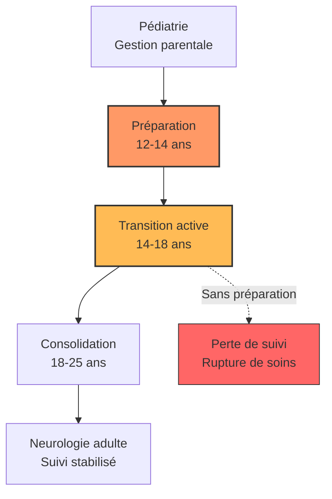

# Partie V : L'Horizon de Vie
## Chapitre 12 : La Transition Critique (Pédiatrie vers Adulte)

### 🎯 L'Essentiel (Cible : Familles & Aidants)

**Le passage de relais**
Jusqu'ici, l'enfant a été suivi par des pédiatres et des neuropédiatres. Mais à l'adolescence, le système de santé change : il faut passer du monde de la pédiatrie au monde de la médecine pour adultes. Ce n'est pas juste un changement de médecin, c'est un changement de philosophie.

**Pourquoi est-ce une période de risque ?**
La transition est souvent une zone de "flou" où des choses peuvent être oubliées :
*   **L'autonomie de l'adolescent :** Il commence à vouloir gérer ses propres médicaments, mais n'a pas toujours la maturité pour le faire sans erreur.
*   **Le changement de spécialistes :** Les médecins adultes ne connaissent pas forcément l'historique complet de l'enfant aussi bien que les pédiatres.
*   **La rupture de suivi :** Si la transition est mal préparée, il peut y avoir des interruptions dans le traitement ou le suivi des comorbidités.

**Le passeport médical de transition**
Pour éviter que des informations vitales ne se perdent lors du changement de médecin, un document appelé "passeport de transition" est recommandé par les experts (Nabbout et al., 2017). Ce document rassemble tout l'historique de votre enfant : sa mutation génétique, la liste de tous les traitements essayés (avec ce qui a marché et ce qui n'a pas marché), son protocole d'urgence, ses bilans cognitifs, et les coordonnées des personnes-ressources. C'est un véritable "carnet de bord" qui accompagne le patient d'un médecin à l'autre.

**Ce que disent les chiffres**
Les études montrent que la transition est un moment de vulnérabilité réelle :
*   30 % des patients vivent une rupture de soins de plus de 3 mois (Andrade et al., 2017) -- c'est-à-dire qu'ils passent plus d'un trimestre sans consultation neurologique.
*   78 % des parents expriment une anxiété forte face au changement de médecin.
*   45 % des familles signalent une dégradation de la prise en charge dans les 2 ans qui suivent la transition.

**À retenir :**
*   La transition doit être planifiée plusieurs années à l'avance.
*   L'objectif est de passer d'une gestion "par les parents" à une gestion "partagée avec l'adolescent".
*   Anticiper permet d'éviter les ruptures de soins et les crises liées à un mauvais suivi.
*   Demandez à votre neuropédiatre d'établir un passeport de transition bien avant le transfert.

---

### 🩺 Le Protocole (Cible : Corps Médical)

**La gestion du transfert de soins (Transition Care)**
La transition des patients atteints du syndrome de Dravet de la pédiatrie vers la neurologie adulte est une phase critique qui nécessite une stratégie structurée pour éviter le "drop-out" médical.

**1. Les étapes d'une transition réussie**
Une transition efficace ne doit pas être un événement ponctuel, mais un processus continu :
*   **Phase de préparation (12-14 ans) :** Éducation du patient et de la famille sur la pathologie, les traitements et l'importance de l'observance. Documentation structurée de l'historique médical complet.
*   **Phase de transition active (14-18 ans) :** Consultations conjointes neuropédiatre/neurologue adulte, transfert progressif des responsabilités. Introduction du patient comme acteur principal de l'échange médical.
*   **Phase de consolidation (18-25 ans) :** Stabilisation dans le système de soins adulte, autonomie complète ou gestion partagée selon les capacités cognitives. Identification de tous les référents adultes.

**2. Recommandations ILAE [Cross et al., 2019]**
La Ligue Internationale Contre l'Epilepsie (ILAE) recommande un modèle structuré en trois phases pour les épilepsies pédiatriques complexes :
*   La transition concerne davantage les parents que le patient lorsque la déficience intellectuelle est sévère [Camfield et Camfield, 2011]. La notion d'"autonomie du patient" doit être réinterprétée selon le niveau fonctionnel.
*   Des consultations conjointes neuropédiatre/neurologue adulte sont recommandées pendant au moins 2 à 3 ans.
*   La possibilité de "consultations de retour" avec l'équipe pédiatrique doit être maintenue pendant les premières années.

**3. Le passeport médical de transition [Nabbout et al., 2017]**
Un consensus d'experts européen recommande l'élaboration d'un document de transition complet, contenant :
*   Données génétiques : mutation SCN1A identifiée, type de variant.
*   Historique complet des crises : chronologie, types, déclencheurs, épisodes d'état de mal.
*   Historique des traitements : tous les antiépileptiques utilisés, réponses et effets secondaires.
*   Traitement actuel : molécules, doses, horaires, taux sériques cibles.
*   Protocole d'urgence personnalisé.
*   Dernier bilan neuropsychologique et niveau fonctionnel.
*   Liste complète des comorbidités (orthopédiques, psychiatriques, métaboliques).
*   Statut social et juridique : mesures de protection, allocations, MDPH, structures d'accueil.

**4. Données sur le "drop-out" médical [Andrade et al., 2017]**
Une enquête auprès de 142 familles révèle des chiffres préoccupants :
*   78 % des parents expriment une anxiété significative face au changement de médecin.
*   62 % rapportent une perte d'information lors du transfert.
*   45 % signalent une dégradation de la prise en charge dans les 2 ans suivant la transition.
*   30 % des patients vivent un épisode de rupture de soins (> 3 mois sans consultation neurologique).

Les principales barrières identifiées sont le manque de neurologues adultes formés aux encéphalopathies épileptiques de l'enfance, l'absence de protocoles de transition standardisés, et la fragmentation des systèmes de santé entre pédiatrie et médecine adulte.

**5. Les enjeux cliniques du transfert**
Le neurologue adulte doit être informé des spécificités pédiatriques du Dravet :
*   **Historique des crises :** Type de crises, déclencheurs (fièvre), et réponse aux traitements passés.
*   **Gestion de la polythérapie :** Continuité des protocoles complexes pour éviter les récurrences d'état de mal.
*   **Suivi des comorbidités :** Transition du suivi neurodéveloppemental vers un suivi neurologique/psychiatrique adulte.

#### 📊 Le cycle de la transition (Mermaid)

---

### 🤝 L'Accompagnement (Cible : Structures d'accueil & Éducateurs)

**Accompagner l'autonomie sans la mettre en péril**
Pour les éducateurs et structures spécialisées, l'adolescence est le moment où l'on doit passer de "faire pour l'enfant" à "aider l'enfant à faire".

**Stratégies d'accompagnement :**
*   **Éducation à l'observance (le respect du traitement) :** Aider l'adolescent à comprendre l'importance de prendre ses médicaments correctement, aux bonnes doses et aux bons horaires (avec supervision).
*   **Soutien à la prise de décision :** Impliquer l'adolescent dans les choix de sa vie quotidienne (activités, sorties) pour renforcer son sentiment d'agence, tout en gardant un œil sur sa sécurité.
*   **Préparation au monde adulte :** Travailler sur les compétences sociales et professionnelles, tout en tenant compte des limitations liées au syndrome.

**Le passeport de transition : un outil concret**
Les experts recommandent la création d'un document de transition qui rassemble toutes les informations importantes sur la personne accompagnée. En tant que professionnel, vous pouvez contribuer à ce document en fournissant vos observations sur les compétences acquises, les habitudes de vie, les préférences et les stratégies qui fonctionnent. Ce passeport est un pont entre les équipes pédiatriques et les équipes adultes.

**Les chiffres à connaître**
Les études montrent que 30 % des patients vivent une rupture de soins de plus de 3 mois lors de la transition, et que 45 % des familles signalent une dégradation de la prise en charge. En tant qu'accompagnant, vous jouez un rôle clé pour alerter si le suivi médical semble interrompu ou si l'état de santé de la personne se modifie. La continuité de votre accompagnement est un facteur de protection pendant cette période instable.

**Vigilance sur le changement de comportement :**
L'adolescence est une période de vulnérabilité émotionnelle. Soyez attentifs à toute modification de l'humeur ou du sommeil qui pourrait signaler soit un trouble lié à la puberté, soit une déstabilisation du traitement antiépileptique.

---

### 💡 Le Point de Liaison (Synthèse)

| Aspect | Famille | Médical | Professionnel |
| :--- | :--- | :--- | :--- |
| **Enjeu majeur** | Lâcher prise progressivement | Assurer la continuité des soins | Favoriser l'autonomie sécurisée |
| **Risque identifié** | Rupture de suivi (30 % des patients > 3 mois) | Drop-out médical, perte d'information (62 %) | Désengagement, dégradation (45 % à 2 ans) |
| **Outil clé** | Passeport de transition (historique complet) | Recommandations ILAE, consultations conjointes | Observations comportementales pour le passeport |
| **Action clé** | Préparer le transfert avec le médecin | Planifier une transition graduée sur 3 phases | Alerter si rupture de suivi, maintenir la continuité |

***
