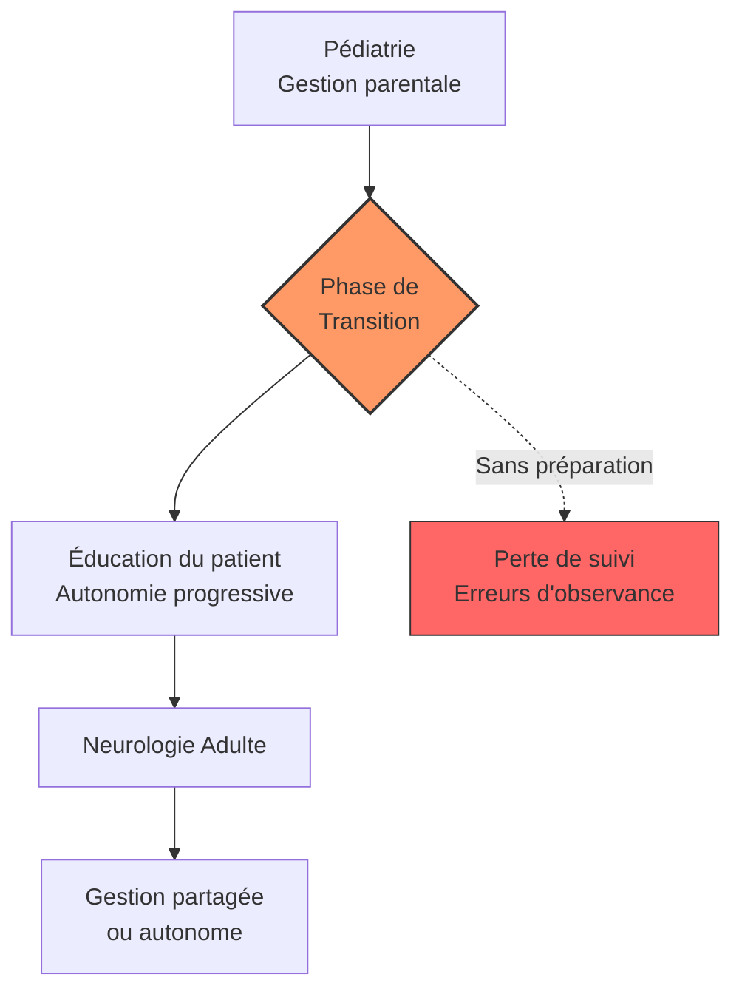

# Partie V : L'Horizon de Vie
## Chapitre 12 : La Transition Critique (Pédiatrie vers Adulte)

### 🎯 L'Essentiel (Cible : Familles & Aidants)

**Le passage de relais**
Jusqu'ici, l'enfant a été suivi par des pédiatres et des neuropédiatres. Mais à l'adolescence, le système de santé change : il faut passer du monde de la pédiatrie au monde de la médecine pour adultes. Ce n'est pas juste un changement de médecin, c'est un changement de philosophie.

**Pourquoi est-ce une période de risque ?**
La transition est souvent une zone de "flou" où des choses peuvent être oubliées :
*   **L'autonomie de l'adolescent :** Il commence à vouloir gérer ses propres médicaments, mais n'a pas toujours la maturité pour le faire sans erreur.
*   **Le changement de spécialistes :** Les médecins adultes ne connaissent pas forcément l'historique complet de l'enfant aussi bien que les pédiatres.
*   **La rupture de suivi :** Si la transition est mal préparée, il peut y avoir des interruptions dans le traitement ou le suivi des comorbidités.

**À retenir :**
*   La transition doit être planifiée plusieurs années à l'avance.
*   L'objectif est de passer d'une gestion "par les parents" à une gestion "partagée avec l'adolescent".
*   Anticiper permet d'éviter les ruptures de soins et les crises liées à un mauvais suivi.

---

### 🩺 Le Protocole (Cible : Corps Médical)

**La gestion du transfert de soins (Transition Care)**
La transition des patients atteints du syndrome de Dravet de la pédiatrie vers la neurologie adulte est une phase critique qui nécessite une stratégie structurée pour éviter le "drop-out" médical.

**1. Les étapes d'une transition réussie**
Une transition efficace ne doit pas être un événement ponctuel, mais un processus continu :
*   **Phase de préparation (14-16 ans) :** Éducation du patient sur sa pathologie, ses traitements et l'importance de l'observance.
*   **Phase de transfert (17-21 ans) :** Introduction progressive du patient aux consultations adultes, où il devient l'acteur principal de l'échange avec le médecin.
*   **Phase de consolidation (> 21 ans) :** Autonomie complète ou gestion partagée selon les capacités cognitives.

**2. Les enjeux cliniques du transfert**
Le neurologue adulte doit être informé des spécificités pédiatriques du Dravet :
*   **Historique des crises :** Type de crises, déclencheurs (fièvre), et réponse aux traitements passés.
*   **Gestion de la polythérapie :** Continuité des protocoles complexes pour éviter les récurrences d'état de mal.
*   **Suivi des comorbidités :** Transition du suivi neurodéveloppemental vers un suivi neurologique/psychiatrique adulte.

#### 📊 Le cycle de la transition (Mermaid)

---

### 🤝 L'Accompagnement (Cible : Structures d'accueil & Éducateurs)

**Accompagner l'autonomie sans la mettre en péril**
Pour les éducateurs et structures spécialisées, l'adolescence est le moment où l'on doit passer de "faire pour l'enfant" à "aider l'enfant à faire".

**Stratégies d'accompagnement :**
*   **Éducation à l'observance (le respect du traitement) :** Aider l'adolescent à comprendre l'importance de prendre ses médicaments correctement, aux bonnes doses et aux bons horaires (avec supervision).
*   **Soutien à la prise de décision :** Impliquer l'adolescent dans les choix de sa vie quotidienne (activités, sorties) pour renforcer son sentiment d'agence, tout en gardant un œil sur sa sécurité.
*   **Préparation au monde adulte :** Travailler sur les compétences sociales et professionnelles, tout en tenant compte des limitations liées au syndrome.

**Vigilance sur le changement de comportement :**
L'adolescence est une période de vulnérabilité émotionnelle. Soyez attentifs à toute modification de l'humeur ou du sommeil qui pourrait signaler soit un trouble lié à la puberté, soit une déstabilisation du traitement antiépileptique.

---

### 💡 Le Point de Liaison (Synthèse)

| Aspect | Famille | Médical | Professionnel |
| :--- | :--- | :--- | :--- |
| **Enjeu majeur** | Lâcher prise progressivement | Assurer la continuité des soins | Favoriser l'autonomie sécurisée |
| **Risque identifié** | Rupture de suivi / Perte de contrôle | Erreurs d'observance du patient | Désengagement de l'adolescent |
| **Action clé** | Préparer le transfert avec le médecin | Planifier une transition graduée | Éduquer à la gestion des traitements |

***
