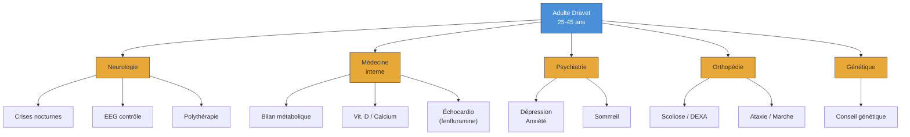

# Partie V : L'Horizon de Vie
## Chapitre 13 : La Vie Adulte Active (25-45 ans)

### 🎯 L'Essentiel (Cible : Familles & Aidants)

**Une bonne nouvelle relative**
Après les années tumultueuses de l'enfance et de l'adolescence, la période 25-45 ans apporte souvent une forme de stabilisation. Les crises d'épilepsie ne disparaissent pas, mais elles deviennent généralement moins fréquentes et surviennent surtout la nuit. Les états de mal épileptique (crises prolongées nécessitant une intervention d'urgence) deviennent exceptionnels après 20 ans. Pour beaucoup de familles, c'est un soulagement : on passe d'une vigilance de chaque instant à une surveillance plus ciblée, notamment nocturne.

**Le quotidien : une autonomie accompagnée**
La grande majorité des adultes Dravet ont besoin d'aide pour les gestes de la vie quotidienne. Ce n'est pas un échec : c'est la réalité du syndrome, et l'objectif est de maximiser ce que la personne peut faire par elle-même, tout en assurant sa sécurité. Environ 50 à 70 % des adultes vivent au domicile familial. D'autres trouvent leur place en foyer d'accueil médicalisé (FAM), en maison d'accueil spécialisée (MAS), ou plus rarement en appartement accompagné pour les plus autonomes.

**Travailler autrement**
L'emploi en milieu ordinaire n'est généralement pas accessible, mais cela ne signifie pas l'absence d'activité. Les ESAT (Établissements et Services d'Aide par le Travail) proposent des ateliers adaptés : conditionnement, espaces verts, artisanat, restauration collective sous supervision. Environ 35 à 40 % des adultes fréquentent un centre de jour ou un atelier protégé. Ces activités apportent un rythme, un sentiment d'utilité et du lien social.

**Vie affective et parentalité**
La vie affective existe, même si les relations amoureuses restent rares. L'isolement social est un vrai risque, et le maintien d'activités de groupe est essentiel. La question de la parentalité se pose parfois : elle nécessite un conseil génétique approfondi, car la mutation du gène SCN1A (le gène impliqué dans le syndrome de Dravet) peut être transmise à l'enfant avec un risque de 50 %. De plus, le valproate, traitement central du syndrome, est formellement contre-indiqué pendant la grossesse.

**Santé de la femme : un sujet encore trop ignoré**
Chez les femmes adultes atteintes du syndrome de Dravet, le traitement par valproate au long cours peut provoquer un **syndrome des ovaires polykystiques** (SOPK — un dérèglement hormonal touchant les ovaires) dans une proportion très élevée, pouvant atteindre 90 % lorsque le traitement a été commencé avant 20 ans. Ce dérèglement hormonal entraîne des troubles des règles (irrégularité, absence de règles), une prise de poids et parfois un excès de pilosité.

Ce déséquilibre hormonal peut favoriser ou aggraver plusieurs problèmes gynécologiques :
*   Les **fibromes utérins** (des tumeurs bénignes de l'utérus qui provoquent des douleurs et des saignements abondants).
*   L'**endométriose** (une maladie où le tissu qui tapisse normalement l'intérieur de l'utérus se développe à l'extérieur, provoquant des douleurs pelviennes chroniques, des règles très douloureuses et de la constipation). L'endométriose touche environ 1 femme sur 9 dans la population générale, et les perturbations hormonales liées au valproate peuvent en favoriser le développement.

Ces problèmes gynécologiques, combinés à la **constipation chronique** fréquente dans le Dravet (voir chapitre 6), créent un véritable **syndrome pelvien** : douleurs abdominales et pelviennes, gêne digestive, et irritabilité, qui abaissent le seuil de déclenchement des crises. Ce cercle vicieux — douleur pelvienne → stress → crises → fatigue → aggravation de la douleur — nécessite une prise en charge coordonnée entre neurologue et gynécologue.

Les fluctuations hormonales du cycle menstruel peuvent elles-mêmes influencer la fréquence des crises — c'est ce qu'on appelle l'**épilepsie cataméniale** (liée aux règles). Il est essentiel que la gynécologie fasse partie du suivi régulier de la femme adulte Dravet.

**La santé mentale, un sujet à ne pas négliger**
La dépression touche 20 à 40 % des adultes Dravet, et l'anxiété 30 à 50 %. Ces troubles sont souvent sous-diagnostiqués parce que la personne ne peut pas toujours exprimer ce qu'elle ressent, ou parce que les symptômes sont confondus avec la fatigue liée aux médicaments. Soyez attentifs aux changements de comportement : repli sur soi, perte d'intérêt pour les activités habituelles, troubles du sommeil accrus.

---

### 🩺 Le Protocole (Cible : Corps Médical)

**1. Évolution des crises à l'âge adulte**
La trajectoire épileptique se stabilise après l'adolescence. Les crises tonico-cloniques généralisées (TCG) persistent chez environ 67 % des adultes (Takahashi et al., 2020), mais avec une fréquence réduite (1 à 4 crises/mois selon Genton et al., 2011). Les crises deviennent principalement nocturnes. Les myoclonies régressent significativement. Les crises fébriles persistent chez environ 30 % des adultes, spécificité notable de cette population. Les états de mal épileptique deviennent exceptionnels après 20 ans.

**2. Suivi pharmacologique au long cours**
La polythérapie reste la règle. Le monitoring doit inclure :
*   **Valproate** : bilan hépatique, ammoniémie, NFS, bilan lipidique, glycémie (risque de syndrome métabolique). Prise de poids chez 40-70 % des patients. Chez la femme : surveillance du SOPK (syndrome des ovaires polykystiques).
*   **Stiripentol** : surveillance des taux plasmatiques (interaction CYP2C19 avec le valproate). Profil de sécurité acceptable au long cours.
*   **Cannabidiol (Epidyolex)** : transaminases hépatiques (élévation chez 15-20 % en association avec le valproate), interaction avec le clobazam (élévation du N-desméthylclobazam).
*   **Fenfluramine (Fintepla)** : échocardiographie tous les 6 mois (surveillance du risque de valvulopathie, non observé aux doses épileptiques).

**3. Conseil génétique et parentalité**
*   Mutations de novo (~80 % des cas, fourchette 70-90 %) : risque de récurrence faible pour la fratrie (1-5 %, lié au mosaïcisme germinal). Mosaïcisme parental détecté dans environ 7 % des familles (Depienne et al., 2009).
*   Si le patient Dravet porteur d'une mutation SCN1A devient parent : risque de transmission de 50 %, avec expressivité variable (de l'épilepsie fébrile simple au syndrome de Dravet complet).
*   **Valproate et grossesse** : taux de malformations congénitales majeures de 10,3 % (registre EURAP, Tomson et al., 2018), réduction du QI de l'enfant de 7 à 10 points. Contre-indication formelle. Discussion précoce de la contraception et du projet parental.
*   Diagnostic préimplantatoire (DPI) ou prénatal (DPN) à proposer aux familles concernées.

**4. Santé de la femme et suivi gynécologique**
*   **SOPK et valproate** : prévalence du SOPK jusqu'à 90 % sous valproate initié avant 20 ans (Isojärvi et al., *NEJM*, 1993). Hyperandrogénie, oligo/anovulation, prise de poids. Bilan hormonal (LH, FSH, testostérone, SHBG) recommandé annuellement.
*   **Fibromes utérins** : les perturbations hormonales induites par le valproate (augmentation de la synthèse d'androgènes ovariens, conversion en estrogènes par aromatisation) peuvent favoriser la croissance de fibromes utérins, tumeurs estrogéno-dépendantes. Échographie pelvienne recommandée en cas de symptômes (saignements, douleurs).
*   **Endométriose** : pathologie estrogéno-dépendante, prévalence de ~10 % en population féminine générale. Le déséquilibre hormonal induit par le valproate (SOPK, anovulation, hyperoestrogénie relative) constitue un facteur de risque potentiel. L'endométriose provoque des douleurs pelviennes chroniques, une dyschésie (douleur à la défécation) et une constipation par spasme du plancher pelvien, s'ajoutant à la constipation iatrogène. Diagnostic par échographie endovaginale +/- IRM pelvienne.
*   **Syndrome pelvien intégré** : la constipation chronique iatrogène (valproate, stiripentol, clobazam), les fibromes et l'endométriose constituent une triade pelvienne dont les symptômes se potentialisent mutuellement. La douleur chronique abaisse le seuil épileptogène via l'axe hypothalamo-hypophyso-surrénalien (stress cortisol). La prise en charge doit être pluridisciplinaire (neurologie + gynécologie + gastro-entérologie + algologie).
*   **Épilepsie cataméniale** : les fluctuations des estrogènes et de la progestérone modulent le seuil épileptogène. Un suivi du calendrier des crises rapporté au cycle menstruel permet d'identifier les patientes à risque et d'envisager une supplémentation progestative péri-menstruelle.
*   **Contraception** : les antiépileptiques inducteurs enzymatiques réduisent l'efficacité des contraceptifs oraux. Le valproate impose une contraception efficace (risque tératogène). Privilégier les dispositifs intra-utérins (DIU) au lévonorgestrel ou au cuivre.

**5. Monitoring métabolique et orthopédique**
*   Vitamine D sérique (25-OH-D) annuelle, supplémentation systématique (800-1000 UI/jour) et calcium (500-1000 mg/jour).
*   Ostéodensitométrie (DEXA) de base à 25-30 ans, puis tous les 2-3 ans. Risque relatif de fracture : 1,7 à 6,2 selon les antiépileptiques (Vestergaard, 2015).
*   Surveillance de la scoliose (30-50 % des cas) et de l'ataxie cérébelleuse (60-80 % des adultes).

**6. Dépistage psychiatrique**
Outils adaptés à la déficience intellectuelle (DI) : PAS-ADD, DBC-A, ABC. Dépression (20-40 %), anxiété (30-50 %), troubles du sommeil (>60 %) (Kalnitski et al., 2021). Antidépresseurs ISRS (sertraline) généralement bien tolérés. Vigilance sur l'interaction fluoxétine/stiripentol (CYP2D6). Antipsychotiques si nécessaire : préférer la quétiapine ou l'aripiprazole (moindre abaissement du seuil épileptogène).

#### 📊 Suivi pluridisciplinaire de l'adulte Dravet (Mermaid)

---

### 🤝 L'Accompagnement (Cible : Structures d'accueil & Éducateurs)

**Insertion professionnelle adaptée**
L'activité professionnelle en milieu protégé est un levier majeur de qualité de vie. En ESAT, privilégiez les ateliers qui valorisent les compétences préservées (mémoire procédurale, c'est-à-dire la mémoire des gestes appris par la répétition) : horticulture, conditionnement, activités artisanales. Adaptez les horaires (matinées souvent plus productives, fatigue liée aux antiépileptiques en début de journée) et prévoyez des temps de pause fréquents. Évitez les environnements avec des sources de chaleur non protégées ou des machines dangereuses.

**Gestion des crises en milieu de travail**
Formez l'ensemble de l'équipe encadrante au protocole de crise : mettre la personne en sécurité, position latérale de sécurité (PLS), ne rien mettre dans la bouche, chronométrer la crise, administrer le traitement d'urgence prescrit si la crise dépasse la durée définie dans le protocole individualisé. Après une crise, prévoir un temps de repos et ne pas forcer la reprise de l'activité.

**Maintien de l'autonomie et dignité adulte**
La personne adulte n'est pas un "grand enfant". Adaptez votre vocabulaire, proposez des choix (même simples), respectez les préférences personnelles. Soutenez les compétences acquises plutôt que de tout faire à la place de la personne. Soyez attentifs aux signes de dépression (retrait des activités, modification de l'appétit ou du sommeil, irritabilité inhabituelle) : ce ne sont pas des "caprices" mais possiblement l'expression d'une souffrance psychologique qui nécessite une évaluation.

**Vie sociale et communautaire**
L'isolement social est le principal facteur de risque de dégradation de la santé mentale. Favorisez les sorties encadrées, les activités de groupe (sport adapté, musicothérapie, art-thérapie), les liens avec l'extérieur. La vie affective doit être respectée et accompagnée, avec une éducation adaptée à la vie intime et relationnelle.

---

### 💡 Le Point de Liaison (Synthèse)

| Aspect | Famille | Médical | Professionnel |
| :--- | :--- | :--- | :--- |
| **Crises** | Stabilisation relative, surtout nocturnes | TCG persistantes, 1-4/mois, monitoring nocturne | Protocole de crise affiché, équipe formée |
| **Emploi** | Valoriser toute activité, même partielle | Adapter les traitements pour limiter la fatigue diurne | ESAT, ateliers adaptés, horaires souples |
| **Santé mentale** | Observer les changements de comportement | Dépistage systématique (PAS-ADD, DBC-A) | Repérer le retrait social, alerter l'équipe médicale |
| **Parentalité** | Accompagner le projet avec bienveillance | Conseil génétique, contre-indication valproate/grossesse | Respecter le désir affectif et intime |
| **Logement** | Anticiper le vieillissement des parents-aidants | Évaluer l'autonomie fonctionnelle | Favoriser les solutions les moins restrictives |

***
