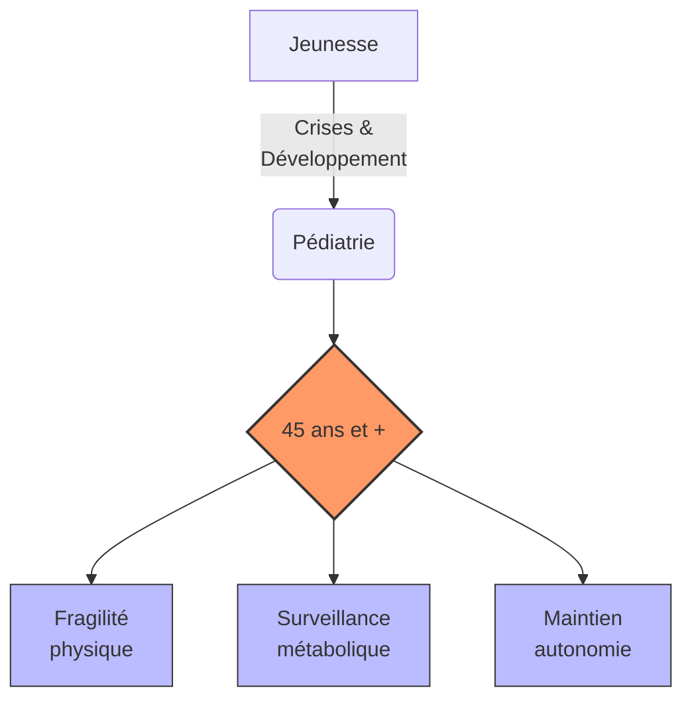

# Partie V : L'Horizon de Vie
## Chapitre 14 : Le Grand Virage (45 ans et +)

### 🎯 L'Essentiel (Cible : Familles & Aidants)

**Le défi du vieillissement**
Après avoir traversé l'enfance et l'adolescence, l'entrée dans la maturité (autour de 45 ans) marque une nouvelle étape. Le corps change, et avec lui, la manière dont le syndrome de Dravet se manifeste. Ce n'est pas forcément une dégradation brutale, mais plutôt une modification des équilibres établis.

**Les changements à surveiller :**
*   **La fragilité physique :** Avec l'âge, la récupération après une crise peut être plus lente. La coordination et l'équilibre peuvent aussi devenir plus précaires. Certains patients nécessitent un fauteuil roulant après 40 ans (Genton et al., 2011).
*   **L'ostéoporose** (fragilisation des os) : les médicaments antiépileptiques pris pendant des décennies, en particulier le valproate et le phénobarbital, réduisent la solidité des os. L'os devient plus fragile et se casse plus facilement, surtout lors des chutes liées aux troubles de l'équilibre. Un examen indolore appelé ostéodensitométrie (qui mesure la densité des os par rayons X) permet de surveiller ce risque. Une supplémentation en vitamine D et en calcium est systématiquement recommandée.
*   **Le risque cardiovasculaire :** La sédentarité, la prise de poids liée aux traitements, et les troubles du système nerveux autonome (le système qui régule le coeur et la tension artérielle sans qu'on y pense, appelé dysautonomie) liés à la mutation SCN1A augmentent le risque de problèmes cardiaques avec l'âge.
*   **L'impact des traitements au long cours sur le foie :** Les médicaments pris pendant des décennies nécessitent une surveillance régulière de la fonction hépatique (le fonctionnement du foie).
*   **La santé cognitive :** On peut observer une évolution de la mémoire ou de la vitesse de traitement de l'information. Il est important de distinguer ce qui relève du vieillissement naturel de ce qui pourrait être une progression de la maladie elle-même.

**À retenir :**
*   Le vieillissement est un processus naturel qui s'ajoute à la maladie -- et il peut être difficile de distinguer les deux.
*   La prévention (exercice adapté, nutrition, suivi médical régulier) est plus cruciale que jamais.
*   L'autonomie doit être préservée par des adaptations de l'environnement.
*   Des examens réguliers (os, coeur, foie, bilan sanguin) permettent de dépister les complications à temps.

---

### 🩺 Le Protocole (Cible : Corps Médical)

**Gestion du patient Dravet sénescent**
La prise en charge après 45 ans nécessite une approche gériatrique intégrée, car les comorbidités liées à l'âge s'ajoutent au tableau neurologique complexe [Genton et al., 2011].

**1. Pharmacocinétique et Pharmacodynamie au long cours**
*   **Métabolisme :** L'évolution de la fonction rénale et hépatique modifie la clairance des antiépileptiques. Un ajustement des doses est souvent nécessaire pour éviter la toxicité. Bilan hépatique et rénal annuel indispensable.
*   **Interactions médicamenteuses :** L'apparition de pathologies chroniques (hypertension, diabète) augmente le risque d'interactions avec le traitement antiépileptique. Réévaluation systématique de la polythérapie pour minimiser les effets iatrogènes, avec tentative de simplification progressive si la situation épileptique le permet.

**2. Ostéoporose et risque fracturaire**
L'ostéoporose est une complication majeure de l'utilisation prolongée des antiépileptiques. Trois mécanismes sont impliqués :
*   **Induction du cytochrome P450** (phénobarbital, phénytoïne, carbamazépine) : accélération du catabolisme de la vitamine D, réduction de l'absorption intestinale du calcium, augmentation de l'excrétion urinaire du calcium.
*   **Effet direct sur l'os :** le valproate est associé à une réduction de la formation osseuse indépendamment de la vitamine D. Certains antiépileptiques ont un effet inhibiteur direct sur les ostéoblastes (cellules qui construisent l'os).
*   **Facteurs indirects :** sédentarité liée au handicap, alimentation déséquilibrée, défaut d'exposition solaire (institutionnalisation).

Le risque relatif de fracture est de 1,7 à 6,2 selon les antiépileptiques utilisés [Vestergaard, 2015]. La prévalence d'ostéopénie atteint 38 % et celle d'ostéoporose 12 % chez les patients épileptiques adultes [Pack et al., 2005].

Recommandations :
*   Dosage de la vitamine D sérique (25-OH-D) annuel. Supplémentation systématique (800-1000 UI/jour) et calcium (500-1000 mg/jour).
*   Ostéodensitométrie (DEXA) tous les 2-3 ans à partir de 30 ans, annuellement après 50 ans.

**3. Risque cardiovasculaire**
Le risque cardiovasculaire est accru chez le patient Dravet vieillissant du fait de :
*   La sédentarité chronique et l'obésité iatrogène (valproate).
*   La dysautonomie liée au *SCN1A* : la mutation affecte également les canaux sodiques cardiaques, prédisposant à des troubles du rythme.
*   Le syndrome métabolique (diabète, dyslipidémie) lié à la polythérapie au long cours.

Recommandations : ECG annuel, surveillance de la pression artérielle, bilan lipidique et glycémie annuels.

**4. Suivi hépatique**
Le valproate au long cours impose une surveillance hépatique régulière (transaminases, ammoniémie). Les patients traités par cannabidiol (Epidyolex) en association avec le valproate présentent un risque accru d'élévation des transaminases (15-20 %).

**5. Évaluation du déclin fonctionnel**
Le suivi doit se concentrer sur la préservation de l'autonomie et la distinction entre vieillissement naturel et progression de la maladie :
*   **Évaluation de la marche et de l'équilibre :** Pour prévenir les chutes, fréquentes en cas d'ataxie aggravée par le vieillissement [Rodda et al., 2012]. Programme de kinésithérapie préventive, adaptation de l'habitat.
*   **Monitoring cognitif :** Surveillance des fonctions exécutives et de la mémoire par tests neuropsychologiques adaptés tous les 2-3 ans. La question d'un risque accru de démence neurodégénérative chez les patients Dravet âgés est un sujet de recherche émergent [Scheffer, 2012], lié au rôle de NaV1.1 dans les circuits de la mémoire hippocampique.
*   **Évaluation fonctionnelle :** Échelle ADL (Activities of Daily Living) et IADL annuelle.
*   **Bilan métabolique annuel complet :** glycémie, bilan lipidique, fonction hépatique, fonction rénale, ionogramme, vitamines D et B12.

#### 📊 Évolution des priorités de soins (Mermaid)

---

### 🤝 L'Accompagnement (Cible : Structures d'accueil & Éducateurs)

**Adapter l'accompagnement à la maturité**
L'approche doit évoluer pour respecter la dignité de l'adulte tout en assurant sa sécurité.

**Stratégies de maintien de l'autonomie :**
*   **Aménagement de l'environnement (Accessibilité) :** Réduire les risques de chute par des aides techniques (barres d'appui, éclairage optimisé, suppression des tapis glissants).
*   **Soutien à la mobilité :** Encourager une activité physique adaptée et régulière pour maintenir le tonus musculaire et l'équilibre.
*   **Stimulation cognitive :** Proposer des activités qui sollicitent la mémoire et les **fonctions exécutives** (les capacités du cerveau à planifier, organiser, prendre des décisions et s'adapter) de manière ludique et non infantilisante.

**Vigilance sur la santé globale :**
*   **Signes de fragilité :** Soyez attentifs aux changements de poids, à la fatigue inhabituelle ou à une perte d'appétit, qui peuvent être des signes de déséquilibre métabolique lié aux traitements.
*   **Risque de fractures :** Les personnes accompagnées prenant des antiépileptiques depuis des décennies ont des os plus fragiles (ostéoporose). Toute chute, même bénigne en apparence, doit être signalée à l'équipe médicale. Favorisez l'activité physique adaptée (marche, exercices d'équilibre) et une alimentation riche en calcium (produits laitiers, légumes verts).
*   **Signes cardiaques :** Essoufflement inhabituel, douleurs thoraciques, palpitations ou malaises doivent être signalés rapidement en raison du risque cardiovasculaire accru.
*   **Distinguer vieillissement et maladie :** Un ralentissement ou une perte d'autonomie peuvent relever du vieillissement naturel ou d'une aggravation de la maladie. Documentez précisément les changements observés (date d'apparition, progression, contexte) pour aider l'équipe médicale à faire la distinction.
*   **Respect de l'intimité :** L'accompagnement d'un adulte nécessite une approche différente de celle d'un enfant ; le respect de sa vie privée et de son autonomie décisionnelle est primordial.

---

### 💡 Le Point de Liaison (Synthèse)

| Aspect | Famille | Médical | Professionnel |
| :--- | :--- | :--- | :--- |
| **Enjeu majeur** | Préserver l'autonomie et la dignité | Gestion des effets cumulés et distinction vieillissement/maladie | Sécurité physique et maintien de l'activité |
| **Ostéoporose** | Alimentation riche en calcium, activité physique | DEXA annuelle après 50 ans, vit. D/calcium, Vestergaard 2015 | Signaler toute chute, prévention des fractures |
| **Cardiovasculaire** | Alerter si essoufflement, malaises | ECG annuel, bilan lipidique, dysautonomie SCN1A | Repérer signes cardiaques, signaler rapidement |
| **Déclin fonctionnel** | Documenter les changements au quotidien | Monitoring cognitif tous les 2-3 ans, échelle ADL | Observer, dater, transmettre les changements |
| **Action clé** | Adaptation du mode de vie | Bilan métabolique annuel complet, simplification de la polythérapie | Aménagement de l'environnement (accessibilité) |

***
