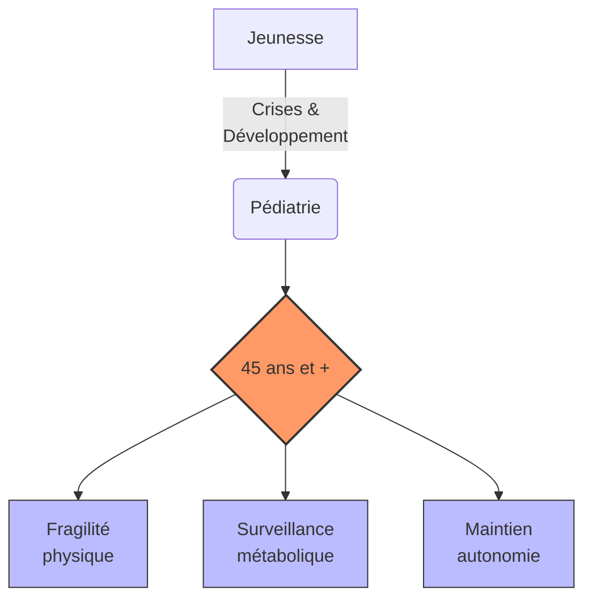

# Partie V : L'Horizon de Vie
## Chapitre 14 : Le Grand Virage (45 ans et +)

### 🎯 L'Essentiel (Cible : Familles & Aidants)

**Le défi du vieillissement**
Après avoir traversé l'enfance et l'adolescence, l'entrée dans la maturité (autour de 45 ans) marque une nouvelle étape. Le corps change, et avec lui, la manière dont le syndrome de Dravet se manifeste. Ce n'est pas forcément une dégradation brutale, mais plutôt une modification des équilibres établis.

**Les changements à surveiller :**
*   **La fragilité physique :** Avec l'âge, la récupération après une crise peut être plus lente. La coordination et l'équilibre peuvent aussi devenir plus précaires.
*   **L'impact des traitements au long cours :** Les médicaments pris pendant des décennies peuvent avoir des effets cumulés sur le métabolisme (os, poids, foie).
*   **La santé cognitive :** On peut observer une évolution de la mémoire ou de la vitesse de traitement de l'information.

**À retenir :**
*   Le vieillissement est un processus naturel qui s'ajoute à la maladie.
*   La prévention (exercice adapté, nutrition, suivi médical régulier) est plus cruciale que jamais.
*   L'autonomie doit être préservée par des adaptations de l'environnement.

---

### 🩺 Le Protocole (Cible : Corps Médical)

**Gestion du patient Dravet sénescent**
La prise en charge après 45 ans nécessite une approche gériatrique intégrée, car les comorbidités liées à l'âge s'ajoutent au tableau neurologique complexe.

**1. Pharmacocinétique et Pharmacodynamie au long cours**
*   **Métabolisme :** L'évolution de la fonction rénale et hépatique modifie la clairance des antiépileptiques. Un ajustement des doses est souvent nécessaire pour éviter la toxicité.
*   **Risque d'ostéoporose :** De nombreux traitements antiépileptiques (notamment les inducteurs enzymatiques) augmentent le risque de déminéralisation osseuse. Un suivi de la densité minérale osseuse est recommandé.
*   **Interactions médicamenteuses :** L'apparition de pathologies chroniques (hypertension, diabète) augmente le risque d'interactions avec le traitement antiépileptique.

**2. Évaluation du déclin fonctionnel**
Le suivi doit se concentrer sur la préservation de l'autonomie :
*   **Évaluation de la marche et de l'équilibre :** Pour prévenir les chutes, fréquentes en cas d'ataxie aggravée par le vieillissement.
*   **Monitoring cognitif :** Surveillance des fonctions exécutives et de la mémoire pour distinguer l'impact du syndrome de Dravet d'un éventuel déclin neurodégénératif lié à l'âge.

#### 📊 Évolution des priorités de soins (Mermaid)

---

### 🤝 L'Accompagnement (Cible : Structures d'accueil & Éducateurs)

**Adapter l'accompagnement à la maturité**
L'approche doit évoluer pour respecter la dignité de l'adulte tout en assurant sa sécurité.

**Stratégies de maintien de l'autonomie :**
*   **Aménagement de l'environnement (Accessibilité) :** Réduire les risques de chute par des aides techniques (barres d'appui, éclairage optimisé, suppression des tapis glissants).
*   **Soutien à la mobilité :** Encourager une activité physique adaptée et régulière pour maintenir le tonus musculaire et l'équilibre.
*   **Stimulation cognitive :** Proposer des activités qui sollicitent la mémoire et les **fonctions exécutives** (les capacités du cerveau à planifier, organiser, prendre des décisions et s'adapter) de manière ludique et non infantilisante.

**Vigilance sur la santé globale :**
*   **Signes de fragilité :** Soyez attentifs aux changements de poids, à la fatigue inhabituelle ou à une perte d'appétit, qui peuvent être des signes de déséquilibre métabolique lié aux traitements.
*   **Respect de l'intimité :** L'accompagnement d'un adulte nécessite une approche différente de celle d'un enfant ; le respect de sa vie privée et de son autonomie décisionnelle est primordial.

---

### 💡 Le Point de Liaison (Synthèse)

| Aspect | Famille | Médical | Professionnel |
| :--- | :--- | :--- | :--- |
| **Enjeu majeur** | Préserver l'autonomie et la dignité | Gestion des effets cumulés & métabolisme | Sécurité physique et maintien de l'activité |
| **Risque identifié** | Déclin fonctionnel rapide | Interactions médicamenteuses & Ostéoporose | Chutes et perte d'indépendance |
| **Action clé** | Adaptation du mode de vie | Suivi biologique et métabolique régulier | Aménagement de l'environnement (accessibilité) |

***
