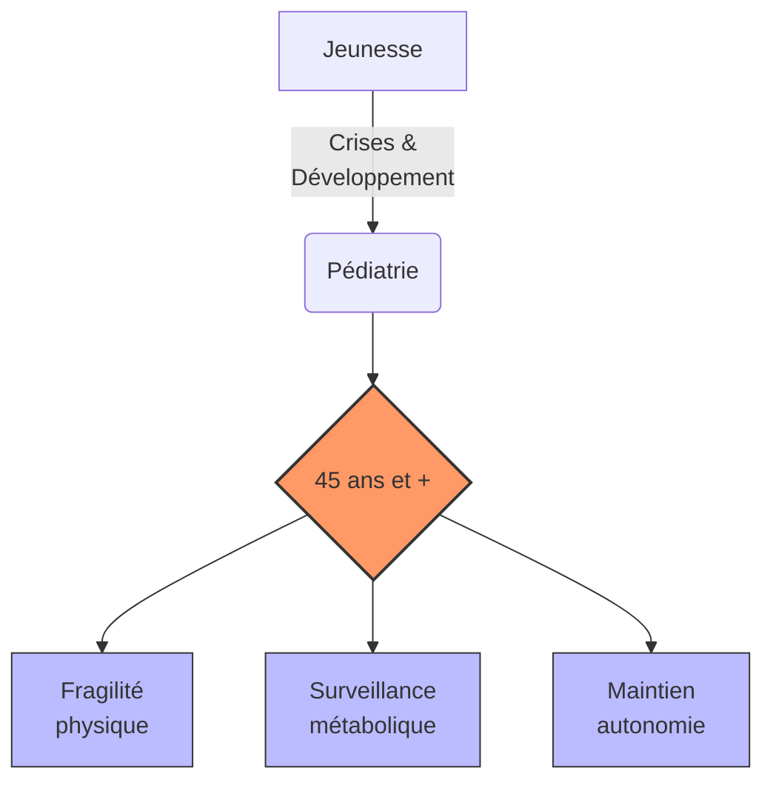

# Partie V : L'Horizon de Vie
## Chapitre 14 : Le Grand Virage (45 ans et +)

### 🎯 L'Essentiel (Cible : Familles & Aidants)

**Le défi du vieillissement**
Après avoir traversé l'enfance et l'adolescence, l'entrée dans la maturité (autour de 45 ans) marque une nouvelle étape. Le corps change, et avec lui, la manière dont le syndrome de Dravet se manifeste. Ce n'est pas forcément une dégradation brutale, mais plutôt une modification des équilibres établis.

**Les changements à surveiller :**
*   **La fragilité physique :** Avec l'âge, la récupération après une crise peut être plus lente. La coordination et l'équilibre peuvent aussi devenir plus précaires. Certains patients nécessitent un fauteuil roulant après 40 ans (Genton et al., 2011).
*   **L'ostéoporose** (fragilisation des os) : les médicaments antiépileptiques pris pendant des décennies, en particulier le valproate et le phénobarbital, réduisent la solidité des os. L'os devient plus fragile et se casse plus facilement, surtout lors des chutes liées aux troubles de l'équilibre. Un examen indolore appelé ostéodensitométrie (qui mesure la densité des os par rayons X) permet de surveiller ce risque. Une supplémentation en vitamine D et en calcium est systématiquement recommandée.
*   **Le risque cardiovasculaire :** La sédentarité, la prise de poids liée aux traitements, et les troubles du système nerveux autonome (le système qui régule le coeur et la tension artérielle sans qu'on y pense, appelé dysautonomie) liés à la mutation SCN1A augmentent le risque de problèmes cardiaques avec l'âge.
*   **L'impact des traitements au long cours sur le foie :** Les médicaments pris pendant des décennies nécessitent une surveillance régulière de la fonction hépatique (le fonctionnement du foie).
*   **La santé cognitive :** On peut observer une évolution de la mémoire ou de la vitesse de traitement de l'information. Il est important de distinguer ce qui relève du vieillissement naturel de ce qui pourrait être une progression de la maladie elle-même.

**À retenir :**
*   Le vieillissement est un processus naturel qui s'ajoute à la maladie -- et il peut être difficile de distinguer les deux.
*   La prévention (exercice adapté, nutrition, suivi médical régulier) est plus cruciale que jamais.
*   L'autonomie doit être préservée par des adaptations de l'environnement.
*   Des examens réguliers (os, coeur, foie, bilan sanguin) permettent de dépister les complications à temps.

**Quand les parents ne peuvent plus**

Il arrive un moment où les parents -- souvent devenus les piliers de toute l'organisation -- ne peuvent plus superviser la prise en charge comme avant. Ce moment n'arrive pas toujours de manière prévisible.

*   **Les facteurs déclencheurs :** L'hospitalisation d'un parent est le motif le plus fréquent de placement en urgence. Viennent ensuite le décès d'un des deux parents, l'épuisement physique et psychique après des décennies de vigilance, ou l'apparition de pathologies propres (troubles cognitifs, perte de mobilité). Parfois, c'est l'aggravation du handicap de l'enfant adulte qui rend le maintien à domicile impossible.
*   **L'anticipation est la clé :** Les listes d'attente en FAM (foyer d'accueil médicalisé, pour les personnes nécessitant une surveillance médicale régulière) et en MAS (maison d'accueil spécialisée, pour les personnes les plus dépendantes) sont longues -- parfois plusieurs années. On a vu des établissements avec 77 personnes en liste d'attente. Ne pas attendre la crise pour déposer un dossier d'orientation à la MDPH (maison départementale des personnes handicapées). Le délai d'instruction est de 4 mois, et l'admission effective peut prendre bien plus longtemps.
*   **Le passage du domicile à la structure :** Ce passage gagne à être progressif. L'accueil temporaire (quelques jours en structure, puis une semaine, puis plus longtemps) permet à la personne de se familiariser avec les lieux, le personnel, les rythmes. Ce n'est pas un luxe -- c'est une nécessité médicale : un changement brutal d'environnement peut provoquer une période d'instabilité avec augmentation temporaire des crises, de l'anxiété, voire une régression des compétences acquises. Cette phase dure en général 2 à 6 semaines.
*   **Ce que vous pouvez faire dès maintenant :** Rédiger un document décrivant tout ce que vous savez sur votre enfant -- ses habitudes, ses déclencheurs de crises, ses moyens de communication, son profil de douleur (comment il exprime la douleur quand il ne peut pas la verbaliser), ses préférences alimentaires, ses rituels de coucher. Ce document sera précieux pour toute équipe qui prendra le relais.

---

### 🩺 Le Protocole (Cible : Corps Médical)

**Gestion du patient Dravet sénescent**
La prise en charge après 45 ans nécessite une approche gériatrique intégrée, car les comorbidités liées à l'âge s'ajoutent au tableau neurologique complexe [Genton et al., 2011].

**1. Pharmacocinétique et Pharmacodynamie au long cours**
*   **Métabolisme :** L'évolution de la fonction rénale et hépatique modifie la clairance des antiépileptiques. Un ajustement des doses est souvent nécessaire pour éviter la toxicité. Bilan hépatique et rénal annuel indispensable.
*   **Interactions médicamenteuses :** L'apparition de pathologies chroniques (hypertension, diabète) augmente le risque d'interactions avec le traitement antiépileptique. Réévaluation systématique de la polythérapie pour minimiser les effets iatrogènes, avec tentative de simplification progressive si la situation épileptique le permet.

**2. Ostéoporose et risque fracturaire**
L'ostéoporose est une complication majeure de l'utilisation prolongée des antiépileptiques. Trois mécanismes sont impliqués :
*   **Induction du cytochrome P450** (phénobarbital, phénytoïne, carbamazépine) : accélération du catabolisme de la vitamine D, réduction de l'absorption intestinale du calcium, augmentation de l'excrétion urinaire du calcium.
*   **Effet direct sur l'os :** le valproate est associé à une réduction de la formation osseuse indépendamment de la vitamine D. Certains antiépileptiques ont un effet inhibiteur direct sur les ostéoblastes (cellules qui construisent l'os).
*   **Facteurs indirects :** sédentarité liée au handicap, alimentation déséquilibrée, défaut d'exposition solaire (institutionnalisation).

Le risque relatif de fracture est de 1,7 à 6,2 selon les antiépileptiques utilisés [Vestergaard, 2015]. La prévalence d'ostéopénie atteint 38 % et celle d'ostéoporose 12 % chez les patients épileptiques adultes [Pack et al., 2005].

Recommandations :
*   Dosage de la vitamine D sérique (25-OH-D) annuel. Supplémentation systématique (800-1000 UI/jour) et calcium (500-1000 mg/jour).
*   Ostéodensitométrie (DEXA) tous les 2-3 ans à partir de 30 ans, annuellement après 50 ans.

**3. Risque cardiovasculaire**
Le risque cardiovasculaire est accru chez le patient Dravet vieillissant du fait de :
*   La sédentarité chronique et l'obésité iatrogène (valproate).
*   La dysautonomie liée au *SCN1A* : la mutation affecte également les canaux sodiques cardiaques, prédisposant à des troubles du rythme.
*   Le syndrome métabolique (diabète, dyslipidémie) lié à la polythérapie au long cours.

Recommandations : ECG annuel, surveillance de la pression artérielle, bilan lipidique et glycémie annuels.

**4. Suivi hépatique**
Le valproate au long cours impose une surveillance hépatique régulière (transaminases, ammoniémie). Les patients traités par cannabidiol (Epidyolex) en association avec le valproate présentent un risque accru d'élévation des transaminases (15-20 %).

**5. Évaluation du déclin fonctionnel**
Le suivi doit se concentrer sur la préservation de l'autonomie et la distinction entre vieillissement naturel et progression de la maladie :
*   **Évaluation de la marche et de l'équilibre :** Pour prévenir les chutes, fréquentes en cas d'ataxie aggravée par le vieillissement [Rodda et al., 2012]. Programme de kinésithérapie préventive, adaptation de l'habitat.
*   **Monitoring cognitif :** Surveillance des fonctions exécutives et de la mémoire par tests neuropsychologiques adaptés tous les 2-3 ans. La question d'un risque accru de démence neurodégénérative chez les patients Dravet âgés est un sujet de recherche émergent [Scheffer, 2012], lié au rôle de NaV1.1 dans les circuits de la mémoire hippocampique.
*   **Évaluation fonctionnelle :** Échelle ADL (Activities of Daily Living) et IADL annuelle.
*   **Bilan métabolique annuel complet :** glycémie, bilan lipidique, fonction hépatique, fonction rénale, ionogramme, vitamines D et B12.

**6. Transition domicile-structure chez le patient Dravet vieillissant**

La transition vers une structure résidentielle constitue une période de vulnérabilité médicale qui doit être anticipée et encadrée.

*   **Facteurs déclencheurs et épidémiologie :** L'hospitalisation du parent-aidant est l'événement le plus fréquent précipitant l'admission en structure (estimé à environ 40 % des placements). Le décès du parent représente environ 25 % des cas, et l'épuisement chronique de l'aidant constitue le motif restant. Les données du double vieillissement montrent que les aidants familiaux d'adultes avec déficience intellectuelle présentent une prévalence significativement plus élevée de pathologies cardiovasculaires, métaboliques et ostéoarticulaires [Yamaki et al., 2009], rendant leur défaillance prévisible.
*   **Impact médical de la transition :** Le changement d'environnement constitue un facteur de stress majeur pouvant provoquer une augmentation de la fréquence des crises épileptiques pendant la période d'adaptation, estimée à 2-6 semaines. On observe également une désorientation, une régression des compétences acquises, des modifications des patterns de sommeil, et une exacerbation des troubles du comportement. Chez le patient non verbal, ces manifestations peuvent être les seuls indicateurs de souffrance psychique.
*   **Protocole de transition recommandé :**
    *   **Maintien du traitement identique :** Ne pas modifier le traitement antiépileptique pendant la phase d'adaptation, sauf urgence. La stabilité pharmacologique est prioritaire dans une période de changement environnemental.
    *   **Coordination neurologue/médecin de structure :** Le neurologue référent doit transmettre au médecin coordonnateur de la structure le protocole d'urgence individualisé, l'historique des crises, les contre-indications (rappel : lamotrigine, carbamazépine, oxcarbazépine, phénytoïne, vigabatrine sont contre-indiquées dans le Dravet), et le bilan des comorbidités.
    *   **Visites préalables :** Organiser des accueils temporaires progressifs (journée, puis nuit, puis séjour court) avant l'admission définitive pour réduire le stress de la transition.
    *   **Objet transitionnel et repères sensoriels :** Maintenir des éléments familiers (objets personnels, photos, couverture) pour ancrer la continuité dans le changement.
    *   **Référent unique :** Désigner un professionnel référent stable pendant la période d'adaptation, formé au protocole d'urgence épileptique du patient.
*   **Surveillance renforcée :** Pendant les 6 premières semaines, une vigilance accrue est nécessaire : monitoring nocturne systématique (capteur de matelas ou bracelet, voir chapitre 9), documentation quotidienne des crises, évaluation hebdomadaire de l'adaptation.

#### 📊 Évolution des priorités de soins (Mermaid)

---

### 🤝 L'Accompagnement (Cible : Structures d'accueil & Éducateurs)

**Adapter l'accompagnement à la maturité**
L'approche doit évoluer pour respecter la dignité de l'adulte tout en assurant sa sécurité.

**Stratégies de maintien de l'autonomie :**
*   **Aménagement de l'environnement (Accessibilité) :** Réduire les risques de chute par des aides techniques (barres d'appui, éclairage optimisé, suppression des tapis glissants).
*   **Soutien à la mobilité :** Encourager une activité physique adaptée et régulière pour maintenir le tonus musculaire et l'équilibre.
*   **Stimulation cognitive :** Proposer des activités qui sollicitent la mémoire et les **fonctions exécutives** (les capacités du cerveau à planifier, organiser, prendre des décisions et s'adapter) de manière ludique et non infantilisante.

**Vigilance sur la santé globale :**
*   **Signes de fragilité :** Soyez attentifs aux changements de poids, à la fatigue inhabituelle ou à une perte d'appétit, qui peuvent être des signes de déséquilibre métabolique lié aux traitements.
*   **Risque de fractures :** Les personnes accompagnées prenant des antiépileptiques depuis des décennies ont des os plus fragiles (ostéoporose). Toute chute, même bénigne en apparence, doit être signalée à l'équipe médicale. Favorisez l'activité physique adaptée (marche, exercices d'équilibre) et une alimentation riche en calcium (produits laitiers, légumes verts).
*   **Signes cardiaques :** Essoufflement inhabituel, douleurs thoraciques, palpitations ou malaises doivent être signalés rapidement en raison du risque cardiovasculaire accru.
*   **Distinguer vieillissement et maladie :** Un ralentissement ou une perte d'autonomie peuvent relever du vieillissement naturel ou d'une aggravation de la maladie. Documentez précisément les changements observés (date d'apparition, progression, contexte) pour aider l'équipe médicale à faire la distinction.
*   **Respect de l'intimité :** L'accompagnement d'un adulte nécessite une approche différente de celle d'un enfant ; le respect de sa vie privée et de son autonomie décisionnelle est primordial.

**Accueillir un nouveau résident Dravet adulte :**

L'arrivée d'un adulte Dravet dans votre structure -- souvent après des décennies de vie au domicile familial -- est un moment charnière qui nécessite une préparation spécifique.

*   **Avant l'admission :** Le protocole d'urgence épileptique doit être en place AVANT le premier jour. Cela signifie : avoir reçu du neurologue référent le protocole individualisé (type de crises, seuils d'intervention, médicaments d'urgence, doses, contre-indications), avoir formé l'ensemble du personnel concerné (y compris les veilleurs de nuit) à l'administration du midazolam buccal (Buccolam), et avoir installé le dispositif de monitoring nocturne adapté (capteur de matelas ou bracelet -- voir chapitre 9 pour les détails techniques).
*   **Recueillir le "savoir des parents" :** Les parents qui ont vécu 20, 30 ou 40 ans avec cette personne possèdent un savoir irremplaçable. Organisez un entretien approfondi (au minimum 2 heures) pour documenter : les habitudes quotidiennes (lever, coucher, repas, toilette), les déclencheurs de crises connus (température, fatigue, émotions fortes, stimulations sensorielles), les signes précurseurs que la personne montre avant une crise, les moyens de communication (gestes, regards, vocalisations, pictogrammes), le profil de douleur (comment la personne exprime l'inconfort quand elle ne peut pas le verbaliser), et les préférences alimentaires -- y compris les textures, car la dysphagie (difficulté à avaler) est fréquente dans le Dravet adulte.
*   **La période d'adaptation (2 à 6 semaines) :** Les premières semaines sont critiques. Les crises peuvent être plus fréquentes en raison du stress du changement. L'anxiété peut se manifester par de l'agitation, un refus alimentaire, des troubles du sommeil, ou au contraire un repli sur soi. Désignez un professionnel référent stable -- toujours le même visage, la même voix -- pour ancrer la relation de confiance. Documentez quotidiennement les crises (type, durée, circonstances) pour permettre au neurologue d'évaluer l'adaptation.
*   **Maintenir le lien familial :** Pendant la transition, le contact avec la famille n'est pas un frein à l'adaptation -- c'est un facteur de sécurisation. Visites régulières, appels, objets familiers dans la chambre : tout ce qui maintient la continuité aide la personne à investir son nouveau lieu de vie. Invitez les parents aux premières réunions de projet personnalisé pour construire ensemble les objectifs d'accompagnement.

---

### 💡 Le Point de Liaison (Synthèse)

| Aspect | Famille | Médical | Professionnel |
| :--- | :--- | :--- | :--- |
| **Enjeu majeur** | Préserver l'autonomie et la dignité | Gestion des effets cumulés et distinction vieillissement/maladie | Sécurité physique et maintien de l'activité |
| **Ostéoporose** | Alimentation riche en calcium, activité physique | DEXA annuelle après 50 ans, vit. D/calcium, Vestergaard 2015 | Signaler toute chute, prévention des fractures |
| **Cardiovasculaire** | Alerter si essoufflement, malaises | ECG annuel, bilan lipidique, dysautonomie SCN1A | Repérer signes cardiaques, signaler rapidement |
| **Déclin fonctionnel** | Documenter les changements au quotidien | Monitoring cognitif tous les 2-3 ans, échelle ADL | Observer, dater, transmettre les changements |
| **Transition structure** | Anticiper les listes d'attente FAM/MAS ; accueil progressif ; transmettre le savoir parental | Maintenir traitement identique ; coordonner neurologue/médecin structure ; surveillance renforcée 2-6 sem. | Protocole d'urgence AVANT admission ; recueillir savoir parental ; référent unique ; monitoring nocturne |
| **Action clé** | Adaptation du mode de vie | Bilan métabolique annuel complet, simplification de la polythérapie | Aménagement de l'environnement (accessibilité) |

***
