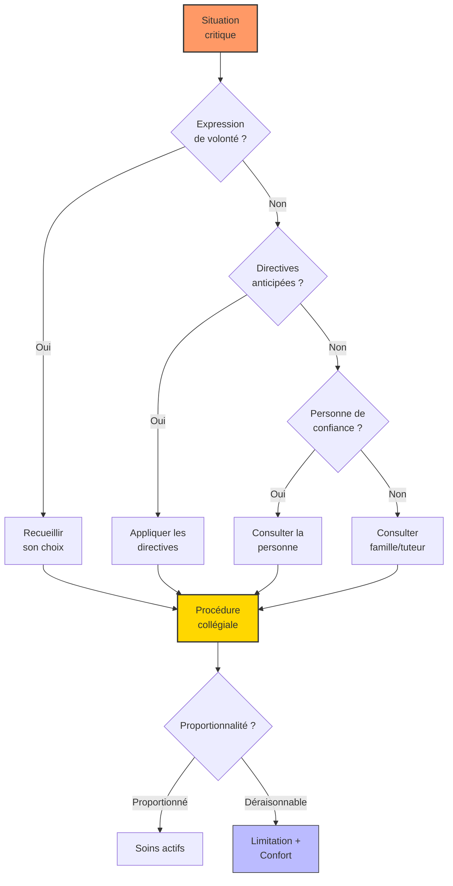

# Partie V : L'Horizon de Vie
## Chapitre 15 : Éthique, Autonomie et Fin de Vie

### 🎯 L'Essentiel (Cible : Familles & Aidants)

**Les questions que personne n'ose poser**
Il y a des sujets que l'on repousse, parce qu'ils font peur. Pourtant, les aborder à tête reposée, c'est protéger son enfant -- même devenu adulte -- et se protéger soi-même. Ce chapitre aborde ces questions avec le respect qu'elles méritent.

**Qui décide pour mon enfant adulte ?**
Lorsqu'une personne est sous mesure de protection (tutelle, curatelle), le tuteur ou le curateur participe aux décisions importantes. Mais la loi est claire : même sous tutelle, l'avis de la personne doit être recherché. Si votre enfant ne parle pas, ses préférences comptent quand même -- un refus exprimé par le corps (se crisper, détourner la tête) est un signal à entendre. Il ne s'agit pas de tout décider "à sa place", mais "avec lui", dans la mesure de ses capacités.

**Le droit à l'autonomie, même partielle**
Autonomie ne signifie pas indépendance totale. Choisir entre deux activités, exprimer un refus, marquer une préférence alimentaire : ce sont des formes d'autonomie à cultiver. Chaque décision laissée à la personne, même modeste, est un acte de respect. Pour les décisions réversibles (choisir un vêtement, une sortie), on peut laisser davantage de liberté. Pour les décisions irréversibles (intervention chirurgicale, traitement lourd), la protection doit être renforcée.

**"Et après nous ?" -- Préparer l'avenir**
C'est la question la plus douloureuse. Quand les parents vieillissent, il est essentiel d'anticiper : identifier un lieu de vie adapté, désigner une personne de confiance (un proche identifié qui sera l'interlocuteur des soignants si la personne ne peut plus s'exprimer), rédiger des directives anticipées (un document qui indique les souhaits de la personne concernant sa fin de vie). Ces démarches, faites sereinement, soulagent tout le monde -- y compris la fratrie, qui n'aura pas à prendre ces décisions dans l'urgence.

**La fin de vie et le deuil**
La loi Claeys-Leonetti (2016) interdit l'acharnement thérapeutique et permet une sédation profonde et continue (un endormissement médicamenteux profond) lorsque la souffrance est insupportable et le pronostic engagé. Pour une personne Dravet, ces décisions se prennent collectivement, avec les soignants et la famille. Perdre un enfant, quel que soit son âge, est un deuil singulier. Il n'y a pas de bonne façon de vivre ce deuil, mais il existe des soutiens -- associations, psychologues, groupes de parole -- qui permettent de ne pas le traverser seul.

---

### 🩺 Le Protocole (Cible : Corps Médical)

**1. Évaluation de la capacité décisionnelle**
L'évaluation repose sur quatre critères : la capacité à comprendre l'information pertinente, à apprécier sa situation personnelle, à raisonner sur les options, et à exprimer un choix. Chez le patient Dravet avec déficience intellectuelle, cette évaluation est dimensionnelle (partielle selon le type de décision) et non binaire. L'utilisation de supports FALC (Facile à Lire et à Comprendre) et de pictogrammes est recommandée pour adapter l'information.

**2. Consentement aux essais cliniques**
La loi Jardé (2012, modifiée en 2016) impose, pour un majeur protégé, l'autorisation du tuteur après avis du juge des tutelles, et l'examen par un Comité de Protection des Personnes (CPP). L'assentiment de la personne (son accord non juridique, marqué par l'absence de refus manifeste) doit être systématiquement recherché. Le ratio bénéfice/risque doit être évalué avec une vigilance particulière : les aidants, portés par l'espoir thérapeutique, peuvent sous-estimer les risques des essais de phase I/II.

**3. Obstination déraisonnable et proportionnalité des soins**
L'état de mal épileptique super-réfractaire (> 24 h) pose la question de la limitation thérapeutique. La décision relève d'une procédure collégiale (art. L. 1110-5-1 du Code de santé publique). Les critères incluent : durée et réponse au traitement, état neurologique de base, volonté exprimée ou supposée du patient. La distinction entre limitation de traitements actifs et abandon des soins (soins de confort, accompagnement) doit être clairement expliquée aux familles.

**4. Diagnostic prénatal et conseil génétique**
Les mutations SCN1A sont de novo dans environ 80 % des cas (fourchette 70-90 % selon les cohortes). Le risque de récurrence par mosaïcisme germinal est estimé à 1-5 %. Le DPN (Diagnostic Prénatal) et le DPI (Diagnostic Préimplantatoire) sont encadrés par la loi de bioéthique du 2 août 2021. Le conseil génétique doit rester non directif. Le CPDPN (Centre Pluridisciplinaire de Diagnostic Prénatal) est la seule instance habilitée à autoriser une IMG (Interruption Médicale de Grossesse).

**5. Bioéthique de la thérapie génique**
Les thérapies basées sur les vecteurs AAV ou les oligonucléotides antisens posent des questions spécifiques : irréversibilité potentielle des effets, sécurité à long terme (risque d'oncogenèse), coûts estimés à plusieurs millions d'euros par traitement. Le consentement éclairé pour des effets à long terme inconnus doit intégrer cette incertitude de manière transparente.

#### 📊 Arbre décisionnel éthique en situation critique (Mermaid)

---

### 🤝 L'Accompagnement (Cible : Structures d'accueil & Éducateurs)

**Respecter les préférences, même sans les mots**
L'autodétermination ne nécessite pas le langage verbal. Un adulte Dravet qui repousse un aliment, qui se dirige vers un espace plutôt qu'un autre, qui sourit à une activité et se ferme à une autre, exprime des choix. Le rôle de l'accompagnant est de les observer, de les documenter, et de les respecter au quotidien. Les grilles d'observation comportementale sont des outils précieux pour formaliser ces préférences.

**Accompagner le vieillissement des parents aidants**
Quand un parent de 70 ans accompagne encore un adulte de 45 ans, la structure d'accueil doit anticiper la transition. Cela signifie : tisser une relation de confiance directe avec le résident (sans passer exclusivement par le parent), intégrer progressivement de nouveaux référents, et rassurer le parent sur la continuité de l'accompagnement. Il ne s'agit pas de "remplacer" le parent, mais de construire un relais solide.

**Préparer les transitions difficiles**
Le décès d'un parent ou un changement de lieu de vie sont des ruptures majeures. Pour une personne qui a besoin de repères stables, ces transitions doivent être préparées longtemps à l'avance : visites progressives du nouveau lieu, maintien des objets familiers, présence de visages connus. Après le décès d'un parent, la personne Dravet vit un deuil qu'elle ne peut pas toujours nommer. Les changements de comportement (repli, agitation, troubles du sommeil) peuvent être des manifestations de ce deuil et doivent être accompagnés comme tels.

**Accompagner la fin de vie en structure**
L'accompagnement en fin de vie ne relève pas uniquement du médical. Maintenir les rituels, la présence rassurante, les stimulations sensorielles appréciées (musique, toucher, lumière douce) -- c'est offrir du confort et de la dignité jusqu'au bout. Former les équipes à la démarche palliative est indispensable pour que chacun trouve sa place dans cet accompagnement.

---

### 💡 Le Point de Liaison (Synthèse)

| Dimension | Famille | Médical | Professionnel |
| :--- | :--- | :--- | :--- |
| **Autonomie** | Laisser choisir dans la mesure du possible, distinguer décisions réversibles et irréversibles | Évaluer la capacité décisionnelle de manière dimensionnelle, rechercher l'assentiment | Observer et documenter les préférences non verbales, favoriser l'autodétermination |
| **Anticipation** | Désigner une personne de confiance, rédiger des directives anticipées, préparer la fratrie | Conseil génétique non directif, procédure collégiale pour les décisions critiques | Construire un relais progressif avec le résident, anticiper les transitions |
| **Fin de vie** | Connaître ses droits (loi Claeys-Leonetti), accepter un accompagnement psychologique | Distinguer limitation des traitements et abandon, garantir les soins de confort | Maintenir les rituels et le confort sensoriel, former les équipes à la démarche palliative |
| **Valeur commune** | *Dignité* | *Proportionnalité* | *Continuité* |

***
