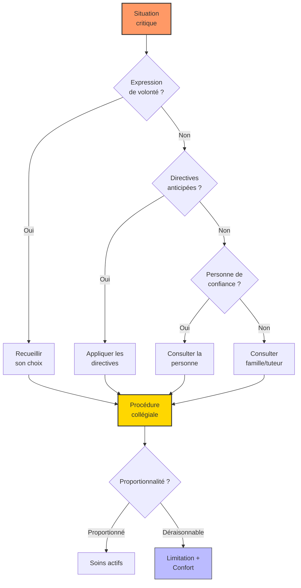

# Partie V : L'Horizon de Vie
## Chapitre 15 : Éthique, Autonomie et Fin de Vie

### 🎯 L'Essentiel (Cible : Familles & Aidants)

**Les questions que personne n'ose poser**
Il y a des sujets que l'on repousse, parce qu'ils font peur. Pourtant, les aborder à tête reposée, c'est protéger son enfant -- même devenu adulte -- et se protéger soi-même. Ce chapitre aborde ces questions avec le respect qu'elles méritent.

**Qui décide pour mon enfant adulte ?**
Lorsqu'une personne est sous mesure de protection (tutelle, curatelle), le tuteur ou le curateur participe aux décisions importantes. Mais la loi est claire : même sous tutelle, l'avis de la personne doit être recherché. Si votre enfant ne parle pas, ses préférences comptent quand même -- un refus exprimé par le corps (se crisper, détourner la tête) est un signal à entendre. Il ne s'agit pas de tout décider "à sa place", mais "avec lui", dans la mesure de ses capacités.

**Le droit à l'autonomie, même partielle**
Autonomie ne signifie pas indépendance totale. Choisir entre deux activités, exprimer un refus, marquer une préférence alimentaire : ce sont des formes d'autonomie à cultiver. Chaque décision laissée à la personne, même modeste, est un acte de respect. Pour les décisions réversibles (choisir un vêtement, une sortie), on peut laisser davantage de liberté. Pour les décisions irréversibles (intervention chirurgicale, traitement lourd), la protection doit être renforcée.

**Le risque de SUDEP : en parler sans effrayer**
La SUDEP (mort subite inattendue en épilepsie, de l'anglais Sudden Unexpected Death in Epilepsy) est la cause la plus fréquente de décès dans le syndrome de Dravet. Ce risque persiste à l'âge adulte, même si les crises diminuent. Les études montrent que la mortalité globale dans le syndrome de Dravet se situe autour de 15,8 %, et que la SUDEP représente 49 % des décès (Shmuely et al., 2016). L'incidence de SUDEP dans le Dravet est estimée à environ 15 fois celle de l'épilepsie en général (Cooper et al., 2016).

Faut-il en parler aux familles ? Cette question soulève un dilemme éthique réel : informer peut générer de l'anxiété, mais ne pas informer prive les familles de la possibilité de prendre des mesures de prévention (surveillance nocturne, capteurs de mouvement, position de sommeil). Le consensus actuel est que l'information doit être donnée, de manière adaptée, en insistant sur les mesures de réduction du risque plutôt que sur les chiffres seuls.

**Protéger juridiquement son enfant adulte**
À l'âge adulte, la plupart des personnes atteintes du syndrome de Dravet ont besoin d'une mesure de protection juridique. Plusieurs options existent, du plus protecteur au moins contraignant :
*   La **tutelle** : le tuteur représente la personne dans tous les actes de la vie civile. C'est la mesure la plus fréquente pour les adultes Dravet avec déficience intellectuelle sévère.
*   La **curatelle** : le curateur assiste la personne (sans la remplacer) pour les actes importants. Adaptée aux déficiences intellectuelles légères à modérées.
*   L'**habilitation familiale** (depuis 2016) : alternative simplifiée à la tutelle, permettant à un proche (parent, fratrie, conjoint) de représenter la personne sans procédure lourde. Souvent la mesure la plus adaptée quand les parents sont les aidants principaux.
*   Le **mandat de protection future** : un acte par lequel les parents désignent, de leur vivant, la personne qui protégera leur enfant lorsqu'ils ne pourront plus le faire. Ce mandat prend effet au décès ou à l'incapacité des parents. C'est un outil essentiel pour préparer le "après nous".

**"Et après nous ?" -- Préparer l'avenir**
C'est la question la plus douloureuse. Quand les parents vieillissent, il est essentiel d'anticiper : identifier un lieu de vie adapté, désigner une personne de confiance (un proche identifié qui sera l'interlocuteur des soignants si la personne ne peut plus s'exprimer), rédiger des directives anticipées (un document qui indique les souhaits de la personne concernant sa fin de vie), et mettre en place un mandat de protection future. Ces démarches, faites sereinement, soulagent tout le monde -- y compris la fratrie, qui n'aura pas à prendre ces décisions dans l'urgence.

**La fin de vie et le deuil**
La loi Claeys-Leonetti (2016) interdit l'acharnement thérapeutique et permet une sédation profonde et continue (un endormissement médicamenteux profond) lorsque la souffrance est insupportable et le pronostic engagé. Pour une personne Dravet, ces décisions se prennent collectivement, avec les soignants et la famille. Perdre un enfant, quel que soit son âge, est un deuil singulier. Il n'y a pas de bonne façon de vivre ce deuil, mais il existe des soutiens -- associations, psychologues, groupes de parole -- qui permettent de ne pas le traverser seul.

---

### 🩺 Le Protocole (Cible : Corps Médical)

**1. Évaluation de la capacité décisionnelle**
L'évaluation repose sur quatre critères : la capacité à comprendre l'information pertinente, à apprécier sa situation personnelle, à raisonner sur les options, et à exprimer un choix. Chez le patient Dravet avec déficience intellectuelle, cette évaluation est dimensionnelle (partielle selon le type de décision) et non binaire. L'utilisation de supports FALC (Facile à Lire et à Comprendre) et de pictogrammes est recommandée pour adapter l'information.

**2. Consentement aux essais cliniques**
La loi Jardé (2012, modifiée en 2016) impose, pour un majeur protégé, l'autorisation du tuteur après avis du juge des tutelles, et l'examen par un Comité de Protection des Personnes (CPP). L'assentiment de la personne (son accord non juridique, marqué par l'absence de refus manifeste) doit être systématiquement recherché. Le ratio bénéfice/risque doit être évalué avec une vigilance particulière : les aidants, portés par l'espoir thérapeutique, peuvent sous-estimer les risques des essais de phase I/II.

**3. SUDEP chez l'adulte : données et discussion éthique**
La SUDEP est la première cause de décès dans le syndrome de Dravet. Les données de mortalité sont les suivantes :
*   Mortalité cumulée estimée entre 10 et 20 % à l'âge de 20 ans [Cooper et al., 2016].
*   Mortalité globale de 15,8 % [Shmuely et al., 2016] avec la répartition suivante des causes de décès : SUDEP 49 %, état de mal épileptique 30 %, infections intercurrentes 7 %, noyade 7 %, autres 7 %.
*   Incidence de SUDEP : 9,32/1000 patients-années, soit environ 15 fois le taux de l'épilepsie en général (0,58/1000 patients-années).
*   Le risque de SUDEP persiste à l'âge adulte mais diminue par rapport à l'enfance.

Facteurs de risque identifiés [Devinsky et al., 2016] : crises tonico-cloniques généralisées fréquentes, crises nocturnes non surveillées, polythérapie (marqueur de gravité).

Mécanismes physiopathologiques : dysfonction autonomique cardiaque (la mutation SCN1A affecte les canaux sodiques cardiaques, prédisposant aux arythmies postictales), apnée centrale postictale, dérégulation de la thermorégulation [Kalume et al., 2013].

La discussion éthique porte sur l'équilibre entre information et anxiété. Le consensus actuel [Harden et al., 2017] recommande une information systématique des familles, en insistant sur les mesures de réduction du risque (surveillance nocturne, capteurs, position de sommeil) plutôt que sur les chiffres seuls.

**4. Protection juridique détaillée**
La majorité des adultes Dravet nécessitent une mesure de protection juridique. Depuis la loi du 5 mars 2007 (réformée en 2019), la protection doit être subsidiaire, proportionnée, individualisée et respectueuse des droits fondamentaux.

*   **Tutelle :** mesure la plus protectrice. Le tuteur représente la personne dans tous les actes civils. Le tuteur peut être familial ou professionnel (mandataire judiciaire à la protection des majeurs, MJPM). Concerne la majorité des patients avec déficience intellectuelle modérée à sévère.
*   **Curatelle** (simple ou renforcée) : assistance sans remplacement. Adaptée aux déficiences intellectuelles légères à modérées.
*   **Habilitation familiale** (ordonnance 2015, en vigueur depuis 2016) : alternative simplifiée, un proche est habilité à représenter la personne. Avantages : procédure plus rapide, pas de contrôle annuel du juge, plus grande souplesse. Mesure privilégiée quand les parents sont aidants principaux et qu'il n'y a pas de conflit familial.
*   **Mandat de protection future** (art. 477-494 du Code civil) : les parents désignent de leur vivant le mandataire qui protégera leur enfant à leur décès ou incapacité. Nécessite un acte notarié pour les pouvoirs les plus étendus.

Même sous tutelle, le patient conserve : le droit de vote (depuis 2019), le droit à l'information sur sa santé, le droit de participer aux décisions, la liberté d'aller et venir, le droit à une vie affective et intime.

La question du "droit à la prise de risque" versus la protection est une tension éthique permanente : jusqu'où protéger sans entraver la liberté individuelle ? Pour les décisions réversibles, une plus grande liberté peut être accordée ; pour les décisions irréversibles, la protection doit être renforcée.

**5. Obstination déraisonnable et proportionnalité des soins**
L'état de mal épileptique super-réfractaire (> 24 h) pose la question de la limitation thérapeutique. La décision relève d'une procédure collégiale (art. L. 1110-5-1 du Code de santé publique). Les critères incluent : durée et réponse au traitement, état neurologique de base, volonté exprimée ou supposée du patient. La distinction entre limitation de traitements actifs et abandon des soins (soins de confort, accompagnement) doit être clairement expliquée aux familles.

**4. Diagnostic prénatal et conseil génétique**
Les mutations SCN1A sont de novo dans >90 % des cas. Le risque de récurrence par mosaïcisme germinal est estimé à 1-2 %, avec un mosaïcisme parental détecté chez 5-10 % des parents apparemment non atteints. Le DPN (Diagnostic Prénatal) et le DPI (Diagnostic Préimplantatoire) sont encadrés par la loi de bioéthique du 2 août 2021. Le conseil génétique doit rester non directif. Le CPDPN (Centre Pluridisciplinaire de Diagnostic Prénatal) est la seule instance habilitée à autoriser une IMG (Interruption Médicale de Grossesse).

**5. Bioéthique de la thérapie génique**
Les thérapies basées sur les vecteurs AAV ou les oligonucléotides antisens posent des questions spécifiques : irréversibilité potentielle des effets, sécurité à long terme (risque d'oncogenèse), coûts estimés à plusieurs millions d'euros par traitement. Le consentement éclairé pour des effets à long terme inconnus doit intégrer cette incertitude de manière transparente.

#### 📊 Arbre décisionnel éthique en situation critique (Mermaid)

---

### 🤝 L'Accompagnement (Cible : Structures d'accueil & Éducateurs)

**Respecter les préférences, même sans les mots**
L'autodétermination ne nécessite pas le langage verbal. Un adulte Dravet qui repousse un aliment, qui se dirige vers un espace plutôt qu'un autre, qui sourit à une activité et se ferme à une autre, exprime des choix. Le rôle de l'accompagnant est de les observer, de les documenter, et de les respecter au quotidien. Les grilles d'observation comportementale sont des outils précieux pour formaliser ces préférences.

**Connaître le risque de SUDEP**
La SUDEP (mort subite inattendue en épilepsie) est un risque réel et persistant à l'âge adulte. Les professionnels d'accompagnement doivent connaître ce risque et les mesures de prévention : surveillance nocturne (capteurs de mouvement, monitoring), ne pas laisser une personne dormir seule sans surveillance dans les périodes de crises fréquentes, éviter le couchage sur le ventre. Le sujet est sensible : il ne s'agit pas de créer de la panique, mais d'assurer une vigilance informée.

**Comprendre les mesures de protection juridique**
Tutelle, curatelle, habilitation familiale, mandat de protection future : ces termes juridiques définissent le cadre dans lequel les décisions sont prises pour la personne accompagnée. En tant que professionnel, il est utile de savoir quelle mesure est en place et qui est le représentant légal, car cela détermine les autorisations nécessaires pour certaines décisions (soins, sorties, activités). L'habilitation familiale, plus récente et plus souple, est de plus en plus utilisée par les familles.

**Accompagner le vieillissement des parents aidants**
Quand un parent de 70 ans accompagne encore un adulte de 45 ans, la structure d'accueil doit anticiper la transition. Cela signifie : tisser une relation de confiance directe avec le résident (sans passer exclusivement par le parent), intégrer progressivement de nouveaux référents, et rassurer le parent sur la continuité de l'accompagnement. Il ne s'agit pas de "remplacer" le parent, mais de construire un relais solide.

**Préparer les transitions difficiles**
Le décès d'un parent ou un changement de lieu de vie sont des ruptures majeures. Pour une personne qui a besoin de repères stables, ces transitions doivent être préparées longtemps à l'avance : visites progressives du nouveau lieu, maintien des objets familiers, présence de visages connus. Après le décès d'un parent, la personne Dravet vit un deuil qu'elle ne peut pas toujours nommer. Les changements de comportement (repli, agitation, troubles du sommeil) peuvent être des manifestations de ce deuil et doivent être accompagnés comme tels.

**Accompagner la fin de vie en structure**
L'accompagnement en fin de vie ne relève pas uniquement du médical. Maintenir les rituels, la présence rassurante, les stimulations sensorielles appréciées (musique, toucher, lumière douce) -- c'est offrir du confort et de la dignité jusqu'au bout. Former les équipes à la démarche palliative est indispensable pour que chacun trouve sa place dans cet accompagnement.

---

### 💡 Le Point de Liaison (Synthèse)

| Dimension | Famille | Médical | Professionnel |
| :--- | :--- | :--- | :--- |
| **SUDEP** | Information adaptée, mesures de prévention (surveillance nocturne, capteurs) | Mortalité 15,8 %, SUDEP 49 % des décès, incidence 15x celle de l'épilepsie générale | Vigilance nocturne, connaître les mesures de prévention |
| **Protection juridique** | Tutelle, curatelle, habilitation familiale, mandat de protection future | Évaluer la capacité décisionnelle, rechercher l'assentiment | Connaître la mesure en place, identifier le représentant légal |
| **Autonomie** | Distinguer décisions réversibles et irréversibles, droit à la prise de risque | Évaluation dimensionnelle, supports FALC | Observer et documenter les préférences non verbales |
| **Anticipation** | Mandat de protection future, directives anticipées, préparer la fratrie | Procédure collégiale pour les décisions critiques | Construire un relais progressif, anticiper les transitions |
| **Fin de vie** | Connaître ses droits (loi Claeys-Leonetti) | Distinguer limitation des traitements et abandon | Maintenir les rituels et le confort sensoriel |
| **Valeur commune** | *Dignité* | *Proportionnalité* | *Continuité* |

***
