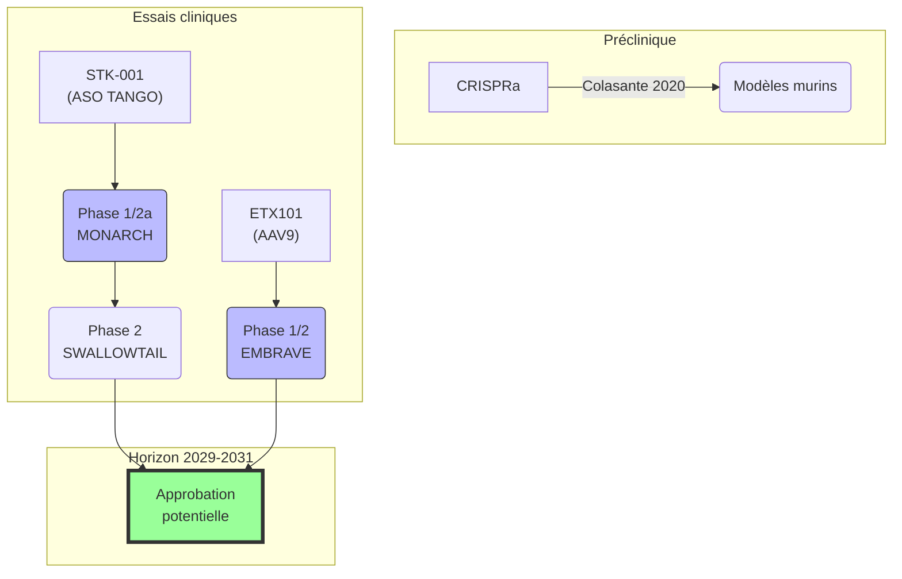

# Partie VI : Demain
## Chapitre 16 : La Frontière de l'Espoir (Thérapies géniques)

### 🎯 L'Essentiel (Cible : Familles & Aidants)

**Réparer le code source**
Le syndrome de Dravet est causé par une erreur dans un seul gène, SCN1A. On peut comparer ce gène à une ligne de code dans le programme qui fait fonctionner le cerveau. Depuis quelques années, des chercheurs travaillent à corriger cette erreur directement à la source. C'est ce qu'on appelle la **thérapie génique** : intervenir sur le gène lui-même, plutôt que de se contenter de gérer les symptômes avec des médicaments.

**Trois grandes stratégies**
Il existe trois façons d'aborder le problème :

La première consiste à **faire travailler davantage la copie saine du gène**. Chaque enfant atteint du syndrome de Dravet possède une copie défectueuse du gène et une copie fonctionnelle. Cette copie saine produit de la protéine, mais pas suffisamment. Un traitement expérimental appelé STK-001 cherche à "débloquer" cette copie pour qu'elle produise plus de protéine -- comme augmenter le volume d'un haut-parleur qui fonctionne, pour compenser celui qui est en panne. Ce traitement utilise la technologie TANGO (Targeted Augmentation of Nuclear Gene Output, c'est-à-dire "augmentation ciblée de la production d'un gène") : il empêche un mécanisme naturel qui détruit une partie des "messages" envoyés par la copie saine, libérant ainsi plus de protéine.

La deuxième approche consiste à **apporter un "activateur" aux cellules du cerveau** via un virus rendu inoffensif qui sert de "transporteur". C'est le principe du traitement ETX101 : un virus modifié (AAV9, un type de virus qui n'est pas dangereux pour l'homme) dépose dans les cellules cérébrales un facteur qui active directement la copie saine du gène. L'avantage est qu'une seule injection pourrait suffire pour toute la vie.

La troisième approche, encore au stade de laboratoire, utilise un outil appelé **CRISPRa** (une version modifiée des "ciseaux génétiques" CRISPR, mais qui ne coupe pas l'ADN). Ce système se fixe sur la copie saine du gène et l'active, un peu comme un interrupteur qu'on pousse au maximum.

**Où en est la recherche ?**
Deux traitements expérimentaux sont actuellement testés chez des enfants et des adolescents dans le cadre d'essais cliniques :
*   **STK-001** (Stoke Therapeutics) : un traitement administré par injection dans le liquide entourant la moelle épinière (injection intrathécale), qui aide la copie saine du gène à produire plus de protéine grâce à la technologie TANGO. L'essai MONARCH (Phase 1/2) a montré des réductions de crises de 30 à 50 % aux doses supérieures, et l'essai SWALLOWTAIL (Phase 2, en double aveugle) est en cours. Ce traitement nécessite des injections répétées (environ tous les 3 à 6 mois). Un essai de suivi à long terme (LONGWING) est également en cours.
*   **ETX101** (Neurocrine Biosciences) : une thérapie génique administrée en une seule injection dans le cerveau, via un virus modifié (AAV9). Elle apporte un "activateur" (un facteur de transcription ingénié, ou eTF) ciblé uniquement aux **interneurones** (les cellules qui freinent l'activité électrique du cerveau) grâce à un promoteur spécifique. L'essai ENDEAVOR/EMBRAVE (Phase 1/2) est en cours, avec des premiers résultats de sécurité encourageants. L'avantage majeur : une seule injection pourrait suffire.

**Les défis à connaître**
Ces approches, aussi prometteuses soient-elles, font face à des obstacles importants :
*   La **barrière hémato-encéphalique** (la "frontière" naturelle qui protège le cerveau) empêche de simplement injecter un traitement dans le sang pour qu'il atteigne le cerveau. C'est pourquoi les traitements doivent être injectés directement dans le liquide céphalo-rachidien ou dans le cerveau.
*   La **fenêtre thérapeutique** (le meilleur moment pour intervenir) reste à déterminer. Un traitement précoce semble plus efficace, mais des bénéfices sont aussi observés après le début des crises.
*   L'**immunogénicité** (la réaction du système immunitaire contre le traitement) peut limiter l'efficacité, notamment pour les virus transporteurs.
*   Pour ETX101, l'injection est un acte neurochirurgical unique et irréversible : une fois le virus injecté, on ne peut pas le retirer.

**Un horizon réaliste**
Ces traitements ne seront pas disponibles demain, mais la recherche avance concrètement. Les estimations actuelles situent les premières approbations potentielles autour de 2029-2031. Ce n'est pas dans cinquante ans. C'est dans le temps d'une enfance.

**Comment participer et rester informé ?**
Les familles peuvent s'inscrire sur les **registres de patients** tenus par les associations (Dravet Syndrome Foundation, Alliance Syndrome de Dravet). Ces registres permettent aux chercheurs d'identifier rapidement les participants potentiels pour les essais cliniques. Parlez-en à votre neuropédiatre référent.

**À retenir :** ces thérapies ne sont pas encore des traitements validés. Elles représentent un espoir sérieux, fondé sur des données scientifiques solides, mais elles restent expérimentales. Le meilleur accompagnement actuel reste indispensable.

---

### 🩺 Le Protocole (Cible : Corps Médical)

**Trois axes thérapeutiques en développement**

Le caractère monogénique du syndrome de Dravet (haploinsuffisance de *SCN1A*, codant NaV1.1) en fait un candidat particulièrement adapté aux approches de thérapie génique. Trois stratégies principales sont en développement clinique ou préclinique avancé.

**1. Oligonucléotides antisens (ASO) -- Programme STK-001**

STK-001 utilise la technologie **TANGO** (Targeted Augmentation of Nuclear Gene Output) [Lim et al., 2020]. Son mécanisme repose sur le blocage de l'inclusion d'un **exon poison** (exon 20N) dans l'ARN pré-messager de *SCN1A*. Cet exon non productif, lorsqu'il est inclus par épissage alternatif, déclenche la dégradation de l'ARNm par le mécanisme NMD (Nonsense-Mediated mRNA Decay). En empêchant son inclusion, STK-001 augmente la production d'ARNm productif à partir de l'allèle sain, élevant les niveaux de protéine NaV1.1 d'environ 50 % à 75-80 % du niveau physiologique [Han et al., 2020].

*   **MONARCH** (Phase 1/2a, NCT04442295) : profil de sécurité acceptable. Événements indésirables principaux : céphalées post-ponction lombaire, douleurs au site d'injection. Réductions médianes de 30-50 % de la fréquence des crises aux doses supérieures. Pas de toxicité dose-limitante identifiée.
*   **SWALLOWTAIL** (Phase 2, NCT05639088) : étude pivot randomisée en double aveugle, contrôlée par placebo, critère principal sur la variation en pourcentage de la fréquence des crises convulsives. Recrutement en cours.
*   **LONGWING** (Extension ouverte, NCT05656716) : évaluation de la sécurité et de l'efficacité à long terme.
*   **Avantages :** mécanisme "naturel" (augmente l'expression du propre gène du patient), dose ajustable et traitement réversible, pas de risque d'insertion génomique.
*   **Limites :** administration intrathécale répétée (estimée tous les 3-6 mois), distribution hétérogène dans les structures cérébrales profondes, coût élevé projeté (précédent du nusinersen/Spinraza pour l'amyotrophie spinale : ~375 000 USD/an). Traitement palliatif et non curatif.

**2. Thérapie génique AAV — Programme ETX101**

ETX101 utilise un vecteur AAV9 pour délivrer un **facteur de transcription ingénié** (eTF, basé sur un domaine en doigts de zinc) au SNC [Tanenhaus et al., 2022]. L'expression de cet eTF est restreinte aux **interneurones GABAergiques** grâce à un promoteur dérivé des gènes *DLX5/DLX6*. L'eTF se lie au promoteur endogène de *SCN1A* et augmente la transcription de l'allèle sain, préservant la régulation physiologique de l'expression.

*   **EMBRAVE** (Phase 1/2, NCT05696639) : dose-escalade en cours, premiers patients dosés avec profil de sécurité favorable.
*   **Avantage majeur :** administration unique, spécificité cellulaire, approche agnostique de la mutation.
*   **Limites :** irréversibilité, immunogénicité anti-AAV9, acte neurochirurgical (injection ICV).

**3. CRISPRa (CRISPR activation) -- Stade préclinique**

L'approche CRISPRa utilise une version catalytiquement inactive de Cas9 (**dCas9** -- dead Cas9) fusionnée à des domaines d'activation transcriptionnelle (VP64, p65, Rta -- système VPR). Guidé par un ARN guide (sgRNA) ciblant le promoteur de *SCN1A*, le système augmente la transcription de l'allèle sain de manière dose-dépendante, sans couper l'ADN (éliminant le risque de mutations hors-cible).

*   [Colasante et al., 2020] : démonstration dans un modèle murin Scn1a+/- d'une augmentation de l'expression de NaV1.1, d'une amélioration de l'excitabilité des interneurones inhibiteurs, et d'une réduction des crises et de la mortalité.
*   [Dong et al., 2022] : optimisation avec un domaine SunTag amplifiant le signal d'activation, efficacité supérieure dans les neurones primaires murins.
*   **Avantages :** pas de coupure de l'ADN, action sur le gène endogène préservant la régulation naturelle, potentiellement combinable avec des promoteurs spécifiques des interneurones.
*   **Limites :** la taille du système (dCas9-VPR + sgRNA) dépasse la capacité d'un seul AAV, nécessitant des systèmes de délivrance double-AAV. Immunogénicité potentielle de la protéine Cas9 d'origine bactérienne (*Streptococcus pyogenes*).

**4. Biomarqueurs émergents pour le suivi thérapeutique**

*   **NfL sériques** (neurofilaments à chaîne légère) : marqueur de lésion axonale, corrélé à l'activité épileptique.
*   **GFAP** (protéine acide fibrillaire gliale) : marqueur d'astrogliose réactive.
*   Ces biomarqueurs pourraient servir de critères de jugement complémentaires dans les futurs essais.

**5. Défis transversaux**

*   **Taille du gène :** l'ADNc de *SCN1A* (~6 kb) dépasse la capacité d'encapsidation des AAV (~4,7 kb), excluant le remplacement génique direct. Des stratégies de contournement (AAV dual avec système split-intéine, mini-gènes) sont en développement préclinique.
*   **Barrière hémato-encéphalique (BHE) :** impose des voies d'administration invasives (intrathécale, intracérébroventriculaire). De nouveaux sérotypes AAV (AAV-PHP.eB, AAV-MaCPNS) capables de traverser la BHE sont en cours d'évaluation, mais leur translatabilité chez l'homme reste incertaine.
*   **Fenêtre thérapeutique :** les données précliniques suggèrent un bénéfice même après le début des crises, mais un traitement précoce est plus efficace. La question du moment optimal d'intervention reste ouverte.
*   **Immunogénicité :** les anticorps préexistants contre AAV9 peuvent neutraliser le vecteur (patients séropositifs potentiellement exclus). Pour CRISPRa, la protéine Cas9 bactérienne peut déclencher une réponse immunitaire.
*   **Dose unique et irréversibilité :** pour ETX101, le transgène viral ne peut pas être retiré après injection. Cela impose une évaluation rigoureuse du rapport bénéfice/risque avant administration.
*   **Coût :** les thérapies géniques AAV existantes (Zolgensma pour l'amyotrophie spinale : ~2,1 M USD) suggèrent un coût très élevé, posant des questions d'accès équitable.

#### 📊 Pipeline thérapies géniques (Mermaid)

---

### 🤝 L'Accompagnement (Cible : Structures d'accueil & Éducateurs)

**Ce que la thérapie génique pourrait changer dans le quotidien**

Si les thérapies géniques actuellement en essai clinique confirment leur efficacité, les changements pour les enfants accompagnés pourraient être progressifs : réduction de la fréquence des crises, et potentiellement une amélioration des capacités d'apprentissage et de communication. Ces effets ne seraient ni immédiats ni spectaculaires — il s'agirait d'une évolution lente, sur des mois, pas d'une transformation du jour au lendemain.

**Préparer les familles : un espoir réaliste**

Les équipes d'accompagnement sont souvent les premiers interlocuteurs des familles au quotidien. Quelques repères pour aborder le sujet des thérapies géniques :
*   Ne jamais parler de "guérison". Les thérapies en développement visent à réduire les crises et à améliorer la qualité de vie, pas à éliminer complètement le syndrome.
*   Orienter les familles vers des sources fiables : le neuropédiatre référent, les associations de patients (Alliance Syndrome de Dravet, Dravet Syndrome Foundation), les sites des essais cliniques (ClinicalTrials.gov).
*   Accueillir l'espoir sans le nourrir d'attentes irréalistes. La recherche avance, c'est un fait. Les délais restent incertains.

**Comprendre les contraintes pratiques**

Si un enfant est inclus dans un essai clinique, les équipes d'accompagnement doivent connaître les contraintes pratiques :
*   STK-001 nécessite des injections intrathécales (injection dans le dos sous anesthésie) tous les 3 à 6 mois, avec des périodes de fatigue possibles après chaque injection.
*   ETX101 implique une intervention neurochirurgique unique, suivie d'une période de surveillance hospitalière.
*   Dans les deux cas, un suivi renforcé est mis en place (bilans sanguins, évaluations neurologiques fréquentes) qui peut modifier le rythme de vie de l'enfant.

**Continuer l'accompagnement actuel**

Même si un enfant participe à un essai clinique, l'accompagnement éducatif, comportemental et social reste indispensable. Les thérapies géniques, si elles fonctionnent, agiront sur la biologie. Elles ne remplaceront pas le travail patient d'apprentissage des habiletés sociales, de structuration de l'environnement, ni le soutien émotionnel aux familles.

---

### 💡 Le Point de Liaison (Synthèse)

| Aspect | Famille | Médical | Professionnel |
| :--- | :--- | :--- | :--- |
| **Enjeu** | Espoir concret de réduction des crises | Trois approches (ASO, AAV, CRISPRa) ciblant l'haploinsuffisance | Changements progressifs possibles |
| **État actuel** | STK-001 (TANGO, injections répétées) et ETX101 (AAV9, dose unique) en essais | SWALLOWTAIL/LONGWING et EMBRAVE en cours ; CRISPRa préclinique | Observer, noter, communiquer |
| **Défis** | BHE, injections invasives, irréversibilité, coût | Immunogénicité, fenêtre thérapeutique, taille du gène | Adapter l'accompagnement si essai clinique |
| **Horizon** | Approbations potentielles ~2029-2031 | Résultats pivotaux attendus 2025-2027 | Maintenir l'accompagnement actuel |
| **Action clé** | S'inscrire sur les registres de patients | Stratifier par mutation, suivre les biomarqueurs (NfL, GFAP) | Se tenir informé, connaître les contraintes pratiques |

***
