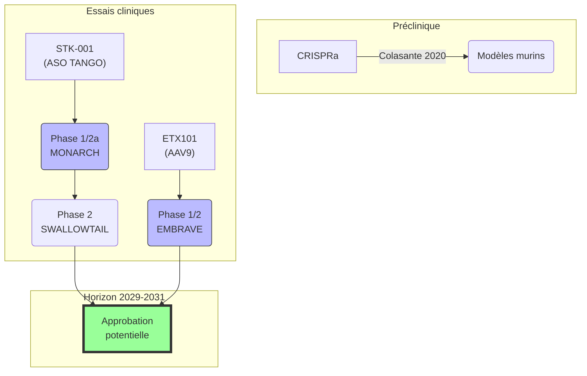

# Partie VI : Demain
## Chapitre 16 : La Frontière de l'Espoir (Thérapies géniques)

### 🎯 L'Essentiel (Cible : Familles & Aidants)

**Réparer le code source**
Le syndrome de Dravet est causé par une erreur dans un seul gène, SCN1A. On peut comparer ce gène à une ligne de code dans le programme qui fait fonctionner le cerveau. Depuis quelques années, des chercheurs travaillent à corriger cette erreur directement à la source. C'est ce qu'on appelle la **thérapie génique** : intervenir sur le gène lui-même, plutôt que de se contenter de gérer les symptômes avec des médicaments.

**Deux grandes stratégies**
Il existe deux façons d'aborder le problème. La première consiste à **faire travailler davantage la copie saine du gène**. Chaque enfant atteint du syndrome de Dravet possède une copie défectueuse du gène et une copie fonctionnelle. Cette copie saine produit de la protéine, mais pas suffisamment. Certains traitements expérimentaux cherchent à "débloquer" cette copie pour qu'elle produise plus de protéine — comme augmenter le volume d'un haut-parleur qui fonctionne, pour compenser celui qui est en panne. La seconde approche consiste à **apporter une instruction supplémentaire** aux cellules du cerveau, via un virus rendu inoffensif qui sert de "transporteur", pour les aider à produire la protéine manquante.

**Où en est la recherche ?**
Deux traitements expérimentaux sont actuellement testés chez des enfants et des adolescents dans le cadre d'essais cliniques :
*   **STK-001** (Stoke Therapeutics) : un traitement administré par injection dans le liquide entourant la moelle épinière, qui aide la copie saine du gène à produire plus de protéine. Les essais MONARCH et SWALLOWTAIL montrent des signaux encourageants avec des réductions de crises observées chez certains patients.
*   **ETX101** (Neurocrine Biosciences) : une thérapie génique administrée en une seule injection dans le cerveau, qui apporte un "activateur" ciblé uniquement aux cellules cérébrales qui en ont besoin (les **interneurones**, les cellules qui freinent l'activité électrique). L'essai EMBRAVE est en cours.

**Un horizon réaliste**
Ces traitements ne seront pas disponibles demain, mais la recherche avance concrètement. Les estimations actuelles situent les premières approbations potentielles autour de 2029-2031. Ce n'est pas dans cinquante ans. C'est dans le temps d'une enfance.

**Comment participer et rester informé ?**
Les familles peuvent s'inscrire sur les **registres de patients** tenus par les associations (Dravet Syndrome Foundation, Alliance Syndrome de Dravet). Ces registres permettent aux chercheurs d'identifier rapidement les participants potentiels pour les essais cliniques. Parlez-en à votre neuropédiatre référent.

**À retenir :** ces thérapies ne sont pas encore des traitements validés. Elles représentent un espoir sérieux, fondé sur des données scientifiques solides, mais elles restent expérimentales. Le meilleur accompagnement actuel reste indispensable.

---

### 🩺 Le Protocole (Cible : Corps Médical)

**Trois axes thérapeutiques en développement**

Le caractère monogénique du syndrome de Dravet (haploinsuffisance de *SCN1A*, codant NaV1.1) en fait un candidat particulièrement adapté aux approches de thérapie génique. Trois stratégies principales sont en développement clinique ou préclinique avancé.

**1. Oligonucléotides antisens (ASO) — Programme STK-001**

STK-001 utilise la technologie **TANGO** (Targeted Augmentation of Nuclear Gene Output). Son mécanisme repose sur le blocage de l'inclusion d'un **exon poison** (exon 20N) dans l'ARN pré-messager de *SCN1A*. Cet exon non productif, lorsqu'il est inclus par épissage alternatif, déclenche la dégradation de l'ARNm par le mécanisme NMD (Nonsense-Mediated mRNA Decay). En empêchant son inclusion, STK-001 augmente la production d'ARNm productif à partir de l'allèle sain, élevant les niveaux de protéine NaV1.1 d'environ 50 % à 75-80 % du niveau physiologique (Han et al., *Science Translational Medicine*, 2020).

*   **MONARCH** (Phase 1/2a, NCT04442295) : profil de sécurité acceptable, réductions médianes de 30-50 % de la fréquence des crises aux doses supérieures.
*   **SWALLOWTAIL** (Phase 2, NCT05639088) : étude randomisée en double aveugle, recrutement en cours.
*   **Limite principale :** administration intrathécale répétée (estimée tous les 3-6 mois), coût élevé projeté.

**2. Thérapie génique AAV — Programme ETX101**

ETX101 utilise un vecteur AAV9 pour délivrer un **facteur de transcription ingénié** (eTF, basé sur un domaine en doigts de zinc) au SNC. L'expression de cet eTF est restreinte aux **interneurones GABAergiques** grâce à un promoteur dérivé des gènes *DLX5/DLX6*. L'eTF se lie au promoteur endogène de *SCN1A* et augmente la transcription de l'allèle sain, préservant la régulation physiologique de l'expression.

*   **EMBRAVE** (Phase 1/2, NCT05696639) : dose-escalade en cours, premiers patients dosés avec profil de sécurité favorable.
*   **Avantage majeur :** administration unique, spécificité cellulaire, approche agnostique de la mutation.
*   **Limites :** irréversibilité, immunogénicité anti-AAV9, acte neurochirurgical (injection ICV).

**3. CRISPRa — Stade préclinique**

L'utilisation de dCas9 fusionnée à des domaines d'activation (système VPR) permet d'augmenter la transcription de l'allèle *SCN1A* sain sans couper l'ADN. Colasante et al. (*Molecular Therapy*, 2020) ont démontré une réduction des crises et de la mortalité dans un modèle murin Scn1a+/-. L'approche reste limitée par la taille du système (nécessite un double AAV) et l'immunogénicité potentielle de la protéine Cas9 bactérienne.

**4. Biomarqueurs émergents pour le suivi thérapeutique**

*   **NfL sériques** (neurofilaments à chaîne légère) : marqueur de lésion axonale, corrélé à l'activité épileptique.
*   **GFAP** (protéine acide fibrillaire gliale) : marqueur d'astrogliose réactive.
*   Ces biomarqueurs pourraient servir de critères de jugement complémentaires dans les futurs essais.

**5. Défis transversaux**

La taille du gène *SCN1A* (~6 kb) dépasse la capacité d'encapsidation des AAV (~4,7 kb), excluant le remplacement génique direct. La barrière hémato-encéphalique impose des voies d'administration invasives. La fenêtre thérapeutique optimale reste à déterminer : les données précliniques suggèrent un bénéfice même après le début des crises, mais un traitement précoce est plus efficace.

#### 📊 Pipeline thérapies géniques (Mermaid)

---

### 🤝 L'Accompagnement (Cible : Structures d'accueil & Éducateurs)

**Ce que la thérapie génique pourrait changer dans le quotidien**

Si les thérapies géniques actuellement en essai clinique confirment leur efficacité, les changements pour les enfants accompagnés pourraient être progressifs : réduction de la fréquence des crises, et potentiellement une amélioration des capacités d'apprentissage et de communication. Ces effets ne seraient ni immédiats ni spectaculaires — il s'agirait d'une évolution lente, sur des mois, pas d'une transformation du jour au lendemain.

**Préparer les familles : un espoir réaliste**

Les équipes d'accompagnement sont souvent les premiers interlocuteurs des familles au quotidien. Quelques repères pour aborder le sujet des thérapies géniques :
*   Ne jamais parler de "guérison". Les thérapies en développement visent à réduire les crises et à améliorer la qualité de vie, pas à éliminer complètement le syndrome.
*   Orienter les familles vers des sources fiables : le neuropédiatre référent, les associations de patients (Alliance Syndrome de Dravet, Dravet Syndrome Foundation), les sites des essais cliniques (ClinicalTrials.gov).
*   Accueillir l'espoir sans le nourrir d'attentes irréalistes. La recherche avance, c'est un fait. Les délais restent incertains.

**Continuer l'accompagnement actuel**

Même si un enfant participe à un essai clinique, l'accompagnement éducatif, comportemental et social reste indispensable. Les thérapies géniques, si elles fonctionnent, agiront sur la biologie. Elles ne remplaceront pas le travail patient d'apprentissage des habiletés sociales, de structuration de l'environnement, ni le soutien émotionnel aux familles.

---

### 💡 Le Point de Liaison (Synthèse)

| Aspect | Famille | Médical | Professionnel |
| :--- | :--- | :--- | :--- |
| **Enjeu** | Espoir concret de réduction des crises | Trois approches (ASO, AAV, CRISPR) ciblant l'haploinsuffisance | Changements progressifs possibles |
| **État actuel** | Deux traitements en essais (STK-001, ETX101) | SWALLOWTAIL et EMBRAVE en cours ; CRISPRa préclinique | Observer, noter, communiquer |
| **Horizon** | Approbations potentielles ~2029-2031 | Résultats pivotaux attendus 2025-2027 | Maintenir l'accompagnement actuel |
| **Action clé** | S'inscrire sur les registres de patients | Stratifier par mutation, suivre les biomarqueurs | Se tenir informé via les associations |

***
