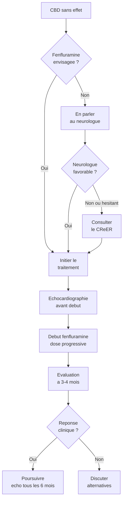

# Hypothese 1 : La fenfluramine, une option sous-utilisee chez l'adulte

## Pourquoi cette hypothese

Le cannabidiol (Epidyolex) ne fonctionne pas pour tout le monde. Les essais cliniques le confirment : **51 a 57 % des patients traites par CBD ne repondent pas** au seuil de 50 % de reduction des crises [Devinsky, NEJM, 2017 ; Miller, JAMA Neurology, 2020]. Plus d'un patient sur deux.

Or il existe une autre molecule, la fenfluramine (Fintepla), qui agit par un mecanisme completement different -- serotoninergique et non cannabinoide -- et qui montre des resultats remarquables chez l'adulte : **80 % de repondeurs a 12 mois** dans le programme d'acces precoce europeen [Specchio, Epilepsia, 2022].

Ce chiffre n'est pas une promesse. Mais c'est une piste que beaucoup de familles ignorent, et que beaucoup de neurologues d'adultes connaissent mal.

## Comment la fenfluramine agit

La fenfluramine augmente la liberation de serotonine (5-HT) dans le cerveau et active des recepteurs serotoninergiques specifiques (5-HT2C principalement). Ce mecanisme est fondamentalement different de celui du CBD, du stiripentol ou du valproate. Cela signifie qu'un patient qui ne repond pas au CBD peut tres bien repondre a la fenfluramine -- les deux molecules ne "parlent" pas aux memes circuits.

La fenfluramine a le **meilleur NNT** (Number Needed to Treat, c'est-a-dire le nombre de patients a traiter pour obtenir un repondeur) de toutes les molecules testees dans le Dravet : **1,8 a 2,0** [Bishop, Epilepsy & Behavior, 2021]. En comparaison, le NNT du CBD est de 5 a 6.

## Les donnees cliniques chez l'adulte

### Essais pivots (population pediatrique et adolescente)

| Essai | Repondeurs >= 50 % | Reduction mediane des crises | Reference |
|-------|--------------------|-----------------------------|-----------|
| Lagae 2019 (0,7 mg/kg/j) | 72,9 % | 74,9 % | Lancet, 2019 |
| Nabbout 2020 (en add-on au stiripentol) | 54 % | 54 % | JAMA Neurology, 2020 |
| Sullivan 2023 (3e essai) | Confirme | Confirme | Epilepsia, 2023 |

### Programme d'acces precoce chez l'adulte [Specchio, 2022]

C'est l'etude cle. Vingt-quatre adultes (18-46 ans), dont 96 % avec mutation SCN1A confirmee et 79 % avec deficience intellectuelle moderee a severe. Des patients comparables a votre proche.

| Critere | Resultat a 3 mois | Resultat a 12 mois |
|---------|-------------------|-------------------|
| Repondeurs >= 75 % | 50 % | **80 %** |
| Amelioration clinique significative (CGI) | 54,1 % | -- |
| Arrets de traitement | 8,3 % (2/24) | -- |

Le resultat le plus frappant : l'efficacite augmente avec le temps chez l'adulte. A 12 mois, 80 % des adultes atteignent une reduction de 75 % ou plus de leurs crises. C'est superieur aux resultats observes chez les enfants et les adolescents.

### Extension a long terme [Scheffer, Epilepsia, 2025]

Sur 375 patients suivis pendant une duree mediane de 824 jours : reduction mediane de 66,8 % de la frequence des crises. Chez les adultes specifiquement, 70,7 % des aidants rapportent une amelioration clinique significative. Aucune valvulopathie ni hypertension arterielle pulmonaire observee au long cours.

## L'echocardiographie : obligatoire mais rassurante

La fenfluramine a un passe. Dans les annees 1960-1990, elle etait utilisee comme coupe-faim a des doses bien plus elevees, parfois associee a d'autres molecules (le fameux "Fen-Phen"). A ces doses elevees, elle pouvait provoquer des atteintes des valves cardiaques, liees a l'activation du recepteur 5-HT2B.

Dans le traitement du Dravet, les doses utilisees sont beaucoup plus faibles (0,2 a 0,7 mg/kg/jour). Neanmoins, par precaution, une **echocardiographie** (echographie du coeur, examen indolore) est obligatoire :

- Avant le debut du traitement
- Tous les 6 mois pendant le traitement
- 3 a 6 mois apres l'arret

A ce jour, dans toutes les donnees disponibles jusqu'en 2025, **aucun cas de valvulopathie cliniquement significative n'a ete rapporte** aux doses antiepileptiques utilisees dans le Dravet [Scheffer, 2025]. La surveillance reste obligatoire, mais elle est rassurante.

## Pourquoi c'est sous-utilise

Trois raisons principales :

1. **L'historique anorexigene** -- beaucoup de medecins associent encore la fenfluramine au scandale des coupe-faim des annees 1990. Ils hesitent a la prescrire.
2. **La perception "pediatrique"** -- les essais pivots ont ete menes chez l'enfant. Certains neurologues d'adultes ne connaissent pas les donnees chez l'adulte ou considerent que c'est "un traitement pour enfants".
3. **Le deficit de formation** -- les neurologues generalistes voient rarement des patients Dravet. La fenfluramine est prescrite principalement par les epileptologues specialises en epilepsies rares.

## Plan d'action

**Etape 1 -- En parler au neurologue referent**
Demandez explicitement si la fenfluramine a ete envisagee. Si votre proche ne repond pas au CBD, c'est un argument fort. Apportez la reference Specchio 2022 si necessaire.

**Etape 2 -- Si le neurologue ne connait pas ou refuse**
Demandez une consultation au **CReER** (Centre de Reference Epilepsies Rares) :
- **Paris** : Hopital Necker-Enfants Malades (Dr Nabbout) -- suit aussi des adultes
- **Marseille** : CHU La Timone
- **Toulouse** : CHU Toulouse -- neurologie, consultation epilepsie

Le CReER peut initier la prescription et la surveillance, puis co-suivre avec le neurologue local.

**Etape 3 -- Evaluer apres 3-4 mois**
L'effet de la fenfluramine apparait en 6-7 semaines [Bishop, 2021]. Une periode d'essai de 3 a 4 mois a dose optimale est raisonnable avant de conclure.

**Etape 4 -- Organiser l'echocardiographie**
A planifier avant la premiere prise, puis tous les 6 mois. Votre cardiologue de ville peut la realiser.

> **Pour approfondir** : Livre, Chapitre 8 — La Revolution Moleculaire (traitements ciblés, essais pivotaux fenfluramine)

## Ce qu'il faut retenir

La fenfluramine n'est pas une guerison. Aucun traitement actuel ne l'est dans le syndrome de Dravet. Mais c'est la molecule avec le meilleur rapport efficacite/nombre de patients a traiter, et les donnees chez l'adulte sont solides et encourageantes. Si votre proche ne repond pas au CBD, cette piste merite d'etre exploree.
