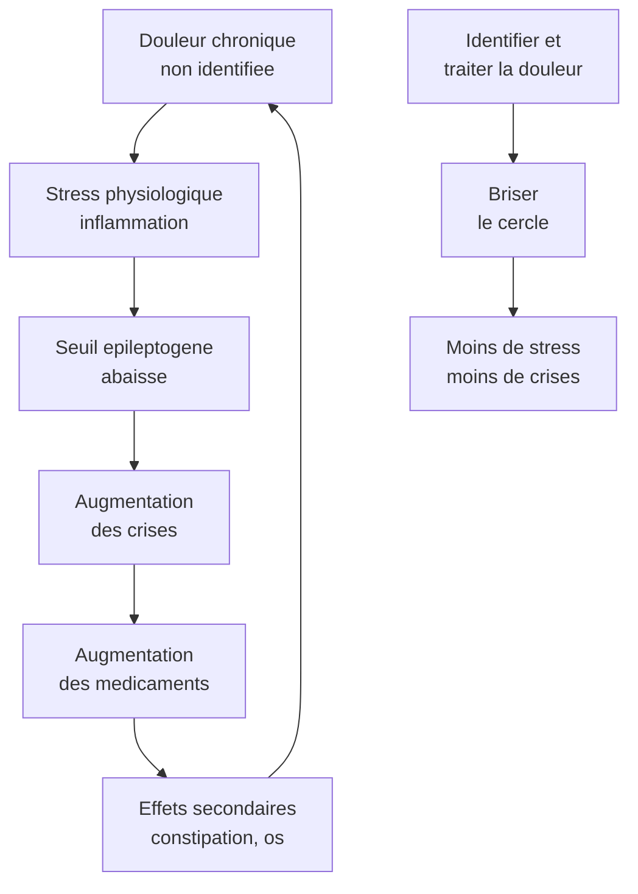

# Hypothese 3 : Chercher la douleur cachee

## Pourquoi c'est l'hypothese cle

Voici un chiffre qui devrait changer votre regard : **moins de 30 % des douleurs sont identifiees chez les adultes non communicants** [HandiConnect]. Cela signifie que plus de deux douleurs sur trois passent inapercues.

Et voici pourquoi c'est directement lie a l'epilepsie : **la douleur chronique abaisse le seuil epileptogene**. Autrement dit, une personne qui souffre a davantage de crises. Traiter la douleur peut reduire les crises sans changer un seul medicament antiepileptique.

C'est le levier a plus fort impact et souvent le plus simple a activer. Il ne necessite ni nouvelle molecule, ni centre de reference, ni demarche administrative. Il necessite un regard different.

## Les sources de douleur chez la femme Dravet de 40 ans

Le tableau ci-dessous n'est pas theorique. Chacune de ces causes est documentee et frequente dans cette population. Certaines sont quasi-systematiques.

| Source de douleur | Pourquoi chez la femme Dravet | Prevalence estimee | Signes possibles |
|-------------------|------------------------------|-------------------|-----------------|
| **SOPK** (syndrome des ovaires polykystiques) | 90 % des femmes sous valproate avant 20 ans | Tres elevee | Douleurs pelviennes, irregularites menstruelles, acne |
| **Endometriose** | 1 femme sur 9 en population generale, favorisee par le desequilibre hormonal | Elevee | Douleurs pelviennes cycliques, agitation pendant les regles |
| **Fibromes uterins** | Frequents apres 35 ans, favorises par le desequilibre hormonal | Moderee a elevee | Douleurs abdominales basses, saignements abondants |
| **Constipation chronique** | Jusqu'a 94 % en institution chez les personnes avec DI severe et deficience motrice | Quasi-systematique | Agitation, refus alimentaire, ballonnement, crises plus frequentes |
| **Douleurs dentaires** | Acces aux soins dentaires souvent neglige, bruxisme frequent, hyperplasie gingivale sous certains MAE | Elevee | Refus de manger, bavage, port de la main au visage |
| **Osteoporose** | Valproate au long cours (perte de densite osseuse), sedentarite, deficit en vitamine D | Moderee a elevee | Douleurs osseuses diffuses, micro-fractures, changement de posture |
| **Reflux gastro-oesophagien** | Favorise par la position allongee prolongee, les medicaments, la constipation | Moderee | Agitation apres les repas, toux nocturne, refus alimentaire |

## Le cercle vicieux : douleur et crises

Briser ce cercle ne demande pas de revolution therapeutique. Cela demande une evaluation systematique de la douleur, puis un traitement cible de chaque cause identifiee.

## Les outils d'evaluation de la douleur

Pour une personne qui ne peut pas dire "j'ai mal", il existe des echelles validees qui traduisent les comportements en score de douleur.

### DESS (Douleur Enfant San Salvadour)

L'echelle de reference en France pour le polyhandicap. Malgre son nom, elle s'utilise a tout age. Elle repose sur l'observation de modifications des signes neurologiques habituels : hypertonie, spasticite, mouvements anormaux, grimaces, cris. Elle necessite de connaitre l'etat de base de la personne -- c'est pourquoi les parents et les professionnels proches sont les meilleurs evaluateurs.

### GED-DI (Grille d'Evaluation de la Douleur -- Deficience Intellectuelle)

Adaptee aux personnes avec trouble du developpement intellectuel. Utilisable par les equipes educatives apres formation.

### FLACC-R (Face, Legs, Activity, Cry, Consolability -- Revised)

Cinq items simples (visage, jambes, activite, cris, consolabilite), score de 0 a 10. Validee chez les personnes avec handicap cognitif. Peut etre utilisee par tout professionnel, meme sans connaissance prealable de la personne.

### CPS-NAID (Chronic Pain Scale for Non-verbal Adults with Intellectual Disabilities)

Vingt-sept items repartis en 6 categories : expression vocale, reaction emotionnelle, expression faciale, langage corporel, reactions protectrices, signes physiologiques. Haute sensibilite, fiabilite inter-evaluateurs ICC 0,91-0,92.

### Le Profil Personnel de Douleur

C'est l'outil le plus precieux sur le long terme. Il s'agit d'un document de reference propre a chaque personne, qui decrit :

- Comment cette personne exprime habituellement la douleur (grimaces specifiques, vocalisations, postures, comportements)
- Ce qui la soulage habituellement
- Les parties du corps plus souvent douloureuses

Ce document doit etre cree avec les parents (qui connaissent les signes depuis des decennies), mis a jour, et accessible a tout soignant -- y compris en cas d'hospitalisation ou de changement d'equipe.

## L'approche hierarchique recommandee

1. **Tenter l'auto-evaluation** si la personne peut montrer ou pointer (echelle visuelle, pictogrammes)
2. **Rechercher les causes potentielles** de maniere systematique (le tableau ci-dessus est votre guide)
3. **Observer les comportements** avec une echelle validee (DESS, FLACC-R)
4. **Obtenir les observations des proches et des soignants** qui connaissent la personne
5. **Tenter un essai therapeutique antalgique** si la suspicion est forte : du paracetamol regulier pendant quelques jours peut etre revelateur

Le signe d'alerte principal : **tout changement brutal de l'etat basal d'une personne non communicante doit faire suspecter une douleur**. Agitation soudaine, retrait, refus de manger, augmentation des crises -- ce ne sont pas des "caprices" ni des "crises comportementales". C'est potentiellement une douleur qui s'exprime.

## Plan d'action

**Etape 1 -- Demander une evaluation de la douleur par echelle validee**
Contactez le medecin coordonnateur de la structure et demandez qu'une evaluation DESS ou FLACC-R soit realisee. Si le medecin ne connait pas ces echelles, la formation Epipair inclut cet enseignement. HandiConnect propose egalement des fiches pratiques.

**Etape 2 -- Bilan gynecologique complet**
C'est souvent le grand oublie. Demandez :
- Une echographie pelvienne (recherche de SOPK, fibromes, endometriose)
- Un bilan hormonal
- Un suivi gynecologique regulier (au minimum annuel)

Pour une personne non communicante, l'examen gynecologique peut necessiter une sedation legere ou etre realise sous MEOPA (melange equimolaire d'oxygene et de protoxyde d'azote, un gaz analgesique et anxiolytique inhale).

**Etape 3 -- Bilan dentaire sous MEOPA**
Les douleurs dentaires sont frequentes et sous-diagnostiquees. Un bilan dentaire est realisable sous MEOPA dans les reseaux de soins bucco-dentaires adaptes au handicap. Renseignez-vous aupres du CHU le plus proche ou du reseau Handident.

**Etape 4 -- Bilan digestif**
- Evaluation du transit : frequence des selles, consistance (echelle de Bristol)
- Recherche de fecalome par palpation abdominale ou radiographie si doute
- Attention : des selles liquides dans la protection n'excluent pas une constipation (faux transit par debordement)
- Mise en place d'un protocole de suivi du transit si ce n'est pas deja fait

**Etape 5 -- Osteodensitometrie**
Si votre proche est sous valproate depuis plus de 3 ans (ce qui est quasi-certain), une osteodensitometrie (mesure de la densite osseuse) est justifiee. Si une osteoporose est detectee, supplementation en vitamine D et calcium, et discussion avec le medecin sur les mesures de prevention des fractures.

**Etape 6 -- Creer le Profil Personnel de Douleur**
Avec les parents et l'equipe de la structure, documenter par ecrit comment votre proche exprime la douleur. Ce document doit etre dans le dossier, dans la chambre, et accompagner la personne en cas d'hospitalisation.

> **Parcours concret**
> - Evaluation DESS/FLACC-R : gratuit (realisee par l'equipe de la structure, sur demande du medecin coordonnateur). Pas de delai si l'equipe est formee.
> - Echographie pelvienne + bilan hormonal : pris en charge ALD. Delai 2-4 mois en gynecologie de ville, plus rapide au CHU sur signalement d'urgence.
> - Bilan dentaire sous MEOPA : pris en charge. Contacter le reseau Handident ou la consultation handicap du CHU le plus proche. Delai variable (1-6 mois selon le departement).
> - Osteodensitometrie : prise en charge ALD apres prescription medicale. Delai 1-3 mois.
> - Profil Personnel de Douleur : gratuit (travail d'equipe parents + structure). Pas de delai.
> - Si la structure refuse l'evaluation douleur : c'est un droit du resident (voir H7 pour les recours).

> **Pour approfondir** : Livre, Chapitre 6 — Les Comorbidités (cartographie complète, échelles de douleur, protocoles)

## Ce qu'il faut retenir

La douleur non identifiee est probablement le facteur le plus sous-estime dans la vie d'un adulte Dravet en structure. Elle aggrave les crises, degrade la qualite de vie, et genere des comportements que l'on attribue a tort au handicap ou a l'epilepsie. L'identifier et la traiter est un geste puissant, concret et accessible.
