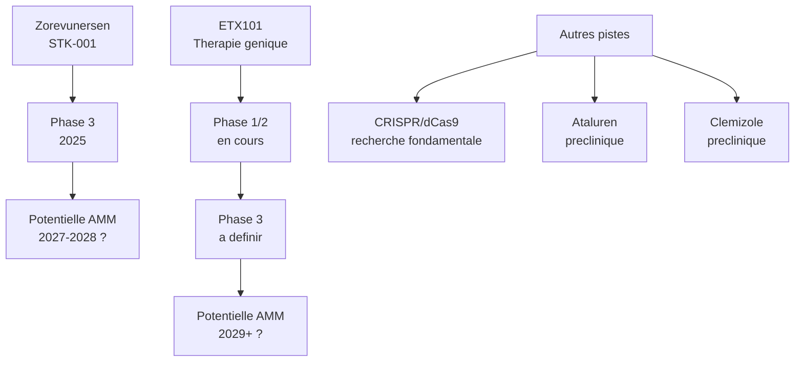

# Hypothese 6 : Les essais cliniques, une fenetre qui s'ouvre

## Pourquoi cette hypothese

Pour la premiere fois dans l'histoire du syndrome de Dravet, des therapies ciblant **la cause genetique** -- et non seulement les symptomes -- sont en essai clinique chez l'humain. Jusqu'ici, tous les traitements existants (valproate, clobazam, stiripentol, fenfluramine, CBD) agissent en aval des crises : ils modifient l'activite des neurotransmetteurs ou des recepteurs, sans corriger le deficit fondamental du canal sodique NaV1.1.

Les nouvelles therapies en developpement visent a augmenter la production de la proteine NaV1.1 fonctionnelle a partir de l'allele sain du gene SCN1A (rappel : dans le Dravet, un seul des deux exemplaires du gene est mute -- l'autre est intact mais insuffisant seul).

Ce n'est pas pour demain au sens strict. Mais les premiers resultats sont encourageants, et les adultes pourraient etre concernes dans les annees a venir.

## STK-001 (zorevunersen) -- Oligonucleotide antisens

### Qu'est-ce que c'est

Un oligonucleotide antisens (ASO) est un court fragment d'ADN synthetique concu pour se fixer sur l'ARN messager (la "copie de travail" du gene) et modifier la maniere dont il est lu par la cellule. Dans le cas de STK-001, la technologie s'appelle **TANGO** (Targeted Augmentation of Nuclear Gene Output) : elle bloque un mecanisme naturel qui gaspille une partie de la production de NaV1.1 a partir de l'allele sain, augmentant ainsi la quantite de proteine fonctionnelle disponible.

### Comment ca s'administre

Par injection intrathecale (dans le liquide cerebrospinal, au niveau lombaire), sous anesthesie locale. Ce type d'injection est deja pratique pour d'autres maladies neurologiques rares (nusinersen/Spinraza pour l'amyotrophie spinale). Les injections sont repetees a intervalles reguliers (tous les quelques mois).

### Ou en est-on

- **Phase 1/2a (MONARCH)** : terminee. Reductions significatives de la frequence des crises, dose-dependantes.
- **Extension ouverte** : ameliorations cognitives et comportementales observees en plus de la reduction des crises.
- **Phase 3 globale** : lancee en 2025.
- Developpeur : Stoke Therapeutics.

### Qui pourrait etre eligible

Les criteres d'eligibilite incluent generalement : mutation SCN1A confirmee, epilepsie pharmacoresistante, absence de contre-indication a l'injection intrathecale. Les essais de Phase 3 pourraient inclure des adultes -- c'est a confirmer au cas par cas.

## ETX101 -- Therapie genique (AAV9)

### Qu'est-ce que c'est

ETX101 est une therapie genique : un vecteur viral non pathogene (AAV9, adeno-associated virus) transporte un gene codant un facteur de transcription artificiel (un outil moleculaire) qui, une fois dans les neurones, **augmente specifiquement l'expression du gene SCN1A endogene** dans les interneurones inhibiteurs GABAergiques. En d'autres termes, il "monte le volume" du gene sain la ou c'est necessaire.

### Comment ca s'administre

Par une injection unique, intracisternale ou intracerebrale, sous anesthesie. C'est potentiellement un traitement en une seule administration.

### Ou en est-on

- **Phase 1/2 (ENDEAVOR)** : en cours. Huit patients traites a fevrier 2025, a plusieurs niveaux de dose.
- **Premiers resultats** (presentes a l'AES 2025) : bien tolere, aucun evenement indesirable grave lie au traitement. Reductions dose-dependantes et soutenues de la frequence des crises. Gains neurodeveloppementaux progressifs et cliniquement significatifs observes sur 52 semaines.
- Developpeur : Encoded Therapeutics.
- **Limite actuelle** : l'essai est ouvert aux enfants de 6 mois a 7 ans. L'extension aux adultes depend des resultats pediatriques.

## Le pipeline en un coup d'oeil

## Comment chercher un essai clinique

**ClinicalTrials.gov** est la base de donnees mondiale des essais cliniques. Pour chercher :
1. Aller sur clinicaltrials.gov
2. Taper "Dravet syndrome" dans le champ de recherche
3. Filtrer par "Recruiting" (en cours de recrutement)
4. Filtrer par pays si vous cherchez un centre en France

**Centres francais impliques dans les essais Dravet :**
- **CReER Paris** : Hopital Necker-Enfants Malades (Pr Rima Nabbout) -- centre de reference national
- **CReER Marseille** : CHU La Timone
- Ces centres sont les plus susceptibles de participer aux essais internationaux et de connaitre les criteres d'eligibilite actuels

## La question du test genetique

Pour etre eligible a un essai ciblant SCN1A, une confirmation genetique de la mutation est indispensable.

Si votre proche a recu son diagnostic il y a 30 ans, le test genetique n'existait peut-etre pas a l'epoque, ou il a ete realise avec une technologie ancienne. Les techniques actuelles (sequencage de nouvelle generation, ou NGS) sont beaucoup plus sensibles et peuvent detecter des mutations qui echappaient aux methodes anterieures.

**Geste concret :** Verifiez que le dossier medical contient un resultat de test genetique SCN1A recant. Si ce n'est pas le cas, demandez au neurologue de le prescrire. C'est un simple prelevement sanguin. Le resultat ouvre la porte aux essais cliniques et affine le pronostic.

## Un message important

Ces therapies representent un espoir reel. Mais elles ne sont pas encore disponibles, leurs resultats a long terme sont inconnus, et l'acces pour les adultes reste incertain a court terme.

Il ne faut ni idealiser ni desesperer. Ne culpabilisez pas si votre proche n'est pas eligible ou si un essai n'est pas accessible. L'important est de maintenir le lien avec un centre specialise (CReER) qui vous informera des evolutions.

Et en attendant, les 7 autres hypotheses de ce guide sont des leviers d'action concrets, disponibles maintenant.

## Plan d'action

**Etape 1 -- Verifier le test genetique SCN1A**
Demandez au neurologue si un test genetique SCN1A a ete realise. Si oui, demandez le compte rendu. Si non, ou s'il date de plus de 10 ans avec une technologie ancienne, demandez un nouveau test par NGS.

**Etape 2 -- Contacter le CReER**
Appelez ou ecrivez au centre de reference le plus proche (Necker a Paris, La Timone a Marseille) pour demander si des essais cliniques sont ouverts aux adultes Dravet. Expliquez le profil de votre proche : age, mutation (si connue), traitements en cours, pharmacoresistance.

**Etape 3 -- Consulter ClinicalTrials.gov**
Recherchez "Dravet syndrome" + "adult" pour identifier les essais ouverts. Certains essais ont des centres en France ; d'autres peuvent necessiter un deplacement a l'etranger.

**Etape 4 -- Rester informe**
L'Alliance Syndrome de Dravet (France) et la Dravet Syndrome Foundation (internationale) publient regulierement des mises a jour sur les essais cliniques. S'y abonner permet de ne pas manquer l'ouverture d'un essai pertinent.

## Ce qu'il faut retenir

Nous vivons un moment historique pour le syndrome de Dravet. Pour la premiere fois, des therapies ciblant la cause genetique sont en essai chez l'humain. L'acces aux adultes est encore limite, mais il est probable que cela change dans les annees a venir. Le premier geste pour s'y preparer : verifier que le test genetique SCN1A est a jour.
