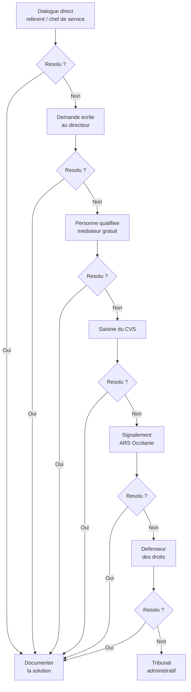

# Hypothese 7 : Vos droits face a la structure d'accueil

## Pourquoi cette hypothese est directement actionnable

Quand les relations avec la structure d'accueil se tendent, on se sent souvent demuni. On n'ose pas insister, de peur que cela retombe sur son enfant. On ne sait pas ce qu'on a le droit de demander. On ne connait pas les recours.

Ce chapitre existe pour changer cela. La loi est de votre cote -- a condition de la connaitre. Et les recours existent, du dialogue direct jusqu'au Defenseur des droits, en passant par un mediateur gratuit et independant dont peu de familles connaissent l'existence.

## Les 7 droits fondamentaux (loi 2002-2, article L.311-3 du CASF)

La loi du 2 janvier 2002 garantit a toute personne accueillie en etablissement medico-social -- foyer de vie, FAM, MAS, communaute de l'Arche -- les droits suivants :

| N | Droit | Ce que cela signifie concretement |
|---|-------|----------------------------------|
| 1 | **Dignite, integrite, vie privee, securite** | La chambre est un espace intime. Les soins doivent respecter la pudeur. La securite nocturne est une obligation. |
| 2 | **Libre choix** | Entre les differentes formes de prise en charge (domicile, etablissement). |
| 3 | **Accompagnement individualise et de qualite** | Le protocole de soins doit etre adapte a votre proche, pas generique. Le consentement eclaire (du representant legal si besoin) est requis. |
| 4 | **Confidentialite** | Les informations medicales et personnelles sont protegees. |
| 5 | **Acces a l'information** | Vous avez le droit d'acceder a toute information relative a la prise en charge. |
| 6 | **Information sur les droits et les voies de recours** | La structure doit vous informer de vos droits et des moyens de les faire valoir. |
| 7 | **Participation directe** | Vous participez au projet d'accueil et d'accompagnement. Ce n'est pas une faveur, c'est un droit. |

## Le contrat de sejour : le relire, maintenant

Le contrat de sejour est le document juridique qui formalise la relation entre votre proche (ou son representant legal) et l'etablissement. Il doit avoir ete remis dans les 15 jours suivant l'admission et signe dans le mois.

**Ce qu'il doit contenir :**
- Les objectifs de prise en charge
- La liste des prestations offertes et leur cout previsionnel
- Les conditions de sejour
- Les conditions de resiliation et de revision

**Ce qu'il faut verifier :**
- Le contrat est-il a jour ? (Il doit etre revise regulierement.)
- Les medicaments contre-indiques dans le syndrome de Dravet (lamotrigine, carbamazepine, oxcarbazepine, phenytoine, vigabatrine) figurent-ils dans le protocole d'urgence annexe ?
- Le protocole d'urgence en cas de crise est-il precis (duree avant administration du midazolam, appel du 15, gestes a faire et a ne pas faire) ?
- Les coordonnees du neurologue referent sont-elles a jour ?

Si le contrat est ancien et n'a jamais ete revise, vous avez le droit de demander sa mise a jour.

## Le projet personnalise : c'est CO-construit

Le projet personnalise (anciennement projet individualise) est l'avenant au contrat de sejour. Il doit etre elabore dans les 6 mois suivant l'admission, et revise **au minimum une fois par an**.

**Principes fondamentaux :**
- Il est **co-construit** avec la personne accueillie et/ou son representant legal, en associant l'equipe pluridisciplinaire
- Vous avez le droit de **proposer** des objectifs, de **refuser** des modalites, de **demander une revision** a tout moment
- Il doit inclure : les attentes et besoins identifies, les objectifs d'accompagnement, les prestations prevues (educatives, soins, therapeutiques), les modalites d'evaluation

**Votre levier :** Si le projet personnalise ne mentionne pas les specificites liees au Dravet (gestion des crises, protocole d'urgence, contre-indications medicamenteuses, douleur, surveillance nocturne), demandez sa revision. C'est votre droit.

## Le CVS : votre voix dans l'institution

Le CVS (Conseil de la Vie Sociale) est l'instance de representation des residents et de leurs familles au sein de l'etablissement. Il se reunit au moins 3 fois par an.

**Qui peut y sieger :** representants des residents, representants des familles/representants legaux, representants du personnel, direction.

**Ses pouvoirs :** il donne son avis et peut faire des propositions sur toute question relative au fonctionnement de l'etablissement -- organisation, activites, animation, travaux, prix des services.

**Comment l'utiliser :** Si vous avez une preoccupation qui concerne tous les residents (formation du personnel aux crises epileptiques, equipement de surveillance nocturne, protocoles de soins), portez-la au CVS. C'est la voie collective.

## L'escalade en cas de conflit

Si le dialogue direct avec l'equipe ne suffit pas, il existe une echelle de recours. Chaque etape laisse une trace ecrite qui renforce votre position.

### Etape 1 : Dialogue direct

Parlez d'abord avec le referent de votre proche ou le chef de service. Exposez votre preoccupation clairement. Notez la date, les personnes presentes, ce qui a ete dit.

### Etape 2 : Demande ecrite au directeur

Si le dialogue oral n'aboutit pas, passez a l'ecrit. Un courrier recommande avec accuse de reception adresse au directeur de l'etablissement. Soyez factuel : decrivez la situation, ce que vous demandez, la base legale de votre demande. **Gardez une copie de tout.**

### Etape 3 : La personne qualifiee (mediateur gratuit)

C'est l'outil le plus meconnu et pourtant le plus precieux. La personne qualifiee est un mediateur independant, designe conjointement par le Prefet, le Directeur general de l'ARS et le President du Conseil departemental. Son intervention est **gratuite**.

**Comment la saisir :** par courrier adresse au Conseil departemental ou a la delegation territoriale de l'ARS, en precisant "personne qualifiee". Delai de reponse : 2 mois.

Elle n'a pas de pouvoir d'injonction sur l'etablissement, mais elle dispose d'une fonction d'alerte et rend compte a l'ARS et au Conseil departemental. Sa seule intervention suffit souvent a debloquer une situation.

### Etape 4 : Saisine du CVS

Le representant des familles au CVS peut porter une reclamation collective lors de la prochaine reunion (au moins 3 fois par an).

### Etape 5 : Signalement a l'ARS

L'ARS (Agence Regionale de Sante) dispose d'un pouvoir d'inspection et de controle sur les etablissements medico-sociaux. Un signalement de dysfonctionnement grave, de non-respect des droits ou de maltraitance peut declencher une inspection.

### Etape 6 : Defenseur des droits

Saisine en ligne sur defenseurdesdroits.fr. Le Defenseur des droits intervient en cas d'atteinte aux droits fondamentaux, de discrimination ou de maltraitance. C'est une autorite independante.

### Etape 7 : Tribunal administratif (dernier recours)

Pour contester une decision administrative. Delai de recours : 2 mois apres le recours administratif prealable obligatoire. C'est le dernier recours, rarement necessaire.

## Points specifiques au Dravet

**Les contre-indications doivent figurer dans le protocole d'urgence.** Si votre proche fait une crise en structure et qu'un medecin de garde ou un urgentiste administre de la phenytoine IV (reflexe frequent en salle d'urgence), les consequences peuvent etre graves. La liste des medicaments contre-indiques (lamotrigine, carbamazepine, oxcarbazepine, phenytoine, vigabatrine) doit etre dans le protocole d'urgence du dossier, dans la chambre, et idealement sur une carte ou un bracelet porte par votre proche.

**Le droit de visite ne peut pas etre interdit arbitrairement.** L'article 6 de la charte des droits et libertes garantit le "droit au respect des liens familiaux". Les horaires de visite sont definis dans le reglement de fonctionnement, mais des restrictions ne peuvent etre imposees que pour des raisons medicales motivees.

**Le representant legal est l'interlocuteur principal.** Si vous etes tuteur ou curateur de votre proche, la structure doit vous associer a chaque etape du projet personnalise et vous informer regulierement de sa sante et de son bien-etre. Aucune modification significative de la prise en charge ne peut se faire sans votre consentement.

## Plan d'action

**Etape 1 -- Relire le contrat de sejour**
Retrouvez le contrat signe a l'admission. Verifiez son contenu. Si vous ne le trouvez pas, demandez-en une copie a la direction.

**Etape 2 -- Demander la revision du projet personnalise**
Par courrier au directeur, demandez la tenue d'une reunion de revision du projet personnalise. Preparez vos propositions : protocole d'urgence a jour, equipement de surveillance nocturne, evaluation de la douleur, contre-indications medicamenteuses dans le dossier.

**Etape 3 -- Si les tensions persistent**
Saisissez la personne qualifiee (mediateur gratuit). C'est un droit. Ce n'est pas une declaration de guerre -- c'est une demarche legale prevue par la loi pour aider les familles.

**Etape 4 -- Documenter chaque echange par ecrit**
Chaque demande orale doit etre suivie d'un email ou d'un courrier de confirmation. Chaque refus doit etre documente. En cas d'escalade, ces traces sont essentielles.

> **Parcours concret**
> - Toutes les demarches de cette hypothese sont gratuites : relecture du contrat, demande de revision, CVS, personne qualifiee, signalement ARS, Defenseur des droits.
> - Seul cout : courrier recommande avec accuse de reception (~6 EUR par envoi). Garder les preuves de depot.
> - Personne qualifiee (mediateur) : saisine par courrier au Conseil departemental ou a la delegation ARS. Delai de reponse : 2 mois maximum. Intervention gratuite et independante.
> - Tribunal administratif (dernier recours) : aide juridictionnelle possible si ressources modestes. Delai de recours : 2 mois apres la decision contestee.

## Contacts utiles

| Organisme | Contact |
|-----------|---------|
| **ARS Occitanie** | Delegation departementale de la Haute-Garonne : 05 34 30 24 00 |
| **Defenseur des droits** | defenseurdesdroits.fr (saisine en ligne) ou 09 69 39 00 00 |
| **UNAPEI** (Union nationale des associations de parents de personnes handicapees mentales) | unapei.org |
| **UDAF Haute-Garonne** (Union departementale des associations familiales) | udaf31.fr |
| **Alliance Syndrome de Dravet** | dravet.fr |

## Ce qu'il faut retenir

Vous n'etes pas en position de faiblesse face a la structure. La loi vous donne des droits concrets et des voies de recours graduees. Le plus important : passez a l'ecrit, gardez des traces, et n'hesitez pas a solliciter la personne qualifiee. Elle est la pour ca.

> **Pour approfondir** : Livre, Chapitre 11 — Inclusion et Droits (détail MDPH, montants, structures résidentielles, monitoring)

Pour les montants detailles des aides financieres (AAH, AEEH, PCH, AJPA) et les procedures MDPH, voir le chapitre 11 du Livre.
