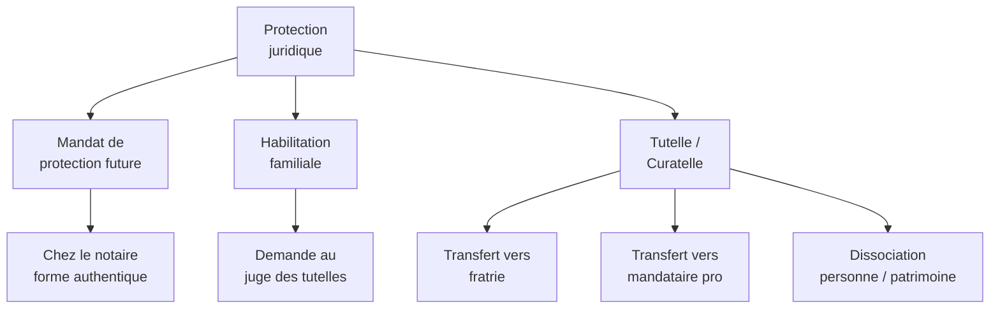

# Hypothese 8 : Preparer l'apres -- Quand les parents ne pourront plus

## Pourquoi c'est le sujet le plus difficile et le plus important

C'est la question que l'on repousse toujours. Celle qui serre la gorge. Celle a laquelle on n'a pas de bonne reponse -- seulement des reponses necessaires.

Quand les parents de Marlene ne seront plus la, ou ne seront plus en mesure de veiller, qui saura qu'elle grimace de cette facon-la quand elle a mal ? Qui se souviendra que tel bruit l'apaise et que tel autre la stresse ? Qui verifiera que la lamotrigine ne figure nulle part dans son protocole d'urgence ?

Le "apres-nous" ne se prepare pas en urgence. Il se prepare maintenant, methodiquement, en protegeant juridiquement votre enfant, en transmettant ce que vous savez, et en organisant le relais.

## Le double vieillissement

Votre enfant vieillit. Vous vieillissez aussi. C'est ce que les professionnels appellent le "double vieillissement" : la conjonction du vieillissement du parent-aidant (souvent 70 ans et plus) avec le vieillissement premature de la personne handicapee, dont les effets du vieillissement se cumulent avec ceux du handicap.

Les donnees sont sans appel : 78 % des adultes avec deficience intellectuelle presentent des conditions liees au vieillissement [Heller & Caldwell, 2006]. Cote parents, 52 % des aidants developpent des symptomes depressifs, 68 % des symptomes anxieux [ScienceDirect, 2020].

La sociologue Muriel Delporte avertit : "Les effets du vieillissement vont se cumuler avec ceux du handicap." La planification anticipee n'est pas un luxe -- c'est une necessite.

## Les outils de protection juridique

### Le mandat de protection future

**Ce que c'est :** Un acte juridique par lequel vous designez a l'avance une ou plusieurs personnes pour representer votre enfant si vous n'etes plus en mesure de le faire. C'est le "mandat de protection future pour autrui" (article 477 du Code civil).

**Comment le rediger :**
- Obligatoirement sous **forme authentique** (acte notarie) quand il s'agit de proteger une personne handicapee (4e alinea de l'article 477)
- Il doit etre precis : qui est designe, pour quels actes (decisions de sante, choix du lieu de vie, gestion du patrimoine)
- Il peut couvrir la protection de la personne, de son patrimoine, ou les deux

**Quand il prend effet :** Lorsqu'un certificat medical atteste que le mandant (vous) ne peut plus pourvoir seul aux interets de la personne protegee.

**Cout :** Honoraires du notaire (environ 300 a 500 EUR).

**Qui designer :** Un membre de la fratrie, un autre proche, ou un mandataire professionnel. Vous pouvez designer un mandataire principal et un mandataire subsidiaire (en cas de defaillance du premier).

### L'habilitation familiale

**Ce que c'est :** Une mesure de protection plus souple que la tutelle, qui permet a un membre de la famille de representer ou d'assister un proche qui ne peut plus pourvoir seul a ses interets. En 2023, 39 000 habilitations familiales ont ete prononcees, soit 38,9 % des mesures de protection juridique.

**Avantages par rapport a la tutelle :**
- Procedure moins contraignante : pas d'inventaire de patrimoine obligatoire, pas de comptes annuels de gestion
- Moins d'autorisations a solliciter au juge
- Absence de controle judiciaire sauf dysfonctionnement

**Condition essentielle :** L'accord unanime de la famille sur le principe et sur la personne designee. En cas de conflit familial, cette mesure ne peut pas etre prononcee.

**Personnes habilitees :** Obligatoirement un membre de la famille proche : ascendant, descendant, frere/soeur ou conjoint.

### Le transfert de tutelle

Si vous etes actuellement tuteur de votre enfant, le transfert de la mesure de tutelle se prepare. Les options :

| Option | Avantages | Inconvenients |
|--------|-----------|---------------|
| **Fratrie** | Connaissance intime de la personne, continuite du lien, gratuite | Risque d'epuisement, charge emotionnelle et administrative, conflit potentiel avec sa propre vie familiale |
| **Mandataire professionnel** | Expertise juridique, neutralite, perennite | Moins de connaissance de la personne, cout (pris en charge selon les ressources du majeur protege) |
| **Association tutelaire** (UDAF, ATGP...) | Structure perenne, encadrement professionnel | Changement de referent possible, moins de personnalisation |

**La dissociation est possible et souvent souhaitable :** confier la protection de la personne (decisions de sante, lieu de vie) a la fratrie qui connait votre enfant, et la gestion du patrimoine a un mandataire professionnel. Le juge des tutelles peut le decider.

**Procedure :** Requete motivee adressee au juge des tutelles. Peut etre demandee par le tuteur en exercice, la personne protegee, ou tout tiers interesse.

## Le "savoir parental" : documenter tout ce que vous savez

C'est peut-etre la chose la plus importante de ce chapitre. Au-dela des actes juridiques, ce qui fait le plus defaut quand les parents ne sont plus la, c'est le **savoir accumule en 40 ans** de vie avec votre enfant.

Ce savoir, personne d'autre ne le detient. Et s'il n'est pas documente, il disparait.

**Ce qu'il faut documenter :**
- Les declencheurs de crises connus (chaleur, fievre, bain chaud, fatigue, excitation, menstruations)
- Les signes precurseurs d'une crise (changement de comportement, regard, humeur)
- Les habitudes de vie : rituel du coucher, alimentation preferee, musiques qui apaisent, activites qui plaisent
- Les preferences et aversions : textures, bruits, personnes, lieux
- L'expression de la douleur : comment votre enfant manifeste la douleur, le stress, la joie (le Profil Personnel de Douleur de l'hypothese H3)
- L'historique complet des traitements : ce qui a marche, ce qui n'a pas marche, les effets secondaires observes
- Les medicaments contre-indiques et pourquoi
- Les coordonnees de toutes les personnes cles : neurologue, medecin traitant, pharmacien, referent de la structure, amis proches

**Format :** Un document ecrit (papier et numerique). Si possible, un entretien filme -- la video capture les nuances, les anecdotes, les details que l'ecrit ne transmet pas.

**Ou le conserver :** Dans le dossier de votre enfant a la structure, une copie chez le notaire (annexee au mandat de protection future), une copie chez la fratrie, une copie chez le mandataire designe.

## La fratrie : libre choix, pas de culpabilite

Les recherches de Regine Scelles (reference francaise sur la fratrie et le handicap) montrent que le handicap affecte chaque membre de la fratrie tout au long de la vie, pas seulement durant l'enfance. Les freres et soeurs adultes rapportent souvent un sentiment d'obligation morale qui entre en tension avec le desir de vivre leur propre vie.

**Principes fondamentaux :**
- La fratrie a le **droit de choisir** librement son niveau d'implication. Ne presumez pas qu'elle prendra automatiquement le relais.
- On peut **dissocier** le lien affectif (la fratrie rend visite, participe aux reunions, maintient le lien) et la protection juridique (confiee a un mandataire professionnel). Les deux roles n'ont pas a etre portes par la meme personne.
- La fratrie doit etre **impliquee progressivement** dans les decisions, pas brutalement au moment de la crise.
- Des **associations de soutien** existent : AFSHM, FratriHa, Fondation OCH, Pause Brindille (pour les jeunes).

Les facteurs qui predisent une implication de la fratrie [Lee & Burke, 2018 ; Orsmond & Seltzer, 2000] : la proximite geographique, la qualite de la relation fraternelle, le genre (les soeurs davantage que les freres), l'absence d'enfants propres. Mais aucun de ces facteurs ne doit devenir une obligation.

## Le droit au repit : vous aussi, vous en avez besoin

Meme avec un enfant en structure, les parents restent des aidants. Les visites, les rendez-vous medicaux, les demarches administratives, la charge mentale -- tout cela use.

| Dispositif | Montant / Duree | Conditions |
|-----------|----------------|------------|
| **AJPA** (Allocation Journaliere du Proche Aidant) | 66,64 EUR/jour, 264 jours max sur la carriere | Reduction ou cessation temporaire d'activite professionnelle |
| **Baluchonnage** (relayage a domicile) | Un professionnel remplace l'aidant 24h/24, jusqu'a 6 jours | Perennise depuis janvier 2025 |
| **Accueil temporaire** | 90 jours par an maximum en FAM/MAS | Orientation MDPH |
| **Droit au repit** (loi ASV 2015) | 500 EUR/an | Quand le plafond du plan d'aide est atteint |

## Plan d'action

**Etape 1 -- Prendre rendez-vous chez un notaire**
Pour le mandat de protection future. Apportez les elements suivants : decision MDPH, mesure de protection juridique en cours (tutelle, curatelle), coordonnees de la personne que vous souhaitez designer comme mandataire. Le notaire redigera l'acte et vous conseillera sur les dispositions patrimoniales (contrat de rente survie, epargne handicap).

**Etape 2 -- Documenter le savoir parental**
Prenez le temps de rediger (ou de filmer) un document complet decrivant tout ce que vous savez sur votre enfant. Impliquez votre enfant dans ce processus si possible (meme partiellement, par ses reactions).

**Etape 3 -- Inclure la fratrie dans les reunions de la structure**
Proposez que vos autres enfants participent aux reunions de revision du projet personnalise. Cela leur permet de connaitre le fonctionnement de la structure, l'equipe, les enjeux -- progressivement, sans pression.

**Etape 4 -- Identifier un mandataire successeur**
Si la fratrie ne souhaite pas ou ne peut pas assumer la protection juridique, identifiez un mandataire professionnel ou une association tutelaire (UDAF, ATGP). Discutez-en avec le notaire et le juge des tutelles si necessaire.

**Etape 5 -- Mettre a jour les documents**
Le mandat de protection future, le Profil Personnel de Douleur, le protocole d'urgence, les coordonnees des personnes cles -- tous ces documents doivent etre a jour et accessibles. Prevoyez une revision annuelle.

> **Parcours concret**
> - Mandat de protection future (acte notarie) : 300-500 EUR (honoraires notaire). Ce prix couvre la redaction de l'acte et le conseil juridique. Variable selon la complexite patrimoniale.
> - Habilitation familiale : gratuit (requete au juge des tutelles, pas de frais). Condition : accord unanime de la famille.
> - Transfert de tutelle : gratuit (demande au juge des tutelles). Delai : 3-6 mois.
> - Mandataire professionnel : cout pris en charge selon les ressources du protege (bareme fixe par decret).
> - AJPA (Allocation Journaliere du Proche Aidant) : 66,64 EUR/jour (2026), 264 jours maximum sur toute la carriere. Condition : reduction ou cessation d'activite professionnelle.
> - Baluchonnage (remplacement de l'aidant a domicile) : 6 jours maximum, professionnel 24h/24. Dispositif perennise depuis janvier 2025.
> - Documentation du savoir parental : gratuit (travail personnel). Prevoir 2-4 heures pour la version ecrite, 30 minutes pour la video.

> **Pour approfondir** : Livre, Chapitre 15 — Ethique, Autonomie et Fin de Vie (tutelle, curatelle, directives anticipées)

## Ce qu'il faut retenir

Preparer l'apres n'est pas un aveu de defaite. C'est un acte d'amour et de responsabilite. Le mandat de protection future est l'outil juridique central. La documentation du savoir parental est l'outil humain central. Et la fratrie a le droit de choisir librement son role -- sans culpabilite.
