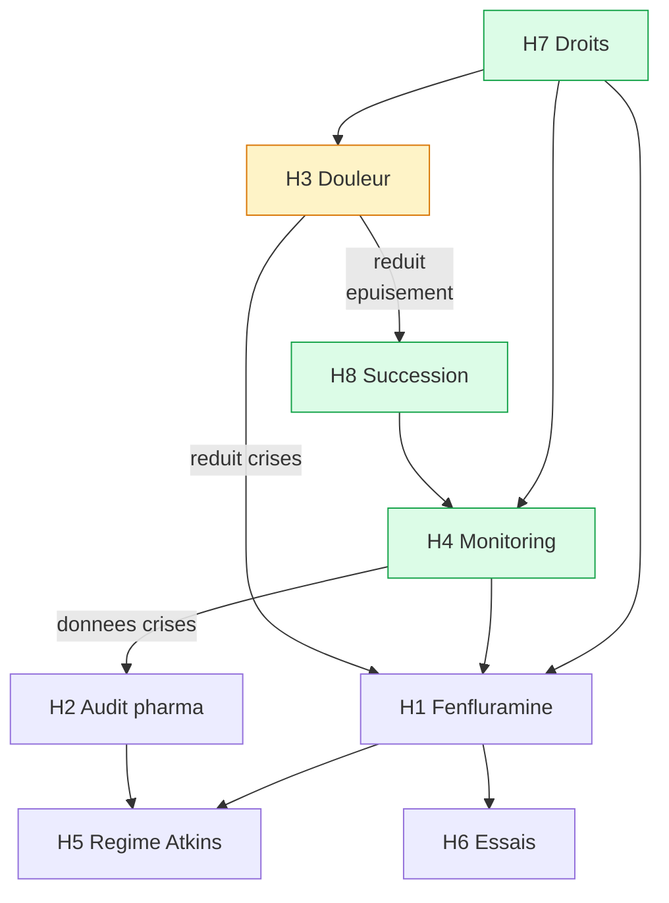

# Le Fil d'Ariane -- Introduction

## Pourquoi ce guide

Le parcours d'un adulte vivant avec le syndrome de Dravet ressemble a un labyrinthe. Des couloirs de consultations, des portes de dossiers administratifs, des croisements de traitements, des impasses de refus ou de meconnaissance. Apres des annees, on peut s'y perdre -- ou pire, cesser de chercher.

Ce guide est votre fil d'Ariane. Il ne remplace pas le labyrinthe. Mais il vous donne une direction, un premier geste a poser, un levier concret a activer quand tout semble bloque.

## A qui s'adresse ce guide

Aux familles d'adultes Dravet vivant en structure residentielle -- foyer de vie, FAM, MAS, communaute de l'Arche. Aux parents qui accompagnent leur enfant depuis des decennies et qui cherchent encore des reponses. A la fratrie qui prend le relais ou s'y prepare.

Il est aussi utile aux professionnels des structures d'accueil et aux medecins qui souhaitent comprendre la perspective familiale et les leviers d'action disponibles.

## Comment l'utiliser

Ce guide est organise en 8 hypotheses independantes. Chacune identifie un levier concret pour ameliorer la vie de votre proche. Vous n'avez pas a les lire dans l'ordre. Commencez par celle qui correspond le plus a votre situation actuelle.

Chaque hypothese contient un plan d'action avec des gestes precis : qui contacter, quoi demander, dans quel delai.

## Si vous ne faites qu'une chose

Verifiez que les contre-indications medicamenteuses Dravet (lamotrigine, carbamazepine, oxcarbazepine, phenytoine, vigabatrine) sont inscrites dans le dossier medical de votre proche, dans sa chambre, et sur une carte qu'il porte sur lui.

> **Imprimer maintenant** : l'affiche contre-indications et la fiche d'urgence sont disponibles dans la Boite a outils.

## Triage -- par quoi commencer

**Cette semaine (vital)**

- Verifier que la fiche contre-indications est dans la chambre et dans le dossier medical
- Verifier que le protocole de crise est affiche et a jour
- Verifier que le personnel de nuit sait quoi faire en cas de crise (H4)

**Ce mois (important)**

- Demander une evaluation de la douleur DESS ou FLACC-R au medecin coordonnateur (H3)
- Relire le contrat de sejour et le projet personnalise (H7)
- Prendre rendez-vous chez un notaire pour le mandat de protection future (H8)
- Consulter le neurologue sur la fenfluramine ou un audit pharmacologique (H1, H2)

**Ce trimestre (utile)**

- Explorer le regime Atkins modifie avec un dieteticien (H5)
- Verifier l'eligibilite aux essais cliniques (H6)
- Participer au CVS pour porter des preoccupations collectives (H7)
- Documenter le savoir parental par ecrit et en video (H8)

## Les 8 hypotheses en un coup d'oeil

| Hypothese | Impact potentiel | Effort | Delai avant effet | Premier geste |
|-----------|-----------------|--------|--------------------|---------------|
| **H1** Fenfluramine | Eleve (80 % repondeurs a 12 mois) | Moyen | 3-4 mois | En parler au neurologue |
| **H2** Audit pharmacologique | Moyen a eleve | Moyen | 2-3 mois | Demander des dosages plasmatiques |
| **H3** Douleur cachee | Tres eleve | Faible | Jours a semaines | Demander une evaluation DESS |
| **H4** Monitoring nocturne | Vital (prevention SUDEP) | Faible | Immediat | Verifier le dispositif actuel |
| **H5** Regime Atkins modifie | Moyen (35-55 %) | Moyen | 3 mois | Consulter un dieteticien |
| **H6** Essais cliniques | Potentiellement transformateur | Eleve | Mois a annees | Verifier le test genetique |
| **H7** Droits face a la structure | Immediat | Faible | Immediat | Relire le contrat de sejour |
| **H8** Preparer l'apres | Essentiel | Moyen | Semaines | RDV chez le notaire |

Chaque hypothese est independante. Commencez par celle qui correspond le plus a votre situation actuelle.

## Comment les hypotheses se connectent

Les 8 hypotheses ne sont pas independantes. Elles forment un systeme ou certaines sont des fondations (sans elles, les autres sont fragiles) et d'autres sont des leviers (leur effet se propage dans tout le systeme).

**Fondations (a securiser en premier) :**
- **H7** (droits) permet d'acceder a toutes les autres hypotheses. Sans connaissance de vos droits, vous ne pouvez pas exiger un traitement, un equipement ou une revision de projet.
- **H4** (monitoring) protege la vie. C'est la condition de securite minimale.
- **H8** (succession) garantit la continuite. Si les parents ne peuvent plus, tout le systeme s'effondre sans relais.

**Leviers a fort effet cascade :**
- **H3** (douleur) est le levier le plus puissant : traiter la douleur reduit les crises, ameliore le sommeil, diminue les comportements difficiles, et reduit l'epuisement de l'aidant.
- **H1** (fenfluramine) et **H2** (audit pharma) agissent directement sur les crises. Mais leur efficacite depend des donnees de crises que **H4** (monitoring) fournit.

**Complementaires :**
- **H5** (regime Atkins) et **H6** (essais cliniques) sont des options additionnelles qui se combinent avec les autres.

