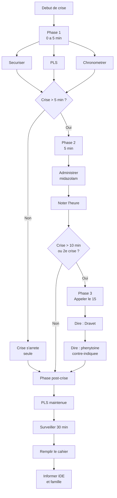

# Fiche 3 -- Protocole de crise (arbre decisionnel)

*Cette fiche decrit la conduite a tenir etape par etape lors d'une crise d'epilepsie. Le chronometrage est votre outil le plus important.*

---

## Arbre decisionnel

---

## Phase 1 : de 0 a 5 minutes -- Securiser

1. **Declencer le chronometre** immediatement (telephone, montre).
2. **Ecarter les objets dangereux** autour de la personne.
3. **Proteger la tete** (glisser un coussin ou un vetement souple sous la tete).
4. **Mettre en PLS** (Position Laterale de Securite) des que possible.
5. **Ne rien mettre dans la bouche** -- ni objet, ni doigt, ni cuillere.
6. **Ne pas retenir les membres** -- laisser la crise se derouler.

> **DANGER** : Ne jamais mettre d'objet dans la bouche et ne jamais maintenir les membres. Vous risquez de blesser la personne ou de vous blesser.

---

## Phase 2 : a 5 minutes -- Traitement de secours

Si la crise dure plus de 5 minutes :

1. **Administrer le midazolam** (Buccolam) selon le protocole individualise du resident :
   - Midazolam buccal : deposer le contenu de la seringue pre-remplie dans la joue, entre la gencive et la joue.
   - Midazolam nasal : suivre les instructions du protocole si cette voie est prescrite.
2. **Noter l'heure exacte** de l'administration.
3. **Continuer la surveillance** en PLS.

---

## Phase 3 : a 10 minutes ou en cas de 2e crise -- Appeler le 15/SAMU

Appelez le 15 si :
- La crise dure plus de 10 minutes malgre le midazolam.
- Une deuxieme crise survient sans reprise de conscience.
- La personne a du mal a respirer, presente des levres bleues (cyanose) ou ne reprend pas conscience.

**Ce que vous devez dire au SAMU :**
- "Le resident a un **syndrome de Dravet** (epilepsie genetique severe)."
- "La **phenytoine est contre-indiquee**. L'alternative est le levetiracetam IV."
- La duree de la crise et l'heure d'administration du midazolam.

---

## Phase post-crise

- **Maintenir en PLS** jusqu'au reveil complet.
- **Verifier la respiration** toutes les 5 minutes pendant au moins 30 minutes.
- **Ne pas brusquer** la personne : confusion, fatigue, parfois agitation sont normales apres une crise.
- **Parler doucement**, proposer de se reposer.
- **Remplir le cahier de crise** :

| Information | A noter |
|---|---|
| Date et heure de debut | _______ |
| Duree de la crise | _______ |
| Type (raideur, secousses, regard fixe...) | _______ |
| Contexte (fievre, fatigue, chaleur...) | _______ |
| Midazolam administre ? Heure ? | _______ |
| Appel au 15 ? | _______ |
| Etat apres la crise | _______ |

- **Informer l'infirmier(e)** et la **famille** dans les meilleurs delais.

> **A RETENIR** : Une crise qui s'arrete seule en moins de 5 minutes ne necessite pas d'appeler le 15, mais elle doit TOUJOURS etre notee dans le cahier et signalee a l'equipe soignante.
