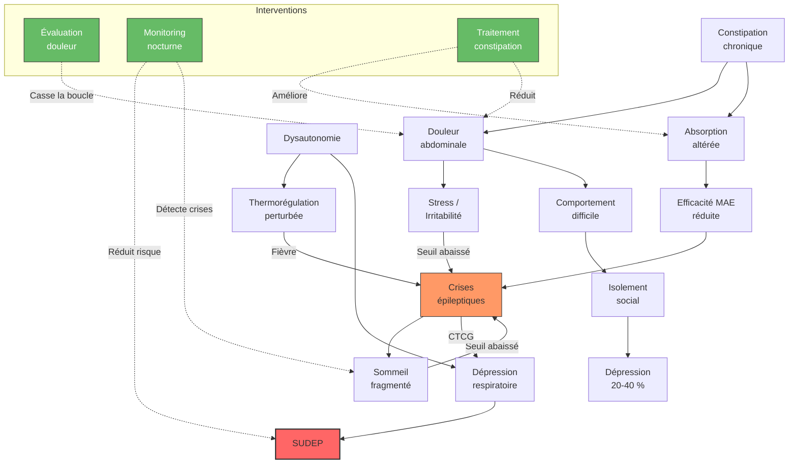

# Partie II : La Chronique d'une Maladie
## Chapitre 6 : Les Comorbidités (Le Spectre Étendu)

### 🎯 L'Essentiel (Cible : Familles & Aidants)

**Au-delà des crises : la vie avec le syndrome**
Il est fréquent de penser que le principal défi du syndrome de Dravet est de stopper les crises. Pourtant, pour beaucoup de familles, le plus grand défi quotidien réside dans ce qu'on appelle les **comorbidités**. Ce sont tous les autres troubles qui accompagnent la maladie et qui ne sont pas des crises d'épilepsie en soi.

**Les grands domaines des comorbidités :**
1.  **Le comportement et l'esprit :** L'enfant peut présenter des traits d'autisme (difficultés de communication, comportements répétitifs) ou des troubles de l'attention (hyperactivité, difficulté à se concentrer). Les troubles du comportement au sens large (agitation, impulsivité, absence de conscience du danger) touchent 60 à 80 % des enfants.
2.  **Le corps et les mouvements :** La coordination des gestes et de l'équilibre peut être perturbée — un trouble appelé **ataxie** (du grec "sans ordre", c'est-à-dire une difficulté à coordonner les mouvements) — et la marche peut devenir instable. L'ataxie est très fréquente : entre 60 et 100 % des patients selon les études. Avec la croissance, une posture de marche particulière peut apparaitre (marche en position accroupie, ou "crouch gait" en anglais), surtout à l'adolescence.
3.  **Les sens et le sommeil :** Le sommeil est très perturbé chez 60 à 80 % des patients, ce qui fatigue l'enfant et ses parents, créant un cercle vicieux avec les crises.
4.  **Le ventre et la digestion :** La **constipation** chronique est fréquente et souvent sous-diagnostiquée. Elle est liée aux médicaments (qui ralentissent le transit), au manque d'activité physique, et aux difficultés alimentaires. Elle peut provoquer des douleurs et de l'irritabilité, et perturber l'absorption des médicaments.
5.  **La déglutition :** La **dysphagie** (difficulté à avaler) touche de nombreux adultes Dravet, en particulier ceux avec une ataxie sévère et une hypotonie (faiblesse du tonus musculaire). Le risque principal est la **fausse route** : un aliment ou un liquide passe dans les voies respiratoires au lieu de l'estomac, ce qui peut provoquer une **pneumopathie d'inhalation** (infection pulmonaire grave). Les pneumopathies d'inhalation figurent parmi les premières causes de mortalité après la SUDEP. Les médicaments antiépileptiques sédatifs (benzodiazépines, valproate à forte dose) diminuent le réflexe de toux et aggravent ce risque. Les textures alimentaires doivent être adaptées (mixé, haché, eau gélifiée) selon l'évaluation d'un **orthophoniste** spécialisé en déglutition. La position assise droite pendant le repas et pendant 30 minutes après est essentielle pour réduire le risque de fausse route.
6.  **Le système nerveux autonome :** Le **système nerveux autonome** (la partie du système nerveux qui contrôle les fonctions "automatiques" du corps comme le rythme cardiaque, la respiration et la température) peut être perturbé. On parle de **dysautonomie**. Cela contribue aux problèmes de régulation de la température et au risque de complications cardiaques.

**Un risque grave à connaitre : la SUDEP**
Il est important de mentionner ici l'existence de la **SUDEP** (Sudden Unexpected Death in Epilepsy, ou mort subite inattendue liée à l'épilepsie). C'est une complication rare mais grave, dans laquelle une personne épileptique décède soudainement sans cause identifiable. Le syndrome de Dravet fait partie des épilepsies où ce risque est le plus élevé. Ce sujet est traité en détail au chapitre 9 ; il est mentionné ici car il représente la complication la plus sévère liée aux crises.

**Pourquoi est-ce important ?**
Parce que traiter uniquement les crises ne suffit pas à améliorer la qualité de vie. Si un enfant a des crises rares mais qu'il ne peut pas communiquer ou qu'il ne dort jamais, sa vie reste très difficile. L'objectif est donc une prise en charge globale.

**Reconnaître la douleur quand les mots manquent**
Quand votre proche ne peut pas parler ou a un langage très limité, comment savoir s'il a mal ? C'est l'une des questions les plus difficiles pour les familles et les soignants. Pourtant, la douleur est fréquente : elle touche environ 70 % des personnes avec une déficience intellectuelle sévère, mais moins de 30 % de ces douleurs sont repérées et traitées. La douleur chronique abaisse le seuil de déclenchement des crises (voir le chapitre 9 sur le protocole d'urgence et la prévention de la SUDEP).

*Quels signes observer ?*
*   **Changement de comportement** : une agitation inhabituelle, un repli soudain (la personne qui participait ne participe plus), un refus de manger, des cris, de l'auto-agression (se frapper, se mordre, se griffer). Ces comportements ne sont pas des "caprices" — ils sont souvent le seul moyen d'exprimer une souffrance.
*   **Postures inhabituelles** : se recroqueviller, se tenir le ventre, garder une position rigide, refuser de s'asseoir ou de se coucher.
*   **Grimaces et expressions faciales** : froncement des sourcils, crispation du visage, mâchoire serrée.
*   **Modifications du sommeil et de l'appétit** : un sommeil plus agité ou au contraire une somnolence excessive, un refus de manger qui s'installe.

*Des outils existent.* Le médecin peut utiliser des échelles d'évaluation de la douleur spécialement conçues pour les personnes qui ne peuvent pas s'exprimer verbalement. Ces grilles codifient les comportements observables (expressions du visage, postures, vocalisations) et permettent de chiffrer l'intensité de la douleur. Demandez au médecin d'évaluer systématiquement la douleur à chaque consultation — pas seulement quand vous suspectez un problème, mais de manière routinière.

*Le "profil personnel de douleur".* Vous connaissez votre proche mieux que quiconque. Prenez le temps de décrire, avec l'équipe soignante, comment il exprime habituellement la douleur : tel geste, telle vocalisation, telle posture. Ce document — appelé profil personnel de douleur — sera précieux pour tout nouveau soignant ou lors d'une hospitalisation.

**À retenir :**
*   La maladie est "multidimensionnelle" (elle touche plusieurs aspects de la vie).
*   Les troubles du comportement (60-80 %), du sommeil (60-80 %) et de la motricité (60-100 %) sont aussi importants que les crises.
*   La constipation et la dysautonomie sont des problèmes fréquents mais souvent négligés.
*   La dysphagie (difficulté à avaler) expose au risque de fausse route et de pneumopathie d'inhalation -- une cause majeure de mortalité après la SUDEP. Une évaluation orthophonique et l'adaptation des textures sont indispensables.
*   La douleur est massivement sous-détectée chez les personnes non-verbales — observez les changements de comportement.
*   La SUDEP est un risque grave qui justifie la surveillance nocturne (voir chapitre 9).
*   Chaque trouble nécessite une aide spécifique (orthophoniste, psychologue, kinésithérapeute).

---

### 🩺 Le Protocole (Cible : Corps Médical)

**Le concept de comorbidité dans l'encéphalopathie épileptique**
Dans le syndrome de Dravet, les comorbidités ne sont pas des pathologies associées fortuites, mais des conséquences directes de la perturbation du développement cérébral et de l'activité épileptique chronique [Villas et al., 2017].

**1. Le Spectre Neurodéveloppemental (TSA et TDAH)**
Une prévalence élevée de **Troubles du Spectre de l'Autisme (TSA)** (20-50 %) et de **Troubles du Déficit de l'Attention avec ou sans Hyperactivité (TDAH)** (20-40 %) est documentée [Li et al., 2011 ; Villas et al., 2017].
*   **Mécanisme :** La désorganisation des circuits synaptiques (défaut d'inhibition GABAergique) perturbe la connectivité fonctionnelle nécessaire aux fonctions exécutives et sociales.
*   **Évaluation :** Utilisation d'échelles standardisées (ADOS-2, ADI-R) pour le TSA et de tests attentionnels. Dépistage recommandé entre 2 et 4 ans (M-CHAT-R/F).

**2. Troubles du Comportement**
Les troubles du comportement constituent l'une des préoccupations majeures des familles. Campbell et al. (2018) et Lagae et al. (2018) rapportent que 60 à 80 % des patients présentent des troubles comportementaux significatifs.
*   **Profil :** Absence de conscience du danger (60-80 %), hyperactivité/impulsivité (25-40 %), comportements stéréotypés (30-50 %), comportements auto-agressifs (15-30 %), irritabilité (20-35 %).
*   **Traits positifs :** Les patients Dravet sont fréquemment décrits comme sociables, affectueux et persévérants, conservant un intérêt social et une réactivité émotionnelle positive.
*   **Évolution :** L'hyperactivité tend à diminuer à l'adolescence ; l'inertie comportementale et le repli sur soi peuvent émerger.

**3. Troubles de la Motricité et de l'Équilibre**
L'ataxie cérébelleuse est une comorbidité majeure, touchant 60 à 100 % des patients [Rodda et al., 2012].
*   **Manifestations :** Dysmétrie, instabilité posturale, troubles de la marche, dyspraxie (50-70 %).
*   **Crouch gait :** Déformation posturale caractéristique (marche accroupie avec flexion des hanches et des genoux), observée chez 50-60 % des adolescents et adultes [Rodda et al., 2012]. Ce phénomène est multifactoriel (ataxie, spasticité, adaptations compensatoires) et peut s'aggraver progressivement.
*   **Impact :** Augmentation du risque de traumatismes liés aux chutes (souvent liées aux crises atoniques).

**4. Troubles du Sommeil et de la Régulation**
Les troubles du sommeil (insomnie de maintien, apnées obstructives, fragmentation) sont extrêmement fréquents (60-80 %) [Licheni et al., 2018].
*   **Architecture du sommeil :** Réduction du sommeil lent profond (stades N3), fragmentation du sommeil paradoxal (REM), crises infracliniques nocturnes.
*   **Cercle vicieux :** Le manque de sommeil abaisse le seuil épileptogène, augmentant la fréquence des crises, qui elles-mêmes fragmentent le sommeil.

**5. Dysautonomie**
Le dysfonctionnement du système nerveux autonome est documenté dans le syndrome de Dravet. Nav1.1 est exprimé dans les circuits autonomes cardiaques et respiratoires.
*   **Manifestations :** Variabilité de la fréquence cardiaque réduite (Delogu et al., 2011), troubles de la régulation thermique, anomalies de la sudation.
*   **Lien avec la SUDEP :** La dysautonomie contribue au risque de SUDEP par le biais d'arythmies post-critiques et de dépression respiratoire (voir chapitre 9 pour le détail).

**6. Troubles gastro-intestinaux et constipation**
La **constipation chronique** est une comorbidité fréquente mais souvent sous-estimée. Elle résulte de la convergence de plusieurs facteurs :
*   **Effets iatrogènes** (liés aux médicaments) : le valproate, le stiripentol et le clobazam ralentissent le transit intestinal. L'association stiripentol + valproate majore cet effet.
*   **Mobilité réduite** : l'ataxie et la sédation médicamenteuse limitent l'activité physique, facteur aggravant de la constipation.
*   **Troubles de la déglutition et de l'alimentation** : les difficultés à mastiquer et à avaler réduisent l'apport en fibres et en liquides.
*   **Cercle vicieux :** La constipation sévère peut entraîner des douleurs abdominales et une irritabilité, qui elles-mêmes abaissent le seuil de tolérance aux crises. Par ailleurs, une constipation importante peut altérer l'absorption des antiépileptiques, réduisant leur efficacité.

**7. Évaluation de la douleur chez l'adulte non-communicant**

La douleur est massivement sous-détectée chez les personnes avec déficience intellectuelle sévère : moins de 30 % des douleurs sont identifiées et traitées [HandiConnect]. La douleur chronique affecte environ 70 % des personnes avec DI (fourchette 38-89 % selon les études), un taux considérablement supérieur à la population générale.

*Signal d'alerte cardinal :* tout changement brutal du comportement basal d'une personne non-communicante doit faire suspecter une douleur jusqu'à preuve du contraire. Les manifestations incluent : grimaces, cris, prostration, positions antalgiques, agressivité soudaine, retrait social, perte d'appétit, troubles du sommeil, exacerbation des crises, spasticité musculaire.

*Échelles validées — tableau comparatif :*

| Échelle | Items | Population | Spécificité | Connaissance préalable |
| :--- | :--- | :--- | :--- | :--- |
| **DESS** (San Salvadour) | 10 | Polyhandicap, tous âges | Modifications des signes neurologiques habituels comme indicateurs de douleur, validée en français | Oui |
| **GED-DI** / NCCPC-R | 26 | DI, TSA, polyhandicap | Meilleures propriétés psychométriques pour douleur aiguë ou chronique (alpha de Cronbach = 0,93) | Non |
| **FLACC-R** | 5 | Polyhandicap | Rapide (visage, jambes, activité, cris, consolabilité), adaptée aux situations aiguës | Oui |
| **Doloplus-2** | 10 | Personne âgée non-communicante | 3 dimensions (somatique, psychomotrice, psychosociale), sensible au changement | Non |
| **EDAAP** | 11 | Adultes polyhandicapés | Inspirée de DESS et Doloplus, spécifique au polyhandicap adulte | Oui |

*Protocole d'évaluation systématique :*
*   Évaluer la douleur à **chaque consultation médicale**, à **chaque changement de comportement inexpliqué**, et de manière **programmée** (au minimum 1 fois par mois en structure résidentielle).
*   Hiérarchie d'évaluation : 1) tenter l'auto-évaluation si possible, 2) rechercher les causes potentielles (constipation, caries, otite, fracture, reflux), 3) observer les comportements avec une échelle validée, 4) recueillir l'avis des proches/soignants connaissant la personne, 5) en cas de doute persistant, tenter un essai thérapeutique antalgique.
*   Établir un **profil personnel de douleur** pour chaque résident : document décrivant les modes d'expression habituels de la douleur propres à la personne (grimaces spécifiques, vocalisations, postures), permettant le repérage par tout soignant, y compris ceux ne connaissant pas la personne.

**8. Constipation chronique : un problème sous-estimé**

*Prévalence.* La constipation est l'une des comorbidités les plus fréquentes et les plus négligées. La prévalence atteint jusqu'à 94 % chez les adultes avec DI sévère sous antiépileptiques et présentant une déficience motrice. Plus de 25 % des patients avec DI reçoivent des prescriptions répétées de laxatifs chaque année (contre 0,1 % dans la population sans DI). 41 % des admissions hospitalières pour constipation concernent des patients sous antiépileptiques.

*Cercle vicieux constipation-crises.* La constipation sévère entraîne des douleurs abdominales, source d'irritabilité et de stress, qui abaissent le seuil épileptogène et augmentent la fréquence des crises. Par ailleurs, une constipation importante peut altérer l'absorption des antiépileptiques par voie orale, réduisant leur efficacité. Attention : des selles liquides ou solides retrouvées dans la protection n'excluent pas une constipation (faux transit par débordement).

*Protocole de prise en charge par paliers :*

| Palier | Actions |
| :--- | :--- |
| **1 - Optimiser** | Dépister/traiter l'hypothyroïdie, revoir la liste des médicaments, minimiser les agents constipants (valproate, stiripentol, clobazam, antipsychotiques) |
| **2 - Hygiène de vie** | Augmenter les fibres (fruits et légumes entiers), activité physique quotidienne, hydratation (minimum 1,5 L/jour), routines de toilettes après les repas (réflexe gastrocolique) |
| **3 - Laxatifs** | Laxatifs osmotiques en première intention (macrogol/PEG) en usage régulier, laxatifs stimulants en "sauvetage" uniquement |
| **4 - Escalade** | Si inefficace : consultation gastro-entérologique, désimpaction manuelle si fécalome, envisager lubiprostone ou linaclotide |

*Surveillance en structure :* suivi du transit au minimum hebdomadaire (fréquence, consistance selon l'échelle de Bristol), notation sur la fiche de suivi du résident, bilan sanguin régulier incluant le bilan thyroïdien.

*Conséquences graves si non traitée :* fécalome et occlusion intestinale, perforation intestinale et péritonite stercorale (potentiellement fatale), troubles du comportement secondaires à l'inconfort, prolapsus des organes pelviens.

**9. Dysphagie et risque de fausse route**

La **dysphagie** (difficulté à avaler) est une comorbidité sous-évaluée mais cliniquement significative chez l'adulte Dravet. Sa prévalence n'est pas spécifiquement étudiée dans le syndrome de Dravet, mais les facteurs de risque convergent : hypotonie oropharyngée liée à l'atteinte neurologique, ataxie cérébelleuse affectant la coordination de la déglutition, sédation médicamenteuse chronique, et crises péri-prandiales.

*Facteurs aggravants iatrogènes :* les antiépileptiques les plus à risque de sédation impactant la déglutition sont le clobazam, le phénobarbital et le valproate à forte dose. L'association de plusieurs molécules sédatives majore l'effet dépresseur sur le réflexe de toux et la coordination pharyngée.

*Évaluation :* le bilan orthophonique de la déglutition constitue le premier pas. L'évaluation de référence repose sur la vidéofluoroscopie (VFSS) ou la fibroscopie de la déglutition (FEES). La classification IDDSI (International Dysphagia Diet Standardisation Initiative) standardise les textures alimentaires et les niveaux d'épaississement des liquides.

*Conséquences cliniques :* les pneumopathies d'inhalation représentent une cause significative de mortalité et de morbidité dans les encéphalopathies épileptiques sévères, se classant parmi les premières causes de décès après la SUDEP. Le risque est majoré en période post-critique (hypotonie transitoire, confusion) et pendant les repas suivant une crise.

**10. Dépression et troubles psychiatriques chez l'adulte non-verbal**

*Prévalence.* Les troubles psychiatriques touchent 30 à 50 % des personnes avec DI, soit un risque 3 à 4 fois supérieur à la population générale. Chez l'adulte Dravet spécifiquement, la dépression affecte 20 à 40 % des patients et l'anxiété 30 à 50 %.

*Reconnaître la dépression sans les mots.* Chez une personne non-verbale, la dépression ne se manifeste pas par une "tristesse verbalisée" mais par des changements comportementaux :
*   Perte d'intérêt pour les activités habituellement appréciées (atelier, sortie, musique).
*   Retrait social et apathie (la personne qui interagissait ne le fait plus).
*   Troubles du sommeil (insomnie ou hypersomnie).
*   Modifications de l'appétit (refus alimentaire ou au contraire hyperphagie).
*   Auto-agression (se frapper, se mordre) ou augmentation de l'irritabilité.
*   Régression des compétences acquises.

*Outils d'évaluation adaptés :*
*   **PAS-ADD Checklist** (Psychiatric Assessment Schedule for Adults with Developmental Disabilities) : 29 items symptomatiques + liste d'événements de vie, 3 scores-seuils. Version française validée [Gerber et al., 2013]. Utilisable par les familles et les équipes non spécialistes.
*   **DBC-A** (Developmental Behaviour Checklist - Adult) : 107 items, 6 facteurs dont "Dépression" et "Repli sur soi".
*   **ABC-C** (Aberrant Behavior Checklist - Community) : quantification des comportements-problèmes.

*Traitement pharmacologique :* les ISRS (inhibiteurs sélectifs de la recapture de la sérotonine) constituent le traitement de première intention. La sertraline est généralement bien tolérée et présente un faible risque d'abaissement du seuil épileptogène. Vigilance sur l'interaction fluoxétine/stiripentol (compétition sur le CYP2D6 — l'enzyme hépatique qui métabolise les deux molécules). Introduire à faible dose et titrer lentement. Si un antipsychotique est nécessaire, préférer la quétiapine ou l'aripiprazole (moindre abaissement du seuil épileptogène que les autres antipsychotiques).

#### 📊 Réseau des comorbidités et boucles de rétroaction (Mermaid)

Ce réseau montre que les comorbidités ne sont pas indépendantes les unes des autres, mais forment des boucles qui s'entretiennent mutuellement. Traiter la constipation, par exemple, peut améliorer l'absorption des médicaments ET réduire la douleur abdominale, ce qui diminue le stress et abaisse la fréquence des crises. De même, le monitoring nocturne agit simultanément sur le risque de SUDEP et sur la détection des crises qui fragmentent le sommeil. Identifier et traiter la douleur chez une personne non-verbale permet de casser la chaîne douleur, comportement difficile, isolement et dépression.

---

### 🤝 L'Accompagnement (Cible : Structures d'accueil & Éducateurs)

**Une approche multidimensionnelle de l'enfant**
L'enfant n'est pas "un enfant épileptique", c'est un enfant qui a des besoins variés. Votre rôle est d'ajuster l'environnement à ses difficultés spécifiques, au-delà de la gestion des crises.

**Stratégies par domaine :**

*   **Communication (TSA/Langage) :** 
    *   Ne pas se contenter de la parole. Utilisez des supports visuels systématiques.
    *   Soyez prévisible : les changements de routine peuvent être très anxiogènes pour un enfant avec des traits autistiques.

*   **Mouvement (Ataxie/Motricité) :** 
    *   Sécurisez les parcours de déplacement.
    *   Encouragez l'autonomie motrice sans mettre en danger la stabilité de l'enfant.

*   **Gestion de la fatigue (Sommeil/Attention) :**
    *   Respectez les rythmes biologiques. Un enfant fatigué est un enfant à risque de crise et d'irritabilité.
    *   Proposez des "zones de calme" ou des temps de décompression sensorielle dans la journée.

*   **Alimentation et transit :**
    *   La constipation est fréquente et souvent liée aux médicaments. Veillez à un apport suffisant en eau et en fibres (fruits, légumes, céréales complètes).
    *   Notez la régularité du transit et signalez tout changement aux parents ou au médecin : une constipation sévère peut affecter l'absorption des médicaments et provoquer de l'irritabilité.

*   **Déglutition et prévention des fausses routes :**
    *   Observez les signes de dysphagie au quotidien : toux pendant ou après les repas, voix "mouillée" ou gargouillante après la déglutition, durée des repas anormalement longue, refus de certaines textures, résidus alimentaires restant en bouche, perte de poids inexpliquée.
    *   Adaptez les textures alimentaires **uniquement** selon les recommandations de l'orthophoniste (ne pas décider seul de mixer ou d'épaissir).
    *   Posture pendant les repas : assis à 90 degrés, menton légèrement fléchi vers l'avant (position de protection des voies aériennes). Maintenir cette position assise pendant au moins 30 minutes après le repas.
    *   Environnement calme pendant les repas : réduire les stimulations (télévision, bruit, agitation) qui détournent l'attention et augmentent le risque de fausse route.
    *   Ne jamais forcer l'alimentation. Si la personne refuse de manger ou tousse de manière répétée, interrompre le repas et signaler la situation.
    *   Transmission : noter les textures tolérées et les difficultés observées dans le dossier du résident et sur la fiche chambre, afin que chaque professionnel (y compris les remplaçants) dispose de l'information.

*   **Sécurité face aux comportements à risque :**
    *   L'absence de conscience du danger est quasi-universelle dans le syndrome de Dravet (60-80 % des patients). L'enfant peut ne pas percevoir les situations dangereuses (escaliers, points d'eau, routes). Une sécurisation active de l'environnement (verrous, barrières, surveillance des accès) est indispensable.
    *   L'impulsivité peut entrainer des gestes brusques ; prévenez plutôt que de réagir.

*   **Vigilance à la posture et à la marche :**
    *   Chez les adolescents, une **marche accroupie** ("crouch gait" en anglais, c'est-à-dire une posture de marche avec les genoux et les hanches fléchis) peut apparaitre. Signalez toute modification de la posture ou de la démarche au kinésithérapeute et aux parents.

*   **Dysautonomie et régulation thermique :**
    *   La **dysautonomie** (dysfonctionnement du système nerveux qui contrôle les fonctions automatiques du corps) peut se manifester par une mauvaise régulation de la température. Soyez attentifs aux signes de surchauffe ou de refroidissement excessif.

**Grille d'observation quotidienne en structure**

En tant que professionnel accompagnant un résident Dravet, vous êtes les yeux et les oreilles de l'équipe médicale. La qualité de vos observations détermine la qualité des décisions de soins. Voici ce qu'il faut noter chaque jour :

*   **Transit** : date de la dernière selle, consistance (dure, molle, liquide), présence de douleur abdominale apparente (se tient le ventre, grimaces lors du passage aux toilettes). Une absence de selles pendant plus de 3 jours doit être signalée au médecin. Attention : des selles liquides dans la protection n'excluent pas une constipation sévère (c'est un débordement autour d'un bouchon de selles dures).
*   **Alimentation et déglutition** : quantité ingérée (tout / la moitié / presque rien), refus alimentaire (depuis quand ?), difficultés de déglutition observées (toux pendant le repas, voix mouillée après avoir avalé, aliments qui "restent en bouche", bavage excessif, durée du repas anormalement longue). Le refus de manger peut être un signe de douleur, de nausée, de dépression, ou de dysphagie qui s'aggrave. Noter si les textures prescrites par l'orthophoniste sont respectées.
*   **Comportement** : agitation inhabituelle, repli ou retrait (ne participe plus aux activités), auto-agression (se frapper, se mordre, se griffer — notez la localisation et la fréquence), qualité du sommeil (endormissement, réveils, agitation nocturne).
*   **Crises d'épilepsie** : heure de début, durée, type de crise observée (raidissement puis secousses = tonico-clonique, absence de réaction = absence, chute brutale = atonique), déclencheur possible identifié (fièvre, chaleur, fatigue, émotion forte), traitement d'urgence administré (oui/non, heure, dose).
*   **Douleur** : localisation suspectée (ventre, tête, membres, dents), intensité estimée (la personne continue ses activités ou est prostré ?), postures antalgiques observées, grimaces.

*Pourquoi cette grille est essentielle.* Ce relevé quotidien sert directement au médecin pour :
*   Repérer une constipation qui s'installe avant qu'elle ne devienne un fécalome (bouchon de selles durcies pouvant nécessiter une intervention médicale).
*   Détecter un changement de fréquence des crises qui pourrait justifier une réévaluation du traitement.
*   Identifier un épisode dépressif avant qu'il ne s'aggrave.
*   Documenter un lien entre une douleur et une augmentation des crises.

Transmettez cette grille à l'équipe de nuit à chaque relève, et au médecin à chaque visite ou consultation. Un problème noté mais non transmis est un problème non traité.

**Observation pour l'équipe médicale :**
Soyez attentifs aux changements subtils qui ne sont pas des crises : une augmentation de l'agitation, un retrait social plus marqué, ou une modification du **tonus musculaire** (la tension naturelle qui maintient les muscles en état de fonctionnement — un tonus trop faible rend l'enfant "mou", un tonus trop élevé le rend raide). Ces informations sont cruciales pour ajuster les traitements non-antiépileptiques.

**Mention importante : la SUDEP**
La **SUDEP** (mort subite inattendue liée à l'épilepsie) est un risque grave dans le syndrome de Dravet. En tant que professionnel, votre rôle est d'assurer une surveillance rigoureuse, notamment pendant les temps de repos et de sieste. Si un moniteur de crises nocturne est en place, veillez à son bon fonctionnement. Le chapitre 9 détaille ce sujet et les mesures de prévention.

---

### 💡 Le Point de Liaison (Synthèse)

| Domaine | Famille | Médical | Professionnel |
| :--- | :--- | :--- | :--- |
| **Comportement (60-80 %)** | Gérer l'agitation, l'absence de conscience du danger | Diagnostic TSA (20-50 %) / TDAH (20-40 %), évaluation comportementale | Sécurisation active, routine et supports visuels |
| **Mouvement (60-100 %)** | Sécuriser la maison, surveiller la posture | Évaluation ataxie, suivi crouch gait, kinésithérapie | Aménagement de l'espace, signaler les changements posturaux |
| **Sommeil (60-80 %)** | Gérer la fatigue globale | Polysomnographie, mélatonine, ajustement MAE | Respecter les temps de repos |
| **Douleur non-verbale** | Observer les changements de comportement, demander l'évaluation systématique | Échelles validées (DESS, GED-DI, FLACC-R), profil personnel de douleur, évaluation mensuelle en structure | Grille d'observation quotidienne, noter postures et grimaces, transmettre au médecin |
| **Constipation** | Hydratation et fibres, signaler le refus alimentaire | Prévalence jusqu'à 94 % sous antiépileptiques, protocole par paliers (macrogol), suivi hebdomadaire du transit | Noter la régularité du transit, alerter si > 3 jours sans selle, attention au faux transit |
| **Dysphagie** | Textures adaptées sur avis orthophoniste, position assise 30 min après repas | Bilan orthophonique, VFSS/FEES, classification IDDSI, vigilance sédation médicamenteuse | Observer toux/voix mouillée au repas, ne pas décider seul des textures, environnement calme, fiche chambre |
| **Dysautonomie** | Surveiller la température | Évaluation cardiaque, variabilité FC | Prévenir surchauffe et refroidissement |
| **SUDEP** | Surveillance nocturne, moniteur de crises | Prévention, information aux familles (voir ch. 9) | Surveillance pendant siestes et repos |

***

> **Pour passer a l'action** : Fil d'Ariane, Hypothese H3 — Chercher la douleur cachée (plan d'action, évaluation DESS, profil de douleur)