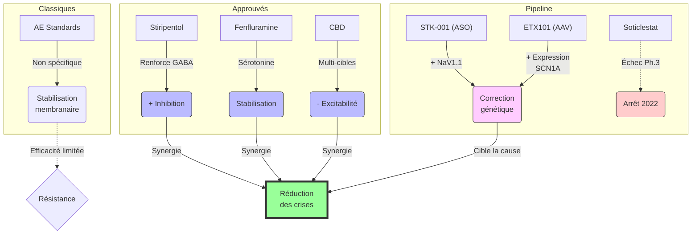
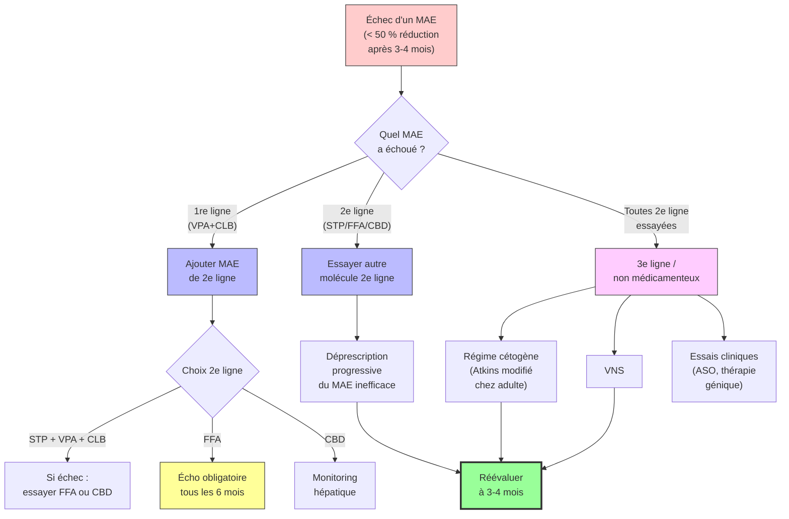

# Partie III : L'Arsenal Thérapeutique
## Chapitre 8 : La Révolution Moléculaire (Traitements Ciblés)

### 🎯 L'Essentiel (Cible : Familles & Aidants)

**L'espoir d'une nouvelle ère**
Pendant longtemps, nous n'avions que des médicaments "généraux" qui essayaient de calmer tout le cerveau. Aujourd'hui, la science progresse vers des traitements beaucoup plus précis, conçus spécifiquement pour agir sur les mécanismes défaillants du syndrome de Dravet.

**Les nouveaux alliés : Fenfluramine et Stiripentol**
Ces médicaments ne sont pas de simples antiépileptiques classiques. Ils agissent de manière complémentaire pour "réparer" ou compenser le manque d'inhibition :
*   **Le Stiripentol :** Il aide à augmenter l'effet du GABA (le "frein" naturel du cerveau dont nous avons parlé au chapitre 1).
*   **La Fenfluramine :** Elle agit sur la **sérotonine**, un messager chimique du cerveau qui influence l'humeur et l'activité électrique. En stimulant certains de ses récepteurs (des "capteurs" à la surface des neurones), elle stabilise les circuits cérébraux et réduit drastiquement la fréquence des crises.
*   **Le Cannabidiol (CBD) :** Utilisé sous forme médicale stricte (différent du cannabis récréatif), il aide à réduire la suractivité électrique du cerveau.

**Ce que cela change concrètement**
Ces traitements ne guérissent pas la mutation génétique, mais ils peuvent réduire le nombre de crises de manière spectaculaire (parfois de plus de 50% ou 70%). Pour une famille, cela signifie moins d'urgences, moins de peur et potentiellement une meilleure qualité de vie pour l'enfant.

**Les résultats en chiffres**
Les études scientifiques rigoureuses (des essais comparant le médicament à un "faux" traitement, appelé placebo, pour être sûr que l'effet est réel) montrent des résultats encourageants :
*   **Stiripentol** : 71% des enfants ont vu leurs crises réduites de moitié ou plus, contre 5% avec le placebo.
*   **Fenfluramine** : réduction d'environ 75% du nombre de crises à la dose optimale, 68% de répondeurs. Important : ce traitement nécessite un **examen du coeur par échographie** (un examen indolore par ultrasons) tous les 6 mois, car la molécule peut théoriquement affecter les valves cardiaques.
*   **CBD médical** : réduction d'environ 39 à 49% des crises selon les études. L'effet se maintient sur au moins 2 ans.

**Et demain ? La recherche avance**
La science explore maintenant des traitements qui s'attaquent directement à la cause génétique du syndrome de Dravet, et non plus seulement à ses conséquences :
*   **Les oligonucléotides antisens (ASO)** : ce sont de petites molécules fabriquées en laboratoire, capables de "corriger" la lecture du gène défaillant pour que le cerveau produise davantage de la protéine manquante (NaV1.1). Le traitement STK-001 est actuellement en Phase 2 d'essai clinique (c'est-à-dire testé sur un groupe de patients pour vérifier son efficacité).
*   **La thérapie génique (ETX101)** : un virus inoffensif, modifié en laboratoire, est utilisé comme "transporteur" pour apporter une instruction génétique au cerveau, afin de stimuler la production de la protéine manquante. Ce traitement, administré en une seule fois, est en Phase 1/2 (stade précoce).
*   **Le soticlestat** : cette molécule, qui visait à réduire une substance excitant les neurones, n'a malheureusement **pas montré d'efficacité suffisante** lors de son essai avancé (interrompu en 2022). C'est un rappel que la recherche progresse aussi par ses échecs, qui permettent de mieux comprendre la maladie.

**Quand un traitement ne fonctionne pas**

Il arrive qu'un médicament prescrit avec espoir ne donne pas les résultats attendus. Si cela vous concerne, sachez une chose essentielle : **c'est fréquent, et ce n'est la faute de personne.**

Prenons l'exemple du CBD médical (cannabidiol) : les études montrent que **plus d'un patient sur deux** (51 à 57 %) ne voit pas ses crises diminuer de moitié avec ce traitement. Ce n'est pas un cas isolé -- c'est la réalité statistique. Le CBD est le traitement ciblé qui compte le plus de non-répondeurs (personnes pour lesquelles le médicament n'atteint pas le seuil d'efficacité attendu).

Mais ne pas répondre à un traitement **ne signifie pas être condamné à ne répondre à rien**. D'autres molécules ont des taux d'efficacité bien supérieurs :
*   **La fenfluramine** : environ 68 à 73 % des patients y répondent, y compris des adultes. Une étude portant sur 24 adultes (18-46 ans) a montré que 80 % d'entre eux répondaient favorablement après 12 mois de traitement. C'est une option encore sous-utilisée chez l'adulte. (Rappel : ce traitement nécessite une surveillance cardiaque par échographie tous les 6 mois.)
*   **Le stiripentol** : environ 67 à 71 % de répondeurs dans les études, particulièrement efficace en association avec le valproate et le clobazam.
*   **Le régime cétogène** (un régime alimentaire très particulier, riche en graisses et pauvre en sucres, qui modifie le fonctionnement du cerveau) : efficace chez environ 50 à 73 % des patients selon la durée. Chez l'adulte, une version simplifiée appelée "régime Atkins modifié" est plus facile à suivre au quotidien.
*   **La stimulation du nerf vague (VNS)** (un petit appareil implanté sous la peau qui envoie des impulsions électriques régulières au cerveau via un nerf du cou) : environ 54 % de répondeurs, avec des bénéfices qui se maintiennent sur le long terme.

**Combien de temps faut-il attendre avant de conclure qu'un traitement ne fonctionne pas ?** Les spécialistes recommandent en général d'attendre **3 à 4 mois** à la dose optimale avant de tirer des conclusions. L'effet de la plupart des molécules apparaît dans les 6 à 7 premières semaines.

**La fatigue thérapeutique est réelle.** Après des années d'essais successifs -- des espoirs, des ajustements de doses, des effets secondaires à gérer, des déceptions -- il est normal de se sentir épuisé. Les études montrent que 84 % des aidants rapportent de la fatigue et 60 % une détérioration de leur santé mentale. Ce n'est pas un aveu de faiblesse : c'est la conséquence logique d'un parcours extrêmement exigeant.

Si vous en êtes là, sachez qu'il est parfaitement légitime de :
*   Demander au neurologue une **réévaluation complète** du traitement : chez un adulte stable, il est parfois possible de simplifier la polythérapie (combinaison de plusieurs médicaments) en retirant les molécules les moins utiles.
*   Décider de **ne pas essayer un nouveau traitement** tout de suite, pour souffler.
*   Revoir les **objectifs** : le bon traitement est celui qui offre le meilleur équilibre entre réduction des crises et qualité de vie -- pas forcément zéro crise. Le consensus international reconnaît que des crises brèves et peu fréquentes sont un objectif acceptable, l'essentiel étant d'éviter les crises prolongées et les états de mal épileptique (crises qui ne s'arrêtent pas d'elles-mêmes et nécessitent une intervention d'urgence).

**À retenir :**
*   On passe d'une médecine "générale" à une médecine "de précision", et bientôt potentiellement à une médecine "réparatrice".
*   Ces traitements sont souvent ajoutés en complément des anciens (polythérapie).
*   Leur accès peut être complexe et nécessite un suivi médical très spécialisé.
*   Les thérapies géniques sont encore expérimentales : elles représentent un espoir réel mais ne sont pas encore disponibles en routine.
*   Ne pas répondre à un traitement est fréquent (plus d'un patient sur deux pour le CBD) et ne signifie pas l'absence de solutions.

---

### 🩺 Le Protocole (Cible : Corps Médical)

**Médecine de Précision et Modulation Synaptique**
L'évolution thérapeutique du syndrome de Dravet marque le passage d'une approche purement symptomatique à une approche ciblant les voies de signalisation spécifiques altérées par la mutation *SCN1A* [Chiron et al., 2000 ; Lagae et al., 2019].

**1. Le Stiripentol (ST) : Modulation GABAergique**
Le stiripentol agit comme un modulateur allostérique positif des récepteurs GABA-A. 
*   **Mécanisme :** Il augmente l'efficacité de la transmission inhibitrice, compensant ainsi le déficit d'activité des interneurones PV+ défaillants. Le stiripentol est également un puissant inhibiteur enzymatique (CYP3A4, CYP1A2, CYP2C19, CYP2D6), augmentant les taux plasmatiques de clobazam et de valproate, ce qui contribue à son efficacité clinique.
*   **Synergie :** Son efficacité est maximale lorsqu'il est utilisé en association avec le clobazam et le valproate, créant un effet de synergie sur l'inhibition synaptique.
*   **Données RCT (STICLO)** [Chiron et al., 2000] **:** Essai randomisé en double aveugle (n=41, enfants sous VPA + CLB). Résultats : **71% de répondeurs** (réduction >= 50% des crises) dans le groupe stiripentol vs 5% sous placebo (p < 0.001). 43% des patients stiripentol ont atteint une absence totale de crises cloniques ou tonico-cloniques pendant le deuxième mois. Ces résultats ont été confirmés par une étude italienne et une méta-analyse Cochrane (Kassaï et al., 2008 : OR = 32.0, IC 95% : 5.2-196.5). Le suivi ouvert à long terme (> 15 ans) montre un maintien de l'efficacité.

**2. La Fenfluramine (FEN) : Voie Sérotoninergique**
La fenfluramine représente une avancée majeure par son mécanisme d'action distinct des antiépileptiques classiques.
*   **Mécanisme :** Elle agit comme un agoniste sélectif des récepteurs de la sérotonine (notamment 5-HT₂B et 5-HT₂C). Cette modulation sérotoninergique semble stabiliser l'excitabilité corticale et réduire la propagation des décharges épileptiques.
*   **Données RCT (étude 1504)** [Lagae et al., 2019] **:** Essai randomisé en double aveugle (n=119, patients 2-18 ans). Résultats : réduction médiane de la fréquence des crises convulsives de **74.9%** avec 0.7 mg/kg/j vs 19.2% sous placebo (p < 0.001). **68% de répondeurs** (>= 50% de réduction) à 0.7 mg/kg/j vs 9.7% sous placebo. Les périodes sans crises >= 21 jours sont significativement plus longues sous fenfluramine. L'étude 1601 [Nabbout et al., 2020] (n=87) a confirmé l'efficacité en add-on au stiripentol (réduction médiane de 54% vs 5% sous placebo). Une extension ouverte sur plus de 3 ans montre un maintien de l'efficacité (~65% de réduction soutenue). L'analyse post-hoc (Lagae et al., 2021) a également montré une réduction significative des états de mal épileptique.
*   **Surveillance cardiaque obligatoire :** En raison du risque de valvulopathie cardiaque lié à l'agonisme 5-HT₂B (même mécanisme ayant conduit au retrait de la fenfluramine comme anorexigène dans les années 1990), une **échocardiographie** est obligatoire avant l'initiation du traitement, puis tous les 6 mois pendant toute la durée du traitement, et 3-6 mois après l'arrêt.

**3. Le Cannabidiol (CBD) médical**
Contrairement à une idée reçue, le CBD a une **faible affinité pour les récepteurs cannabinoïdes classiques** (CB1, CB2). Ses mécanismes antiépileptiques principaux passent par d'autres voies :
*   **Antagonisme du récepteur GPR55 :** Réduction de l'excitabilité synaptique par diminution de la libération de calcium intracellulaire.
*   **Agonisme des canaux TRPV1 :** Désensibilisation de ces canaux et réduction de l'excitabilité neuronale.
*   **Modulation de l'adénosine :** Inhibition de la recapture de l'adénosine (effet neuroprotecteur et anticonvulsivant).
*   **Inhibition enzymatique :** Le CBD est un puissant inhibiteur du CYP2C19 et du CYP3A4, ce qui entraîne des interactions pharmacocinétiques significatives.
*   **Données RCT :**
    *   **GWPCARE1** [Devinsky et al., 2017] : Essai randomisé en double aveugle (n=120, patients 2-18 ans, CBD 20 mg/kg/j). Réduction médiane des crises convulsives de **38.9%** vs 13.3% sous placebo (p = 0.01). Taux de répondeurs >= 50% : **43%** vs 27%. 5% des patients CBD sont devenus libres de crises convulsives (vs 0% placebo).
    *   **GWPCARE2 (Devinsky et al., 2019)** : Étude dose-ranging (n=199). Réduction médiane : **48.7%** (10 mg/kg/j) vs **45.7%** (20 mg/kg/j) vs 26.9% (placebo). Les deux doses sont supérieures au placebo, avec un profil de tolérance meilleur pour 10 mg/kg/j.
    *   **Extension ouverte** : Maintien de l'efficacité sur >= 2 ans, réduction soutenue d'environ 50%.

> ⚠️ **Hépatotoxicité CBD + Valproate :** L'association CBD-valproate augmente le risque d'élévation des transaminases (ALAT/ASAT). Un **monitoring hépatique obligatoire** est requis : avant traitement, à 1 mois, 3 mois, 6 mois, puis périodiquement.

**4. Interactions pharmacocinétiques critiques**
*   **Stiripentol + Clobazam (via CYP2C19) :** Le stiripentol inhibe le CYP2C19, augmentant les taux de N-desméthylclobazam (métabolite actif du clobazam). Cette interaction nécessite une surveillance étroite et un ajustement des doses de clobazam.
*   **CBD + Clobazam :** Le CBD inhibe également le CYP2C19, augmentant de 3 à 5 fois les taux de N-desméthylclobazam. Réduction de dose souvent nécessaire.
*   **CBD + Valproate :** Risque d'hépatotoxicité additive (voir encadré ci-dessus).

**5. Pipeline thérapeutique : vers des traitements étiologiques**

Au-delà des trois molécules approuvées, plusieurs approches visent désormais la cause génétique du syndrome de Dravet.

*   **Soticlestat (TAK-935)** : Inhibiteur sélectif de la cholestérol 24-hydroxylase (CH24H), enzyme cérébrale dont le produit (24S-hydroxycholestérol) est un modulateur positif des récepteurs NMDA. L'inhibition de CH24H réduit donc la neurotransmission glutamatergique excitatrice. L'essai de Phase 3 SKYLINE a été **interrompu en 2022** en raison de résultats négatifs à l'analyse intermédiaire. Cet échec illustre que la recherche progresse par essais et erreurs, et que des résultats prometteurs en Phase 2 ne garantissent pas le succès en Phase 3.

*   **STK-001 (Stoke Therapeutics)** : Oligonucléotide antisens (ASO) administré par voie intrathécale. Exploite le mécanisme TANGO (Targeted Augmentation of Nuclear Gene Output) : en modifiant l'épissage de l'ARN pré-messager de *SCN1A*, STK-001 augmente la production de protéine NaV1.1 fonctionnelle à partir de l'allèle sain. L'essai MONARCH (Phase 1/2a) a montré une réduction dose-dépendante des crises avec un profil de sécurité acceptable. L'essai ADMIRAL (**Phase 2**, randomisé) est en cours. Il s'agit de la première thérapie ciblant directement la cause génétique du syndrome de Dravet.

*   **ETX101 (Ultragenyx)** : Thérapie génique par vecteur viral adéno-associé (AAV) délivrant un facteur de transcription artificiel (eTF) qui augmente spécifiquement l'expression de *SCN1A* dans les interneurones GABAergiques, s'appuyant sur les travaux précliniques de [Colasante et al., 2020]. Administration intracérébrale unique. Essai ENDEAVOR (**Phase 1/2**) en cours depuis 2023. Avantage théorique : traitement potentiellement définitif en une seule administration. Risques : immunogénicité du vecteur AAV, irréversibilité.

#### 📊 Comparaison des modes d'action (Mermaid)

**6. Gestion de la non-réponse thérapeutique**

**6.1 Définitions**

L'ILAE définit l'épilepsie pharmacorésistante comme **l'échec d'essais adéquats de deux médicaments antiépileptiques tolérés, correctement choisis et utilisés** (en monothérapie ou en combinaison) pour obtenir une liberté durable des crises (Kwan et al., *Epilepsia*, 2010). Pratiquement tous les patients Dravet remplissent cette définition dès l'enfance.

Dans les essais cliniques Dravet, le seuil opérationnel est une **réduction < 50 % de la fréquence mensuelle des crises convulsives (MCSF)** par rapport à la baseline. Le consensus international (Wirrell et al., *Epilepsia*, 2022) établit qu'il est acceptable de tolérer des crises convulsives brèves et peu fréquentes, l'objectif principal étant d'éviter les crises prolongées et l'état de mal épileptique (79 % d'accord parmi les médecins, 86 % parmi les aidants).

**6.2 Taux de non-répondeurs par molécule**

| Molécule | Essai de référence | Répondeurs >= 50 % | Non-répondeurs | NNT (>= 50 %) |
| :--- | :--- | :--- | :--- | :--- |
| Stiripentol | STICLO | 67-71 % | **29-33 %** | ~3 |
| Fenfluramine 0,7 mg/kg | Lagae 2019 / Nabbout 2020 | 54-73 % | **27-31 %** | **1,8-2,0** |
| CBD 20 mg/kg | GWPCARE1/2 | 43-44 % | **56-57 %** | ~5-6 |
| CBD 10 mg/kg | GWPCARE2 | 49 % | **51 %** | ~4-5 |

La méta-analyse en réseau (Guerrini et al., *Epilepsia Open*, 2024) confirme la supériorité du stiripentol et de la fenfluramine sur le CBD à tous les seuils de réponse (p < 0,0001), sans différence significative entre STP et FFA au seuil de 50 % (p = 0,93).

**6.3 Durée d'essai avant conclusion d'échec**

Aucune durée spécifique au Dravet n'est établie dans la littérature. Les essais pivots utilisent des périodes de 14-15 semaines. Le temps d'apparition de l'effet est de 6-7 semaines pour le CBD (Madan Cohen et al., 2021) et la fenfluramine (Bishop et al., 2021), plus rapide pour le stiripentol (Kassaï et al., 2024). **Recommandation pratique : 3 à 4 mois minimum à dose cible** avant de conclure à un échec, en tenant compte de la variabilité intra-individuelle.

**6.4 Séquence thérapeutique recommandée (Wirrell et al., 2022)**

*   **1re ligne :** VPA +/- CLB
*   **2e ligne (add-on, choix entre) :** STP (en association avec VPA + CLB), FFA, ou CBD. Le consensus et la méta-analyse Guerrini 2024 favorisent le STP et la FFA sur le CBD.
*   **3e ligne :** topiramate, bromures, lévétiracétam, brivaracétam, zonisamide, éthosuximide, pérampanal
*   **4e ligne / réfractaire :** régime cétogène (après échec de 3-4 MAE, consensus 84 %), stimulation du nerf vague (VNS, après échec des molécules de 1re/2e ligne)

Pratique actuelle (enquête Wirrell 2022) : 48 % des patients sont sous 3 MAE, 28 % sous 4 MAE ou plus.

**6.5 Protocole de déprescription du CBD**

D'après l'information de prescription FDA/EMA et le protocole GWPCARE5 :
*   Réduction de **10 % de la dose par jour pendant 10 jours** (pas d'arrêt brutal en raison du risque de rebond de crises et d'état de mal)
*   Visite de suivi 4 semaines après la dernière dose
*   Pas de syndrome de sevrage physique documenté
*   **Ajustement obligatoire des co-médications** : l'arrêt du CBD modifie les taux de clobazam et de valproate (interactions CYP2C19 et CYP3A4). Surveiller et ajuster les doses.
*   Transaminases : retour à la normale après réduction de dose ou arrêt du CBD.

**6.6 Fenfluramine chez l'adulte : données et sous-utilisation**

Programme d'accès précoce européen (Specchio et al., *Epilepsia*, 2022) : 24 adultes (18-46 ans), durée moyenne de la maladie 26,1 ans, 96 % avec mutation *SCN1A*, 79 % avec déficience intellectuelle modérée à sévère.

| Critère | Adultes (>= 18 ans) | Enfants (< 6 ans) | Adolescents (6-17 ans) |
| :--- | :--- | :--- | :--- |
| >= 75 % réduction à 3 mois | 50 % | 62 % | 53 % |
| >= 75 % réduction à 12 mois | **80 %** | 55 % | 46 % |
| Amélioration clinique significative (CGI) | 54,1 % | 69,8 % | 55,8 % |

L'extension long terme (Scheffer et al., *Epilepsia*, 2025, n=375) confirme une réduction médiane de la MCSF de 66,8 % et une absence de valvulopathie ou d'HTAP au long cours. **Échocardiographie obligatoire** avant initiation, puis tous les 6 mois pendant le traitement, et 3-6 mois après l'arrêt.

La fenfluramine constitue une option sous-utilisée chez l'adulte Dravet, avec une efficacité comparable voire supérieure à long terme par rapport aux cohortes pédiatriques.

**6.7 Réévaluation périodique et simplification de la polythérapie**

Chez l'adulte stable, les phénotypes de crises évoluent avec l'âge : les états de mal cessent généralement après 10 ans, les crises deviennent prédominamment nocturnes (73 % vs 27 % diurnes), la photosensibilité tend à disparaître avant 20 ans. Ces changements peuvent justifier :
*   La réduction progressive des molécules les moins contributives
*   L'objectif réaliste (Wirrell 2022) : contrôle des crises prolongées et de l'EME, avec tolérance de crises brèves auto-résolutives
*   La minimisation des effets secondaires cumulatifs (ostéopénie sous VPA, sédation sous benzodiazépines, hépatotoxicité sous CBD + VPA)

> ⚠️ Il n'existe actuellement aucun protocole publié spécifique pour la simplification de la polythérapie chez l'adulte Dravet stable. La déprescription doit être progressive, individualisée, et accompagnée d'un monitoring rapproché.

#### 📊 Arbre décisionnel : gestion de la non-réponse (Mermaid)

---

### 🤝 L'Accompagnement (Cible : Structures d'accueil & Éducateurs)

**Comprendre l'impact des nouveaux traitements**
L'introduction de ces molécules peut modifier le profil de l'enfant. Il est crucial de ne pas interpréter un changement comme une "guérison", mais comme une amélioration de la stabilité.

**Surveillance des effets secondaires par molécule :**

Chaque nouveau traitement a un profil d'effets secondaires qui lui est propre. En tant que professionnel, connaître ces effets vous permet d'observer et de signaler rapidement tout changement.

*   **Stiripentol :**
    *   *Somnolence* (sensation de fatigue excessive) : très fréquente, surtout au début du traitement ou lors d'un changement de dose. L'enfant peut sembler plus "éteint" ou moins réactif pendant les activités.
    *   *Perte d'appétit et poids* : surveillez la prise alimentaire lors des repas et des collations. Signalez toute perte de poids ou refus alimentaire persistant.
    *   *Neutropénie* (baisse d'un type de globules blancs qui protègent contre les infections) : ce risque est surveillé par des prises de sang régulières. Soyez vigilant face aux signes d'infection (fièvre, fatigue inhabituelle, infections répétées).

*   **Fenfluramine :**
    *   *Perte d'appétit et perte de poids* : cet effet s'explique par l'histoire de la molécule, qui était autrefois utilisée comme coupe-faim (anorexigène) avant d'être repositionnée à faible dose pour l'épilepsie. Notez attentivement les quantités mangées.
    *   *Fatigue* : peut se manifester par une moindre participation aux activités ou un besoin de repos accru.
    *   La surveillance du coeur (échocardiographie tous les 6 mois) est assurée par l'équipe médicale, mais signalez tout essoufflement inhabituel.

*   **CBD médical :**
    *   *Somnolence accrue* : particulièrement marquée lorsque le CBD est associé au clobazam (CLB, une benzodiazépine, c'est-à-dire un médicament de la famille des calmants). L'enfant peut être nettement plus endormi.
    *   *Diarrhée* : surveillez la fréquence et la consistance des selles. Cela peut affecter le confort et la participation aux activités.
    *   *Hépatotoxicité* (toxicité pour le foie) : ce risque est accru en association avec le valproate. Il est surveillé par des analyses sanguines, mais signalez tout jaunissement de la peau ou des yeux (ictère), des urines très foncées ou une fatigue soudaine et intense.

*   **Comportement :** De manière générale, surveillez toute apparition d'agitation ou, au contraire, d'un retrait social accru, qui pourrait être lié à l'ajustement thérapeutique.

**Comprendre les traitements expérimentaux :**
Certaines familles pourront évoquer des essais cliniques en cours (ASO, thérapie génique). Ces traitements, encore expérimentaux, suscitent beaucoup d'espoir mais aussi d'anxiété. Il est important de ne pas alimenter de faux espoirs ni de décourager les familles. Orientez-les vers l'équipe médicale pour toute question sur l'éligibilité ou le calendrier de ces thérapies. Le soticlestat, dont l'essai a été interrompu en 2022, peut être un sujet de déception pour les familles qui y avaient placé leurs espoirs.

**Accompagner la non-réponse au traitement**

Il arrive qu'un traitement ne produise pas l'effet espéré. En tant que professionnel, vous êtes un maillon essentiel dans l'observation et l'accompagnement de ces situations.

*   **Observer et rapporter objectivement l'inefficacité :**
    *   Tenez un relevé factuel des crises : **fréquence** (nombre par jour/semaine), **durée** (en minutes), **type** (convulsions généralisées, absences, crises partielles avec ou sans perte de conscience), **circonstances** (réveil, repas, fatigue, chaleur).
    *   Notez les changements survenus depuis l'introduction ou la modification du traitement : le résident est-il plus somnolent ? Plus agité ? Son appétit a-t-il changé ? Sa participation aux activités a-t-elle évolué ?
    *   Ces observations concrètes sont précieuses pour l'équipe médicale qui doit décider de poursuivre, modifier ou arrêter un traitement. Un carnet de suivi partagé entre la structure et la famille est un outil simple mais efficace.

*   **Reconnaître la fatigue thérapeutique des familles :**
    *   Après des années d'essais successifs -- espoirs, ajustements, effets secondaires, déceptions -- les familles peuvent manifester des signes d'épuisement : désengagement des rendez-vous médicaux, irritabilité accrue, retrait social, découragement exprimé ("à quoi bon essayer encore").
    *   Ces réactions sont normales et documentées : les études montrent que 84 % des aidants de personnes atteintes du syndrome de Dravet rapportent de la fatigue, et 60 % une détérioration de leur santé mentale.
    *   Votre rôle n'est pas de résoudre ce problème, mais de le reconnaître sans jugement et d'orienter vers les ressources de soutien (psychologue, association de patients, assistante sociale).

*   **Ne pas projeter de fausse espérance :**
    *   Évitez les formules comme "ça va marcher cette fois" ou "il faut garder espoir, le bon traitement existe forcément". Même si elles partent d'une bonne intention, elles peuvent blesser une famille qui a déjà entendu ces mots de nombreuses fois avant un nouvel échec.
    *   Préférez : "On voit que ce traitement n'apporte pas ce qu'on espérait. L'équipe médicale va réévaluer les options avec vous."

*   **Soutenir sans juger les choix thérapeutiques :**
    *   Si une famille décide de ne pas essayer un nouveau traitement, ou de demander un temps de pause entre deux essais, respectez cette décision. La déprescription (arrêt progressif d'un médicament qui s'est révélé inefficace) est un acte médical légitime, pas un abandon.
    *   Le bon traitement est celui qui offre le meilleur équilibre entre réduction des crises et qualité de vie pour le résident et sa famille.

**Soutien à la gestion de la polythérapie :**
La personne accompagnée peut prendre un nombre important de médicaments à des heures très précises. 
*   **Régularité du protocole :** La coordination avec les parents pour le respect strict des horaires est vitale pour maintenir l'efficacité thérapeutique.
*   **Observation fine :** Votre rôle est d'être le témoin privilégié de la "réponse" au traitement dans un environnement naturel (jeu, repas, interaction sociale).

---

### 💡 Le Point de Liaison (Synthèse)

| Aspect | Famille | Médical | Professionnel |
| :--- | :--- | :--- | :--- |
| **Objectif** | Moins de crises, plus de vie | Modulation GABA/Sérotonine/génétique | Stabilité et vigilance accrue |
| **Molécules approuvées** | Stiripentol, Fenfluramine, CBD : réduction 39-75% des crises | Données RCT solides (STICLO, Lagae 2019, GWPCARE) | Effets secondaires spécifiques par molécule à surveiller |
| **Pipeline** | ASO et thérapie génique : espoir mais encore expérimentaux | STK-001 (Phase 2), ETX101 (Phase 1/2), soticlestat (échec Phase 3) | Accompagner les familles face aux espoirs et déceptions |
| **Surveillance clé** | Échocardiographie obligatoire sous fenfluramine | Monitoring hépatique (CBD+VPA), hématologique (STP), cardiaque (FEN) | Somnolence, appétit, diarrhée, signes d'infection |
| **Non-réponse** | Fréquente (51-57 % pour le CBD), pas un échec personnel ; d'autres options existent (FFA, STP, régime cétogène, VNS) | Séquence VPA+CLB, puis STP/FFA/CBD, puis 3e ligne ; déprescription progressive ; FFA sous-utilisée chez l'adulte (80 % répondeurs à 12 mois) | Observer et rapporter objectivement ; reconnaître la fatigue des familles ; ne pas projeter de faux espoirs ; soutenir sans juger |
| **Action clé** | Espoir et patience dans l'ajustement | Optimisation de la polythérapie et pharmacovigilance | Observation fine, signalement rapide des changements |

***

> **Pour passer a l'action** : Fil d'Ariane, Hypothese H1 — La fenfluramine (données adultes, plan d'action, demande au neurologue)
