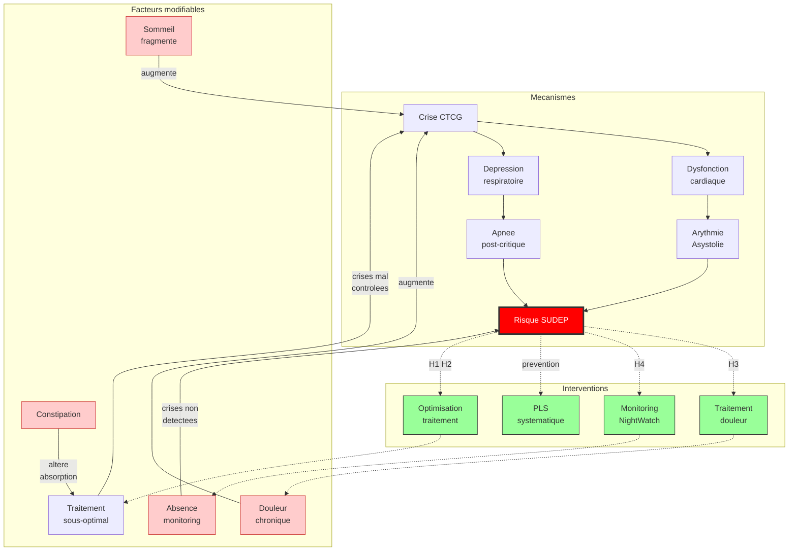
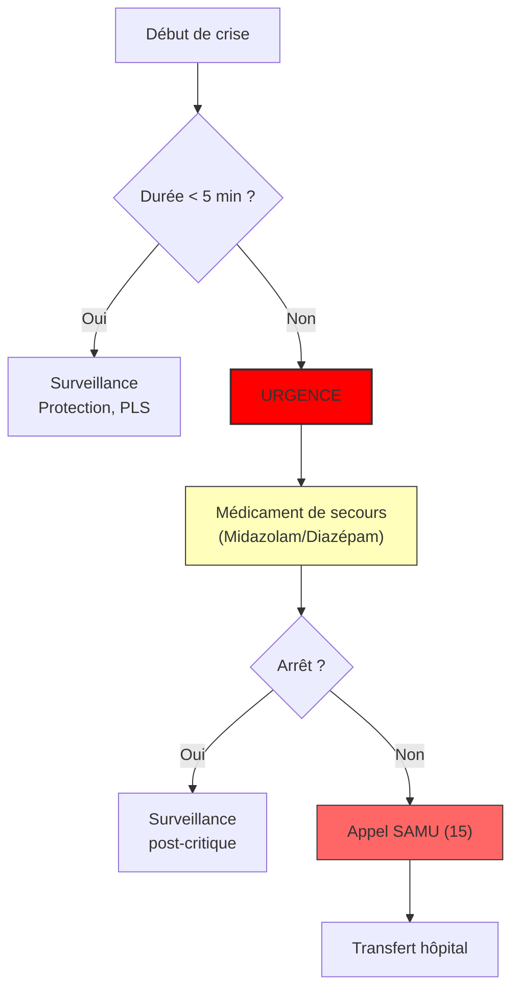

# Partie III : L'Arsenal Thérapeutique
## Chapitre 9 : Le Protocole d'Urgence (Gestion des crises et SUDEP)

### 🎯 L'Essentiel (Cible : Familles & Aidants)

**Quand l'urgence devient réelle**
La plupart des crises sont brèves, mais dans le syndrome de Dravet, certaines peuvent durer anormalement longtemps. On parle d'**état de mal épileptique** lorsque la crise dépasse un certain seuil de temps (généralement 5 minutes) ou qu'elle se répète sans que l'enfant reprenne conscience entre elles. C'est une urgence médicale absolue.

**Les réflexes qui sauvent**
Face à une crise prolongée, le stress est immense, mais la procédure doit être automatique :
1.  **Sécuriser :** Écarter les objets dangereux, protéger la tête.
2.  **Positionner :** Mettre l'enfant en Position Latérale de Sécurité (PLS) dès que possible pour libérer ses voies respiratoires.
3.  **Agir (Médicaments de secours) :** Si le médecin a prescrit un médicament d'urgence (souvent une forme de diazépam ou de midazolam à administrer par voie rectale ou nasale), utilisez-le immédiatement selon les instructions.
4.  **Appeler :** Contactez les secours (15 ou 112) si la crise ne s'arrête pas ou si vous avez un doute.

**La question de la SUDEP (Mort Subite en Épilepsie)**
C'est le sujet le plus difficile, mais il est essentiel d'en parler. La SUDEP (mort subite inattendue en épilepsie) est un décès soudain chez une personne épileptique, le plus souvent lié à un arrêt respiratoire ou cardiaque pendant ou juste après une crise. Dans le syndrome de Dravet, ce risque est significativement plus élevé que dans les autres épilepsies, et il représente la première cause de décès prématuré.

**Ce qui protège concrètement :**
*   **La surveillance nocturne :** Les crises surviennent souvent pendant le sommeil. Des dispositifs de détection (matelas capteurs, bracelets connectés) peuvent alerter les parents.
*   **Le contrôle des crises :** Moins il y a de crises prolongées, plus le risque diminue.
*   **La position de sécurité :** Après chaque crise, placer la personne sur le côté (PLS).
*   **La carte d'urgence :** Un document que l'enfant ou l'adulte porte sur lui, indiquant son diagnostic et les médicaments interdits, peut sauver la vie en cas d'intervention par des soignants non familiers du Dravet.

**À retenir :**
*   Une crise qui dure plus de 5 minutes est une urgence vitale.
*   La PLS et les médicaments de secours sont vos meilleurs outils.
*   La prévention passe par un contrôle rigoureux des crises au quotidien.

---

### 🩺 Le Protocole (Cible : Corps Médical)

**Gestion de l'État de Mal Épileptique (EME)**
Dans le syndrome de Dravet, la gestion de l'EME -- défini comme une crise d'une durée supérieure à 5 minutes ou des crises répétées sans reprise de conscience [Trinka et al., 2015] -- doit être extrêmement rapide en raison du risque élevé de dommages neuronaux et de complications respiratoires.

**1. Algorithme d'intervention (Protocoles de secours)**
*   **Phase 1 (0-5 min) :** Stabilisation des fonctions vitales, oxygénothérapie si nécessaire, mise en PLS.
*   **Phase 2 (5-10 min - Traitement de première ligne) :** Administration rapide de **benzodiazépines** (famille de médicaments à action calmante rapide sur le cerveau). Les protocoles privilégient souvent le **Midazolam** (administré dans la bouche ou dans le nez) pour sa rapidité d'action et sa facilité d'administration par les non-professionnels.
*   **Phase 3 (10 min+ - Traitement de deuxième ligne) :** Si l'EME persiste, passage aux antiépileptiques intraveineux. Le **lévétiracétam IV** (40-60 mg/kg, max 4 500 mg) est la première option de 2e ligne car il n'implique pas de blocage sodique. En alternative : phénobarbital IV (15-20 mg/kg).

> ⚠️ **CONTRE-INDICATION ABSOLUE :** La **phénytoïne/fosphénytoïne IV**, traitement classique de l'état de mal dans la population générale, est **contre-indiquée dans le syndrome de Dravet** en raison de son mécanisme de blocage sodique. Son utilisation en urgence par des équipes non familières du Dravet est un piège fréquent. Elle ne doit être envisagée qu'en dernière ligne absolue lorsque toutes les autres options sont épuisées.

**2. SUDEP (Sudden Unexpected Death in Epilepsy)**

La SUDEP est la **première cause de mortalité prématurée** dans le syndrome de Dravet [Shmuely et al., 2016 ; Cooper et al., 2016]. Son incidence est estimée à **5-10 pour 1 000 patient-années**, soit 15 à 20 fois supérieure au taux général dans l'épilepsie (0,3-0,5/1 000). Selon le registre de Kearney et al. (2019, n=1 604), la SUDEP représente **49% de l'ensemble des décès** chez les patients Dravet, avec une mortalité globale de 15,8%.

**Mécanismes physiopathologiques :**
*   **Dysfonction cardiaque autonome :** Les crises tonico-cloniques généralisées (CTCG) peuvent induire une bradycardie ou une asystolie post-ictale, des arythmies ventriculaires et un allongement du QT [Kalume et al., 2013]. NaV1.1 est exprimé dans les cardiomyocytes, contribuant à cette vulnérabilité cardiaque.
*   **Dépression respiratoire post-critique :** Apnée centrale par dépression des centres respiratoires du tronc cérébral [Kalume et al., 2013]. Les neurones sérotoninergiques du raphé, impliqués dans la commande respiratoire, expriment NaV1.1 et sont dysfonctionnels dans le Dravet.
*   **Dysfonction autonome chronique :** Variabilité de la fréquence cardiaque réduite même en période intercritique, suggérant un dysfonctionnement autonome permanent.

**Facteurs de risque principaux :**
*   CTCG fréquentes, surtout nocturnes (niveau de preuve élevé)
*   Crises sans surveillance pendant le sommeil
*   Décubitus ventral pendant ou après la crise
*   États de mal épileptiques répétés
*   Pic de risque entre 1 et 5 ans, mais le risque persiste toute la vie

**Protocole de prévention :**
*   **Optimisation du traitement antiépileptique :** Réduction maximale de la fréquence des CTCG, évitement strict des médicaments contre-indiqués.
*   **Monitoring nocturne :** Dispositifs détecteurs (matelas SAMi/Emfit, bracelets NightWatch avec sensibilité de 85-95% pour les CTCG nocturnes, pulse-oxymètres).
*   **Gestion post-ictale :** Positionnement systématique en décubitus latéral de sécurité après chaque CTCG.
*   **Information des familles :** Discussion ouverte et précoce sur le risque de SUDEP, conformément aux recommandations de l'AAN [Harden et al., 2017].
*   **Carte d'urgence :** Document mentionnant le diagnostic, les médicaments contre-indiqués et le protocole d'urgence, à porter sur soi en permanence.

#### 📊 Mécanismes et prévention de la SUDEP (Mermaid)

Ce diagramme montre que la SUDEP n'est pas une fatalite isolee mais le resultat d'une chaine de facteurs, dont plusieurs sont modifiables. La douleur chronique, le sommeil fragmente, la constipation et l'absence de monitoring sont autant de maillons sur lesquels il est possible d'agir. En cassant ces chaines -- par le traitement de la douleur (H3), le monitoring nocturne (H4), l'optimisation du traitement (H1, H2) et la PLS systematique -- on reduit concretement le risque.

#### 📊 Arbre décisionnel d'urgence (Mermaid)

---

### 🤝 L'Accompagnement (Cible : Structures d'accueil & Éducateurs)

**Le rôle de "Premier Répondant"**
En structure (crèche, école), vous êtes les premiers témoins. Votre capacité à rester calme et à appliquer le protocole est vitale.

**Actions immédiates en cas de crise prolongée :**
*   **Ne jamais rien mettre dans la bouche :** Cela peut provoquer des étouffements ou des blessures.
*   **Libérer les voies aériennes :** La priorité est d'éviter l'obstruction par la langue ou les sécrétions. La PLS est votre geste réflexe.
*   **Chronométrer :** Notez précisément l'heure de début et l'heure de fin de la crise. Cette donnée est cruciale pour le médecin.

**Prévention et environnement sécurisé :**
*   **Protocole écrit :** Chaque structure accueillant un enfant Dravet doit avoir une copie du "Plan d'Urgence Individuel" (incluant les contacts d'urgence, le protocole de médicaments de secours et la **liste des médicaments contre-indiqués**).
*   **Carte d'urgence :** L'enfant doit disposer d'une carte portée sur lui mentionnant son diagnostic, les médicaments interdits et le protocole d'urgence. Cela est vital en cas d'intervention par des soignants qui ne connaissent pas le syndrome.
*   **Gestion des risques de chute :** Lors des crises atoniques (relâchement soudain des muscles), assurez-vous que l'espace est dégagé pour éviter les chocs violents.
*   **Surveillance du sommeil :** Dans les structures avec nuitées, une vigilance accrue est nécessaire. Le risque de SUDEP (mort subite en épilepsie, un risque de décès soudain lié aux crises) est plus élevé pendant le sommeil. Si un dispositif de détection est en place, vérifiez qu'il est fonctionnel.

---

### 💡 Le Point de Liaison (Synthèse)

| Aspect | Famille | Médical | Professionnel |
| :--- | :--- | :--- | :--- |
| **Urgence** | Crise > 5 min = Danger | État de mal épileptique (EME) | Application immédiate du protocole |
| **Action clé** | Médicament de secours & PLS | Stabilisation et traitement IV | Chronométrage et protection physique |
| **Prévention** | Contrôle des crises au quotidien | Stratégie anti-SUDEP | Vigilance thermique et sommeil |

***

> **Pour passer a l'action** : Fil d'Ariane, Hypothese H4 — Monitoring nocturne (NightWatch, équipement, financement PCH)
>
> **Outil a imprimer** : Fiche d'urgence et affiche contre-indications dans la Boite a outils
