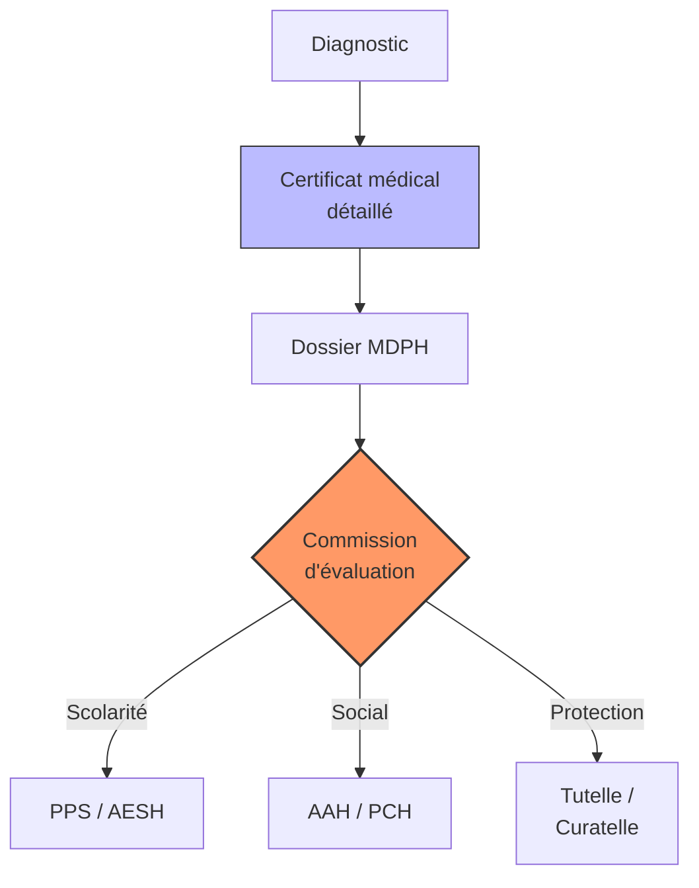
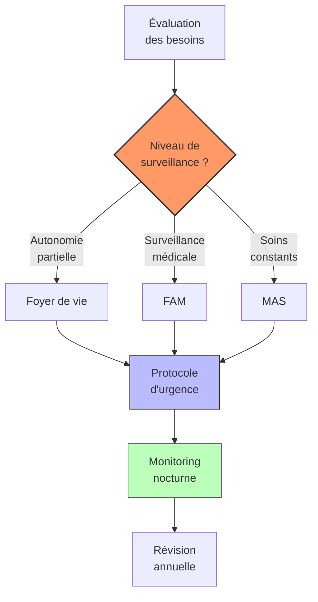

# Partie IV : L'Impact Global
## Chapitre 11 : Inclusion et Droits (Scolarité, Juridique, Social)

### 🎯 L'Essentiel (Cible : Familles & Aidants)

**Transformer le handicap en droits**
Vivre avec le syndrome de Dravet signifie souvent devoir se battre pour que l'enfant soit accueilli à l'école, qu'il reçoive les aides nécessaires et que sa sécurité soit garantie. La loi est là pour vous aider, mais elle demande une démarche active : il faut "faire valoir ses droits".

**Les trois piliers de l'inclusion :**
1.  **L'École (Scolarité) :** L'objectif est que votre enfant puisse apprendre, même si cela nécessite des aménagements (aide humaine, matériel adapté, temps supplémentaire).
2.  **Le Soutien Financier et Social :** Le handicap entraîne des coûts importants (soins, matériel, temps de présence). Il existe des aides financières pour compenser ces charges, attribuées par la **MDPH** (Maison Départementale des Personnes Handicapées) de votre département :
    *   **AEEH** (Allocation d'Éducation de l'Enfant Handicapé) : pour les enfants de moins de 20 ans. L'allocation de base est d'environ 142 EUR/mois, à laquelle s'ajoutent des compléments selon la gravité (de 107 EUR/mois pour le complément 1 jusqu'à 1 126 EUR/mois pour le complément 6). Dans le syndrome de Dravet, les compléments 4 à 6 sont fréquemment attribués en raison de la surveillance constante nécessaire.
    *   **AAH** (Allocation aux Adultes Handicapés) : à partir de 20 ans, environ 1 016 EUR/mois à taux plein. Depuis 2023, les revenus du conjoint ne sont plus pris en compte (déconjugalisation). C'est souvent la principale ressource des adultes Dravet.
    *   **PCH** (Prestation de Compensation du Handicap) : pour financer les aides humaines (surveillance, accompagnement), les aides techniques (détecteur de crises, matériel adapté), et l'aménagement du logement. Elle peut être plus avantageuse que l'AEEH + complément pour les situations les plus lourdes.
3.  **La Protection Juridique :** À mesure que l'enfant grandit, si ses capacités ne lui permettent pas de prendre seul les décisions importantes (gestion de l'argent, choix médicaux), il faudra organiser une protection légale. Cela peut aller de la **curatelle** (une aide pour les décisions, la personne garde une part d'autonomie) à la **tutelle** (une protection plus forte où un tuteur décide à sa place). L'**habilitation familiale** (depuis 2016) est une alternative plus souple, souvent privilégiée pour les parents d'adultes Dravet.

**La procédure MDPH en pratique :**
1.  **Constituer le dossier :** Formulaire Cerfa, certificat médical détaillé (moins de 6 mois), projet de vie rédigé par la famille (document crucial, souvent sous-estimé), bilans paramédicaux.
2.  **Évaluation :** Une équipe pluridisciplinaire de la MDPH évalue les besoins et élabore un Plan Personnalisé de Compensation (PPC).
3.  **Décision :** La CDAPH (Commission des Droits et de l'Autonomie des Personnes Handicapées) prend la décision. Délai légal : 4 mois, souvent 6 à 12 mois en pratique.
4.  **En cas de refus ou de décision insatisfaisante :** Un recours est possible — d'abord un recours administratif (RAPO, dans les 2 mois), puis si nécessaire un recours devant le tribunal (dans les 2 mois suivant le rejet du RAPO). Les associations peuvent vous aider à formuler ces recours.

#### Vie en structure résidentielle

Quand votre proche adulte ne peut plus vivre au domicile familial — parce que les parents vieillissent, que la surveillance 24h/24 devient impossible, ou simplement parce qu'il a besoin de son propre lieu de vie — la question de la structure résidentielle se pose. C'est une étape difficile, mais elle ne signifie pas un abandon : c'est une nouvelle organisation de vie dans laquelle la famille garde un rôle central.

**Les types de structures : choisir en connaissance de cause**

Il existe trois grands types de structures en France. La différence principale tient au niveau de soins disponibles sur place :

*   **Le foyer de vie** (ou foyer occupationnel) : le moins médicalisé. Il accueille des adultes qui ont besoin d'aide au quotidien mais pas de soins médicaux constants. L'équipe est surtout composée d'éducateurs. Il n'y a pas forcément d'infirmier sur place en permanence. Les activités proposées (art, sport, ateliers) visent l'épanouissement, pas la rééducation. Le financement vient du Conseil départemental.
*   **Le FAM** (Foyer d'Accueil Médicalisé) : un entre-deux. Il combine un accompagnement éducatif et une surveillance médicale régulière (infirmiers, médecin coordonnateur), sans pour autant offrir des soins lourds en continu. Il a deux financeurs : l'Assurance Maladie pour les soins, le Conseil départemental pour l'hébergement.
*   **La MAS** (Maison d'Accueil Spécialisée) : la structure la plus médicalisée. Elle accueille les personnes les plus dépendantes, avec du personnel soignant présent en continu, y compris la nuit. L'Assurance Maladie finance l'intégralité des coûts.

Pour un adulte atteint du syndrome de Dravet, le choix dépend de la fréquence et de la gravité des crises, du niveau d'autonomie et des besoins de surveillance nocturne. Un foyer de vie peut convenir si les crises sont bien contrôlées et si un protocole d'urgence est en place. Un FAM ou une MAS sont plus adaptés si les crises restent fréquentes ou si une surveillance médicale rapprochée est nécessaire.

**Le contrat de séjour : votre document de référence**

Quand votre proche entre en structure, un **contrat de séjour** est signé entre la famille (ou le tuteur) et l'établissement. C'est un vrai contrat au sens légal, imposé par la loi 2002-2. Il doit vous être remis dans les 15 jours et signé dans le mois suivant l'admission.

Ce contrat contient :
*   Les objectifs de la prise en charge (ce que la structure s'engage à apporter)
*   La liste des prestations et leur coût
*   Les conditions de séjour, de résiliation et de révision
*   Un avenant détaillant le **projet personnalisé** de votre proche, à établir dans les 6 mois

Ce que vous devez savoir : le contrat n'est pas figé. Vous pouvez — et devez — demander sa révision si la situation évolue. Votre participation à l'élaboration du contrat est obligatoire ; sans elle, le contrat est nul.

**Vos droits fondamentaux : ce que la loi garantit**

La loi du 2 janvier 2002 a posé 7 droits fondamentaux pour toute personne accueillie en établissement (article L.311-3 du Code de l'action sociale et des familles). En langage simple :

1.  **Dignité et sécurité** — votre proche doit être traité avec respect, son intimité doit être préservée.
2.  **Libre choix** — entre un accompagnement à domicile ou en établissement, quand c'est possible.
3.  **Accompagnement de qualité** — adapté à ses besoins, avec son consentement (ou celui de son tuteur).
4.  **Confidentialité** — ses informations personnelles et médicales sont protégées.
5.  **Accès à l'information** — vous avez le droit de consulter tout document relatif à sa prise en charge.
6.  **Information sur les recours** — la structure doit vous informer de vos voies de recours si quelque chose ne va pas.
7.  **Participation** — vous participez directement au projet d'accompagnement de votre proche.

Ces droits ne sont pas théoriques : ils sont accompagnés d'outils concrets. À l'admission, vous devez recevoir un **livret d'accueil** (qui explique le fonctionnement de la structure), la **charte des droits et libertés** (12 articles détaillant les principes de respect), et le **règlement de fonctionnement** (les règles pour tous : résidents, personnel, familles).

**Le CVS : votre voix dans la structure**

Le **CVS** (Conseil de la Vie Sociale) est une instance obligatoire dans chaque structure avec hébergement. Pensez-y comme un conseil d'administration où les résidents et les familles ont la majorité des voix.

Concrètement :
*   Il se réunit au moins 3 fois par an.
*   Les représentants des résidents et des familles doivent être plus nombreux que tous les autres membres.
*   Il donne son avis sur tout : organisation, activités, travaux, prix des services.
*   Les familles peuvent y siéger en tant que représentantes.
*   C'est un lieu où porter des réclamations collectives.

Si votre structure n'a pas de CVS actif, c'est une anomalie : c'est une obligation légale depuis 2004 (réformée en 2022).

**Le financement : ce qui change quand votre proche est en structure**

*   **En MAS** : l'AAH est réduite à 30 % du montant plein après 60 jours d'hébergement continu (soit environ 310 EUR/mois en 2025). Ce montant est réservé aux dépenses personnelles (vêtements, loisirs, hygiène). Le résident paie aussi un forfait journalier hospitalier (environ 20 EUR/jour).
*   **En FAM** : la participation couvre le volet hébergement (calculée selon les ressources). Le résident conserve un minimum de 30 % de l'AAH.
*   **En foyer de vie** : les frais d'hébergement sont à la charge du résident. Le minimum garanti est de 30 % de l'AAH (environ 312 EUR/mois en 2025). Si les ressources sont insuffisantes, une aide sociale départementale (ASH) peut compléter.

Point important : l'aide sociale à l'hébergement (ASH) pour personnes handicapées **n'impose pas d'obligation alimentaire** à la famille. Le Conseil départemental ne demandera pas aux parents ni à la fratrie de contribuer aux frais d'hébergement. En revanche, l'ASH est récupérable sur la succession du bénéficiaire après son décès, sauf à l'encontre du conjoint, des enfants, des parents ou de la personne ayant assumé la charge effective et constante de la personne handicapée.

**Quand ça ne va pas : vos recours**

Si vous êtes en désaccord avec la structure, si les droits de votre proche ne sont pas respectés, si la communication est rompue — vous n'êtes pas sans ressources :

1.  **Parlez au directeur** — mettez votre réclamation par écrit pour garder une trace.
2.  **Demandez une personne qualifiée** — c'est un médiateur externe, indépendant et gratuit, désigné conjointement par le Préfet, l'ARS et le Conseil départemental. Vous pouvez le saisir par courrier auprès du Conseil départemental ou de l'ARS, en précisant "personne qualifiée". Il vous répondra sous 2 mois.
3.  **Portez le sujet au CVS** — par l'intermédiaire du représentant des familles.
4.  **Saisissez l'ARS** — en cas de dysfonctionnement grave (maltraitance, non-respect des protocoles de soins). L'ARS dispose d'un pouvoir d'inspection et de contrôle.
5.  **Contactez le Défenseur des droits** — en cas d'atteinte aux droits fondamentaux ou de discrimination.

Le message à retenir : **vous avez le droit de contester une décision**. Aucune structure ne peut vous empêcher d'exercer ces recours.

**Le modèle de l'Arche : une approche différente**

Les communautés de l'Arche, fondées en 1964, fonctionnent sur un principe fondamentalement différent : **"vivre avec" plutôt que "prendre en charge"**. Les résidents ne sont pas des "bénéficiaires" mais des membres d'une communauté de vie où chacun contribue.

En pratique : 6 à 8 personnes avec un handicap intellectuel partagent une "maisonnée" avec 4 à 5 assistants qui vivent également sur place. Parmi ces assistants, 2 sont salariés professionnels ; les autres sont de jeunes volontaires (service civique). La France compte 40 communautés de l'Arche, accueillant 1 350 personnes.

Ce modèle a des forces (liens humains forts, vie sociale riche, sentiment d'appartenance) mais aussi des limites importantes pour le syndrome de Dravet : les volontaires non professionnels ne sont pas toujours formés à la gestion des crises épileptiques, et la surveillance nocturne peut être insuffisante. Certaines communautés de l'Arche gèrent aussi des FAM ou des MAS, mieux adaptés aux situations médicalement complexes. L'adéquation du modèle communautaire doit être évaluée au cas par cas en fonction des besoins de surveillance de votre proche.

**À retenir :**
*   L'inclusion n'est pas une faveur, c'est un droit (souvent encadré par des lois comme la loi de 2005 en France).
*   L'AEEH, l'AAH et la PCH sont les trois aides financières principales ; elles ne couvrent pas tous les coûts mais constituent un socle essentiel.
*   Le projet de vie est un document clé du dossier MDPH — prenez le temps de le rédiger.
*   Le contrat de séjour est un document légal : lisez-le, conservez-le, faites-le réviser si nécessaire.
*   En structure résidentielle, la loi 2002-2 vous garantit 7 droits fondamentaux — exigez qu'ils soient respectés.
*   Si ça ne va pas, vous avez des recours concrets : personne qualifiée, CVS, ARS, Défenseur des droits.
*   Chaque dossier est unique : l'administratif demande de la patience et de la rigueur.
*   Ne restez pas seuls face aux démarches : les associations sont vos meilleures alliées pour comprendre les procédures.

---

### 🩺 Le Protocole (Cible : Corps Médical)

**Le rôle du médecin dans le parcours administratif**
Le corps médical est le moteur de la reconnaissance du handicap [HAS, 2021]. Sans un dossier médical solide, l'accès aux droits est quasi impossible [Wirrell et al., 2017].

**1. La construction du dossier médical d'expertise**
Pour obtenir des aides auprès de la **MDPH** (Maison Départementale des Personnes Handicapées) en France, le médecin doit produire un certificat médical détaillé (Cerfa n° 15695*01) qui ne se contente pas de nommer la maladie, mais décrit ses **conséquences fonctionnelles** [HAS, 2021] :
*   **Impact cognitif :** Score de QI, troubles de l'attention, difficultés d'apprentissage.
*   **Impact moteur :** Besoin d'aide pour les déplacements, la toilette, l'alimentation.
*   **Impact sécuritaire :** Risque lié aux crises (besoin de surveillance constante, risque de SUDEP).
*   **Le taux d'incapacité de 80 %** est généralement reconnu dès le diagnostic confirmé de syndrome de Dravet, ouvrant droit à l'AEEH de base et à l'AAH [Wirrell et al., 2017].

**Orientation vers les aides financières :**
Le médecin doit connaitre les dispositifs pour orienter les familles de manière proactive :
*   **AEEH** (enfants < 20 ans) : base ~142 EUR/mois + compléments 1 à 6 (107 à 1 126 EUR/mois). Les compléments 4 à 6 sont fréquemment justifiés dans le Dravet.
*   **AAH** (adultes >= 20 ans) : ~1 016 EUR/mois à taux plein. Attribution possible sans limitation de durée si taux d'incapacité >= 80 %.
*   **PCH** : 5 éléments (aides humaines, aides techniques, aménagement du logement, charges spécifiques, aide animalière). La PCH est souvent plus avantageuse que l'AEEH + complément pour les situations les plus lourdes.
*   **ALD 9** : l'épilepsie sévère (dont le syndrome de Dravet) relève de l'ALD 9, avec prise en charge à 100 % des soins liés à l'ALD.
*   **AJPP** (Allocation Journalière de Présence Parentale) : ~64 EUR/jour pour un parent qui doit cesser son activité pour accompagner son enfant.

**2. L'accompagnement scolaire (Le PAI et le PPS)**
Le médecin joue un rôle clé dans la mise en place des outils d'inclusion scolaire :
*   **PAI (Projet d'Accueil Individualisé) :** Indispensable pour la gestion médicale à l'école (administration des médicaments de secours — Buccolam/midazolam buccal, diazépam intrarectal — protocole fièvre, contre-indications) [HAS, 2021]. Élaboré avec le médecin scolaire, renouvelé annuellement.
*   **PPS (Projet Personnalisé de Scolarisation) :** Pour l'attribution d'une AESH (Accompagnant des Élèves en Situation de Handicap) ou d'aménagements pédagogiques [Wirrell et al., 2017]. Dans le Dravet, une AESH individuelle à temps complet (18-24h hebdomadaires) est fréquemment justifiée.

**3. La protection juridique et la capacité**
Le médecin intervient dans le processus de mise sous protection juridique en évaluant la capacité de discernement et l'autonomie décisionnelle du patient. Les options, par ordre croissant de protection :
*   **Habilitation familiale** (depuis 2016) : alternative simplifiée, privilégiée quand un proche peut assurer la protection sans conflit familial.
*   **Curatelle** (simple ou renforcée) : assistance au majeur protégé qui conserve une autonomie partielle. Adaptée aux adultes Dravet avec déficience intellectuelle légère à modérée.
*   **Tutelle** : représentation complète du majeur protégé. Mesure la plus fréquemment mise en place pour les adultes Dravet avec déficience intellectuelle sévère.

#### 📊 Le parcours de reconnaissance des droits (Mermaid)

#### Prise en charge médicale en structure résidentielle

**1. Protocole d'urgence épileptique en foyer**

En établissement médico-social adulte, l'équivalent du PAI scolaire est intégré dans le **projet personnalisé** du résident et dans un **protocole d'urgence individualisé** élaboré par le médecin coordonnateur en lien avec le neurologue référent.

Ce protocole individuel doit contenir :
*   La description des types de crises présentés par le résident
*   La conduite à tenir en cas de crise (gestes de première intention, positionnement latéral de sécurité)
*   Les seuils de déclenchement de l'administration du traitement d'urgence (durée de crise)
*   Les médicaments d'urgence prescrits (midazolam buccal, diazépam rectal) avec doses et voies d'administration
*   Les critères d'appel au SAMU/15
*   Les **contre-indications spécifiques** du résident (dans le syndrome de Dravet : lamotrigine, carbamazépine, oxcarbazépine, phénytoïne, vigabatrine — ces bloqueurs sodiques aggravent la maladie)

Le protocole est annexé au contrat de séjour, affiché de manière accessible dans le dossier du résident, dans sa chambre (de façon confidentielle) et une copie est disponible pour le personnel de nuit. Il doit être **révisé au minimum annuellement** et à chaque modification du traitement.

**Administration du midazolam par du personnel non soignant :**
L'article L. 313-26 du CASF (issu de la loi HPST 2009) autorise le personnel éducatif (éducateurs, AMP/AES, veilleurs de nuit) à aider à la prise de médicaments lorsque le résident n'a pas l'autonomie suffisante, à condition que :
*   Un protocole médical individualisé soit établi par le médecin prescripteur
*   La prescription distingue clairement s'il s'agit d'un acte de la vie courante ou d'un acte infirmier
*   Le personnel soit formé au geste (reconnaissance de la crise, déclenchement du chronomètre, technique d'administration de la seringue pré-remplie dans la joue, surveillance post-administration, appel au 15)

En pratique, dans de nombreux établissements, le midazolam buccal (Buccolam) est administré par le personnel éducatif formé selon le protocole individualisé. La formation **Epipair** (organisme de référence national) couvre ces compétences en 1 à 3 jours [Epipair, www.epipair.fr]. Au Royaume-Uni, le cadre ESNA/ILAE/RCPsych formalise cette pratique avec un test de compétence (95 % de réussite chez 278 aidants testés ; recyclage recommandé tous les 12 à 24 mois) [Tittensor et al., 2021].

**2. Coordination médicale**

Le **médecin coordonnateur** de l'établissement (MAS ou FAM) constitue le pivot de la prise en charge médicale :
*   Il élabore et met en oeuvre le projet de soins de l'établissement
*   Il coordonne les interventions des professionnels de santé internes (IDE, aides-soignants) et externes (neurologue référent)
*   Il assure la liaison avec le centre de référence épilepsies rares ou le CHU pour les consultations spécialisées
*   Il peut initier des modifications thérapeutiques en urgence en attendant l'avis spécialisé

L'IDE (infirmier diplômé d'État) assure la surveillance quotidienne, l'administration des traitements de fond, le suivi de la fréquence et des caractéristiques des crises, et la transmission au neurologue référent. En MAS, une présence IDE est courante ; en FAM, un IDE est régulièrement présent mais pas nécessairement en continu ; en foyer de vie, il n'y a pas d'obligation réglementaire de présence infirmière permanente.

La plupart des adultes Dravet sont encore suivis par des neuropédiatres, faute d'expertise suffisante en neurologie adulte pour cette pathologie [Cardenal-Muñoz et al., 2022]. Le médecin coordonnateur doit veiller à ce que le lien avec le spécialiste référent reste actif, avec une transmission régulière des données sur les crises (fréquence, type, durée, circonstances).

**3. Surveillance nocturne et SUDEP**

Le risque de SUDEP (Sudden Unexpected Death in Epilepsy — mort subite inattendue dans l'épilepsie) est un enjeu majeur en structure résidentielle. L'étude de référence de van der Lende et al. (2018, Neurology), portant sur 25 ans de données dans deux centres résidentiels aux Pays-Bas, a démontré :

*   **Incidence SUDEP en structure** : 3,53 pour 1 000 patients-années (IC 95 % : 2,73-4,53)
*   **77 % des cas de SUDEP** présentaient des crises convulsives nocturnes (vs 33 % des témoins)
*   La surveillance nocturne a un effet protecteur : le centre avec la surveillance la moins intensive avait l'incidence SUDEP la plus élevée
*   Les crises nocturnes non surveillées constituent le facteur de risque principal

Les données spécifiques au syndrome de Dravet (Maltseva et al., 2024, Epilepsia) montrent que 75,9 % des aidants utilisent un monitoring nocturne, 81 % rapportent avoir évité un incident critique grâce à ce monitoring, et 20,4 % ont dû pratiquer une réanimation pour arrêt cardiaque ou respiratoire.

**Ratios de personnel la nuit (en pratique, aucun ratio réglementaire national n'est imposé) :**
*   MAS : 1 aide-soignant + 1 veilleur pour 15-20 résidents (1 pour 8-10 dans les établissements les mieux dotés), IDE d'astreinte
*   FAM : 1 veilleur pour l'ensemble, IDE d'astreinte
*   Foyer de vie : 1 veilleur, pas de personnel soignant la nuit

**Dispositifs de monitoring nocturne :**

| Dispositif | Principe | Détection crises sérieuses | Limites |
| :--- | :--- | :--- | :--- |
| **Capteur matelas Emfit** | Mouvements rythmiques sous matelas | 21 % | Ne détecte pas les crises non convulsives |
| **Bracelet NightWatch** | Fréquence cardiaque + accéléromètre 3D | **85 %** (96 % des crises tonico-cloniques) | Port au bras supérieur requis |
| **Caméra IA (Nelli)** | Analyse vidéo par intelligence artificielle | En complément | Analyse rétrospective pour le neurologue |
| **Oreiller anti-étouffement** | Structure perméable | Prévention passive | Ne détecte rien, réduit le risque d'asphyxie |

Sources : Arends et al., 2018 (Neurology, essai prospectif 28 participants, 1 826 nuits, 809 crises).

**Protocole post-ictal en structure résidentielle :**
Après une crise convulsive, le positionnement latéral de sécurité est impératif pour dégager les voies aériennes. Le résident ne doit pas être laissé seul pendant la phase post-critique (confusion, risque de chute, risque d'obstruction respiratoire en position ventrale). La surveillance doit se poursuivre jusqu'au retour à un état de conscience normal.

**4. Tableau comparatif des structures résidentielles**

| Critère | Foyer de vie | FAM | MAS |
| :--- | :--- | :--- | :--- |
| **Niveau de médicalisation** | Faible | Intermédiaire | Élevé |
| **Financement** | Conseil départemental | Double (ARS + Conseil départemental) | Assurance Maladie intégrale |
| **Personnel soignant** | Limité, pas d'IDE permanent | IDE régulier, médecin coordonnateur | IDE + aides-soignants en continu, médecin coordonnateur |
| **Surveillance nocturne** | 1 veilleur | 1 veilleur + IDE astreinte | Soignant en continu |
| **AAH du résident** | Maintenue (participation sur frais) | Réduite à 30 % après 60 jours | Réduite à 30 % après 60 jours |
| **Adéquation Dravet** | Crises rares et bien contrôlées | Surveillance régulière nécessaire | Crises fréquentes, surveillance constante |

#### 📊 Parcours d'orientation en structure résidentielle (Mermaid)

---

### 🤝 L'Accompagnement (Cible : Structures d'accueil & Éducateurs)

**L'école et les structures comme partenaires de l'inclusion**
Votre rôle est de transformer les décisions administratives en réalités quotidiennes pour l'enfant.

**Mise en oeuvre des aménagements :**
*   **Application du PAI :** Vous devez être formé et capable d'appliquer le protocole médical (crises, médicaments) sans hésitation. La sécurité de l'enfant dépend de votre réactivité.
*   **Adaptation pédagogique :** L'inclusion n'est pas seulement la présence physique, c'est l'accès au savoir. Utilisez les outils de communication (CAA) et les temps de repos prévus dans le projet de l'enfant.

**Comprendre le cadre administratif :**
En tant que professionnel, connaitre les dispositifs vous permet de mieux accompagner les familles et de comprendre le cadre dans lequel vous intervenez :
*   **Le PAI** encadre la gestion médicale (crises, médicaments de secours, protocole fièvre).
*   **Le PPS** définit vos missions pédagogiques et les aménagements (AESH, matériel, emploi du temps).
*   **La MDPH** est l'organisme qui attribue les aides (AEEH, PCH, orientation scolaire). Les délais de traitement sont souvent longs (6 à 12 mois) — soyez compréhensifs si les familles expriment de la frustration face à l'administratif.
*   **L'AESH** est un acteur central de l'inclusion. Dans le syndrome de Dravet, une AESH individuelle (AESHi) à temps complet est souvent nécessaire. Si l'AESH est absente, la sécurité de l'enfant peut être compromise — il est impératif de le signaler immédiatement.

**Lutte contre la stigmatisation :**
*   **Sensibilisation :** Expliquez la maladie aux autres élèves et au personnel pour éviter les malentendus sur les comportements (fatigue, crises, troubles du langage).
*   **Équité vs Égalité :** Comprenez que donner "plus" ou "différent" à cet enfant n'est pas un privilège, mais une compensation nécessaire pour lui donner les mêmes chances de réussite que les autres.

**Communication avec la famille :**
Soyez le relais d'information fiable. Si un aménagement ne fonctionne pas en pratique (ex: l'AESH est absente ou l'outil de communication est perdu), informez immédiatement les parents pour qu'ils puissent agir auprès des instances décisionnelles. Soyez également conscients de la pression financière que vivent de nombreuses familles Dravet (40 000 à 100 000 EUR/an de coûts totaux) et de la lourdeur des démarches administratives qu'elles doivent mener en parallèle des soins.

#### Travailler en structure résidentielle avec un résident Dravet

Si vous êtes éducateur, AMP/AES (accompagnant éducatif et social), moniteur-éducateur ou veilleur de nuit dans un foyer de vie, un FAM (Foyer d'Accueil Médicalisé) ou une MAS (Maison d'Accueil Spécialisée) accueillant un résident atteint du syndrome de Dravet, cette section vous concerne directement.

**1. Le projet personnalisé : co-construction et révision**

Le projet personnalisé est le document central de l'accompagnement. Il constitue l'avenant au contrat de séjour et définit les objectifs, les prestations et les modalités d'accompagnement spécifiques à chaque résident.

En pratique, pour un résident Dravet :
*   **Co-construisez-le avec la famille** (ou le tuteur) : elle connait le résident depuis des décennies, ses habitudes, ses déclencheurs de crises, ses préférences. Ses observations sont indispensables.
*   **Intégrez le volet médical** : le protocole d'urgence épileptique, les contre-indications médicamenteuses, les facteurs déclenchants identifiés (fièvre, chaleur, fatigue), les traitements en cours.
*   **Révisez-le au minimum une fois par an**, lors d'une réunion associant le référent, le médecin coordonnateur et la famille. Mais aussi à chaque événement significatif : changement de traitement, modification de la fréquence des crises, hospitalisation.
*   **Le référent du résident** rédige le projet en lien avec l'équipe pluridisciplinaire. C'est lui qui porte la cohérence de l'accompagnement au quotidien.

**2. Le CVS : faciliter la participation des familles**

En tant que professionnel, votre rôle vis-à-vis du CVS (Conseil de la Vie Sociale) est de faciliter la participation des résidents et de leurs familles, pas de l'entraver. Concrètement :
*   Informez les familles de l'existence du CVS et de leur droit d'y siéger
*   Aidez les résidents qui le peuvent à exprimer leurs attentes (outils en FALC — Facile À Lire et à Comprendre — si nécessaire)
*   Faites remonter les sujets récurrents (organisation des visites, qualité des repas, activités) pour qu'ils soient portés à l'ordre du jour
*   Le CVS se réunit au moins 3 fois par an : assurez-vous que les familles reçoivent les comptes rendus

**3. Communication avec les familles : les outils concrets**

La relation avec la famille d'un résident Dravet est souvent intense. Les parents ont vécu des décennies de surveillance constante et confient leur proche avec une anxiété légitime. Voici les outils pour construire la confiance :

*   **Cahier de liaison** : outil de transmission quotidien entre l'équipe et la famille, relatant les événements significatifs (crises, comportement, activités, rendez-vous médicaux). Les parents doivent pouvoir le consulter à chaque visite.
*   **Réunions périodiques** : au minimum une réunion annuelle de bilan du projet personnalisé. Dans les situations complexes (crises fréquentes, difficultés comportementales), des points intermédiaires trimestriels sont recommandés.
*   **Compte-rendu après crise** : après une crise convulsive, informez la famille rapidement (dans la journée) sur la nature de la crise, sa durée, les gestes effectués et l'état du résident après la crise. Ne minimisez pas, ne dramatisez pas : décrivez les faits.
*   **Accès au dossier** : la famille (ou le représentant légal) peut demander accès aux informations relatives à la prise en charge de son proche, sous réserve des règles de confidentialité.

**4. Formation aux gestes d'urgence épileptiques**

Tout professionnel intervenant auprès d'un résident Dravet doit maîtriser les gestes d'urgence. Le syndrome de Dravet se caractérise par des crises convulsives qui peuvent être prolongées et constituer un risque vital.

**Les gestes à connaître :**
*   **Mise en sécurité** : éloigner les objets dangereux, protéger la tête, ne rien mettre dans la bouche.
*   **Chronométrage** : déclencher le chronomètre dès le début de la crise. La durée détermine quand administrer le traitement d'urgence (seuil défini dans le protocole individuel, généralement 5 minutes).
*   **Positionnement latéral de sécurité** (PLS) : à effectuer dès que la phase clonique (secousses) cesse, pour dégager les voies aériennes.
*   **Administration du midazolam buccal** (Buccolam) : seringue pré-remplie à administrer dans la joue selon le protocole individualisé. Ce geste est autorisé pour le personnel éducatif formé (article L. 313-26 du CASF).
*   **Appel au 15** : si la crise dépasse la durée définie dans le protocole, si le traitement d'urgence ne fait pas effet, ou si le résident présente des signes de détresse respiratoire.
*   **Documentation** : après la crise, notez le type, la durée, les circonstances (heure, activité en cours, fièvre éventuelle), les gestes effectués et l'état post-critique.

**Fréquence de formation** : formation initiale à la prise de poste, recyclage recommandé tous les 12 à 24 mois, avec exercices pratiques sur seringues pré-remplies factices. L'organisme de référence en France est **Epipair** (www.epipair.fr), qui propose des formations de 1 à 3 jours spécifiquement destinées aux professionnels d'établissements médico-sociaux.

**5. Gestion des conflits avec les familles**

Les tensions entre familles et équipes sont fréquentes. Les parents d'un adulte Dravet ont souvent passé des décennies à se battre pour les droits de leur enfant. Ils peuvent être perçus comme exigeants ou méfiants — mais cette vigilance est le produit d'années d'expériences difficiles.

Quelques principes pour désamorcer les tensions :
*   **Ne prenez pas les réclamations personnellement** — elles visent l'organisation, pas vous.
*   **Facilitez le dialogue** plutôt que de vous retrancher derrière les procédures.
*   **Proposez la médiation** en cas de blocage : le référent du résident ou le cadre socio-éducatif peut jouer ce rôle en interne.
*   **Orientez vers la personne qualifiée** si la médiation interne échoue : c'est un médiateur externe, indépendant et gratuit, dont le rôle est d'aider la famille à faire valoir ses droits sans passer par un contentieux.
*   **Documentez les échanges** — un compte-rendu écrit après chaque réunion protège tout le monde.

**6. Spécificités Dravet en foyer : les points de vigilance quotidiens**

Le syndrome de Dravet impose des précautions spécifiques que tout professionnel doit connaître et appliquer au quotidien :

*   **Thermosensibilité** : la chaleur est un déclencheur majeur de crises. Attention aux bains trop chauds, aux activités extérieures en période de canicule, aux pièces surchauffées. Privilégiez les activités en intérieur climatisé lors des fortes chaleurs. Le protocole individuel doit préciser les seuils de température à respecter.
*   **Contre-indications médicamenteuses** : les médicaments suivants sont formellement contre-indiqués dans le syndrome de Dravet car ils aggravent les crises : **lamotrigine, carbamazépine, oxcarbazépine, phénytoïne, vigabatrine** (bloqueurs des canaux sodiques). Cette liste doit être **affichée dans le dossier de soins** et connue de toute l'équipe, y compris des remplaçants et intérimaires.
*   **Carte d'urgence** : une carte récapitulative (diagnostic, traitement en cours, contre-indications, protocole d'urgence, coordonnées du neurologue référent) doit figurer dans le dossier du résident et l'accompagner lors de tout déplacement extérieur.
*   **Surveillance post-crise** : après une crise convulsive, le résident ne doit pas être laissé seul. La phase post-critique (confusion, somnolence) peut durer de quelques minutes à plusieurs heures. Surveillez la respiration et maintenez la position latérale de sécurité.
*   **Risque de SUDEP** (mort subite inattendue dans l'épilepsie) : les crises nocturnes sont le principal facteur de risque. Les dispositifs de monitoring nocturne (bracelet NightWatch, capteur de matelas) réduisent significativement ce risque en permettant une intervention rapide.

---

### 💡 Le Point de Liaison (Synthèse)

| Aspect | Famille | Médical | Professionnel |
| :--- | :--- | :--- | :--- |
| **Objectif** | Obtenir des aides et l'inclusion | Fournir les preuves médicales | Appliquer les aménagements |
| **Aides financières** | AEEH (142 + compléments), AAH (~1 016 EUR), PCH | Orientation proactive, ALD 9 | Connaitre le cadre pour accompagner |
| **Procédure MDPH** | Dossier, projet de vie, recours si refus | Certificat détaillé (conséquences fonctionnelles) | Contribuer aux bilans, ESS annuelle |
| **Outil clé** | Dossiers administratifs, associations | Certificats détaillés, PAI, PPS | Pédagogie adaptée, AESH, sécurité |
| **Protection juridique** | Anticiper (habilitation familiale, curatelle, tutelle) | Évaluer la capacité de discernement | Respecter le cadre de protection |
| **Défi majeur** | Lenteur administrative (6-12 mois) | Traduire le médical en fonctionnel | Passer de la théorie à la pratique |
| **Structure résidentielle** | Choisir entre foyer de vie, FAM ou MAS selon les besoins ; lire et faire réviser le contrat de séjour | Rédiger le protocole d'urgence individualisé ; coordonner avec le neurologue référent ; équiper en monitoring nocturne | Co-construire le projet personnalisé avec la famille ; connaître les contre-indications Dravet ; former l'équipe aux gestes d'urgence |
| **Droits et recours** | Contrat de séjour, CVS, personne qualifiée, ARS, Défenseur des droits | Annexer le protocole d'urgence au contrat ; révision annuelle du volet médical | Faciliter le CVS, documenter les échanges, orienter vers la médiation en cas de conflit |
| **Urgence en foyer** | Exiger un protocole écrit et une formation du personnel ; vérifier le monitoring nocturne | Protocole individualisé (midazolam, seuils, appel 15) ; évaluer le risque SUDEP (3,53/1000 PA) | Maîtriser PLS, chronomètre, midazolam buccal (art. L.313-26 CASF) ; formation Epipair tous les 12-24 mois |

***

> **Pour passer a l'action** : Fil d'Ariane, Hypothese H7 — Vos droits face a la structure (escalade des recours, personne qualifiée, CVS)
