# Partie V : L'Horizon de Vie
## Chapitre 13 : La Vie Adulte Active (25-45 ans)

### 🎯 L'Essentiel (Cible : Familles & Aidants)

**Une bonne nouvelle relative**
Après les années tumultueuses de l'enfance et de l'adolescence, la période 25-45 ans apporte souvent une forme de stabilisation. Les crises d'épilepsie ne disparaissent pas, mais elles deviennent généralement moins fréquentes et surviennent surtout la nuit. Les états de mal épileptique (crises prolongées nécessitant une intervention d'urgence) deviennent exceptionnels après 20 ans. Pour beaucoup de familles, c'est un soulagement : on passe d'une vigilance de chaque instant à une surveillance plus ciblée, notamment nocturne.

**Le quotidien : une autonomie accompagnée**
La grande majorité des adultes Dravet ont besoin d'aide pour les gestes de la vie quotidienne. Ce n'est pas un échec : c'est la réalité du syndrome, et l'objectif est de maximiser ce que la personne peut faire par elle-même, tout en assurant sa sécurité. Environ 50 à 70 % des adultes vivent au domicile familial. D'autres trouvent leur place en foyer d'accueil médicalisé (FAM), en maison d'accueil spécialisée (MAS), ou plus rarement en appartement accompagné pour les plus autonomes.

**Travailler autrement**
L'emploi en milieu ordinaire n'est généralement pas accessible, mais cela ne signifie pas l'absence d'activité. Les ESAT (Établissements et Services d'Aide par le Travail) proposent des ateliers adaptés : conditionnement, espaces verts, artisanat, restauration collective sous supervision. Environ 35 à 40 % des adultes fréquentent un centre de jour ou un atelier protégé. Ces activités apportent un rythme, un sentiment d'utilité et du lien social.

**Vie affective et sexualité**
Les adultes Dravet ont des besoins affectifs et, pour certains, des désirs sexuels. Ces besoins sont légitimes et reconnus par les recommandations de l'ANESM (2017) sur la vie affective et sexuelle en établissement médico-social. La vie affective existe, même si les relations amoureuses restent rares. L'isolement social est un vrai risque, et le maintien d'activités de groupe est essentiel.

La vie en structure pose des questions spécifiques auxquelles il faut répondre sans tabou :
*   **L'intimité** : chaque résident a droit à un espace et un temps privés. Frapper avant d'entrer dans la chambre, respecter les moments seuls, ne pas nier les manifestations affectives ou sexuelles.
*   **Le consentement** : quand il y a déficience intellectuelle, la question du consentement éclairé est complexe mais ne doit pas conduire à un déni du droit à la vie affective. L'évaluation se fait au cas par cas : la personne comprend-elle la nature de la relation ? Peut-elle exprimer un refus ?
*   **La contraception** : elle doit être compatible avec les antiépileptiques. Le valproate est formellement contre-indiqué pendant la grossesse (risque de malformations de 10,3 %). Les progestatifs seuls ou le dispositif intra-utérin sont généralement compatibles avec les traitements du Dravet. Un suivi gynécologique est indispensable.
*   **Le SOPK et l'humeur** : le syndrome des ovaires polykystiques (fréquent sous valproate, voir plus bas) et les traitements hormonaux peuvent provoquer des troubles de l'humeur, des douleurs et une altération de l'image de soi, impactant la vie affective.

La question de la parentalité se pose parfois : elle nécessite un conseil génétique approfondi, car la mutation du gène SCN1A (le gène impliqué dans le syndrome de Dravet) peut être transmise à l'enfant avec un risque de 50 %. De plus, le valproate est formellement contre-indiqué pendant la grossesse.

**Santé de la femme : un sujet encore trop ignoré**
Chez les femmes adultes atteintes du syndrome de Dravet, le traitement par valproate au long cours peut provoquer un **syndrome des ovaires polykystiques** (SOPK — un dérèglement hormonal touchant les ovaires) dans une proportion très élevée, pouvant atteindre 90 % lorsque le traitement a été commencé avant 20 ans. Ce dérèglement hormonal entraîne des troubles des règles (irrégularité, absence de règles), une prise de poids et parfois un excès de pilosité.

Ce déséquilibre hormonal peut favoriser ou aggraver plusieurs problèmes gynécologiques :
*   Les **fibromes utérins** (des tumeurs bénignes de l'utérus qui provoquent des douleurs et des saignements abondants).
*   L'**endométriose** (une maladie où le tissu qui tapisse normalement l'intérieur de l'utérus se développe à l'extérieur, provoquant des douleurs pelviennes chroniques, des règles très douloureuses et de la constipation). L'endométriose touche environ 1 femme sur 9 dans la population générale, et les perturbations hormonales liées au valproate peuvent en favoriser le développement.

Ces problèmes gynécologiques, combinés à la **constipation chronique** fréquente dans le Dravet (voir chapitre 6), créent un véritable **syndrome pelvien** : douleurs abdominales et pelviennes, gêne digestive, et irritabilité, qui abaissent le seuil de déclenchement des crises. Ce cercle vicieux — douleur pelvienne → stress → crises → fatigue → aggravation de la douleur — nécessite une prise en charge coordonnée entre neurologue et gynécologue.

Les fluctuations hormonales du cycle menstruel peuvent elles-mêmes influencer la fréquence des crises — c'est ce qu'on appelle l'**épilepsie cataméniale** (liée aux règles). Il est essentiel que la gynécologie fasse partie du suivi régulier de la femme adulte Dravet.

**La vie quotidienne en foyer**
Lorsque votre proche vit en foyer d'accueil médicalisé (FAM), en maison d'accueil spécialisée (MAS) ou dans une communauté comme l'Arche, sa journée est rythmée par des repères stables : lever, toilette, petit-déjeuner, activités, repas, temps calme, coucher. Cette régularité n'est pas de la rigidité — c'est une protection. Pour une personne vivant avec le syndrome de Dravet, un rythme prévisible limite la fatigue et le stress, deux déclencheurs majeurs de crises.

*Que se passe-t-il la nuit ?* La surveillance nocturne varie selon les structures. En MAS, un soignant est présent en continu la nuit. En FAM, un veilleur de nuit assure les rondes, parfois avec une infirmière d'astreinte joignable par téléphone. De plus en plus de structures équipent les chambres de capteurs de mouvement placés sous le matelas, ou utilisent un bracelet porté au bras (comme le NightWatch) qui détecte les crises par les mouvements et le rythme cardiaque. Si une crise survient la nuit, le personnel suit un protocole précis : mise en sécurité, chronométrage, administration du traitement d'urgence si nécessaire, et vous êtes informés le lendemain matin, ou immédiatement en cas d'hospitalisation.

*Les activités de la journée.* Selon les capacités de votre proche, la journée peut inclure des ateliers en ESAT (ateliers protégés proposant des activités adaptées comme le conditionnement, l'horticulture, l'artisanat), des activités occupationnelles (peinture, musique, sport adapté), ou des sorties encadrées (promenades, courses, événements culturels). Ces activités ne sont pas du "divertissement" : elles donnent un rythme, un sentiment d'utilité et des liens sociaux — trois éléments essentiels au bien-être.

*Les repas.* Si votre proche suit un régime cétogène (un régime riche en graisses et pauvre en sucres, parfois utilisé contre l'épilepsie), la structure doit l'intégrer aux menus avec l'aide d'un diététicien. En cas de dysphagie (difficulté à avaler), les repas sont adaptés en texture : aliments mixés ou moulinés, boissons épaissies pour éviter les fausses routes. Ces adaptations sont définies dans le projet personnalisé.

*Votre place en tant que famille.* Vous avez le droit de participer aux réunions du projet personnalisé, qui a lieu au minimum une fois par an. C'est le moment de faire le point sur l'accompagnement, les activités, les soins, et de transmettre vos observations. N'hésitez pas à demander un cahier de liaison pour suivre le quotidien (crises, comportement, activités, repas). Vous pouvez aussi siéger au Conseil de la Vie Sociale (CVS), l'instance qui donne un avis sur le fonctionnement de l'établissement.

**D'autres problèmes de santé à surveiller**
En plus de l'épilepsie et des troubles déjà mentionnés, les adultes Dravet peuvent développer d'autres problèmes liés à la maladie elle-même ou aux traitements pris pendant des décennies :
*   **L'ostéoporose** (fragilisation des os) : les médicaments antiépileptiques, en particulier le valproate et le phénobarbital, réduisent la densité osseuse au fil des années. Cela augmente le risque de fractures, surtout combiné aux troubles de l'équilibre (ataxie). Une supplémentation en vitamine D et en calcium, ainsi qu'un suivi régulier de la solidité des os (ostéodensitométrie, un examen indolore), sont recommandés.
*   **La prise de poids** : elle touche 40 à 70 % des patients sous valproate et contribue à un risque de syndrome métabolique (un ensemble de problèmes incluant diabète, cholestérol élevé, hypertension).

**Hygiène quotidienne et gestion du risque thermique**
Le bain et la douche sont des moments à risque dans le syndrome de Dravet. L'eau chaude est un facteur déclenchant de crises bien identifié : l'élévation de la température corporelle modifie le fonctionnement des canaux sodiques (les mêmes canaux qui sont défaillants dans le Dravet), ce qui peut provoquer une crise. Quelques règles simples permettent de sécuriser ces moments :
*   **Température de l'eau** : ne jamais dépasser 37 °C. Utilisez un thermomètre de bain à chaque toilette -- ne vous fiez pas à la sensation de la main.
*   **Douche plutôt que bain** : l'immersion prolongée dans l'eau chaude élève davantage la température corporelle. Si un bain est souhaité, limitez-le en durée.
*   **Ne jamais laisser la personne seule dans l'eau** : même quelques minutes, le risque de crise et de noyade est réel.
*   **Midazolam accessible** : le traitement d'urgence doit être à portée de main dans la salle de bain, pas dans l'armoire à pharmacie à l'autre bout du couloir.
*   **Si une crise survient dans l'eau** : sortez la personne immédiatement, placez-la en position latérale de sécurité sur le sol, et appliquez le protocole habituel de gestion de crise.

**La santé mentale, un sujet à ne pas négliger**
La dépression touche 20 à 40 % des adultes Dravet, et l'anxiété 30 à 50 %. Ces troubles sont souvent sous-diagnostiqués parce que la personne ne peut pas toujours exprimer ce qu'elle ressent, ou parce que les symptômes sont confondus avec la fatigue liée aux médicaments. Soyez attentifs aux changements de comportement : repli sur soi, perte d'intérêt pour les activités habituelles, troubles du sommeil accrus.

---

### 🩺 Le Protocole (Cible : Corps Médical)

**1. Évolution des crises à l'âge adulte**
La trajectoire épileptique se stabilise après l'adolescence. Les crises tonico-cloniques généralisées (TCG) persistent chez environ 67 % des adultes [Takahashi et al., 2020], mais avec une fréquence réduite (1 à 4 crises/mois) [Genton et al., 2011]. Les crises deviennent principalement nocturnes -- cette prédominance nocturne est une caractéristique importante à l'âge adulte, nécessitant une surveillance adaptée (capteurs de mouvement, monitoring nocturne). Les myoclonies régressent significativement. Les crises fébriles persistent chez environ 30 % des adultes, spécificité notable de cette population. Les états de mal épileptique deviennent exceptionnels après 20 ans.

Sur les cohortes adultes suivies [Genton et al., 2011] (24 adultes jusqu'à 48 ans), les patients les plus âgés présentent une démarche de plus en plus instable, certains nécessitant un fauteuil roulant après 40 ans. L'ataxie cérébelleuse (troubles de la coordination et de l'équilibre) est présente chez 60 à 80 % des adultes et tend à s'aggraver avec l'âge. Les études neuropathologiques confirment que le syndrome de Dravet constitue une véritable encéphalopathie épileptique avec des anomalies structurelles progressives [Catarino et al., 2011].

**2. Comorbidités psychiatriques et métaboliques de l'adulte**
Les comorbidités de l'adulte Dravet sont multiples et nécessitent un dépistage systématique :
*   **Troubles psychiatriques :** dépression (20-40 %), anxiété (30-50 %), troubles du sommeil (> 60 %). Dépistage par outils adaptés à la déficience intellectuelle (PAS-ADD, DBC-A, ABC). Les antidépresseurs ISRS (sertraline) sont généralement bien tolérés ; vigilance sur l'interaction fluoxétine/stiripentol (CYP2D6).
*   **Syndrome métabolique :** prise de poids (40-70 % sous valproate), risque de diabète de type 2, dyslipidémie. Bilan lipidique et glycémie annuels.
*   **Ostéoporose :** risque relatif de fracture de 1,7 à 6,2 selon les antiépileptiques [Vestergaard, 2015]. Le valproate est associé à une réduction de la formation osseuse indépendamment de la vitamine D. Facteurs aggravants : sédentarité, alimentation déséquilibrée, défaut d'exposition solaire.

**3. Prise en charge médicale quotidienne en structure**

*Organisation des soins et observance thérapeutique.* En MAS, la distribution des médicaments est assurée par l'IDE (infirmier diplômé d'État) présent en continu. En FAM, l'IDE prépare les piluliers et supervise la distribution, qui peut être réalisée par un éducateur formé conformément à l'article L. 313-26 du CASF (acte de la vie courante sous protocole). L'observance est un enjeu majeur chez l'adulte Dravet sous polythérapie complexe : toute modification non intentionnelle des horaires ou des doses peut déstabiliser l'équilibre épileptique. Un protocole écrit de distribution, incluant les horaires, les doses exactes et les interactions alimentaires (stiripentol à prendre pendant le repas), doit être affiché et accessible à toute l'équipe.

*Gestion des crises nocturnes en internat.* Les crises tonico-cloniques sont principalement nocturnes chez l'adulte Dravet. Le protocole de surveillance nocturne doit inclure :
*   Monitoring technologique : bracelet multimodal (NightWatch, détection de 96 % des crises tonico-cloniques) et/ou capteur de matelas (Emfit, détection de 21 % des crises sérieuses), combinés à un oreiller à structure perméable (prévention de l'asphyxie positionnelle). La caméra avec intelligence artificielle (Nelli/Neuro Event Labs) permet une analyse rétrospective des crises pour le neurologue.
*   Ratio personnel de nuit : en MAS, 1 aide-soignant pour 8 à 20 résidents selon les établissements, avec IDE d'astreinte. En FAM, 1 veilleur pour l'établissement avec IDE d'astreinte téléphonique. Ce ratio, souvent insuffisant, justifie le recours systématique au monitoring technologique.
*   Protocole d'alerte gradué : crise < 5 minutes → surveillance, PLS, chronométrage ; crise > 5 minutes (ou selon le seuil individualisé) → administration du midazolam buccal (Buccolam) selon le protocole individualisé ; absence de reprise de conscience à 10 minutes ou crise > 10 minutes → appel SAMU/15.

*Coordination pluridisciplinaire.* La prise en charge en structure repose sur une équipe coordonnée :
*   **Médecin coordonnateur** : pivot de la coordination, il élabore le protocole de soins, assure la liaison avec les spécialistes externes et peut initier des modifications thérapeutiques en urgence.
*   **Neurologue référent** (consultation externe en centre de référence épilepsies rares ou CHU) : réévalue le traitement antiépileptique et ajuste la stratégie thérapeutique.
*   **IDE** : surveillance clinique quotidienne, distribution des traitements, formation du personnel éducatif aux gestes d'urgence.
*   **Éducateurs spécialisés / AES** : observation comportementale, transmission des informations sur les crises et les changements d'état au médecin.

*Réévaluation périodique du traitement.* Le traitement antiépileptique doit être réévalué au minimum annuellement par le neurologue référent, et de manière anticipée en cas de :
*   Modification de la fréquence, du type ou de la durée des crises.
*   Apparition d'effets indésirables (sédation excessive, prise de poids, constipation sévère, troubles hépatiques).
*   Changement de poids corporel significatif (adaptation des doses).
*   Introduction d'un nouveau médicament non antiépileptique (risque d'interactions, notamment avec les psychotropes).

**4. Suivi pharmacologique au long cours**
La polythérapie reste la règle. Le monitoring doit inclure :
*   **Valproate** : bilan hépatique, ammoniémie, NFS, bilan lipidique, glycémie (risque de syndrome métabolique). Prise de poids chez 40-70 % des patients. Chez la femme : surveillance du SOPK (syndrome des ovaires polykystiques).
*   **Stiripentol** : surveillance des taux plasmatiques (interaction CYP2C19 avec le valproate). Profil de sécurité acceptable au long cours.
*   **Cannabidiol (Epidyolex)** : transaminases hépatiques (élévation chez 15-20 % en association avec le valproate), interaction avec le clobazam (élévation du N-desméthylclobazam).
*   **Fenfluramine (Fintepla)** : échocardiographie tous les 6 mois (surveillance du risque de valvulopathie, non observé aux doses épileptiques).

**5. Conseil génétique et parentalité**
*   Mutations de novo (>90 % des cas) : risque de récurrence faible pour la fratrie (1-2 %, lié au mosaïcisme germinal). Mosaïcisme parental somatique ou germinal détecté chez 5-10 % des parents apparemment non atteints [Depienne et al., 2006].
*   Si le patient Dravet porteur d'une mutation SCN1A devient parent : risque de transmission de 50 %, avec expressivité variable (de l'épilepsie fébrile simple au syndrome de Dravet complet).
*   **Valproate et grossesse** : taux de malformations congénitales majeures de 10,3 % [Tomson et al., 2018], réduction du QI de l'enfant de 7 à 10 points. Contre-indication formelle. Discussion précoce de la contraception et du projet parental.
*   Diagnostic préimplantatoire (DPI) ou prénatal (DPN) à proposer aux familles concernées.

**6. Vie affective, sexualité et consentement**
*   **Cadre juridique et éthique :** les recommandations de l'ANESM (2017) reconnaissent le droit à la vie affective et sexuelle des personnes en situation de handicap vivant en établissement. Le consentement sexuel en contexte de déficience intellectuelle est évalué au cas par cas selon la capacité décisionnelle dimensionnelle : la personne comprend-elle la nature de l'acte, ses conséquences, peut-elle exprimer un refus ?
*   **Contraception et interactions médicamenteuses :** les antiépileptiques inducteurs enzymatiques (carbamazépine, phénytoïne, oxcarbazépine) réduisent l'efficacité des contraceptifs oraux. Ces molécules sont contre-indiquées dans le syndrome de Dravet, ce qui simplifie le choix contraceptif. Le valproate, le clobazam et le stiripentol n'ont pas d'interaction significative avec les contraceptifs oraux. Les progestatifs seuls ou le dispositif intra-utérin (DIU au lévonorgestrel ou au cuivre) sont généralement compatibles. Référer au gynécologue pour un choix adapté au profil de la patiente.
*   **Valproate et grossesse :** rappel -- taux de malformations congénitales majeures de 10,3 % [Tomson et al., 2018], réduction du QI de l'enfant de 7 à 10 points. Contre-indication formelle. La contraception doit être systématiquement abordée dès la puberté chez toute femme sous valproate.
*   **En cas de relation entre résidents :** évaluation conjointe par l'équipe pluridisciplinaire, les familles, et si nécessaire le juge des tutelles. L'objectif est de protéger la personne tout en respectant sa dignité et son droit à l'intimité.

**7. Santé de la femme et suivi gynécologique**
*   **SOPK et valproate** : prévalence du SOPK jusqu'à 90 % sous valproate initié avant 20 ans [Isojärvi et al., 1993]. Hyperandrogénie, oligo/anovulation, prise de poids. Bilan hormonal (LH, FSH, testostérone, SHBG) recommandé annuellement.
*   **Fibromes utérins** : les perturbations hormonales induites par le valproate (augmentation de la synthèse d'androgènes ovariens, conversion en estrogènes par aromatisation) peuvent favoriser la croissance de fibromes utérins, tumeurs estrogéno-dépendantes. Échographie pelvienne recommandée en cas de symptômes (saignements, douleurs).
*   **Endométriose** : pathologie estrogéno-dépendante, prévalence de ~10 % en population féminine générale. Le déséquilibre hormonal induit par le valproate (SOPK, anovulation, hyperoestrogénie relative) constitue un facteur de risque potentiel. L'endométriose provoque des douleurs pelviennes chroniques, une dyschésie (douleur à la défécation) et une constipation par spasme du plancher pelvien, s'ajoutant à la constipation iatrogène. Diagnostic par échographie endovaginale +/- IRM pelvienne.
*   **Syndrome pelvien intégré** : la constipation chronique iatrogène (valproate, stiripentol, clobazam), les fibromes et l'endométriose constituent une triade pelvienne dont les symptômes se potentialisent mutuellement. La douleur chronique abaisse le seuil épileptogène via l'axe hypothalamo-hypophyso-surrénalien (stress cortisol). La prise en charge doit être pluridisciplinaire (neurologie + gynécologie + gastro-entérologie + algologie).
*   **Épilepsie cataméniale** : les fluctuations des estrogènes et de la progestérone modulent le seuil épileptogène. Un suivi du calendrier des crises rapporté au cycle menstruel permet d'identifier les patientes à risque et d'envisager une supplémentation progestative péri-menstruelle.
*   **Contraception** : les antiépileptiques inducteurs enzymatiques réduisent l'efficacité des contraceptifs oraux. Le valproate impose une contraception efficace (risque tératogène). Privilégier les dispositifs intra-utérins (DIU) au lévonorgestrel ou au cuivre.

**8. Monitoring métabolique et orthopédique**
*   Vitamine D sérique (25-OH-D) annuelle, supplémentation systématique (800-1000 UI/jour) et calcium (500-1000 mg/jour).
*   Ostéodensitométrie (DEXA) de base à 25-30 ans, puis tous les 2-3 ans. Risque relatif de fracture : 1,7 à 6,2 selon les antiépileptiques [Vestergaard, 2015].
*   Surveillance de la scoliose (30-50 % des cas) et de l'ataxie cérébelleuse (60-80 % des adultes).

**9. Dépistage psychiatrique**
Outils adaptés à la déficience intellectuelle (DI) : PAS-ADD, DBC-A, ABC. Dépression (20-40 %), anxiété (30-50 %), troubles du sommeil (>60 %) [Kalnitski et al., 2021]. Antidépresseurs ISRS (sertraline) généralement bien tolérés. Vigilance sur l'interaction fluoxétine/stiripentol (CYP2D6). Antipsychotiques si nécessaire : préférer la quétiapine ou l'aripiprazole (moindre abaissement du seuil épileptogène).

#### 📊 Suivi pluridisciplinaire de l'adulte Dravet (Mermaid)

```mermaid
graph TD
    A["Adulte Dravet<br/>25-45 ans"] --> B["Neurologie"]
    A --> C["Médecine<br/>interne"]
    A --> D["Psychiatrie"]
    A --> E["Orthopédie"]
    A --> F["Génétique"]
    A --> G["Gynécologie"]
    A --> H["Vie quotidienne"]

    B --> B1["Crises nocturnes"]
    B --> B2["EEG contrôle"]
    B --> B3["Polythérapie"]

    C --> C1["Bilan métabolique"]
    C --> C2["Vit. D / Calcium"]
    C --> C3["Échocardio<br/>(fenfluramine)"]

    D --> D1["Dépression<br/>Anxiété"]
    D --> D2["Sommeil"]

    E --> E1["Scoliose / DEXA"]
    E --> E2["Ataxie / Marche"]

    F --> F1["Conseil génétique"]

    G --> G1["SOPK / Valproate"]
    G --> G2["Contraception"]
    G --> G3["Vie affective"]

    H --> H1["Risque thermique<br/>Bain / Douche"]
    H --> H2["Intimité<br/>ANESM 2017"]

    style A fill:#4a90d9,stroke:#333,color:#fff
    style B fill:#e8a838,stroke:#333
    style C fill:#e8a838,stroke:#333
    style D fill:#e8a838,stroke:#333
    style E fill:#e8a838,stroke:#333
    style F fill:#e8a838,stroke:#333
    style G fill:#e8a838,stroke:#333
    style H fill:#e8a838,stroke:#333
```

---

### 🤝 L'Accompagnement (Cible : Structures d'accueil & Éducateurs)

**Accompagner un résident Dravet au quotidien**

*Routines sécurisées.* La stabilité du quotidien est votre meilleur outil de prévention des crises. Veillez à :
*   **Horaires de médicaments** : respectez scrupuleusement les horaires prescrits. Le stiripentol doit être pris pendant le repas (et non à jeun). Un retard de plus de 30 minutes sur une prise peut suffire à déstabiliser l'équilibre épileptique. Si vous distribuez les médicaments, vérifiez que le résident a bien avalé (pas de comprimé gardé en bouche ou recraché).
*   **Gestion de la fièvre** : chez un adulte Dravet, la fièvre reste un déclencheur majeur de crises (elle persiste chez environ 30 % des adultes). Prenez la température au moindre doute. Administrez le paracétamol dès 37,8 °C selon le protocole prescrit, sans attendre 38,5 °C comme en population générale.
*   **Éviter la surchauffe** : la dysautonomie (perturbation du système nerveux qui régule la température du corps) rend les personnes Dravet vulnérables à la chaleur. En été, privilégiez les pièces climatisées ou ventilées, les activités à l'ombre, et une hydratation renforcée. Même un bain trop chaud peut déclencher une crise (voir la section "Hygiène quotidienne et prévention du risque thermique" plus bas pour le protocole détaillé).

*Crises au quotidien : que faire selon le contexte ?*
*   **Pendant une activité** (atelier, sport) : éloignez les objets dangereux, allongez la personne au sol si possible, protégez sa tête, ne restreignez pas ses mouvements. Chronométrez. Les autres participants doivent être éloignés calmement.
*   **Au repas** : risque de fausse route. Si la personne a de la nourriture en bouche, placez-la en position latérale de sécurité (PLS) pour éviter l'inhalation. Ne tentez jamais de retirer de la nourriture de la bouche pendant la crise.
*   **En sortie extérieure** : ayez toujours sur vous le traitement d'urgence (midazolam buccal), le protocole individualisé et un téléphone. Repérez les zones ombragées et les accès aux secours. Prévoyez un plan de repli.
*   **Après la crise** : la phase post-critique (période de récupération après la crise) dure de quelques minutes à plusieurs heures. La personne peut être confuse, fatiguée, désorientée. Ne forcez jamais la reprise d'activité. Proposez un lieu calme et sûr.

*Communication avec le résident non-verbal ou peu verbal.* Beaucoup d'adultes Dravet ont un langage limité ou absent. Votre rôle est d'observer et d'interpréter :
*   **Signaux de douleur** : grimaces, crispation du visage, postures inhabituelles (se recroqueviller, se tenir le ventre), refus de manger, agitation soudaine, auto-agression (se frapper, se mordre). Ces comportements ne sont pas des "caprices" — ils expriment souvent une douleur que la personne ne peut pas verbaliser.
*   **Signaux de malaise** : regard fixe ou fuyant, retrait inhabituel, refus de participer aux activités qu'elle apprécie normalement, gémissements, changement de posture, pâleur.
*   **Signaux de détresse émotionnelle** : pleurs, cris, agitation extrême, mais aussi l'inverse — un retrait total, une apathie inhabituelle. Observez ce qui est différent par rapport au comportement habituel de cette personne.
*   Utilisez des supports visuels (pictogrammes, photos) et des choix simples (montrer deux objets) pour communiquer. Appuyez-vous sur les proches et les collègues qui connaissent bien la personne pour décoder ses modes d'expression.

*Travail en équipe : transmission entre jour et nuit.*
Les informations entre l'équipe de jour et l'équipe de nuit doivent circuler de manière systématique. À chaque relève, transmettez :
*   Les crises survenues (heure, durée, type, traitement administré).
*   Tout changement de comportement (agitation, repli, refus alimentaire).
*   Les prises de médicaments effectuées et celles restantes.
*   Les consignes spécifiques du médecin (ex. : surveillance renforcée après un changement de traitement, prise de température si fièvre suspectée).
Un cahier de transmission ou un outil numérique partagé (tablette avec application de suivi) rend cette transmission traçable et fiable. L'information orale seule ne suffit pas.

**Insertion professionnelle adaptée**
L'activité professionnelle en milieu protégé est un levier majeur de qualité de vie. En ESAT, privilégiez les ateliers qui valorisent les compétences préservées (mémoire procédurale, c'est-à-dire la mémoire des gestes appris par la répétition) : horticulture, conditionnement, activités artisanales. Adaptez les horaires (matinées souvent plus productives, fatigue liée aux antiépileptiques en début de journée) et prévoyez des temps de pause fréquents. Évitez les environnements avec des sources de chaleur non protégées ou des machines dangereuses.

**Gestion des crises en milieu de travail**
Formez l'ensemble de l'équipe encadrante au protocole de crise : mettre la personne en sécurité, position latérale de sécurité (PLS), ne rien mettre dans la bouche, chronométrer la crise, administrer le traitement d'urgence prescrit si la crise dépasse la durée définie dans le protocole individualisé. Après une crise, prévoir un temps de repos et ne pas forcer la reprise de l'activité.

**Maintien de l'autonomie et dignité adulte**
La personne adulte n'est pas un "grand enfant". Adaptez votre vocabulaire, proposez des choix (même simples), respectez les préférences personnelles. Soutenez les compétences acquises plutôt que de tout faire à la place de la personne. Soyez attentifs aux signes de dépression (retrait des activités, modification de l'appétit ou du sommeil, irritabilité inhabituelle) : ce ne sont pas des "caprices" mais possiblement l'expression d'une souffrance psychologique qui nécessite une évaluation.

**Emploi et socialisation : des enjeux majeurs**
Les données montrent qu'aucun adulte Dravet n'exerce d'emploi en milieu ordinaire (Genton et al., 2011), mais 35 à 40 % fréquentent un centre de jour ou un atelier protégé (ESAT). Les barrières à l'emploi sont multiples : persistance des crises, déficience intellectuelle, troubles moteurs (ataxie, c'est-à-dire troubles de l'équilibre et de la coordination), fatigue liée aux médicaments. L'enjeu n'est pas l'emploi classique, mais l'accès à une activité structurante qui apporte un rythme, un sentiment d'utilité et du lien social. Les ESAT avec hébergement peuvent offrir une solution intégrée pour les adultes qui ne vivent plus au domicile familial.

**Vie affective, intimité et accompagnement relationnel**
L'isolement social est le principal facteur de risque de dégradation de la santé mentale. Favorisez les sorties encadrées, les activités de groupe (sport adapté, musicothérapie, art-thérapie), les liens avec l'extérieur.

La vie affective et sexuelle doit être respectée et accompagnée, dans le cadre des recommandations de l'ANESM (2017) :
*   **Respecter l'intimité** : frappez avant d'entrer dans la chambre, accordez des temps seuls, ne commentez pas les manifestations affectives devant les autres résidents.
*   **Ne pas nier ni réprimer** les manifestations affectives ou sexuelles. Elles font partie de la vie adulte et de la dignité de la personne.
*   **Distinguer** les comportements d'exploration normaux des comportements à risque (absence de consentement, exposition publique, auto-agression).
*   **Former le personnel** à l'éducation affective adaptée : des formations spécialisées existent (CREAI, ANCREAI) et permettent aux équipes d'aborder ces situations avec professionnalisme et bienveillance.
*   **En cas de relation entre résidents** : procéder à une évaluation conjointe par l'équipe, les familles et, si nécessaire, le juge des tutelles. L'objectif est double : protéger la personne et respecter son droit à la vie affective.

**Hygiène quotidienne et prévention du risque thermique**
Le bain et la douche sont des moments à risque spécifique chez les résidents Dravet, car l'eau chaude est un déclencheur de crises bien identifié. Des règles strictes s'imposent :
*   **Vérifier la température de l'eau AVANT chaque toilette** : utilisez un thermomètre, ne dépassez jamais 37 °C. Ne vous fiez pas à la sensation de la main.
*   **Préférer la douche au bain** : l'immersion prolongée élève davantage la température corporelle. Si un bain est accordé, limitez sa durée.
*   **Limiter la durée** : 10 à 15 minutes maximum pour une douche.
*   **Adapter les salles de bain** : tapis antidérapant au sol et dans la douche, siège de douche fixé au mur, barre d'appui. En cas de crouch gait (marche accroupie) ou d'ataxie sévère, prévoir une aide à deux personnes si nécessaire.
*   **Ne jamais laisser la personne seule dans l'eau**, même brièvement.
*   **Midazolam accessible** : le traitement d'urgence doit être à portée de main dans la salle de bain.
*   **Transmettre la consigne de température** dans le dossier du résident et lors de chaque relève, en particulier aux remplaçants qui ne connaissent pas la personne.

**Vigilance sur les comorbidités physiques**
Les professionnels de l'accompagnement doivent être attentifs aux signes d'ostéoporose (douleurs osseuses, fractures après des chutes mineures) et de prise de poids excessive. Ces problèmes sont souvent liés aux traitements antiépileptiques au long cours. L'encouragement à l'activité physique adaptée (marche, natation encadrée, exercices d'équilibre) contribue à la prévention de l'ostéoporose et au maintien d'un poids santé.

---

### 💡 Le Point de Liaison (Synthèse)

| Aspect | Famille | Médical | Professionnel |
| :--- | :--- | :--- | :--- |
| **Crises** | Stabilisation relative, surtout nocturnes | TCG persistantes, 1-4/mois, monitoring nocturne | Protocole de crise affiché, équipe formée |
| **Comorbidités** | Surveiller prise de poids, douleurs osseuses | Ostéoporose (DEXA), syndrome métabolique, psychiatrie | Encourager activité physique, alerter si fractures |
| **Emploi** | Valoriser toute activité, même partielle | Adapter les traitements pour limiter la fatigue diurne | ESAT (35-40 % des adultes), ateliers adaptés |
| **Santé mentale** | Observer les changements de comportement | Dépistage systématique (PAS-ADD, DBC-A) | Repérer le retrait social, alerter l'équipe médicale |
| **Vie affective** | Besoins légitimes, intimité, contraception compatible | Consentement dimensionnel, DIU/progestatifs, contre-indication valproate/grossesse | Respecter l'intimité, frapper avant d'entrer, formations CREAI/ANCREAI |
| **Hygiène / Risque thermique** | Eau <= 37 °C, douche plutôt que bain, ne jamais laisser seul | Eau chaude = déclencheur (cinétique canaux sodiques), midazolam accessible | Thermomètre avant chaque toilette, 15 min max, aide à deux si ataxie, transmettre la consigne |
| **Parentalité** | Accompagner le projet avec bienveillance | Conseil génétique, contre-indication valproate/grossesse | Évaluation conjointe équipe/familles/tutelle si relation |
| **Vie en structure** | Participer au projet personnalisé, cahier de liaison, visites | Protocole de soins individualisé, monitoring nocturne, coordination neurologue/médecin coordonnateur | Routines sécurisées, transmission jour/nuit, observer les signaux non-verbaux |
| **Logement** | Anticiper le vieillissement des parents-aidants | Évaluer l'autonomie fonctionnelle | Favoriser les solutions les moins restrictives |

***
