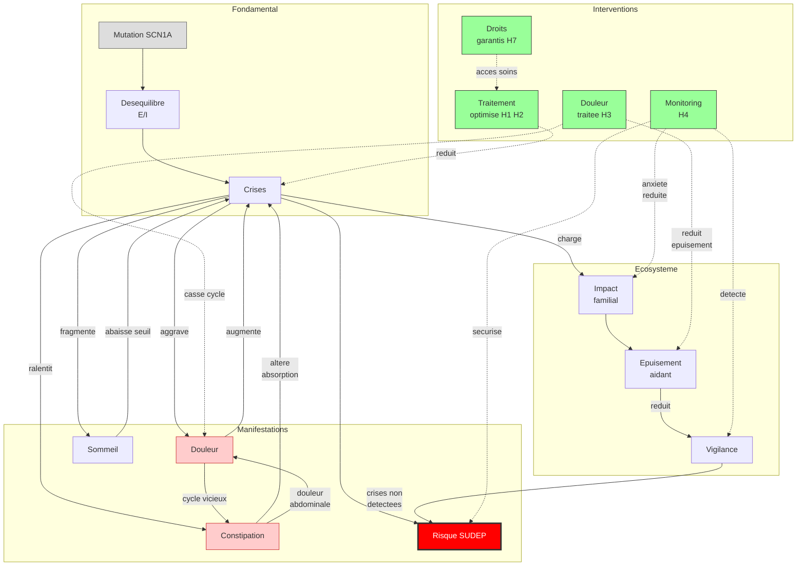

# Partie VI : Demain
## Chapitre 17 : Conclusion — Trois Mondes, Un Seul Combat

### Ce que nous avons appris

Au fil de ces pages, nous avons suivi un chemin qui part d'une seule lettre mal écrite dans un gène et qui mène à une vie entière. Une mutation du gène SCN1A, une porte défaillante dans les neurones, un frein cérébral qui lâche -- et tout bascule. Nous avons vu comment cette erreur de code, présente dès la conception, ne se révèle souvent qu'au détour d'une fièvre, lorsque le cerveau échoue à un test de résistance qu'il n'était pas équipé pour passer.

Nous avons traversé la première année et ses crises inaugurales, l'enfance et ses combats quotidiens, l'adolescence et ses remaniements. Nous avons détaillé l'arsenal thérapeutique -- du stiripentol, premier traitement à avoir démontré une efficacité spécifique dans le Dravet, à la fenfluramine et au cannabidiol (CBD), jusqu'aux thérapies géniques en cours d'essai. Chaque étape a marqué un progrès : la gestion symptomatique s'est affinée, les protocoles d'urgence se sont structurés, la vigilance face à la SUDEP s'est organisée. Nous avons regardé en face l'impact sur les familles, la fratrie, l'équilibre du foyer. Nous avons abordé les droits, l'inclusion, la transition vers l'âge adulte, et accompagné le parcours jusqu'à la vie avancée, avec les questions éthiques qu'elle soulève. Et nous avons, enfin, ouvert la porte de demain -- celle de la thérapie génique et de la correction causale.

Ce livre a tenté de tenir une promesse : construire un pont entre trois mondes qui parlent trop souvent des langues différentes. Il est temps, dans ces dernières lignes, de s'adresser à chacun de ces mondes.

---

### Aux familles

Vous qui vivez avec le syndrome de Dravet chaque jour, chaque nuit, chaque fièvre : votre parcours est légitime. La charge mentale que vous portez — cette vigilance de chaque instant, ces traitements à ajuster, ces regards à décoder — n'est pas une faiblesse. C'est la preuve d'un engagement que rien ne peut remplacer.

Aucun algorithme, aucun protocole médical, aucune formation professionnelle ne pourra jamais égaler ce que vous savez de votre enfant. Vous êtes les premiers experts de son quotidien. Quand vous dites "quelque chose ne va pas", vous avez raison, même quand les chiffres ne le montrent pas encore.

Demander de l'aide n'est pas un aveu d'échec. C'est une stratégie de soin — pour votre enfant, et pour vous. Ce livre vous est dédié, comme il l'était dès la première page.

---

### Au corps médical

Vous qui cherchez à soigner, à comprendre, à affiner : le syndrome de Dravet vous rappelle que la médecine de précision n'est pas un luxe, mais une nécessité. Un diagnostic précoce change une trajectoire. Une contre-indication respectée évite une catastrophe. Un génotype corrélé au phénotype ouvre la voie à des traitements ciblés.

La recherche avance. Les thérapies géniques passent du laboratoire aux essais cliniques. STK-001 (technologie TANGO) augmente l'expression de l'allèle sain par modulation de l'épissage. ETX101 (vecteur AAV9) délivre un facteur de transcription ingénié aux interneurones GABAergiques. CRISPRa active la transcription sans couper l'ADN. Ces trois approches convergent vers un même objectif : compenser l'haploinsuffisance de NaV1.1. Nous passons progressivement de la gestion symptomatique à la correction causale. Votre rôle est d'accompagner cette transition, de rester à la pointe, et de ne jamais oublier que derrière chaque dossier il y a une famille qui attend, espère et se bat.

La SUDEP reste un enjeu majeur de santé publique dans cette population, avec une incidence 15 fois supérieure à celle de l'épilepsie en général. La réduction du fardeau épileptique par les nouvelles thérapies pourrait contribuer à diminuer ce risque, mais la vigilance doit rester constante.

Écoutez les parents. Leur expertise clinique informelle est un outil diagnostique que vous ne trouverez dans aucun manuel.

---

### Aux professionnels de l'accompagnement

Vous qui accueillez, observez, adaptez : votre rôle est irremplaçable dans la chaîne. L'éducateur qui note un changement de comportement, l'AESH qui repère un regard fixe, l'animateur qui ajuste la température de la salle — chacun de ces gestes est un acte de soin, même s'il ne porte pas ce nom.

L'inclusion n'est pas une faveur. C'est un droit. Et elle se construit dans les détails : un protocole d'accueil individualisé, une communication fluide avec la famille et le médecin, une observation rigoureuse traduite en faits précis. Vous n'avez pas besoin de devenir neurologue. Vous avez besoin de rester ce que vous êtes : des professionnels attentifs, formés à observer, et prêts à agir.

---

### Le pont

Ce livre repose sur une conviction : les trois mondes — familles, soignants, professionnels — ne peuvent pas avancer seuls. Le parent qui comprend la physiopathologie dialogue mieux avec le neurologue. Le médecin qui saisit le quotidien d'une famille prescrit avec plus de justesse. Le professionnel qui rattache ses observations à une réalité médicale intervient avec plus de pertinence.

Le pont, ce n'est pas un lieu. C'est une pratique. C'est le tableau de synthèse à la fin de chaque chapitre. C'est la réunion d'équipe où chacun parle et où chacun écoute. C'est le carnet de liaison rempli avec rigueur. C'est le médecin qui prend cinq minutes de plus pour expliquer, le parent qui transmet ses observations sans filtre, et le professionnel qui pose la question qu'il n'osait pas poser.

Le syndrome de Dravet est un adversaire redoutable. Mais il n'a jamais fait face à ces trois mondes réunis.

---

### Demain

Il serait irresponsable de promettre une guérison imminente. Mais il serait tout aussi irresponsable de ne pas dire que les raisons d'espérer n'ont jamais été aussi concrètes.

Le chemin parcouru est considérable. En quelques décennies, le syndrome de Dravet est passé d'une maladie sans nom à une maladie comprise, diagnosticable par un simple test génétique, et dotée de traitements spécifiques. Le stiripentol a ouvert la voie dans les années 2000. La fenfluramine et le cannabidiol ont élargi l'arsenal dans les années 2010. Aujourd'hui, les thérapies géniques -- STK-001, ETX101, CRISPRa -- s'attaquent directement à la cause du syndrome : l'insuffisance de protéine NaV1.1 dans les interneurones du cerveau. Les premiers résultats d'essais cliniques montrent des signaux encourageants, avec des approbations potentielles à l'horizon 2029-2031.

Cette trajectoire -- de la gestion symptomatique vers la correction causale -- représente un changement de paradigme. Nous ne parlons plus seulement de freiner les crises, mais de restaurer le fonctionnement du cerveau à sa source.

La SUDEP reste l'ombre la plus lourde sur le parcours des familles. Mais la réduction du fardeau épileptique par les nouvelles thérapies, combinée à l'amélioration de la surveillance (capteurs nocturnes, monitoring connecté), ouvre la perspective d'une diminution de ce risque.

L'espoir ne réside pas dans un miracle unique. Il réside dans la convergence : des chercheurs qui avancent, des cliniciens qui traduisent, des familles qui participent aux essais, des professionnels qui maintiennent la qualité de vie pendant que la science fait son travail.

Si certaines informations contenues dans cet ouvrage devaient être dépassées par de nouvelles découvertes, rappelons ce que nous écrivions en introduction : c'est une bonne nouvelle. Cela signifie que la recherche avance.

---

### Une vision systemique

Le syndrome de Dravet n'est pas une succession de problemes isoles -- crises d'un cote, douleur de l'autre, sommeil ailleurs. C'est un systeme interconnecte ou chaque element influence les autres. Une douleur non traitee augmente les crises, qui fragmentent le sommeil, qui epuise l'aidant, qui reduit la vigilance. Inversement, chaque intervention bien placee declenche des effets en cascade positifs. La prise en charge la plus efficace est celle qui identifie ces boucles et les casse aux bons endroits.

Ce reseau est la carte du territoire. Le livre en explore chaque region en detail -- mecanismes, traitements, accompagnement, droits. Le Fil d'Ariane montre ou agir en premier et comment chaque intervention se propage dans le systeme.

---

*Ce livre s'achève comme il a commencé : dédié à toutes les familles qui se battent chaque jour, à tous les soignants qui cherchent sans relâche, et à tous les professionnels qui accueillent avec patience et bienveillance. Le combat continue. Il n'est plus solitaire.*
